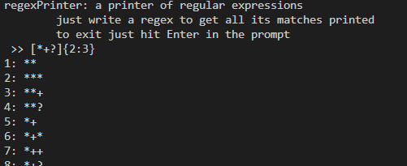

---
metadata:
    description: Neste artigo explico sucintamente o que são expressões regulares
        e mostro algo que fiz com elas!
title: Procurar tudo o que uma expressão regular consegue encontrar
---

[Expressões regulares](https://en.wikipedia.org/wiki/Regular_expression) são uma maneira compacta de representar várias sequências de caracteres. Será que eu consigo descobrir todas as sequências de caracteres que uma expressão regular consegue encontrar?

===

Estas podem ser usadas, por exemplo, para encontrar várias ocorrências de um certo padrão num texto, e substituí-lo por outro padrão (semelhante ou não). Um exemplo de uma expressão regular é `abc(d|e)` que serve para encontrar as sequências "abcd" e "abce" (vê a próxima imagem). O caracter `|` serve para indicar que temos de fazer uma escolha entre o que está à esquerda ou à direita. `cao|gato` pode ser usada para encontrar as sequências "cao" e "gato". Há outros caracteres que têm significados especiais e vou mencioná-los brevemente.

Uma pergunta interessante que surge é: dada uma expressão regular, quais são as sequências de caracteres que podem ser encontradas por ela? Para responder a essa pergunta, criei um pequeno programa em Python, a que chamei `regexPrinter`, que recebe uma expressão regular e imprime no ecrã todas as sequências que poderiam ser encontradas pela expressão. Para fazer isto, fiz com que, nos padrões infinitos, o programa imprimisse os casos mais pequenos e depois pusesse "..." para indicar essa infinitude, e escolhi também uma parte da sintaxe das expressões regulares que queria implementar.

Eis aquilo com que o meu programa sabe lidar:

 - o operador `*`, que serve para indicar $0$ ou mais repetições; por exemplo, `ah*` encontra "a", "ah", "ahh", ...;
 - o operador `+`, que serve para indicar $1$ ou mais repetições; por exemplo `(hue)+` encontra "hue", "huehue", "huehuehue", ...;
 - o operador `?`, que serve para indicar $0$ ou $1$ repetições; por exemplo, `woo(hoo)?` encontra apenas "woo" e "woohoo";
 - o operador `{a:b}` indica não menos do que $a$ repetições e não mais do que $b$; por exemplo, `po{1:3}is` encontra "pois", "poois" e "pooois";
 - o operador `|` que indica uma escolha; `gato|gatu` encontra "gato" e "gatu";
 - os parêntesis retos `[]` servem para indicar várias escolhas de um caracter só de forma compacta; por exemplo `[abc]` encontra "a", "b" e "c";
 - os parêntesis curvos `()` servem para alterar a precedência dos operadores, já que qualquer um dos quantificadores `*+?{:}` tem precedência maior que a concatenação, o que quer dizer que `ab?` é interpretado como `a(b?)` e _não_ como `(ab)?`.

Qualquer caracter que não tenha um significado especial é interpretado literalmente, exceto dentro dos parêntesis retos `[]`, onde todos os caracteres são interpretados literalmente.

O código pode ser encontrado [aqui](https://github.com/RodrigoGiraoSerrao/projects/blob/master/misc/regexPrinter.py) no GitHub e está em Python3. Para usar o `regexPrinter` basta correr o script e escrever expressões regulares no prompt. A técnica que usei para isto foi escrever uma gramática para o pedaço da sintaxe das expressões regulares que eu queria saber imprimir, escrevi um parser para essa gramática, e dada uma expressão regular uso o parser para a transformar numa árvore, onde cada nó se sabe imprimir. Em particular, foi algo parecido com o que fiz na [minha linguagem de programação a fingir](https://mathspp.com/blog/creating-programming-language-from-scratch), aprendido [nesta](https://ruslanspivak.com/lsbasi-part1/) série de artigos.

! É dia 24 de Julho de 2020 e estou a migrar este artigo do meu blogue antigo para aqui, quase 3 anos depois de o escrever. Enquanto o fazia, reparei que o meu programa não está correto. Por exemplo, o meu programa não funciona corretamente com a expressão regular `[*+?{:}]{2:3}`. Desafio-te a corrigires o programa e a partilhares o teu progresso na secção de comentários em baixo!