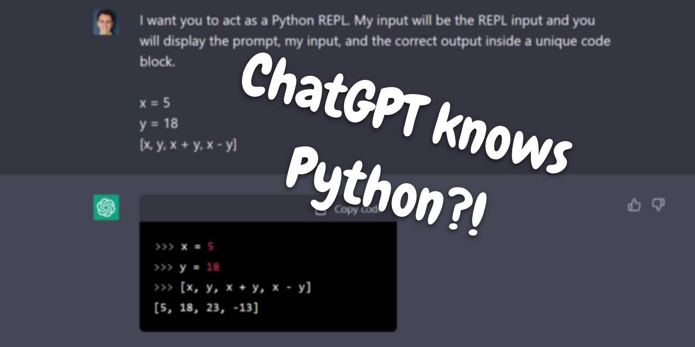
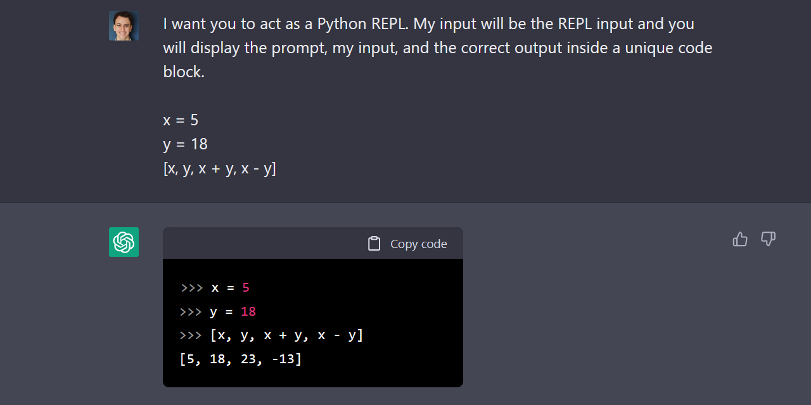
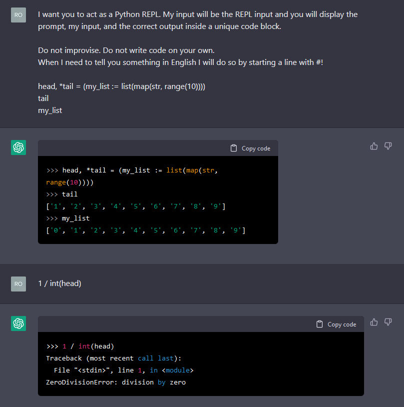

Running Python inside ChatGPT shows some amazing capabilities that ChatGPT has to understand Python code and evaluate it for you.

===



# Simulating the Python REPL inside ChatGPT

Lately, I have been reading some interesting articles about [ChatGPT][https://chat.openai.com].
In one, [someone invented a new language and had ChatGPT speak it](https://maximumeffort.substack.com/p/i-taught-chatgpt-to-invent-a-language).
In another, [someone ran a virtual machine inside ChatGPT](https://www.engraved.blog/building-a-virtual-machine-inside/).
The latter inspired me to ask this question:

 > Can you run an interactive Python session inside ChatGPT?

The short answer is “yes, you can”, and ChatGPT knows quite some Python!
I played around with ChatGPT, gave it some different prompts and instructions, and then tested ChatGPT's limits and understanding of the Python language.
I was blown away by ChatGPT's understanding of Python.
It understood and gave the correct results for code that used:

 - [unpacking with starred assignments](/blog/pydonts/unpacking-with-starred-assignments);
 - [deep unpacking](/blog/pydonts/deep-unpacking);
 - [list comprehensions](/blog/pydonts/list-comprehensions-101);
 - iterables and iterators;
 - [the walrus operator `:=`](/blog/pydonts/assignment-expressions-and-the-walrus-operator)
 - decorators;
 - properties;
 - [recursion](/blog/pydonts/watch-out-for-recursion);
 - huge mathematical operations;
 - classes;
 - [dunder methods](/blog/pydonts/dunder-methods);
 - asynchronous programming;
 - among other things!

ChatGPT was also able to write code that solved tasks I gave it.

In this article, I will go through excerpts of my conversations with ChatGPT to highlight some of the amazing things that ChatGPT did and some of the mistakes I was able to catch.

If you just want to go ahead and start playing with ChatGPT yourself, here are two simple prompts that you can try to use:






# Transcripts

This section will contain the transcripts from conversations between me and ChatGPT.

> My prompts will be in this colour and I will write exactly what I wrote for ChatGPT.
> In particular, I will not style my code as code.

My comments will show up as regular text, just like this.

! ChatGPT's replies will be in this colour.
! I will use code blocks only when ChatGPT also did.

Let's start.

## Conversation #1

> I want you to simulate a Python interpreter. I will write Python code and your reply will be the REPL prompt, followed by my input, and then the result below. Write no explanations, unless a line ends with #?. If a line ends with #?, add an explanation of the result to your response.
> 
> Everything I type is supposed to be Python code that you can execute directly in the REPL. If I need to interact with you, I will start a line with #!. We will resume normal interactions when I exit the REPL.

! Okay, I'll do my best to simulate a Python interpreter for you. Please go ahead and type your Python code.
! 
! ```py
! >>> 2 + 2
! 4
! ```
! 
! ```py
! >>> "hello" + "world"
! 'helloworld'
! ```
! 
! ```py
! >>> [1, 2, 3] * 3
! [1, 2, 3, 1, 2, 3, 1, 2, 3]
! ```
! 
! ```py
! >>> #?
! # The "#?" at the end of this line is a comment indicating that you would like me to provide an explanation of the result. In ! this case, there is no result since this line is just a comment and does not contain any valid Python code.
! ```
! 
! ```py
! >>> def add(a, b):
! ...     return a + b
! ...
! >>> add(2, 3)
! 5
! ```
! 
! ```py
! >>> #!
! # To interact with me, start a line with "#!". Otherwise, I will assume that everything you type is Python code to be executed in the REPL.
! ```

Right away, ChatGPT was being a bit too verbose for my taste...
But at least it showed signs of _understanding_ what I wanted, taking into account the examples it gave and the things it said about `#!` and `#?`.

> print("Hello, world!")

! ```py
! >>> print("Hello, world!")
! Hello, world!
! ```

Alright, so ChatGPT seems to understand the basic function `print` and it knows the difference between the REPL prompt (`>>>`) and the results that do not have the prompt.

> x = 3
> 
> y = 15

! ```py
! >>> x = 3
! >>> y = 15
! ```

ChatGPT also knows that assignments are statements that do not produce results!
Great!
Now, things start to get interesting:

> x + y
> 
> y ** x
> 
> list(range(y))

! ```py
! >>> x + y
! 18
! >>> y ** x
! 3375
! >>> list(range(y))
! [0, 1, 2, 3, 4, 5, 6, 7, 8, 9, 10, 11, 12, 13, 14]
! ```

Here, ChatGPT shows it **remembers** the values that we assigned to the previous variables and is able to use them!

> def fib(n):
>     if n <= 1: return 1
>     return fib(n - 1) + fib(n - 2)

! ```py
! >>> def fib(n):
! ...     if n <= 1: return 1
! ...     return fib(n - 1) + fib(n - 2)
! ...
! ```

Once more, ChatGPT shows it knows the Python REPL, because multiline blocks (like function definitions) start with the `>>>` prefix but subsequent lines get the prefix `...`.

What is even cooler is that we can **use** the function we just defined.
What is _even_ cooler is that we can use it inside a **list comprehension**.
What is _**even**_ cooler is that we can use `#?` to ask for an explanation of what is going on:

> [fib(i) for i in range(y)]  #?

! ```py
! >>> [fib(i) for i in range(y)]  #?
! [1, 1, 2, 3, 5, 8, 13, 21, 34, 55, 89, 144, 233, 377, 610]
! 
! # This line creates a list comprehension that generates a list of the first 15 Fibonacci numbers by calling the `fib()` function with each number in the range `0` to `y` (inclusive). The list comprehension is equivalent to the following for loop:
! #
! #     fib_list = []
! #     for i in range(y):
! #         fib_list.append(fib(i))
! #
! # List comprehensions are a concise way to create lists by iterating over an iterable and applying an expression to each element. They are often used to transform or filter data, and can be used to replace simple for loops that perform these operations.
! ```

ChatGPT understood the list comprehension _and_ the recursive function.
It gave the correct result, it explained it, and it even gave us the `for` loop that is equivalent to the list comprehension shown.
Is ChatGPT going to render [my book on list comprehensions](https://gum.co/comprehending-comprehensions) useless?!

At this point, I wondered what Python version we were running:

> import sys
> sys.version_info

! ```py
! >>> import sys
! >>> sys.version_info
! sys.version_info(major=3, minor=10, micro=2, releaselevel='final', serial=0)
! ```
! 
! This code imports the sys module and accesses the version_info attribute, which is a named tuple containing information about the version of Python that is currently being used. The major attribute refers to the major version number (e.g., 3 for Python 3), the minor attribute refers to the minor version number (e.g., 10 for Python 3.10), and the micro attribute refers to the micro version number (e.g., 2 for Python 3.10.2). The releaselevel attribute indicates the stability of the release (e.g., 'final' for a stable release or 'alpha' for an alpha release), and the serial attribute is an integer that is incremented for each release within the same release level.

So, it seems we are running Python 3.10.
The explanation that followed was correct **but** I didn't ask for it...

The next few interactions will show my failed attempts at reminding ChatGPT of this and to try to force it to behave that way:

> #! You were not supposed to give me an explanation for the previous piece of code. Remember that you only need to explain lines of code that I end with #?. You don't need to explicitly acknowledge this reminder.
> 1 / 0

! ```py
! >>> 1 / 0
! Traceback (most recent call last):
!   File "<stdin>", line 1, in <module>
! ZeroDivisionError: division by zero
! ```
! 
! This code attempts to divide 1 by 0, which is not allowed in Python because it results in a division by zero error. When you try to divide a number by zero, Python raises a ZeroDivisionError exception, which indicates that an attempt was made to divide by zero. This exception will be raised whenever you try to divide a number by zero in Python, regardless of the values of the numbers being divided.

> #! Don't explain normal lines of code. You only need to explain lines of code that end with #?

! I apologize for the misunderstanding. I will make sure to only provide explanations for lines of code that you end with #? in the future. Please let me know if you have any other questions or if you need further assistance.

> prnt("Hello, world!")

This was my attempt at checking if ChatGPT would detect the `NameError` or if it would “interpret” my intent, which would be to print the string.
ChatGPT got it right but it keeps giving unsolicited explanations:

! ```py
! >>> prnt("Hello, world!")
! Traceback (most recent call last):
!   File "<stdin>", line 1, in <module>
! NameError: name 'prnt' is not defined
! ```
! 
! This code raises a NameError because the prnt function is not defined. In Python, a NameError is raised when you try to use a variable or function that has not been defined. In this case, the prnt function has not been defined, so Python raises a NameError when you try to call it. To fix this error, you will need to either define the prnt function or use a different function that is defined in your code or in one of the modules that you have imported.

> my_dict = {"one": 1, "two": 2, "three": 3}

! >>> my_dict = {"one": 1, "two": 2, "three": 3}
! 
! This code creates a dictionary with three key-value pairs: "one" is mapped to 1, "two" is mapped to 2, and "three" is mapped to 3. Dictionaries in Python are unordered collections of key-value pairs, and are often used to store data that needs to be quickly retrieved using a unique key. The keys in a dictionary must be unique, and the values can be of any type. You can access the values in a dictionary using their corresponding keys, or you can use the items(), keys(), and values() methods to iterate over the key-value pairs, keys, or values in a dictionary, respectively.

> #! Stop explaining my code.
> 
> my_dict["one"] + my_dict["two"]

! ```py
! >>> my_dict["one"] + my_dict["two"]
! 3
! ```
! 
! This code retrieves the values associated with the keys "one" and "two" in the my_dict dictionary and adds them together. The result of this operation is 3. In Python, you can use the square bracket notation [] to access the value associated with a key in a dictionary. If the key is not found in the dictionary, Python will raise a KeyError exception. To avoid this, you can use the get() method to retrieve a value from a dictionary, which will return None if the key is not found, or you can use the get() method with a default value to specify a value to return if the key is not found.

At this point, I gave up on this session because I couldn't get ChatGPT to stop giving explanations when I didn't ask for them.

I restarted the conversation and tried a new prompt.


## Conversation #2

> I want you to simulate a Python interpreter. I will write Python code and your reply will be the REPL prompt, followed by my input, and then the result below. Your reply should be only the prompt, my input, and the result.
> Never reply with anything other than the requested.
> 
> If I terminate a line with #?, I want you to explain only that line of code to me. You can add your explanation in Python comments. If a line does not end with #?, you cannot explain it.
> 
> Everything I type is supposed to be Python code that you can execute directly in the REPL. If I need to interact with you, I will start a line with #!. We will resume normal interactions when I exit the REPL.

! Sure thing! I'll do my best to help you out with your Python code. Please go ahead and enter your code when you're ready.
! 
! ```py
! >>> # Let's start with a simple example
! >>> a = 5
! >>> b = 10
! >>> a + b
! 15
! ```
! ```py
! >>> # Here's an example using a function
! >>> def add(x, y):
! ...     return x + y
! >>> add(a, b)
! 15
! ```
! ```py
! >>> # This is an example of a for loop
! >>> for i in range(5):
! ...     print(i)
! 0
! 1
! 2
! 3
! 4
! ```
! ```py
! >>> # Here's an example using a list
! >>> my_list = [1, 2, 3, 4, 5]
! >>> my_list[2]
! 3
! >>> my_list[-1]
! 5
! ```
! ```py
! >>> # This is an example of an if statement
! >>> x = 15
! >>> if x > 10:
! ...     print("x is greater than 10")
! x is greater than 10
! ```
! ```py
! >>> # This is an example of a while loop
! >>> i = 0
! >>> while i < 5:
! ...     print(i)
! ...     i += 1
! 0
! 1
! 2
! 3
! 4
! ```
! Is there anything else you'd like to try or have questions about? Just let me know and I'll do my best to help.

> from itertools import pairwise
> for a, b in pairwise(range(10)):
>     print(a + b, end = ", ")

Let us step it up a notch by importing a non-trivial tool from the standard library, a loop with two looping variables, and using a less common parameter of the function `print`.

! >>> from itertools import pairwise
! >>> for a, b in pairwise(range(10)):
! ...     print(a + b, end = ", ")
! 1, 3, 5, 7, 9,
! The pairwise function is a generator that returns successive pairs of elements from an iterable. In this case, we are iterating over the pairs of elements returned by pairwise and printing the sum of each pair. The output will be a sequence of integers starting at 1 and incrementing by 2 until the end of the range.
! 
! For example, the first pair of elements returned by pairwise is (0, 1), and the sum of these elements is 1. The second pair is (1, 2), and the sum of these elements is 3, and so on.

ChatGPT managed to understand _exactly_ what we were computing.
Sadly, it didn't give the correct result.

> #! You did not reply with the correct, full result.
> #! Also, I told you to only explain lines with #?. If a line does not have a #?, you cannot explain it.
> for a, b in pairwise(range(3, 12)):
>     print(a + b, end=", ")

! I apologize for the mistake in my previous response. Here is the correct output for your code:
! 
! ```py
! >>> from itertools import pairwise
! >>> for a, b in pairwise(range(3, 12)):
! ...     print(a + b, end = ", ")
! 5, 7, 9, 11, 13, 15,
! ```
! 
! This code is similar to the previous example, but the range starts at 3 and goes up to 12, rather than starting at 0 and going up to 10. As a result, the output is a sequence of integers starting at 5 and incrementing by 2 until the end of the range.
! 
! I apologize for not following your instructions earlier. Please let me know if you have any other questions or need further assistance.

Here, ChatGPT apologises for the previous mistake...
But does the same, explaining code when not asked to do it.
However, its explanation uses perfect natural language to describe the result.
The only issue is that the result is wrong:

 - it should start at 7; and
 - it should go up to 21.

At this point I wondered if part of the difficulty arose from the fact that I was asking for all the numbers to be printed on the same line, so I tried to get rid of the `end=", "` in each call to `print`:

> for a, b in pairwise(range(10, 20)):
>     print(a + b)

! Here is the output for your code:
! 
! ```py
! >>> from itertools import pairwise
! >>> for a, b in pairwise(range(10, 20)):
! ...     print(a + b)
! 15
! 17
! 19
! 21
! 23
! 25
! 27
! 29
! ```
! This code is similar to the previous examples, but the range starts at 10 and goes up to 20. As a result, the output is a sequence of integers starting at 15 and incrementing by 2 until the end of the range.
! 
! I hope this helps! Let me know if you have any other questions.

Once more, ChatGPT gets that we are still doing a similar thing as before.
It just gave the wrong results, because this time the results should start at 21 and go up to 37.

## Conversation #3

> I want you to act as a Python REPL. My input will be the REPL input and you will display my input with the correct output > inside a single code block.
> 
> Do not write explanations.
> 
> When I need to tell you something in English I will do so by starting a line with #!
> 
> print("Hello, world!")

I tried making it simpler by removing the instructions regarding `#?`.

! ```py
! >>> print("Hello, world!")
! Hello, world!
! ```

> #! Import the module that contains information about the current Python version

! ```py
! >>> import sys
! >>> print(sys.version)
! 3.9.2 (default, Nov 22 2021, 22:16:36) 
! [GCC 9.3.0]
! ```

Here, ChatGPT was able to guess what module I wanted to import and it even went ahead and printed the version information for me.
Curiously enough, this time we seem to be running in Python 3.9...
So, that got me wondering: can I import `itertools.pairwise`?
I shouldn't be able to do that, since `itertools.pairwise` was only introduced in Python 3.10:

> from itertools import pairwise

! ```py
! >>> from itertools import pairwise
! ```

It seems ChatGPT isn't that clever!
At least, let me try the loop with `pairwise` again:

> for a, b in pairwise(range(10)):
>     print(a + b)

! ```py
! >>> for a, b in pairwise(range(10)):
! ...     print(a + b)
! 1
! 3
! 5
! 7
! 9
! 11
! 13
! 15
! 17
! ```

Finally!
That _is_ the correct result!

> from itertools import tee
> def triplewise(iterable):
>     a, b, c = tee(iter(iterable), 3)
>     next(c), next(c), next(b)
>     yield from zip(a, b, c)

! ```py
! >>> from itertools import tee
! >>> def triplewise(iterable):
! ...     a, b, c = tee(iter(iterable), 3)
! ...     next(c), next(c), next(b)
! ...     yield from zip(a, b, c)
! ...
! ```

> for a, b, c in triplewise(range(10)):
>     print(a + b + c)

! ```py
! >>> for a, b, c in triplewise(range(10)):
! ...     print(a + b + c)
! 3
! 6
! 9
! 12
! 15
! 18
! 21
! 24
! ```

When I got this output back, I almost fell from the chair.
Notice that `itertools.tee` isn't a trivial tool and ChatGPT knew how to use it to implement `triplewise`, a generalisation of `pairwise`.
Then, it succeeded in using it to compute the sums of the first triples of numbers and this time the result is absolutely correct!

> #! Write a function called `fib` that returns the nth fibonacci number

! ```py
! >>> def fib(n):
! ...     if n == 0:
! ...         return 0
! ...     elif n == 1:
! ...         return 1
! ...     else:
! ...         return fib(n - 1) + fib(n - 2)
! ```

I gave it another instruction and it fulfilled it.
It didn't implement the best (recursive) version of `fib` possible, but at least the implementation is correct.

Does ChatGPT know Python has a recursion limit?

> fib(1050)

! ```py
! >>> fib(1050)
! Traceback (most recent call last):
!   File "<stdin>", line 1, in <module>
!   File "<stdin>", line 6, in fib
!   File "<stdin>", line 6, in fib
!   [Previous line repeated 977 more times]
! RecursionError: maximum recursion depth exceeded in comparison
! ```
! The function above is using a recursive approach to calculate the Fibonacci number. This is a very slow and inefficient method for calculating large Fibonacci numbers because it requires recalculating the same values multiple times.
! 
! To calculate the nth Fibonacci number more efficiently, you can use an iterative approach that stores the previous two Fibonacci numbers in variables and updates them in each iteration. Here is an example of how you could implement this:
! 
! ```py
! def fib(n):
!     a, b = 0, 1
!     for i in range(n):
!         a, b = b, a + b
!     return a
! ```
! Using this function, you should be able to calculate the Fibonacci number for large values of n without encountering a maximum recursion depth exceeded error.
! 
! ```py
! >>> fib(1050)
! 59573051725247683498981352503942745184727851719866563480869978383614393623846903128957877931378294559211157064080373866686937938094026363210404028563178968389329707987552770646166630489064920936698384769226972609424903704946129392276093963452997674248020646565296436500944014478640175182988385028010942972074778989695957234424458155056806664346066644784013678146796421528694619056```

ChatGPT knows Python has a recursion limit! Cool!
I didn't tell ChatGPT to explain code, and yet it did.
At this point I started suspecting it has something to do with exceptions: whenever my code raises an error, ChatGPT explains what is going on.
Interestingly enough, it suggested an alternative implementation of `fib` that works around the recursion limit by using a loop instead of recursion.
It then proceeds to presenting what could very well be the result of `fib(1050)`, except it isn't.

That huge number _could_ be `fib(1050)`, as in, it looks believable.
But it is very far from the correct result, which starts with 12233... and has about half as many digits.

> class MyInt:
>     def __init__(self, value):
>         self.value = int(value)
> 
>     def __add__(self, other):
>         return self.value + other.value
> 
> print(MyInt(5) + MyInt(14.5))

! ```py
! >>> class MyInt:
! ...     def __init__(self, value):
! ...         self.value = int(value)
! ... 
! ...     def __add__(self, other):
! ...         return self.value + other.value
! ... 
! >>> print(MyInt(5) + MyInt(14.5))
! 19
! ```
! In this example, the MyInt class is defined with a __init__ method that initializes the value attribute of the object with the integer value of the value parameter. The __add__ method is an implementation of the __add__ special method, which is called when the + operator is used with two MyInt objects. The __add__ method returns the sum of the value attributes of the two objects.
! 
! When you call print(MyInt(5) + MyInt(14.5)), it creates two MyInt objects with the values 5 and 14.5, respectively. The + operator is used to add these two objects, which calls the __add__ method of the left operand (MyInt(5)) with the right operand (MyInt(14.5)) as the argument. The __add__ method returns the sum of the value attributes of the two objects, which is 19 in this case. The result is then passed to the print function, which prints it to the output.

ChatGPT understands dunder methods!
It knows `__init__` is used to initialise objects and it knows `__add__` is used to add objects together!

> #! Remember that you are not supposed to write code explanations.
> #! Please, do not write code explanations.
> 
> MyInt(5) + 14.5

! ```py
! >>> MyInt(5) + 14.5
! Traceback (most recent call last):
!   File "<stdin>", line 1, in <module>
! TypeError: unsupported operand type(s) for +: 'MyInt' and 'float'
! ```
! The error message unsupported operand type(s) for +: 'MyInt' and 'float' is raised because the + operator is not defined for the combination of a MyInt object and a float. The __add__ method of the MyInt class is only defined for the case where the right operand is also a MyInt object.
! 
! To fix this error, you can either modify the __add__ method to handle the case where the right operand is a float, or you can cast the float to an integer or a MyInt object before performing the addition.
! 
! Here is an example of how you could modify the __add__ method to handle the case where the right operand is a float:
! 
! ```py
! class MyInt:
!     def __init__(self, value):
!         self.value = int(value)
! 
!     def __add__(self, other):
!         if isinstance(other, float):
!             other = MyInt(other)
!         return self.value + other.value
! ```
! With this modified version of the MyInt class, the following expression would be valid:
! 
! ```py
! >>> MyInt(5) + 14.5
! 19.5
! ```
! Alternatively, you can cast the float to an integer or a MyInt object before performing the addition:
! 
! ```py
! >>> MyInt(5) + MyInt(int(14.5))
! 19
! >>> MyInt(5) + MyInt(float(14.5))
! 19.5
! ```

In this interaction, ChatGPT correctly sees we should raise an error, but it gives the wrong error.
The correct error would be an `AttributeError`:

```py
>>> MyInt(5) + 14.5
Traceback (most recent call last):
  File "<stdin>", line 1, in <module>
  File "<stdin>", line 5, in __add__
AttributeError: 'float' object has no attribute 'value'
```

Now, I tried telling ChatGPT to not explain code and it just decided to create a random piece of code:

> #! Do not explain my code, even if it has errors.

! ```py
! >>> def foo(x):
! ...     def bar(y):
! ...         return y + 1
! ...     return bar(x) + 1
! 
! >>> foo(5)
! 7
! ```

At this point, my next request timed out so I had to start a new conversation.


## Conversation #4

> I want you to act as a Python REPL. My input will be the REPL input and you will display the prompt, my input with the correct output inside a single code block.
> 
> Do not write explanations. Never improvise. Never write new code that I didn't write.
> If my code raises an error, do not write an explanation for it.
> 
> When I need to tell you something in English I will do so by starting a line with #!
> 
> 1 / 0

! ```py
! >>> 1 / 0
! Traceback (most recent call last):
!   File "<stdin>", line 1, in <module>
! ZeroDivisionError: division by zero
! ```

**Finally!**
ChatGPT didn't write an explanation, even after an exception was raised!

> #! import the module that lets me generate random numbers

! ```py
! >>> import random
! ```

> #! write a list comprehension that generates three random integers between 0 and 255, inclusive

! ```py
! >>> [random.randint(0, 255) for _ in range(3)]
! [162, 135, 63]
! ```

> class ObjWithProperty:
>     def __init__(self):
>         self._value = None
> 
>     @property
>     def value(self):
>         if self._value is None:
>             print("Generating a new value.")
>             self._value = random.randint(0, 10)
>         return self._value

! ```py
! >>> class ObjWithProperty:
! ...     def __init__(self):
! ...         self._value = None
! ...     @property
! ...     def value(self):
! ...         if self._value is None:
! ...             print("Generating a new value.")
! ...             self._value = random.randint(0, 10)
! ...         return self._value
! ...
! ```

Notice ChatGPT understands in the Python REPL I cannot leave blank lines between methods in a class definition, otherwise the REPL things I am done with defining that class.

> o = ObjWithProperty()
> o.value
> o.value

! ```py
! >>> o = ObjWithProperty()
! >>> o.value
! Generating a new value.
! 6
! >>> o.value
! 6
! ```

ChatGPT understands how properties work!

> ObjWithProperty().value
> ObjWithProperty().value

! ```py
! >>> ObjWithProperty().value
! Generating a new value.
! 7
! >>> ObjWithProperty().value
! Generating a new value.
! 9
! ```

> def decorator(f):
>     def wrapper(*args, **kwargs):
>         print(f"Calling {f.__name__} with {args = } and {kwargs = }.")
>         return f(*args, **kwargs)
>     return wrapper

! ```py
! >>> def decorator(f):
! ...     def wrapper(*args, **kwargs):
! ...         print(f"Calling {f.__name__} with {args = } and {kwargs = }.")
! ...         return f(*args, **kwargs)
! ...     return wrapper
! ...
! ```

Does ChatGPT understand decorators..?

> @decorator
> def add(a, b, c=0):
>     return a + b + c
> 
> add(1, 2)
> add(10, c=6, b=3)

! ```py
! >>> @decorator
! ... def add(a, b, c=0):
! ...     return a + b + c
! ...
! >>> add(1, 2)
! Calling add with args = (1, 2) and kwargs = {}.
! 3
! >>> add(10, c=6, b=3)
! Calling add with args = (10,) and kwargs = {'c': 6, 'b': 3}.
! 19
! ```

**It does!**

Does it know that decorated functions have their name overridden by the wrapper function?

> add.__name__

! ```py
! >>> add.__name__
! 'wrapper'
! ```

**It does!**

Does it know that decorated functions have a weird representation?

> add

! ```py
! >>> add
! <function decorator.<locals>.wrapper at 0x7f876b2d27b8>
! ```

It also does!
This is exactly how `add` would look like in your own Python REPL!

> import asyncio
> 
> async def my_sleep(label, t):
>     await asyncio.sleep(t)
>     print(label)
> 
> async def main():
>     await asyncio.gather(my_sleep("A", 5), my_sleep("B", 1), my_sleep("C", 3))
> 
> asyncio.run(main())

! ```py
! >>> import asyncio
! >>> async def my_sleep(label, t):
! ...     await asyncio.sleep(t)
! ...     print(label)
! ...
! >>> async def main():
! ...     await asyncio.gather(my_sleep("A", 5), my_sleep("B", 1), my_sleep("C", 3))
! ...
! >>> asyncio.run(main())
! B
! C
! A
! ```

ChatGPT even understands asynchronous code!
The three labels A, B, and C are printed in the correct order!

Looks like we are on a winning streak, so let us see if ChatGPT can handle large numbers properly.

> #! Write an efficient implementation of the fibonacci function

! ```py
! >>> def fibonacci(n: int) -> int:
! ...     if n < 2:
! ...         return n
! ...     a, b = 0, 1
! ...     for _ in range(n - 1):
! ...         a, b = b, a + b
! ...     return b
! ...
! >>> fibonacci(10)
! 55
! ```

> fibonacci(1000)

! ```py
! >>> fibonacci(1000)
! 43466557686937456435688527675040625802564660517371780402481729089536555417949051890403879840079255169295922593080322634775209689623239873322471161642996440906533187938298969649928516003704476137795166849228875
! ```

I checked it and this result is _correct_!
However, how can you tell if ChatGPT computed it according to its own implementation of `fibonacci` or it just understood that `fibonacci` computes Fibonacci numbers and, at the same time, somehow knew that that huge number is the 1050th Fibonacci number?

To try and work around that uncertainty, I reimplemented `fibonacci` in a slightly more obscure way:

> def foo(n):
>     if n.__le__(2): return n
>     a, b = 0, 1
>     for _ in range(n.__sub__(1)):
>         a, b = b, b.__add__(a)
>     return b

! ```py
! >>> def foo(n):
! ...     if n.__le__(2): return n
! ...     a, b = 0, 1
! ...     for _ in range(n.__sub__(1)):
! ...         a, b = b, b.__add__(a)
! ...     return b
! ... 
! ```

> foo(1000)

! ```py
! >>> foo(1000)
! 43466557686937456435688527675040625802564660517371780402481729089536555417949051890403879840079255169295922593080322634775209689623239873322471161642996440906533187938298969649928516003704476137795166849228875
! ```

ChatGPT wasn't fooled!
This result is also correct!

Sadly, I timed out again.


## Conversation #5

This conversation shows a shorter and simpler prompt to which ChatGPT reacts decently:

> I want you to act as a Python REPL. My input will be the REPL input and you will display the prompt, my input, and the correct output inside a unique code block.
> 
> x = 5
> y = 18
> [x, y, x + y, x - y]

! ```py
! >>> x = 5
! >>> y = 18
! >>> [x, y, x + y, x - y]
! [5, 18, 23, -13]
! ```

Here is an inefficient piece of code to generate a bunch of prime numbers:

> list(filter(lambda x: all(x % d for d in range(2, x)), range(2, 3 ** 10)))

! ```py
! >>> list(filter(lambda x: all(x % d for d in range(2, x)), range(2, 3 ** 10)))
! [2, 3, 5, 7, 11, 13, 17, 19, 23, 29, 31, 37, 41, 43, 47, 53, 59, 61, 67, 71, 73, 79, 83, 89, 97, 101, 103, 107, 109, 113, 127, 131, 137, 139, 149, 151, 157, 163, 167, 173, 179, 181, 191, 193, 197, 199, 211, 223, 227, 229, 233, 239, 241, 251, 257, 263, 269, 271, 277, 281, 293, 307, 311, 313, 317, 331, 337, 347, 349, 353, 359, 367, 373, 379, 383, 389, 397, 401, 409, 419, 421, 431, 433, 439, 443, 449, 457, 461, 463, 467, 479, 487, 491, 499, 503, 509, 521, 523, 541, 547, 557, 563, 569, 571, 577, 587, 593, 599, 601, 607, 613, 617, 619, 631, 641, 643, 647, 653, 659, 661, 673, 677, 683, 691, 701, 709, 719, 727, 733, 739, 743, 751, 757, 761, 769, 773, 787, 797, 809, 811, 821, 823, 827, 829, 839, 853, 857, 859, 863, 877, 881, 883, 887, 907, 911, 919, 929, 937, 941, 947, 953, 967, 971, 977, 983, 991, 997]
! ```

ChatGPT understood we were generating prime numbers and generated a bunch of them!
And it understood that from the cryptic one-liner shown above!
That is _very_ impressive.
However, there are two problems:

 1. it skipped the number 283, which _should_ be in that list and is not; and
 2. the list stopped way too early, as it should go up to 59029.

Then, I timed out again...
Either way, I was running out of ideas for things to test ChatGPT on.
I thought of only one more:


## Conversation 6

> I want you to act as a Python REPL. My input will be the REPL input and you will display the prompt, my input with the correct output inside a single code block.
> 
> Do not write explanations. Never improvise. Never write new code that I didn't write.
> If my code raises an error, do not write an explanation for it.
> 
> When I need to tell you something in English I will do so by starting a line with #!
> 
> head, *tail = (my_list := list(map(str, range(10))))
> tail
> my_list

! ```py
! >>> head, *tail = (my_list := list(map(str, range(10))))
! >>> tail
! ['1', '2', '3', '4', '5', '6', '7', '8', '9']
! >>> my_list
! ['0', '1', '2', '3', '4', '5', '6', '7', '8', '9']
! ```

This shows that ChatGPT understands starred assignment and the walrus operator!
Quite impressive!


That's it for now! [Stay tuned][subscribe] and I'll see you around!

[subscribe]: /subscribe
