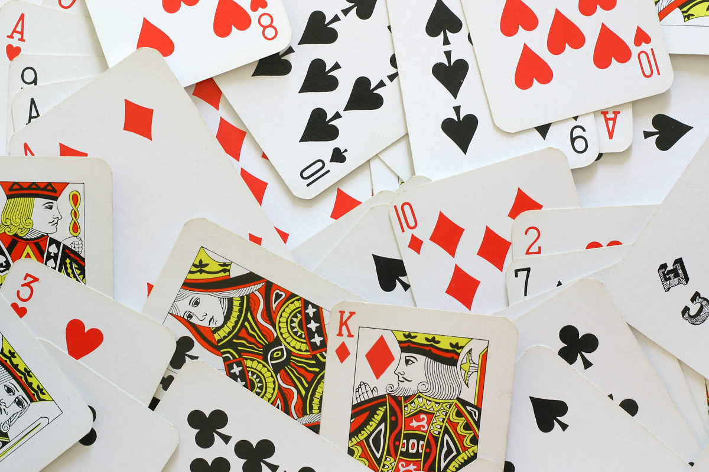

Para acompanhar este artigo, sugiro que arranjem um baralho de cartas. Um baralho normal de $52$ cartas com $4$ naipes e $13$ cartas por naipe (ou seja, sem jokers). Agora baralhem o baralho. Quando o baralho estiver muito bem baralhado, podem continuar a ler este artigo.

===

Agora que o baralho está baralhado, vou fazer uma pergunta:

!!! Qual destas duas opções é mais provável?
!!!
!!! - Algures no baralho vão aparecer duas cartas _iguais_ de seguida (e.g. aparecem dois "oitos" de seguida, ou dois "valetes");
!!! - As cartas vão estar todas alternadas.

Pensem um pouco e depois de decidirem qual é o vosso palpite, percorram o vosso baralho. O que é que encontraram? Havia duas cartas iguais de seguida, ou nem por isso? Se eu tivesse de adivinhar, eu diria que encontraram duas cartas iguais de seguida!

Um baralho de cartas que esteja perfeitamente bem baralhado tem aproximadamente $95\%$ probabilidade de ter duas cartas iguais de seguida! [1]
Isto significa que, por cada $20$ pessoas que fizerem esta experiência, eu vou acertar $19$ vezes.

Acharam isto surpreendente? A ideia que eu tenho é que, para a maioria das pessoas, um resultado aleatório - por exemplo o baralhar de um conjunto de $52$ cartas - é algo que produz um resultado sem padrões; e haver duas cartas iguais juntas é um padrão (apesar de ser um padrão pequeno).
Isto pode fazer alguém pensar que um baralho de cartas "bem baralhado" não vai conter nenhum destes padrões, quando _"baralhado"_ só quer dizer _"arranjado de forma aleatória"_.
Tal como se pode concluir, ao arranjarmos aleatoriamente as cartas de um baralho, é pouco provável conseguirmos separar as cartas iguais umas das outras.

### Conteúdo bónus

Baralhem as cartas todas de novo, por favor. E se, em vez de duas cartas de seguida, eu quiser encontrar três cartas iguais de seguida. Quão provável é isto acontecer?
Então e quatro cartas de seguida?

Pensem um pouco e depois palpitem. Comparem ainda com a situação em que vem tudo completamente separado.

No final de contas, há uma probabilidade de cerca de $12\%$ de encontrarmos três cartas iguais de seguida. Isto ainda é mais provável do que as cartas estarem todas segregadas. No entanto, só uma em cada $400$ vezes é que vão conseguir encontrar quatro cartas iguais todas de seguida (aproximadamente).

---

[1] Escrevi [um script Python](https://github.com/RojerGS/projects/blob/master/whatAreTheOdds/shuffled_card_deck.py) para estimar estas probabilidades, uma vez que fazer as contas com papel e caneta... bem, nem quero pensar no assunto.
O código estimou a probabilidade de haver duas cartas iguais de seguida em $\approx 95.5\%$, o que significa que a probabilidade de estar tudo muito bem separado é $\approx 4.5\%$.
