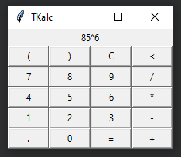
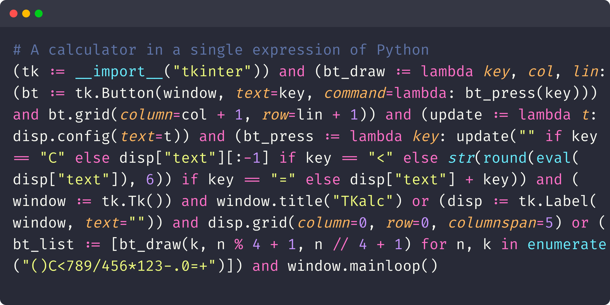

Let us implement a calculator in ONE line of code.

===


# Single-line calculator

A while back ago I saw someone on the Internet [sharing a GUI calculator they had written in 17 lines of code][reddit-post].
They were pretty happy that the calculator was _only_ 17 lines of code, and so I thought: can I make it shorter?
Turns out you can!
Let me show you how to implement this calculator in a single line of code.




## A reasonable calculator

The code for the original calculator is pretty reasonable.
I don't love the formatting and I don't love the fact that the original code uses [a list comprehension where a `for` loop was due](/blog/pydonts/list-comprehensions-101#bad-use-cases), but the code is pretty decent!

Here is the code:

```py
from tkinter import *

def bt_draw(key, col, lin):
    bt = Button(window, text=key, command=lambda: bt_press(key))
    bt.grid(column=col+1, row=lin+1)
    return bt

def bt_press(key):
    if   key == "C": disp["text"] = ""
    elif key == "<": disp["text"] = disp["text"][:-1]
    elif key == "=": disp["text"] = str(round(eval(disp["text"]), 6))
    else           : disp["text"] += key

window = Tk()
window.title("TKalc")

disp = Label(window, text="")
print(disp.grid(column=0, row=0, columnspan=5))

keys = "()C<789/456*123-.0=+"
bt_list = [bt_draw(keys[n], n%4, n//4) for n in range(20)]

window.mainloop()
```

Now, we'll start boiling it down to a single line.


## Drop a couple of lines

The first things we'll do come for free.
We'll drop the `return` statement inside `bt_draw` and we'll drop the variable `keys`, which we'll inline with `enumerate` inside the list comprehension:

```py
from tkinter import *

def bt_draw(key, col, lin):
    bt = Button(window, text=key, command=lambda: bt_press(key))
    bt.grid(column=col+1, row=lin+1)
    # Gone

def bt_press(key):
    if   key == "C": disp["text"] = ""
    elif key == "<": disp["text"] = disp["text"][:-1]
    elif key == "=": disp["text"] = str(round(eval(disp["text"]), 6))
    else           : disp["text"] += key

window = Tk()
window.title("TKalc")

disp = Label(window, text="")
disp.grid(column=0, row=0, columnspan=5)

bt_list = [bt_draw(k, n%4 + 1, n//4 + 1) for n, k in enumerate("()C<789/456*123-.0=+")]

window.mainloop()
```


## Statements: bad, expressions: good

One of the main ideas driving our changes is that statements cannot be mixed together with other code in a single line (for example, you can't have two `if` statements on the same line) so we need to replace all statements with expressions.

As another example, you can't have an assignment on the same line as a `def`, or an `elif` and an `else` on the same line.

So, we'll replace all statements with expressions.


## Assignments become assignment expressions

One of the easiest changes we can make is turn all assignments into assignment expressions which we also parenthesise:

```py
from tkinter import *

def bt_draw(key, col, lin):
    (bt := Button(window, text=key, command=lambda: bt_press(key)))
    bt.grid(column=col+1, row=lin+1)
    # Gone

def bt_press(key):
    if   key == "C": disp["text"] = ""
    elif key == "<": disp["text"] = disp["text"][:-1]
    elif key == "=": disp["text"] = str(round(eval(disp["text"]), 6))
    else           : disp["text"] += key

(window := Tk())
window.title("TKalc")

(disp := Label(window, text=""))
disp.grid(column=0, row=0, columnspan=5)

(bt_list := [bt_draw(k, n%4 + 1, n//4 + 1) for n, k in enumerate("()C<789/456*123-.0=+")])

window.mainloop()
```

The only problem that remains is the function `bt_press` that assigns to `disp["text"]`, which cannot be the target of an assignment expression.
So, in this case we take a step back to be able to take four steps forward!
We start by introducing an auxiliary function:

```py
(update := lambda t: disp.config(text=t))
```

Since we're defining `update` from scratch, might as well just do it as a `lambda` from the get-go!
Now, we can use the function `update` inside the function `bt_press`:

```py
def bt_press(key):
    if key == "C": update("")
    elif key == "<": update(disp["text"][:-1])
    elif key == "=": update(str(round(eval(disp["text"]), 6)))
    else: update(disp["text"] + key)
```

We got rid of all of the assignment statements, excellent!


## Conditional statements

The next thing we're doing is getting rid of the conditional statements: the `if`, the two `elif`, and the `else`.
Thankfully, we got lucky!
The only thing the statements really do is decide what the argument to `update` should be.
For example, the function `bt_press` could've been written as follows:

```py
def bt_press(key):
    if key == "C": arg = ""
    elif key == "<": arg = disp["text"][:-1]
    elif key == "=": arg = str(round(eval(disp["text"]), 6))
    else: arg = disp["text"] + key
    update(arg)
```

So, this pattern is something we can "easily" do with nested [conditional expressions](/blog/pydonts/conditional-expressions).
This way, we can change `bt_press` so that it only uses a single expression:

```py
def bt_press(key):
    update(
        "" if key == "C" else
        disp["text"][:-1] if key == "<" else
        str(round(eval(disp["text"]), 6)) if key == "=" else
        disp["text"] + key
    )
```

I wrapped it so you could see the "similarity" with the original code, but we can delete the newlines:

```py
def bt_press(key):
    update("" if key == "C" else disp["text"][:-1] if key == "<" else str(round(eval(disp["text"]), 6)) if key == "=" else disp["text"] + key)
```

And at this point we might as well just make it a `lambda`:

```py
(bt_press := lambda key: update("" if key == "C" else disp["text"][:-1] if key == "<" else str(round(eval(disp["text"]), 6)) if key == "=" else disp["text"] + key))
```


## A function to do imports

We've now gotten rid of almost _all_ statements.
One that remains is the statement `from tkinter import *`.

The first thing we'll do is replace the asterisk import with a named import and prefixing the tkinter objects with `tk.`:

```py
import tkinter as tk

def bt_draw(key, col, lin):
    (bt := tk.Button(window, text=key, command=lambda: bt_press(key)))
    bt.grid(column=col + 1, row=lin + 1)

(update := lambda t: disp.config(text=t))

(bt_press := lambda key: update("" if key == "C" else disp["text"][:-1] if key == "<" else str(round(eval(disp["text"]), 6)) if key == "=" else disp["text"] + key))

(window := tk.Tk())
window.title("TKalc")

(disp := tk.Label(window, text=""))
disp.grid(column=0, row=0, columnspan=5)

(bt_list := [bt_draw(k, n % 4 + 1, n // 4 + 1) for n, k in enumerate("()C<789/456*123-.0=+")])

window.mainloop()
```

Now that the import statement has a name, we can replace it with an expression.
Believe it or not, there is a function that we can use to do imports!
(Please don't do this at home!)

```py
(tk := __import__("tkinter"))
```


## Getting rid of the last function statement

There is one little pesky function statement remaining:

```py
def bt_draw(key, col, lin):
    (bt := tk.Button(window, text=key, command=lambda: bt_press(key)))
    bt.grid(column=col + 1, row=lin + 1)
```

The problem here is that the function `bt_draw` has two lines and `lambda` functions only accept a single expression...
You can fix this problem in a couple of different ways but my favourite one uses [Boolean short-circuiting](/blog/pydonts/boolean-short-circuiting) together with the fact that all Python objects have a [Truthy or Falsy](/blog/pydonts/truthy-falsy-and-bool) value.

The gist of it is that if you have two expressions `expr1` and `expr2`, then you can put them together with `and` or `or` and you get both to run.
You use either `and` or `or` depending on the value of `expr1`:

 - if `expr1` evaluates to a Falsy value, you write `expr1 or expr2`; and
 - if `expr2` evaluates to a Truthy value, you write `expr1 and expr2`.

In the case of the function `bt_draw`, the first expression evaluates to a tkinter button which is Truthy (the _vast_ majority of objects are Falsy!), so we join the two expressions with an `and`:

```py
def bt_draw(key, col, lin):
    (bt := tk.Button(window, text=key, command=lambda: bt_press(key))) and bt.grid(column=col + 1, row=lin + 1)
```

After we do this, we can turn `bt_draw` into a `lambda`:

```py
(bt_draw := lambda key, col, lin: (bt := tk.Button(window, text=key, command=lambda: bt_press(key))) and bt.grid(column=col + 1, row=lin + 1))
```


## Chaining all of the standalone expressions

At this point, this is what our code looks like:

```py
(tk := __import__("tkinter"))

(bt_draw := lambda key, col, lin: (bt := tk.Button(window, text=key, command=lambda: bt_press(key))) and bt.grid(column=col + 1, row=lin + 1))

(update := lambda t: disp.config(text=t))

(bt_press := lambda key: update("" if key == "C" else disp["text"][:-1] if key == "<" else str(round(eval(disp["text"]), 6)) if key == "=" else disp["text"] + key))

(window := tk.Tk())
window.title("TKalc")

(disp := tk.Label(window, text=""))
disp.grid(column=0, row=0, columnspan=5)

(bt_list := [bt_draw(k, n % 4 + 1, n // 4 + 1) for n, k in enumerate("()C<789/456*123-.0=+")])

window.mainloop()
```

Now, we can chain _all_ of this with `and` and `or` operators.
If you're not sure how, you can aggregate the expressions one by one, but this is the final result:

```py
(tk := __import__("tkinter")) and (bt_draw := lambda key, col, lin: (bt := tk.Button(window, text=key, command=lambda: bt_press(key))) and bt.grid(column=col + 1, row=lin + 1)) and (update := lambda t: disp.config(text=t)) and (bt_press := lambda key: update("" if key == "C" else disp["text"][:-1] if key == "<" else str(round(eval(disp["text"]), 6)) if key == "=" else disp["text"] + key)) and (window := tk.Tk()) and window.title("TKalc") or (disp := tk.Label(window, text="")) and disp.grid(column=0, row=0, columnspan=5) or (bt_list := [bt_draw(k, n % 4 + 1, n // 4 + 1) for n, k in enumerate("()C<789/456*123-.0=+")]) and window.mainloop()
```

We've done it!

Here's all of your code:




[reddit-post]: https://www.reddit.com/r/Python/comments/ojab0n/i_see_your_17_loc_calculator_and_i_raise_you_a/
