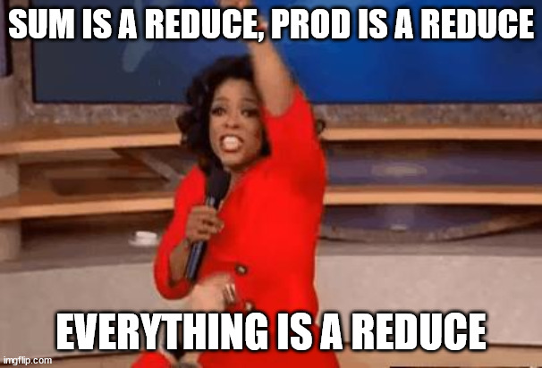

This is the written version of my EuroPython 2022 lightning talk “Smoosh all the things”.

===

This is the written version of a lightning talk I gave at EuroPython 2022 in Dublin.
If you prefer, you can watch the recording of my presentation:

<iframe width="560" height="315" src="https://www.youtube-nocookie.com/embed/YeH7CwruEUs" title="YouTube video player" frameborder="0" allow="accelerometer; autoplay; clipboard-write; encrypted-media; gyroscope; picture-in-picture" allowfullscreen></iframe>

Here is the written version of this talk:


# Quiz time

Can you please tell me the result of the expression that follows?

```pycon
>>> 1 + 2 + 3 + 4
```

You probably got it correct, it's `10`:

```pycon
>>> 1 + 2 + 3 + 4
10
```

Now, what about this next expression?

```pycon
>>> 1 * 2 * 3 * 4
```

You probably got this one correct as well, it's `24`:

```pycon
>>> 1 * 2 * 3 * 4
24
```

What about _this_ one, instead:

```pycon
>>> True and True and False and True
```

This Boolean condition evaluates to `False`, which you probably also knew.

```pycon
>>> True and True and False and True
False
```

It is very likely that you understand all these three expressions.
After all, they are fairly simple.
Now, the question is...
What's the pattern here?


## Pattern?

Take a look at the three expressions:

```pycon
>>> 1 + 2 + 3 + 4
10
>>> 1 * 2 * 3 * 4
24
>>> True and True and False and True
False
```

What is the pattern that they exhibit?
These three expressions are structurally similar...
But in what way?


### Binary function

Well, the three expressions make use of a binary function.
That's `+`, `*`, and `and`, in the three expressions.
“Binary” here means they accept two arguments,
which is true of `+`, `*`, and `and`:

```pycon
# +
>>> 1 + 2 + 3 + 4
10

# *
>>> 1 * 2 * 3 * 4
24

# and
>>> True and True and False and True
False
```


### List of values

Another commonality between the three expressions is that we are working with “a bunch of values”,
which I can represent as a list of values:

```pycon
# +, [1, 2, 3, 4]
>>> 1 + 2 + 3 + 4
10

# *, [1, 2, 3, 4]
>>> 1 * 2 * 3 * 4
24

# and, [True, True, False, True]
>>> True and True and False and True
False
```


### Single result

Finally, when we take the binary function we are working with and use it to smoosh all of the values in the list of values,
we get a _single_ result.
In all three cases:

 - smooshing `[1, 2, 3, 4]` with addition `+` gives `10`;
 - smooshing `[1, 2, 3, 4]` with multiplication `*` gives `24`; and
 - smooshing `[True, True, False, True]` with the logical `and` gives `False`.

```pycon
# +, [1, 2, 3, 4], 10
>>> 1 + 2 + 3 + 4
10

# *, [1, 2, 3, 4], 24
>>> 1 * 2 * 3 * 4
24

# and, [True, True, False, True], False
>>> True and True and False and True
False
```

In short, these three expressions could be summarised by:

 - the binary function that I was using;
 - the values that were smooshed together by that binary function; and
 - the result we obtain.


## This pattern is useful!

So, I gave you three expressions following a specific pattern.
But is this pattern useful?

It _is_ a useful pattern!
In fact, these three examples correspond to three well-known functions in Python:

```py
10 == sum([1, 2, 3, 4])

24 == math.prod([1, 2, 3, 4])

False == all([True, True, False, True])
```


## This pattern is a reduce!

This pattern is _very_ useful and it even has a name.
The module `functools` contains a tool, `reduce`, that we can use to express this pattern.
In other words, we can implement all of the three functions mentioned above in terms of `reduce`!

Why is that?

Because `reduce` needs a binary function and a list of values,
and will then proceed to smooshing all of the values,
with the given function, to produce a single result:

```py
reduce(+, [...]) == sum

reduce(*, [...]) == math.prod

reduce(and, [...]) == all
```


## Everything is a reduce!

Not only are `sum`, `math.prod`, and `all`, specific cases of `reduce`,
but there are many other built-ins that are reductions or very similar to reductions.



Some other examples include the built-ins `any`, `max`, `min`, and `str.join`.


## What gives?

But hey, what gives?
Why do I care about `reduce`?

I am of the opinion that understanding that all of these built-ins are related gives you a deeper understanding of the functions themselves.
In turn, understanding these functions makes it simpler for you to understand the general form of `reduce`,
which also means you gain one more tool for your tool belt.
After all, as programmers, that is one of the things we are most interested in:
knowing about the tools at our disposal, so that we can use the right tool for the job, always.

Finally, there is also a more philosophical advantage to it,
in that when you deepen your knowledge of how all these things work,
and when you realise there are connections between different things that seemed disconnected,
you start building a more complete picture of how things are the way they are and you improve your knowledge of algorithms and programming, in general.

And, to me, few things are more elegant than expanding my knowledge and filling in all the gaps that I can.


## Prolog

If you would like to learn more about `functools.reduce`,
I have written [a Pydon't about the power of reductions](/blog/pydonts/the-power-of-reduce).
