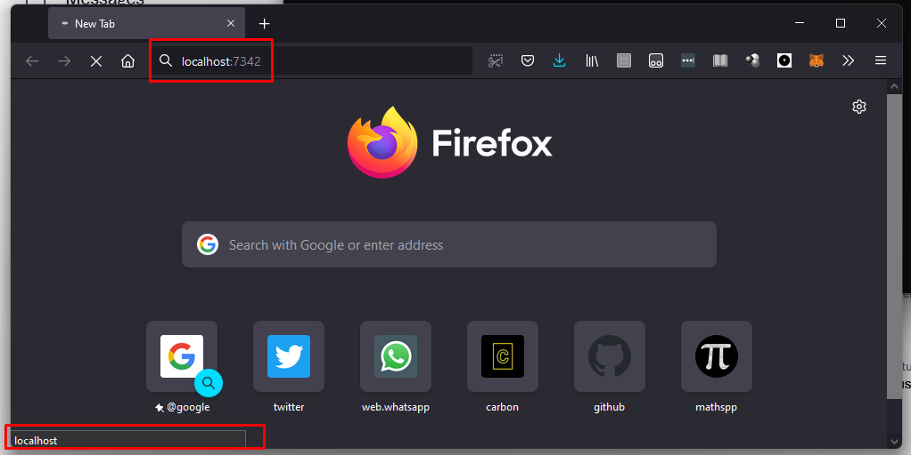
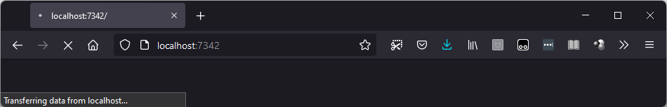
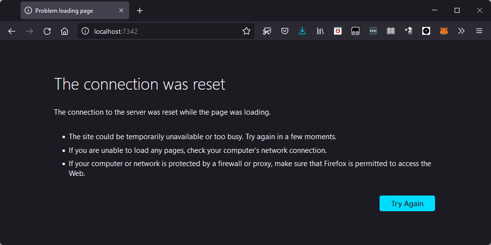
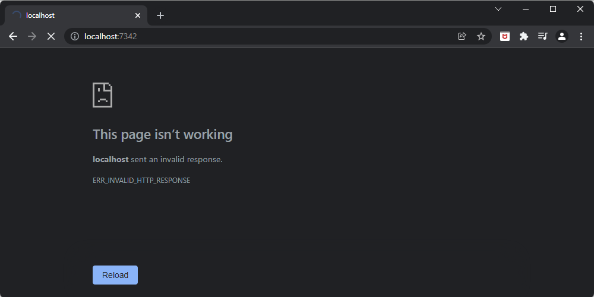
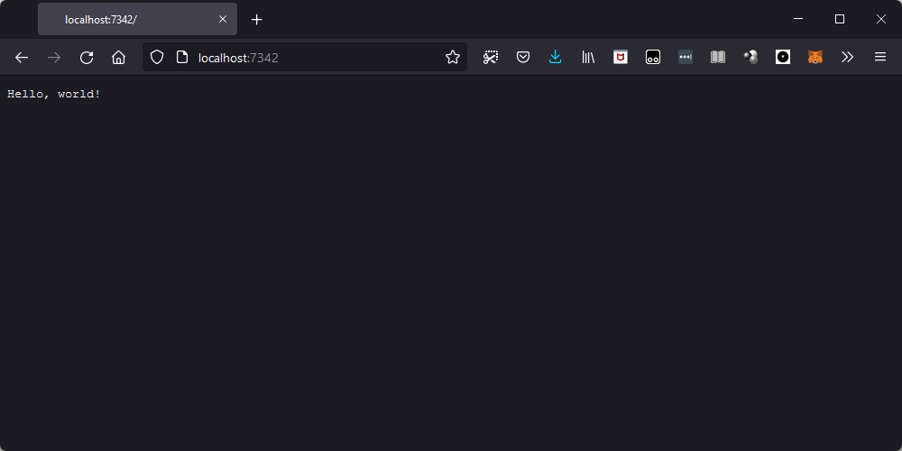
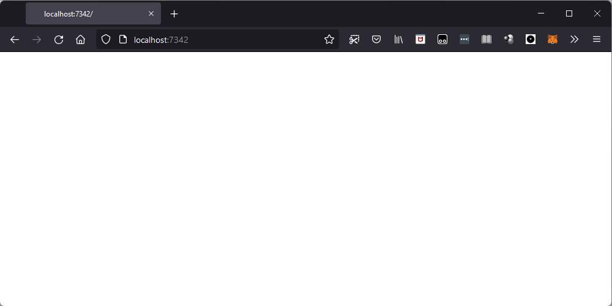
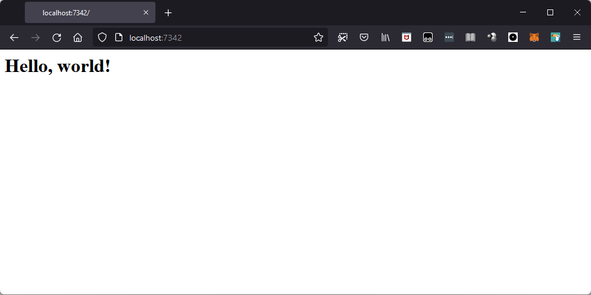
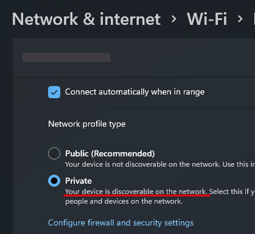

Join me as I dive into the world of socket programming with 0 (ZERO) prior experience.

===

<script async src="https://platform.twitter.com/widgets.js" charset="utf-8"></script>


# Motivation and starting point

I need to learn about socket programming for work.
I was tasked with maintaining a project ([Py'n'APL][pynapl]) that revolves around sockets,
so I figured I can't really maintain [Py'n'APL][pynapl] without knowing what I'm messing with.

I have no networking knowledge whatsoever,
and I'm starting this learning experience with the impression that sockets are like tunnels/roads
that allow different programs to communicate.
This is my (limited) intuitive understanding of sockets,
which we'll find out together whether it is a decent intuition or not.

My generic game plan is to read enough about sockets so that:

 - I can explain what sockets are to others;
 - I can manipulate sockets in my Python programs; and
 - I can make use of sockets in my Python programs to have them communicate with each other.


## Learning in public

At the same time I learn about socket programming _and_ write this article,
I will be sharing my almost-real-time findings, ideas, and experiments, on Twitter.
If you are reading this, it means I already did that, but here is the Twitter thread
that I wrote while learning about socket programming in public:

<blockquote class="twitter-tweet"><p lang="en" dir="ltr">Today, I&#39;m spending the day learning in public about socket programming (in Python 🐍).<br><br>My starting point is this:<br><br>“I think sockets are like tunnels/roads that allow different programs to talk to each other directly.”<br><br>This 🧵 will evolve as I learn and experiment 👇</p>&mdash; Rodrigo 🐍📝 (@mathsppblog) <a href="https://twitter.com/mathsppblog/status/1478321570892320768?ref_src=twsrc%5Etfw">January 4, 2022</a></blockquote>


# Client and server sockets

The first step in my journey to understanding socket programming is going through the
“Socket Programming HOWTO” available in the Python docs, and that you can read [here][socket-programming-howto].

As we read through the [HOWTO][socket-programming-howto], we learn about “IPC”:

!!! IPC stands for Inter-Process Communication,
!!! which validates the idea that sockets are useful for programs to communicate with each other.

It also tells us about the distinction between a “client socket” and a “server socket”.

A “server socket” is described as a switchboard operator.
My understanding of that is that the server (socket) is responsible for accepting
communications “from the outside world”, and handling those.

The “client socket” seems to be the socket that wants to connect to a given server,
in order to communicate with it.

The example given in that [HOWTO][socket-programming-howto] is that of a web browser:
your web browser acts as (or uses?) a client socket to connect to a website.
For example, in order to read this article, your browser had to use a client socket
to access my domain.
On my end, my web server has a socket server that accepts these connections
from people like you, and then returns the web pages.

The [HOWTO][socket-programming-howto] actually says that the web server uses both server sockets and client sockets...
So, perhaps the server socket is in charge of accepting the connections,
but then it also uses a client socket to _send_ the pages that were requested?


# Creating a server socket

Further reading shows how we can create a server socket and a client socket,
although they do nothing.

Go ahead and open your Python REPL.
In it, type this:

```py
# REPL 1
>>> import socket
>>> server = socket.socket(socket.AF_INET, socket.SOCK_STREAM)
>>> server.bind(("localhost", 7342))
>>> server.listen()
>>> (client_socket, address) = server.accept()

```

You should notice that your REPL is hanging – that's good news!
Here is what is going on:
First, we import the built-in module `socket`, which provides sockets-related functionality.
Then, the line

```py
server = socket.socket(socket.AF_INET, socket.SOCK_STREAM)
```

creates a socket that will act as our server.
The first argument, `socket.AF_INET`, tells the socket what type of addresses we are using.
`AF` stands for _Address Family_, and here is my understanding of what this means:
when you write an email to someone, you use their email _address_, right?
Otherwise, your emails wouldn't reach the correct people...

Typically, we write email addresses as `some_name@domain.tld`.
For example, you wouldn't bat an eye if you saw an email like `john.doe@gmail.com`.
However, we could decide to reformat the addresses, for example, into something like `gmail.com / john.doe`.
This would be a new address family, where all addresses follow a different format: `domain.tld / some_name`.
Thus, the first argument to `socket.socket` specifies what type/format of addresses we are expecting.
The `INET` portion of `socket.AF_INET` says we are going to use IPv4 addresses.

In other words, `socket.socket(socket.AF_INET, ...)` creates a socket that uses addresses that follow the IPv4 format.

Secondly, the `socket.SOCK_STREAM` argument specifies the type of socket.
However, I have no idea what the `SOCK_STREAM` type means.
Hopefully, we'll find out as we go along.

After we created the socket, we need to tell it to act as a server socket.
For the socket to be a server socket, we need to tell it the address we want to listen to.
Something like, if you want people to be able to send you emails to `john.doe@gmail.com`,
first you have to create that email account.

By writing

```py
server.bind(("localhost", 7342))
```

we are telling the server to pay attention to connections that come in to the address `("localhost", 7342)`.
The `"localhost"` part of it is what is called the _host_, and `7342` is the _port_.
Together, they form the address.
By using `"localhost"` as the host, the server socket is only visible inside your own computer.
The port is `7342` because that's a random large number I like.
When playing around with these things, avoid small numbers, as those usually have specific meanings.

After creating the server, and telling it where to listen to, we must actually tell the server to
_start listening_, and that's what the line

```py
server.listen()
```

does.
Finally, we want to accept connections and use them for something,
so we write

```py
(client_socket, address) = server.accept()
```

This is the line of code that grabs a connection from a client, and does something with it.
Because no one is trying to connect to our random host and port, the code hangs:
it's waiting for a socket to connect!


# Connecting to the server through your browser

After creating the server, I had a glimpse of inspiration!
I opened my browser and I typed `localhost:7342`; I suggest you do the same.
When you do that, your server code is no longer hanging, and you get to inspect the `client_socket`:

```py
# (client_socket, address) = server.accept() <- this is no longer hanging.
>>> client_socket
<socket.socket fd=580, family=AddressFamily.AF_INET, type=SocketKind.SOCK_STREAM, proto=0, laddr=('127.0.0.1', 7342), raddr=('127.0.0.1', 61896)>
```

At the same time, you should see the browser showing that progress indicator, customary when the browser is loading a page.
In essence, the browser is waiting for the server (your code) to handle the request of connecting to the “web page”
at the address `localhost:7342`.
(Between you and me, we know there is no web page at that address, but the browser doesn't know that!)
This is what my browser (Mozilla Firefox) looks like:




So, you might be wondering: can we send information to the browser?
Well, we can definitely try; after all, sockets (from the `socket` module) have a method `.send`
that seems just about right for this.

Let's try sending something back to the browser, to see what happens:

```py
>>> client_socket.send("Hello, world!")
Traceback (most recent call last):
  File "<stdin>", line 1, in <module>
TypeError: a bytes-like object is required, not 'str'
```

If we try to send a string, we get this error back.
Sockets are low-level beasts, so we are going to be dealing with instances of `bytes`.
Thankfully, all we have to do is prepend a `b` to the string:

```py
>>> client_socket.send(b"Hello, world!")
13
```

The return value is the length of the message that we sent to the other end of the socket:

```py
>>> len("Hello, world!")
13
>>> len(b"Hello, world!")
13
```

At the same time, the look of the browser changes.
(At least for me, on Firefox.)
Now, the bottom-left tooltip says that we are _transferring data_,
and the page preview is now in a tone of grey:



Now it's the browser's turn to be left hanging...
Why?
I suspect it's because we never told the browser we already sent all the data we wanted...
So, maybe sockets work a bit like files, and we have to close them after being used?
We can try calling the method `.close` on our `client_socket`:

```py
>>> client_socket.close()
```

However, when we do that, Firefox doesn't like it,
and it presents a message saying that the connection was reset:



I also tried this out on Chrome, and turns out that it complains sooner in the process.
When you try sending the binary string `b"Hello, world!"`, it says that the page isn't working,
and that the localhost sent an invalid response:



What is more, the error message says that the localhost sent an invalid response,
which is something interesting!

So, we did manage to connect to our server, we just didn't do anything useful with it...
Yet!


# Reading (receiving) incoming data

At this point, I went to take a shower, and was left thinking about this little experiment...
And then it hit me: perhaps we need to _read_ the actual request _first_, and _then_ we reply with the data!

So, I closed my socket and re-ran the line `client_socket, address = server.accept()` until it hang again.
When it hang again, I opened the browser and went to `localhost:7342`.
After that, I tried reading from the socket.

To be completely honest with you, I have _no_ idea why the next calls to `.accept` don't hang immediately.
It's as if some other sockets were queued in to connect/be accepted..?
Not sure.

Anyway, I re-ran that line a bunch of times, and when it hang, I called the method `.read`:

```py
>>> (client_socket, address) = server.accept()  # Didn't hang.
>>> (client_socket, address) = server.accept()  # Didn't hang.
>>> (client_socket, address) = server.accept()  # Didn't hang.
>>> (client_socket, address) = server.accept()  # Didn't hang.
>>> (client_socket, address) = server.accept()  # Didn't hang.
>>> (client_socket, address) = server.accept()  # Didn't hang.
>>> (client_socket, address) = server.accept()  # Didn't hang.

>>> (client_socket, address) = server.accept()  # This one hang!
>>> client_socket.read()
Traceback (most recent call last):
  File "<stdin>", line 1, in <module>
AttributeError: 'socket' object has no attribute 'read'
>>>
```

Except that sockets don't seem to have a method `.read`.
Thus, I decided to use the built-in `dir` to list all the attributes of my client socket.
Among those, I found `recv`, “re-c-v”, which looks like short for “receive”:

```py
>>> dir(client_socket)
['__class__', '__del__', '__delattr__', '__dir__', '__doc__', '__enter__', '__eq__', '__exit__', '__format__', '__ge__', '__getattribute__', '__getstate__', '__gt__', '__hash__', '__init__', '__init_subclass__', '__le__', '__lt__', '__module__', '__ne__', '__new__', '__reduce__', '__reduce_ex__', '__repr__', '__setattr__', '__sizeof__', '__slots__', '__str__', '__subclasshook__', '__weakref__', '_accept', '_check_sendfile_params', '_closed', '_decref_socketios', '_io_refs', '_real_close', '_sendfile_use_send', '_sendfile_use_sendfile', 'accept', 'bind', 'close', 'connect', 'connect_ex', 'detach', 'dup', 'family', 'fileno', 'get_inheritable', 'getblocking', 'getpeername', 'getsockname', 'getsockopt', 'gettimeout', 'ioctl', 'listen', 'makefile', 'proto', 'recv', 'recv_into', 'recvfrom', 'recvfrom_into', 'send', 'sendall', 'sendfile', 'sendto', 'set_inheritable', 'setblocking', 'setsockopt', 'settimeout', 'share', 'shutdown', 'timeout', 'type']
```

So, let's try calling `.recv`:

```py
>>> client_socket.recv()
Traceback (most recent call last):
  File "<stdin>", line 1, in <module>
TypeError: recv() takes at least 1 argument (0 given)
```

Alright, I should've known better...
I should've read the docs on `.recv` or, at the very least, called `help` on it:

```py
>>> help(client_socket.recv)
```
```txt
Help on built-in function recv:

recv(...) method of socket.socket instance
    recv(buffersize[, flags]) -> data

    Receive up to buffersize bytes from the socket.  For the optional flags
    argument, see the Unix manual.  When no data is available, block until
    at least one byte is available or until the remote end is closed.  When
    the remote end is closed and all data is read, return the empty string.
```

Now that we know what the argument does, let's try to read a bunch of data from the socket:

```py
>>> data = client_socket.recv(999_999)
>>> len(data)
1092
```

We tried reading 999,999 bytes of data but we only got 1092,
so we probably got everything.
Let's print the data (as a string):

```py
>>> print(data.decode("utf8"))
```
```txt
GET / HTTP/1.1
Host: localhost:7342
User-Agent: Mozilla/5.0 (Windows NT 10.0; Win64; x64; rv:95.0) Gecko/20100101 Firefox/95.0
Accept: text/html,application/xhtml+xml,application/xml;q=0.9,image/avif,image/webp,*/*;q=0.8
Accept-Language: en,en-US;q=0.8,pt-PT;q=0.5,pt;q=0.3
Accept-Encoding: gzip, deflate
Connection: keep-alive
Cookie: username-localhost-8889="2|1:0|10:1640189416|23:username-localhost-8889|44:ODkzZTRiN2JjYzIzNDhmMDg2NjExMmJmNzQwZjBmZTY=|5c241580e03053bff2a4b96d6bcac1e91ade29d1fca2474dd63c86901cb96ace"; username-localhost-8890="2|1:0|10:1638989839|23:username-localhost-8890|44:ZmFhY2I5MmZkY2UxNGU0Y2IxN2IyMDMzNzljYzc5MzU=|f45e93bbaafa381409c85b136c31ba38daef9eeb7bad5ff4915ebdc78d02576e"; username-localhost-8888="2|1:0|10:1640430299|23:username-localhost-8888|44:NmU3ZDVjYmE1Y2ZmNGQ0Zjk4NWM0ODU5ZWI1N2JjNGE=|ff8af643aa244047d0f51c3fc2c41884fd95ad43e8f343c18e3dce4edf910ecb"; _xsrf=2|294156da|6210c8ee81c228a89a06129cf9ab1217|1639935796
Upgrade-Insecure-Requests: 1
Sec-Fetch-Dest: document
Sec-Fetch-Mode: navigate
Sec-Fetch-Site: none
Sec-Fetch-User: ?1


>>>
```

Now that we read all this data, let's ignore it and send our own data back:

```py
>>> client_socket.send(b"Hello, world!")
13
>>> client_socket.close()
```

If we do that through Firefox, then the browser displays our data:



Quite interesting!
However, if we try to send some HTML, the browser doesn't display it properly.
For example, try sending `b"<html><body><h1>Hello, world!</h1></body></html>"` back.
You will see it displayed as a raw string in the browser (if you use Firefox).

If we consider this and the fact that Chrome complains about an invalid response,
it must be because we are not replying to the browser in the format that it expects.
This is something that is very relevant for socket programming:
because it is low-level, the two endpoints (the server and the client) have to agree
on the format that the messages take.


# HTTP response format

As I was [writing about this on Twitter][twitter-thread],
[someone replied][twitter-html-response] with the bare minimum I needed to include in the message
for the browser to be able to make sense of it:

<blockquote class="twitter-tweet" data-conversation="none" data-theme="light"><p lang="en" dir="ltr">I think you&#39;ll need to include:<br><br>HTTP/1.1 200 OK<br>Content-Type: text/html<br><br>As part of your client.send(). That should be the minimum required response for it to see that what you&#39;re sending is HTML and not just plain text.</p>&mdash; Linh Pham (@questionlp) <a href="https://twitter.com/questionlp/status/1478381741685579780?ref_src=twsrc%5Etfw">January 4, 2022</a></blockquote>

Like I mentioned before, we need to speak the language that the browser expects,
and it appears that we have to return some meta information in the beginning of our reply,
much like the browser sent some meta information (that we ignored!).

So, I did just that, I tried sending this message:

```py
>>> msg = b"""HTTP/1.1 200 OK
Content-Type: text/html
<html><body><h1>Hello, world!</h1></body></html>"""
>>> client.send(msg)
88
>>> client.close()
```

When I did this, Firefox changed from that grey state to a fully white page:



This seems like a better indication that we are making progress,
but we don't see our “Hello, world!” title.
In fact, when I inspected the HTML of the page I was looking at,
I found the page to be empty:

```html
<html>
    <head></head>
    <body></body>
</html>
```

So, I figured something else had failed.
Then, I had a hunch: maybe I need to add a newline between the headers and the data?

So, I updated the `msg` and tried again.

```py
>>> msg = b"""HTTP/1.1 200 OK
... Content-Type: text/html
...
... <html><body><h1>Hello, world!</h1></body></html>"""
>>> client, addr = server.accept()
>>> data = client.recv(999_999)
>>> client.send(msg)
89
>>> client.close()
```

Lo and behold, it worked!
As it turns out, we _did_ need the empty line between the headers and data,
and now we have our basic webpage:



This also seems to be working on Chrome (for me, at least),
so let's call this the first major win of this article!


# Creating a client socket

The [HOWTO][socket-programming-howto] also shows how to create a client socket from scratch,
so maybe we could do just that.

The code in the [HOWTO][socket-programming-howto] is just two lines and a couple of comments:

```py
# create an INET, STREAMing socket
s = socket.socket(socket.AF_INET, socket.SOCK_STREAM)
# now connect to the web server on port 80 - the normal http port
s.connect(("www.python.org", 80))
```

After we connect the client socket, we can send the request for a page,
and then get the page back.
From our experiments before, it looks like we may need to send metadata like the
things we got from when the browser connected to us.

So, let's go back to that, and try requesting a page from www.python.org.
First, I copied and pasted the whole data from before, putting it in the variable `msg`:

```py
>>> msg = b"""GET / HTTP/1.1
Host: localhost:7342
User-Agent: Mozilla/5.0 (Windows NT 10.0; Win64; x64; rv:95.0) Gecko/20100101 Firefox/95.0
Accept: text/html,application/xhtml+xml,application/xml;q=0.9,image/avif,image/webp,*/*;q=0.8
Accept-Language: en,en-US;q=0.8,pt-PT;q=0.5,pt;q=0.3
Accept-Encoding: gzip, deflate
Connection: keep-alive
Cookie: username-localhost-8889="2|1:0|10:1640189416|23:username-localhost-8889|44:ODkzZTRiN2JjYzIzNDhmMDg2NjExMmJmNzQwZjBmZTY=|5c241580e03053bff2a4b96d6bcac1e91ade29d1fca2474dd63c86901cb96ace"; username-localhost-8890="2|1:0|10:1638989839|23:username-localhost-8890|44:ZmFhY2I5MmZkY2UxNGU0Y2IxN2IyMDMzNzljYzc5MzU=|f45e93bbaafa381409c85b136c31ba38daef9eeb7bad5ff4915ebdc78d02576e"; username-localhost-8888="2|1:0|10:1640430299|23:username-localhost-8888|44:NmU3ZDVjYmE1Y2ZmNGQ0Zjk4NWM0ODU5ZWI1N2JjNGE=|ff8af643aa244047d0f51c3fc2c41884fd95ad43e8f343c18e3dce4edf910ecb"; _xsrf=2|294156da|6210c8ee81c228a89a06129cf9ab1217|1639935796
Upgrade-Insecure-Requests: 1
Sec-Fetch-Dest: document
Sec-Fetch-Mode: navigate
Sec-Fetch-Site: none
Sec-Fetch-User: ?1

"""
```

Then, I tried sending it, reading the response back, and printing it:

```py
>>> client.send(msg)
1078
>>> data = client.recv(999_999)
>>> print(data.decode("utf8"))
```
```txt
HTTP/1.1 421 Misdirected Request
Server: Varnish
Retry-After: 0
Content-Type: text/plain;charset=us-ascii
Cache-Control: private, no-cache
connection: keep-alive
Content-Length: 28
Accept-Ranges: bytes
Date: Tue, 04 Jan 2022 19:34:08 GMT
Via: 1.1 varnish

Misdirected Request (E2815)

>>>
```

Well, we got _something_ back, but the first line of the result talks about a 421 Misdirected Request,
which means we pointed something at the wrong thing...
A quick search online, and we can see that the issue was the beginning of our `msg`:

```py
>>> print(msg[:35].decode("utf8"))
```
```txt
GET / HTTP/1.1
Host: localhost:7342
```

The host is defined to be `"localhost:7342"`, when we actually want to talk to the host `"www.python.org"`.

Let's update that in our variable `msg`, and try again!
(Also, after a bit of Googling, I figured we [could omit _most_ of the headers][required-http-headers],
to make our request smaller and easier to look at.)

```py
>>> msg = b"""GET / HTTP/1.1
Host: www.python.org

"""
```

So, let's recreate our client socket and try again:

```py
>>> client = socket.socket(socket.AF_INET, socket.SOCK_STREAM)
>>> client.connect(("www.python.org", 80))
>>> client.send(msg)
37
>>> print(client.recv(999_999).decode("utf8"))
```
```txt
HTTP/1.1 301 Moved Permanently
Server: Varnish
Retry-After: 0
Location: https://www.python.org/
Content-Length: 0
Accept-Ranges: bytes
Date: Tue, 04 Jan 2022 19:41:55 GMT
Via: 1.1 varnish
Connection: close
X-Served-By: cache-mad22069-MAD
X-Cache: HIT
X-Cache-Hits: 0
X-Timer: S1641325316.879145,VS0,VE0
Strict-Transport-Security: max-age=63072000; includeSubDomains


>>>
```

We see some progress being made!
Now we get the error “301 Moved Permanently”, along with the information `Location: https://www.python.org/`,
so it must be related to the fact that the official Python website uses HTTPS only.
Alright, let's try looking for a website that still allows HTTP, then...

After a bit of googling, I found the website [http://ptsv2.com/](http://ptsv2.com/),
that looks like a website that won't force you to use HTTPS anytime soon.

! This is true at the time of writing.
! If you are reading this in the future (you are!) and the website no longer exists/
! accepts HTTP, feel free to leave a comment with a suggestion of another website,
! or just replace all occurrences of “http://ptsv2.com/” below with another website you pick.

So, what we need to do now is update the variable `msg` and try again.

```py
>>> msg = b"""GET / HTTP/1.1
... Host: ptsv2.com
...
... """
>>> client = socket.socket(socket.AF_INET, socket.SOCK_STREAM)
>>> client.connect(("ptsv2.com", 80))
>>> client.send(msg)
32
>>> data = client.recv(999_999)
>>> len(data)
4825
>>> print(data[:300].decode("utf8"))
```
```txt
HTTP/1.1 200 OK
Content-Type: text/html; charset=utf-8
Vary: Accept-Encoding
X-Cloud-Trace-Context: 6f4d016104760832fda81a9edc07f832
Date: Tue, 04 Jan 2022 19:51:02 GMT
Server: Google Frontend
Content-Length: 4602

<!DOCTYPE html>
<html lang="en">
  <head>
    <meta charset="utf-8">

```

This does look like a valid response, and that's because it is!
That's great!
We managed to use a client socket to connect to a web server and get a page from there!

Next up, let's connect our own server socket to our own client socket, and have both of them communicate!
This should be a walk in the park, after using sockets to communicate with browsers and the Internet.


# Using sockets to communicate between two Python instances

In order to do this, let's open two Python terminals,
and put them side by side.

I'll walk you through the things you have to do,
just make sure to write each piece of code in the correct REPL:

 - one will be the “server side”; and
 - the other will be the “client side”.

To create the server, we

 - create a new socket;
 - bind it to the localhost and a random port number (I like 7342);
 - start listening on that host and port; and
 - accept an incoming connection:

```py
# (SERVER)
>>> import socket
>>> server = socket.socket(socket.AF_INET, socket.SOCK_STREAM)
>>> server.bind(("localhost", 7342))  # 1
>>> server.listen()  # 2
>>> client, address = server.accept()  # 3
```

At this point, the code hangs because we are waiting for a client to connect.

To create a client, we do the exact same first step, but then we connect to the host and port:

```py
# (CLIENT)
>>> import socket
>>> client = socket.socket(socket.AF_INET, socket.SOCK_STREAM)
>>> client.connect(("localhost", 7342))  # 4
```

At this point, the server side is no longer hanging, because a client connected
and the connection was automatically accepted.

Now, either side can send the first message.
If this were a communication through an established protocol,
we would know the socket that is expected to send the first message.
For example, on the web, with the browsers,
browsers are expected to send the first message (the request) to the server.
Only then the server replies.

For our toy experiment, let's have the client send the first (and only)
message with some data, which the server will give back in reverse.

Sending the data means calling the method `.send`:

```py
# (CLIENT)
>>> client.send(b"Hello, world!")  # 5
13
```

Now that we sent some data, the server can receive it and handle it.
In our case, we receive the data, and then return it reversed.

After we reverse the data and send it back, we close the socket.
In our toy example, we assume that the client can only use the socket once,
which means that the server has no reason to keep the socket open after returning
the reversed data.

Here is the code that implements the steps described:

```py
# (SERVER)
>>> data = client.recv(1024)
>>> print(data.decode("utf8"))
Hello, world!
>>> response = bytes(reversed(data))
>>> client.send(response)
13
>>> client.close()
```

While this is happening, the client side is waiting to receive a message back,
which we can receive and print:

```py
# (CLIENT)
>>> back = client.recv(1024)
>>> print(back.decode("utf8"))
!dlrow ,olleH
```

After this, we can see that the connection on the server side was indeed closed.
This is signalled by the fact that calling the method `.recv` once more returns an empty bytes sequence.
This is how sockets signal that the other end was closed;
if the server side wasn't closed but the server hadn't sent any (more) data yet,
the method call would just hang and wait for data to be received.

So, here is our verification that the server side was indeed closed,
after which we close our end of the connection too:

```py
# (CLIENT)
>>> client.recv(1024)
b''
>>> client.close()
```


# Using sockets to communicate between your phone and your laptop

Sockets can also be used between different devices.
This is obvious, actually: your browser connects to web servers
around the globe!
You can do this yourself!
All it takes is two different devices with Python and a WiFi network.

To be fair, you can get away with not being on the same WiFi network,
but it's simpler to pull this off if they are;
at least for me, because I don't understand much about networking, security, etc.

So, the first step is creating the server socket, which I'll do on my computer.
The code is pretty much the same as we've seen above, except this time we don't want
to bind the server to localhost.
Instead, we want to bind the server to a name that allows the computer to be found
by _other_ devices on the same network:

```py
# (SERVER DEVICE)
>>> import socket
>>> server = socket.socket(socket.AF_INET, socket.SOCK_STREAM)
>>> server.bind((socket.gethostname(), 7342))
>>> server.listen()
>>> client, addr = server.accept()
```

By using the function `socket.gethostname`,
we bind the server socket to the host name of the machine itself.
This is a name that other devices can use to connect to your device.

! When you run this for the first time,
! a pop-up might ask you if you want to let Python communicate
! through the firewall.
! For this experiment to work, you need to allow that.

For other devices to be able to find my computer on the network,
I need to make sure that my computer _is_ discoverable on the network.
On Windows, that's a matter of going to the Wi-Fi settings.
For other operating systems, you'll have to look it up...



Now that that's done, I grabbed my second device, opened Python, and created a client server:

```py
# (CLIENT DEVICE)
>>> import socket
>>> client = socket.socket(socket.AF_INET, socket.SOCK_STREAM)
>>> client.connect(("LAPTOP-LOVP26AI", 7342))
```

What is that string `"LAPTOP-LOVP26AI"` I wrote as the host name?
Well, that's the host name of _my_ laptop.
Your own device will have a different host name, so,
how can you figure that out?
Just use `socket.gethostname`!

```py
# (SERVER DEVICE)
>>> socket.gethostname()
'LAPTOP-LOVP26AI'
```

If everything goes well, none of the devices should be hanging,
which means the connection worked successfully.

All that is left is sending a message from one device to the other!
I took my phone and sent the message `"Hey there, Rodrigo's laptop."`:

```py
# (CLIENT DEVICE)
>>> client.send(b"Hey there, Rodrigo's laptop.")
28
```

On my laptop (the server device) I just had to receive the message and print it:

```py
>>> print(client.recv(1024).decode("utf8"))
Hey there, Rodrigo's laptop.
```

And that's how I connected my phone to my laptop using sockets and Python!
Here is a picture of the moment:


I'll be honest with you:
I rejoiced when I saw the message appear on my laptop!
It's a great feeling when you tinker with things and get them to work!


# What server sockets really do

At this point, we've seen enough to start understanding what server sockets really do and,
on top of that, understand a statement made early in the [HOWTO][socket-programming-howto]:

 > “The client
 > application (your browser, for example) uses “client” sockets exclusively; the
 > web server it’s talking to uses both “server” sockets and “client” sockets.”

The client socket seems to be responsible for sending and receiving data,
while the server socket hasn't done any of that...
In fact, the server socket seems to only be responsible for accepting connections
_and_ creating _client_ sockets.

So, client sockets tend to be paired up: one for each end of the communication.
It's the server socket's responsibility to make sure incoming client sockets are paired up:
when someone creates a client socket and tries to connect to somewhere (let's call it a service),
it's because that someone wants to communicate with that service.

Thus, the service will have a server socket that accepts the connections from the sockets
that want to communicate with that service.
Then, the server socket creates a client socket that _does_ the _actual communication_
with the socket that wanted to reach out to the service.

At least, that's my understanding of it!


# Protocol to send/receive messages

After having played a bit with sockets, we start to realise that sockets
don't really tell us when they are done receiving a given message.

In fact, when a socket receives 0 bytes, it's not because the message ended.
It's because the other socket _closed the connection_!
When the other sockets closes the connection / you receive `b""`,
you will _never_ get any more data from the other socket.

So, if the other socket doesn't close the connection but it also sends you nothing,
then your code will hang when you try to receive something.
In other words, a socket can't tell you that there's nothing else to read _for now_.
A great example of this is what happens when you create a server socket and try to accept a connection
when there is no one on the other side trying to connect:
we are left waiting for an inbound connection.

```py
>>> import socket
>>> server = socket.socket(socket.AF_INET, socket.SOCK_STREAM)
>>> server.bind(("localhost", 7342))
>>> server.listen()
>>> client, addr = server.accept()
# Cursor stays here, because there is no one to connect!
```

And when the connection does come,
if the other side doesn't send anything and we try to receiving something with `client.recv(...)`,
we will be left waiting again, with the code hanging.

So, if you think about this for a bit, how can we know that we have received a full message..?
It can't be by receiving 0 bytes, because that's reserved for when the socket on the other side closes.
Thus, you realise that we have to do _something else_,
so that the receiving socket knows when it has received the whole message.

This is relevant because:

 1. the argument `recv_length` given to `client.recv(recv_length)` tells the socket to read,
 at most, `recv_length` bytes;
 it doesn't guarantee that those many bytes will be read, even if the message is long enough for that; and
 2. even if the method `.recv` would return always all the bytes specified by `recv_length`,
 we can't tell beforehand how long the message will be...

Unless!
What if the message had a fixed length?!
That way, we know we have to read exactly a specific number of bytes to get a full message!


## Fixed-length messages

If we opt for having messages with a fixed length,
then we need to pick a character to pad the end of the message,
and then get rid of it.

Here's a snippet showcasing the basic idea behind this way of sending and receiving messages:

```py
# (CLIENT)
>>> LENGTH = 30
>>> msg = b"Hello, world!"
>>> padding = b"#" * (LENGTH - len(msg))
>>> client.send(msg + padding)
30

# ---

# (SERVER)
>>> LENGTH = 30
>>> msg_recvd = b""
>>> while len(msg_recvd) < LENGTH:
...     msg_recvd += client.recv(10)
...
>>> msg_recvd
b'Hello, world!#################'
>>> msg_recvd.rstrip(b"#")
b'Hello, world!'
```

When picking the padding character,
we need to be careful not to choose some character that may show up naturally at the end of the message.
Sometimes, this is easy to do, and other times, not so much.

However, if we do manage to come up with such a character,
then we can try doing something else:
instead of using it to _pad_ the messages sent, use it to _delimit the ends of the messages_.

## Delimited messages

In delimited messages, you pick a character (or a sequence of characters) that won't show up in the body of a message,
and you keep calling the method `.recv` until you can find the delimiter in your received message.

Something like this:

```py
# (CLIENT)
>>> DELIM = b"#*#"
>>> msg = b"Hello, world!"
>>> client.send(msg + DELIM)
16

# ---

# (SERVER)
>>> msg_recvd = b""
>>> DELIM = b"#*#"
>>> while not msg_recvd.endswith(DELIM):
...     msg_recvd += client.recv(10)
...
>>> msg_recvd
b'Hello, world!#*#'
```

However, we may run into trouble with something!
Can you figure out what is the issue with the server code above..?

The issue is that, if we receive two messages back to back,
we might never get the delimiter at the end of the variable `msg_recvd`.
Instead, we should check if the delimiter is present at all,
and not necessarily at the end:

```py
# ...
# (SERVER)
>>> msg_recvd = b""
>>> DELIM = b"#*#"
>>> while DELIM not in msg_recvd:
...     msg_recvd += client.recv(10)
...
>>> final_msg, msg_recvd = msg_recvd.split(DELIM, 1)
>>> final_msg
b'Hello, world!'
```

By using the method `.split` with the second argument set to `1`,
we can break the bytes received and retrieve only the first message.
Specifying the `1` means that this works even if we receive more than two messages consecutively,
because it only performs a maximum of one split.

Even after protecting ourselves from consecutive messages being sent by one of the sockets,
we still have the issue of coming up with a delimiter that never shows up in the message body.
Personally, I don't consider this very elegant (the need to pick a delimiter),
specially because a delimiter that works in a given context may not work in another context.

Thus, it would be interesting if we found another, better, solution.

## Length indication

Another possibility is for the message itself to start with an indication of its length.
If we do that, we first read the length of the message,
and then we read the number of bytes specified by that first excerpt of the message.

Now, this might look like a circular problem,
but we also need to be able to know that we have read all of the length information...
So, how do we do that?
Is the length information a fixed-length message?
A delimited message?

For the example below, I opted for a fixed-length length indication
(five bytes, in this case):

```py
# Length indication at beginning
# (CLIENT)
>>> msg = b"Hello, world"
>>> length = str(len(msg)).zfill(5).encode("utf8")
>>> length
b'00012'
>>> client.send(length)
5
>>> client.send(msg)
12

# ---

# (SERVER)
>>> length = int(client.recv(5).decode("utf8"))
>>> msg_recvd = b""
>>> while len(msg_recvd) < length:
...     msg_recvd += client.recv(10)
...
>>> msg_recvd
b'Hello, world'
```

The code above reads the length, and then reads the message in a loop.
However, as far as I can tell, the first section that reads the length of the message should also be in a loop.
From my understanding of what I have read, we can never assume we managed to read as many bytes as we wanted,
even if we _know_ we are getting a message of sufficient length.
Thus, the line

```py
>>> length = int(client.recv(5).decode("utf8"))
```

should really be a loop that reads data while the variable `length` doesn't contain five bytes of data.

Now, if you are paying attention, you'll notice that in the Internet experiments we did above,
neither the browser nor the web server used any of these three methods...
So, what did they do?

## Sending and closing

In the HTTP protocol, they go another route!
They signal the end of the message by closing the connection.
In other words, the HTTP protocol only uses a socket once.

This makes it simple to recognise the end of the message,
because that's when you read zero bytes.
On the other hand, it isn't very helpful if you are interested in keeping
a communication between the two endpoints.
It seems to me this way of doing things is better for one-off exchanges.

To operate in this way, you can do something like the following:

```py
# Send and close.
# (CLIENT)
>>> msg = b"Hello, world!"
>>> client.send(msg)
13
>>> client.close()

# ---

# (SERVER)
>>> len_recvd, msg_recvd = -1, b""
>>> while len_recvd != 0:
...     recvd = client.recv(10)
...     msg_recvd += recvd
...     len_recvd = len(recvd)
...
>>> msg_recvd
b'Hello, world!'
```


# Sending in a loop

The previous section showed four ways in which you can define conversations between two end points
that make use of sockets to transfer data back and forth.
However, the [HOWTO][socket-programming-howto] taught me that there was a subtle mistake in all four
methods of sending/receiving data that I showed above.

The thing is, you can't be sure that a `.recv(n)` reads `n` bytes of data,
even if the underlying message you are reading is long enough.
As it turns out, you can't also be sure that `.send(msg)` sends the whole message.
(I suspect the justifications for both are the same, or at least related, but I don't know what they are.)

Therefore, you also need a loop that ensures the whole message is sent.
That's why the method `.sent` returns the number of bytes that were effectively sent through the socket.

Here is a possible implementation of such a loop:

```py
def send(socket, msg):
    bytes_sent = 0
    while bytes_sent < len(msg):
        bytes_sent += socket.send(msg[bytes_sent:])
    return bytes_sent
```


# Closing sockets and shutting down

When you are done with sockets, you are supposed to shut them down and then close them.
To do that, you get two methods:

 - `.shutdown`; and
 - `.close`.

As you can probably guess, the method `.shutdown` is to shut down the socket,
and the method `.close` closes the socket.
So, what's the difference?

It seems to me that you use the method `.shutdown` when you want to warn the other side
that you are going to close your end of the connection.
To really understand _why_ `.shutdown` is relevant,
it's important to note that after calling the method `.shutdown`,
you can tell the other side that you won't be sending any more data,
but you might still be available to receive.

For example, when your browser sends a request for a website, it might shut down like that.
In doing that, the web server will have an easier time understanding that it received the whole request:
given that the browser shut down and said it won't be sending any more,
when you try to call `.recv` after reading the whole request,
you will be receiving zero bytes of data in the form of `b""`.

You can also do more or less the “reverse” thing:
you can shut down by saying that you won't be receiving any more data,
but leaving it on the table that you might still send more data.


# Conclusion and next steps

I feel like I already have some knowledge of how sockets work,
so now is a good time to conclude this first exploration of sockets,
and try using them in a project.

Recall that, in this article, I touched upon several topics, such as:

 - how to create sockets in Python;
 - the difference between server and client sockets;
 - four different mechanisms that sockets and use to send and receive data;
 - how to connect to a socket using the web browser;
 - how to connect to a web server using a socket;
 - how to use sockets to communicate between two Python REPLs; and
 - how to use sockets to communicate between your phone and laptop, or two other devices connected on the same network.

I wrote this article while I was learning.
The point was to try and give you some insights into my thought process
and the experiments I ran to make sure I was understanding what I was learning.


[pynapl]: https://github.com/Dyalog/pynapl
[socket-programming-howto]: https://docs.python.org/3/howto/sockets.html
[twitter-thread]: https://twitter.com/mathsppblog/status/1478321570892320768
[twitter-html-response]: https://twitter.com/questionlp/status/1478381741685579780
[required-http-headers]: https://serverfault.com/a/163655
