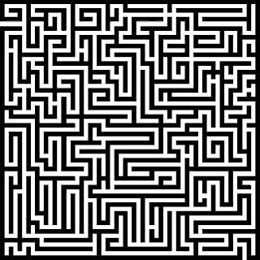
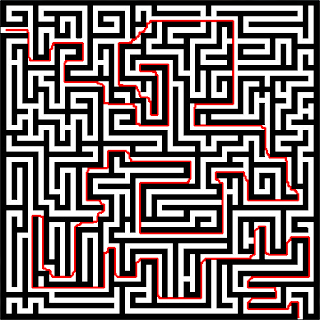

---
metadata:
    description: In this blog post I will be showing how I wrote a program to solve
        mazes for me.
title: Solving mazes with programming
---

I have always loved solving mazes... so naturally I had to write a program to solve mazes for me!

===

Take a look at this maze; can you find a path from the upper left entrance in the maze to the lower right exit? Probably you can, and so does the program I wrote!

I wrote a program in Python (making use of `pygame` and `Pillow`) to solve any maze given. I did this project several years ago, after learning about [Dijkstra's algorithm]. I read about the algorithm and decided to implement it, to get a feel for it. I realized that I could apply it to a maze in a picture, if I took each pixel of the image to be a vertex in the graph where I'd apply the method.

I wanted to make my program fairly general, in terms of the mazes that could be given, and so I dwelled with a problem: how to tell if two adjacent pixels should be connected in the graph or not. I knew I only wanted to connect pixels that referred to the path, and not to the walls, so my idea was simple: I supposed that a picture of a maze would have mainly two colours, one for the walls and another for the paths. I leveraged on that to preprocess the image and turn it to a black and white picture, where each pixel would be either completely white or completely black (I did this by finding the average luminosity of a pixel in the image and used that as a threshold; a pixel with luminosity below the average becomes black, otherwise it becomes white). After processing, ask the user for the two points we want to connect; if they have the same colour (say it was white) then it must have been because the paths have been changed into white and thus I need only to consider white pixels.

After we know where to start, where to end, and which colour we care about (either black or white) I apply Dijkstra's algorithm on the graph of the vertices of that colour, where two vertices are connected if the two corresponding pixels are adjacent. Of course I didn't have to explicitly build the graph, as it was given by the pixels in the picture. After a path is found, a red line is drawn. The first version of the script would draw the absolute shortest path, and so it would mainly be adjacent to walls and I found it aesthetically unpleasing. To try and counter that I added a slight element of randomness when drawing the red path. Using my script to solve the maze above we get this drawing:

which looks like a line I could draw with my pencil, if I managed to not overlap my line with the walls of the maze by accident. The code can be found in [this GitHub repo][gh] and a downloadable executable can be found [here][drive]. In both places you can find a `bin` folder with a couple of maze examples.

[Dijkstra's algorithm]: https://en.wikipedia.org/wiki/Dijkstra%27s_algorithm
[gh]: https://github.com/RojerGS/projects/tree/master/MazeSolver
[drive]: https://drive.google.com/open?id=1L7Ell-R4hUlN8Tutp10ycKyUq8kp5_c-