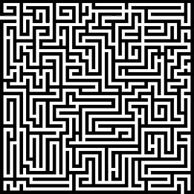

---
metadata:
    description: Neste artigo explico brevemente como criei um programa para resolver
        labirintos.
title: Resolver labirintos com programação
---

Sempre adorei resolver labirintos... portanto era óbvio que tinha de escrever um programa que o fizesse por mim!

===

Olha para o labirinto que está aqui em cima e vê lá se consegues ir da entrada que está em cima à esquerda até à saída que está ali em baixo à direita. Provavelmente consegues. O programa que eu escrevi... também!

Um dia li sobre um algoritmo bastante famoso, o [algoritmo de Dijkstra][Dijkstra's algorithm], e percebi que o podia aplicar para resolver labirintos!

O processo subjacente à resolução de um labirinto é simples: especifico uma imagem com um labirinto e processo-a para a converter numa imagem a preto e branco, sem tons de cinza. Cada pixel da imagem processada ou é 100% branco ou 100% preto (para fazer isto, calculo a luminosidade média da imagem e uso-a como bitola: se um pixel tiver luminosidade abaixo da média, fica preto; se não, fica branco). De seguida, o utilizador escolhe as posições de partida e de chegada, e o programa verifica se, na nova imagem, essas posições têm a mesma cor. A ideia é que, após o processamento, as paredes do labirinto ficaram todas da mesma cor e os caminhos do labirinto ficaram todos da cor oposta. Não há garantias de que isto acontece mas pareceu-me ser uma suposição bastante razoável.

Se é o caso que as duas posições têm a mesma cor, então usamos o algoritmo de Dijkstra para encontrar o caminho mais curto entre as duas posições. Claro que não é necessário construir o grafo explicitamente, podemos usar os pixéis como vértices do grafo implícito. Quando o caminho é encontrado, o programa desenha-o a vermelho. No início, o script desenhava o caminho absolutamente mais curto, o que se traduzia num caminho sempre rente às paredes e na altura achei que isso era esteticamente desagradável. Para tentar contrariar isso um pouco, incluí um pequeno elemento aleatório na parte que desenha o caminho.

Aqui podem ver o caminho que o meu programa encontrou para o labirinto do início do artigo:

O código pode ser encontrado [nesta pasta do GitHub][gh]; também podem encontrar um executável Windows [no Google Drive][drive]. Nos dois sítios há também uma pasta chamada `bin` onde estão alguns exemplos de labirintos que podem usar para testar o programa.

[Dijkstra's algorithm]: https://en.wikipedia.org/wiki/Dijkstra%27s_algorithm
[gh]: https://github.com/RojerGS/projects/tree/master/MazeSolver
[drive]: https://drive.google.com/open?id=1L7Ell-R4hUlN8Tutp10ycKyUq8kp5_c-