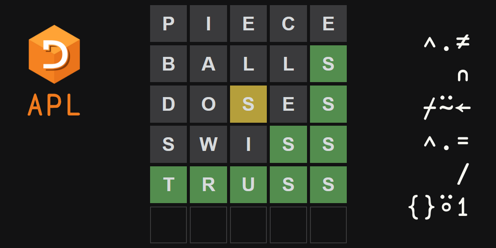

Join me in solving the word game Wordle in (Dyalog) APL.

===




# Introduction

[Wordle] is a conceptually simple game that you can play online.
(For those of you who know it, it's like [Mastermind] (the board game),
but with words.)
There is a secret word that you have to guess and you are given 6 tries
to find out what word is the secret word.
When you make a guess, you get some information back:

 - you are told which letters of the guess match letters of the secret word;
 - you are told which letters of the guess exist in the secret word,
 but are in the wrong position in the guess; and
 - you are told which letters of the guess don't exist in the secret word.

For example, assume that the secret word is “chess”, and you guess “caves”:

 - the “c” and the “s” are in their correct positions when compared to the secret word;
 - the letter “e” in “caves” exists in the secret word but it's in the wrong position; and
 - the letters “a” and “v” do not exist in the secret word.

Here is how the game would represent this information:


Again, recall that:

 - the green squares around “c” and “s” tell you that those letters are in the correct place;
 - the yellow square around “e” tells you that “e” exists in the secret word but in some other position; and
 - the gray squares around “a” and “v” tell you that “a” and “v” are not in the secret word.


# Objective

What we want to do is write an [APL] program that helps us play Wordle.
(I have written [a similar article][wordle-python] in the past, but using Python.)

We will write a couple of functions:

 - a function `Score` that scores a given guess with respect to a given secret word; and
 - a function `Filter` that returns the possible secret words with respect to a given guess and its score.

! All the code is available in [this GitHub repository][gh-wordleapl].

As for the letter information, which I'll call the score of a guess, we will encode it in this way:

 - a `0` means the letter isn't in the secret word;
 - a `1` means the letter is in the incorrect position; and
 - a `2` means the letter is in the correct position.

Here are a couple of examples:

| Secret word | Guess | Score |
| :- | :- | :- |
| chess | caves | `2 0 0 1 2` |
| chess | swiss | `0 0 0 2 2` |
| talon | fault | `0 2 0 1 1` |

Take a second to make sure you understand all of the scores above.


# Getting some data

The first thing we will do is [grab a list of words][word-list] to play with.
If I'm not mistaken, the list I linked to is a free list of the Scrabble dictionary.

(If you are on a Unix system, you may also get away with just using the [`words`][unix-words] file.)

Now that we have some data, let's get started!


# Loading the data

First thing we want to do is load the data into the APL session,
which we can do with the `⎕NGET` function:

```APL
      words ← ⊃⎕NGET 'WORD.LST' 1
      10↑words
┌──┬───┬─────┬──────┬────┬───┬─────┬──────┬────┬────────┐
│aa│aah│aahed│aahing│aahs│aal│aalii│aaliis│aals│aardvark│
└──┴───┴─────┴──────┴────┴───┴─────┴──────┴────┴────────┘
```

Of course, we quickly realise that we don't want to deal with all this data.
The only words we care about are those that have length 5,
so we can fix that by figuring out the length of each word with _tally_:

```APL
      ≢¨10↑words
2 3 5 6 4 3 5 6 4 8
```

And then, we _compress_ the words that have length equal to 5:

```APL
      10↑words⌿⍨5=≢¨words
┌─────┬─────┬─────┬─────┬─────┬─────┬─────┬─────┬─────┬─────┐
│aahed│aalii│aargh│abaca│abaci│aback│abaft│abaka│abamp│abase│
└─────┴─────┴─────┴─────┴─────┴─────┴─────┴─────┴─────┴─────┘
```

After we are done with that, we _mix_ the words to get a nice-looking matrix of words:

```APL
      ↑10↑words⌿⍨5=≢¨words
aahed
aalii
aargh
abaca
abaci
aback
abaft
abaka
abamp
abase
```

Of course, we want to do this for all the words, not just the first 10.
Putting this all together,
we can write a short dfn that loads the data from the given file:

```APL
      Load ← {↑w⌿⍨⍵=≢¨ w←⊃⎕NGET ⍺ 1}
      words ← 'C:\Users\rodri\Documents\Programming\projects\misc\WORD.LST' Load 5
      5↑words
aahed
aalii
aargh
abaca
abaci
```


# Scoring a word

Now, we want to write a function `Score` that

 - takes the secret word on the left;
 - takes the guess word on the right; and
 - returns the letter information like I defined above:
   - a `2` means a correct letter in the correct spot;
   - a `1` means a correct letter in an incorrect spot; and
   - a `0` means a wrong letter.


## Correct letters in the correct spot

Figuring out the correct letters in the correct spot is easy:

```APL
      ⍝ secret ←→ guess
      2×'chess'='caves'
2 0 0 0 2
      2×'chess'='swiss'
0 0 0 2 2
      2×'talon'='fault'
0 2 0 0 0
```

This can also be reformulated tacitly:

```APL
      ⍝ secret ←→ guess
      'chess'(2∘×⍤=)'caves'
2 0 0 0 2
      'chess'(2∘×⍤=)'swiss'
0 0 0 2 2
      'talon'(2∘×⍤=)'fault'
0 2 0 0 0
```


## Correct letters in the incorrect spot

Figuring out the correct letters in the incorrect spot is slightly harder than what one might think.
At first glance, one might think that _membership_ `∊` is enough.
Perhaps, summing the result of _membership_ with the result of _equals_ suffices:

```APL
      ⍝ secret ←→ guess
      'chess'(∊⍨+=)'caves'
2 0 0 1 2
      'chess'(∊⍨+=)'swiss'
1 0 0 2 2
      'talon'(∊⍨+=)'fault'
0 2 0 1 1
```

The truth is, this is pretty close to the correct solution...
But can you figure out the issue?

The issue lies in this example:

```APL
      'chess'(∊⍨+=)'swiss'
1 0 0 2 2
```

The correct answer should be `0 0 0 2 2`.
Why?
Because the first “s” in “swiss” doesn't show up in “chess”:
the last two letters “s” of “chess” have already been matched by the last two letters “s” of “swiss”.
In a way, we have to take into account the number of times each letter shows up,
while _membership_ doesn't do that.

The fix?
We can use something like _progressive membership_,
a version of _membership_ that takes into account repetitions:

```APL
      ⍝ Progressive membership, https://aplcart.info/?q=progressive%20membership
      PM ← {((≢⍺)⍴⍋⍋⍺⍳⍺⍪⍵)∊(≢⍵)⍴⍋⍋⍺⍳⍵⍪⍺}
      'sss' PM 'chess'
1 1 0  ⍝ The third 's' is not in 'chess' because 'chess' only has 2 's'.
```

So, now that we have _progressive membership_,
we just need to apply it to the secret and guess words!
However, we need to be careful to either remove the letters that are already correct,
or to move those to the beginning of the words for _progressive membership_:

```APL
      PM ← {((≢⍺)⍴⍋⍋⍺⍳⍺⍪⍵)∊(≢⍵)⍴⍋⍋⍺⍳⍵⍪⍺}
      I ← ⊃¨ ∘⊂
      'chess' {p ← ⍒⍺=⍵ ⋄ ⍵ ((⍋p)I PM⍥(p I⊢)) ⍺}'caves'
1 0 0 1 1
```

The excerpt `PM⍥(p I⊢)` applies _progressive membership_ _**over**_ the reordering of each argument with `(p I⊢)`.
`p` is a permutation that moves letters in the correct positions to the beginning of the word:

```APL
      'chess' {p ← ⍒⍺=⍵ ⋄ ⎕← (p I⊢)⍺ ⋄ ⎕← (p I⊢)⍵} 'caves'
cshes
csave
```

After we reorder them, we can use _progressive membership_:

```APL
      'chess' {p ← ⍒⍺=⍵ ⋄ ⍵ (PM⍥(p I⊢)) ⍺} 'caves'
1 1 0 0 1
```

However, after we do so, the letters are in the wrong order.
To replace the correct ordering,
we first need to realise that `⍋p` is the inverse permutation of `p`.
Thus, we can use `(⍋p)I` to put things in the correct place:

```APL
      'chess' {p ← ⍒⍺=⍵ ⋄ ⍵ ((⍋p)I PM⍥(p I⊢)) ⍺}'caves'
1 0 0 1 1
```

Finally, we just need to signal the characters that are correct and in the correct spot.
To do that, we just need to add `⍺=⍵` to the Boolean mask above,
which can be done by adding `=+` to the train we have written:

```APL
      'chess' {p ← ⍒⍺=⍵ ⋄ ⍵ (=+(⍋p)I PM⍥(p I⊢)) ⍺}'caves'
2 0 0 1 2
```

Thus, the function `Score` becomes:

```APL
      Score ← {p ← ⍒⍺=⍵ ⋄ ⍵(=+(⍋p)I PM⍥(p I⊢))⍺}
      ⍝ secret ←→ guess
      'chess' Score 'caves'
2 0 0 1 2
      'chess' Score 'swiss'
0 0 0 2 2
      'talon' Score 'fault'
0 2 0 1 1
```


# Filtering words that match a score

The next function we want to implement is the function `Filter`.
This function will take three pieces of information:

 - on the left, it accepts a matrix containing all the words that could be the secret word; and
 - on the right, it takes a 2-item vector:
   - the first item is the most recent guess; and
   - the second item is the score for that guess.

The purpose of the function `Filter` is to filter out the words that cannot be the secret word,
taking into account the most recent guess and its score.

We will implement the function `Filter` in four steps:

 1. remove all the words that don't have the same correct letters in the correct places;
 2. remove all the words that, for correct letters in incorrect places, keep them in the same place;
 3. remove all the words that don't have the correct letters in incorrect places in sufficient number; and
 4. remove all the words that make use of letters that we know aren't present.

The key is to understand that we want to look at these four steps in an independent way, one at a time.
By doing them sequentially,
we end up applying the restrictions that we want,
but by applying simpler rules.

In other words, instead of filtering words with a single complex predicate,
we filter words with four simpler predicates.

For the following subsections,
let's use a subset of all the data to help us experiment:

```APL
      ⎕← sub ← words[(⍳5),35+⍳5;]
aahed
aalii
aargh
abaca
abaci
abuzz
abyes
abysm
abyss
acari
```

## Correct letters in correct places

The first thing we are going to do is make sure that we only keep the words that have the correct letters in the correct places.
How can we do this?

We can start by figuring out what are the positions where we know which letters should be present.
For example, let's pretend that the score of the guess `'aback'` was `2 0 2 0 0`:
Then, we know that we need to look at the matrix of words and only keep the words that have `'aa'` in the first and third columns:

```APL
      guess ← 'aback' ⋄ score ← 2 0 2 0 0
      ⎕← pos ← 2=score
1 0 1 0 0
      pos/sub
ah
al
ar
aa
aa
au
ay
ay
ay
aa
      pos/guess
aa
```

In order to compare those columns with the appropriate letters of the guess, we can use an _inner product_ `∧.=`:

```APL
      (pos/sub)∧.=pos⌿guess
0 0 0 1 1 0 0 0 0 1
      sub,⍪(pos/sub)∧.=pos⌿guess
aahed 0
aalii 0
aargh 0
abaca 1
abaci 1
abuzz 0
abyes 0
abysm 0
abyss 0
acari 1
```

After we use the _inner product_ to figure out the words that we care about,
we can _compress_ to get rid of the words that don't matter:

```APL
      sub⌿⍨(pos/sub)∧.=pos⌿guess
abaca
abaci
acari
```


## Correct letters in incorrect places still in incorrect places

The next thing we want to do is get rid of all the words that keep the correct letters in their incorrect places.

For example, if the guess `'aback'` scores `2 1 1 0 0`,
then we don't want the words `'abaca'`, `'abaci'`, and `'abuzz'`,
because those words have a `'b'` in their second letter:
`'aback'` does too,
but we already know that the `'b'` in `'aback'` should be _elsewhere_,
not in the second letter.
Similarly, we also don't care about the word `'acari'`,
because the third letter is an `'a'`, much like in `'aback'`.

To do this filtering,
we follow a strategy similar to the previous one.
First, we find the positions that we care about:

```APL
      guess ← 'aback' ⋄ score ← 2 1 1 0 0
      ⎕← pos ← 1=score
0 1 1 0 0
      pos/sub
ah
al
ar
ba
ba
bu
by
by
by
ca
      pos⌿guess
ba
```

Then, we compare those rows with the letters we extracted from the guess.
We only want to keep words that _don't_ have the `'b'` in that first column _and_ that _don't_ have the `'a'` in the second column.
In other words, we want to keep all the words for which all the selected columns are _not equal_ to the corresponding letters selected from the guess.

We do this with a similar _inner product_, `∧.≠`:

```APL
      sub,⍪(pos/sub)∧.≠pos⌿guess
aahed 1
aalii 1
aargh 1
abaca 0
abaci 0
abuzz 0
abyes 0
abysm 0
abyss 0
acari 0
      sub⌿⍨(pos/sub)∧.≠pos⌿guess
aahed
aalii
aargh
```

Alternatively, we could have checked for the words that have one of those matches with `∨.=`,
and then negate that:

```APL
      sub⌿⍨~(pos/sub)∨.=pos⌿guess
aahed
aalii
aargh
```

That's that, but why did we do it?

By doing this check, we make it easier on ourselves to check if the correct letters of incorrect positions show up in other positions in the words.
This will become clearer as we dive into the next subsection.


## Correct letters in other places

The next step is checking that the letters that are correct but in incorrect places still show up in the word.
How can we do that?

As a standalone problem,
this would entail going through each of the correct letters in incorrect places,
making sure they showed up in _another_ position of the word,
and making sure there were enough of each letter.
For example, if a guess attributes the score `1 1` to the letters `'aa'`,
then we need to find words that have two or more `'a'`.

However, in the previous subsection,
we already made sure that the correct letters in incorrect places did not stay still,
so the only thing that there is left is to make sure that the words have _enough_ of each letter that we need.

For example, if the word `'aback'` scored `1 0 1 0 0`,
the word `'taste'` wouldn't do because we know the secret word has two `'a'`s,
and the word `'taste'` only has one.
In other words, we can't just use _membership_ because that doesn't take into care about how many times each letter is accounted for,
but we can use _progressive membership_ once more:

```APL
      'aa' ∊ 'taste'
1 1
      'aa' PM 'taste'
1 0
      'aa' PM 'qatar'
1 1
```

So, in order to check the words that have the correct letters in other places,
we take the letters that we must find in the words and then
we apply _progressive membership_ to those letters and all the other words:

```APL
      guess ← 'rxxaa' ⋄ score ← 1 0 0 1 1
      pos ← score=1
      sub⌿⍨∧/(pos⌿guess)PM⍤1⊢sub
aargh
acari
```


## Remove incorrect letters

The final step is making sure that the words that we select do not contain any of the letters that we already know shouldn't be there.
For example, if the guess were `'aargh'` and the score were `2 1 0 0 0`,
then we would know that the secret word doesn't contain the letters `'rgh'` and we could filter out words with those letters.

However, if the guess were `'aargh'` and the score were `1 0 0 0 0`, we would have to be careful about the `'a'`.
The second `'a'` in `'aargh'` was scored with a `0`,
so that means that the secret word only has **one** `'a'`.
In other words, we can't filter out all words that contain the letter `'a'`;
we can only filter out the words where `'a'` shows up twice or more.

How can we do this?

At this point, we only have candidate words that contain the letters needed in enough number.
What we need to filter out is words that contain _too_ many letters in common with our guess.

Let's suppose that our guess was `'praam'` and that the score was `0 0 1 0 2`.
This means that the secret word contains a single `'a'` and none of the letters `'pr'`.
So, if we take a word that has passed all the previous criteria,
we only need to check that the number of its letters contained in `'apr'` is 1:

```APL
      guess ← 'praam' ⋄ score ← 0 0 1 0 2
      pos ← 2≠score
      count ← +⌿pos⌿score
      sub⌿⍨count=+/(pos/sub)∊pos⌿guess
abuzz
abyes
abysm
abyss
```

In isolation, this check isn't enough.
However, when we do all the checks in succession, it works.


## Final function

If we put everything together, here is the function `Filter`:

```APL
      Filter ← {
         (gss scr) ← ⍺
         wrds ← ⍵
         pos ← 2=scr
         wrds ⌿⍨← (pos/wrds)∧.=pos⌿gss
         pos ← 1=scr
         wrds ⌿⍨← (pos/wrds)∧.≠pos⌿gss
         wrds ⌿⍨← ∧/(pos⌿gss)PM⍤1⊢wrds
         pos ← 2≠scr ⋄ cnt ← +⌿pos⌿scr
         wrds ⌿⍨← cnt=+/(pos/wrds)∊pos⌿gss
         wrds
      }
      'aback' (2 0 2 1 0) Filter words
acari
      'aback' (2 0 2 0 1) Filter words
araks
awake
```

An alternative is to rewrite the code as a chain of the four steps that we just went over:

```APL
      CL ← {⍵⌿⍨(p/⍵)∧.=g⌿⍨p ← s=2⊣(g s) ← ⍺}
      IP ← {⍵⌿⍨(p/⍵)∧.≠g⌿⍨p ← 1=s⊣(g s) ← ⍺}
      OP ← {⍵⌿⍨∧/⍵ PM⍤1⍨g⌿⍨p ← 1=s⊣(g s) ← ⍺}
      IL ← {⍵⌿⍨(+⌿p⌿s)=+/(p/⍵)∊g⌿⍨p ← 2≠s⊣(g s) ← ⍺}
      Filter ← {⍺ IL ⍺ OP ⍺ IP ⍺ CL ⍵}
```

You can get all the code from [this GitHub repository][gh-wordleapl].
All you need to do is clone the repo into `path/to/WordleAPL` and then you can load all the code into your Dyalog session by running the command

```
      ]create # path/to/WordleAPL
Linked: # ←→ path/to/Wordle
```

!!! As an exercise, try modifying the function `Filter` by deleting any one of the four functions that it uses.
!!! By doing so and then running the function `Filter` with some inputs,
!!! you will be able to spot the kinds of mistakes that the function does when it skips one step.


[wordle-python]: /blog/solving-wordle-with-python

[wordle]: https://www.powerlanguage.co.uk/wordle/
[mastermind]: https://en.wikipedia.org/wiki/Mastermind_(board_game)
[word-list]: https://raw.githubusercontent.com/RodrigoGiraoSerrao/projects/master/misc/WORD.LST
[unix-words]: https://en.wikipedia.org/wiki/Words_(Unix)
[APL]: https://apl.wiki
[aplcart]: https://aplcart.info
[gh-wordleapl]: https://github.com/rodrigogiraoserrao/WordleAPL
