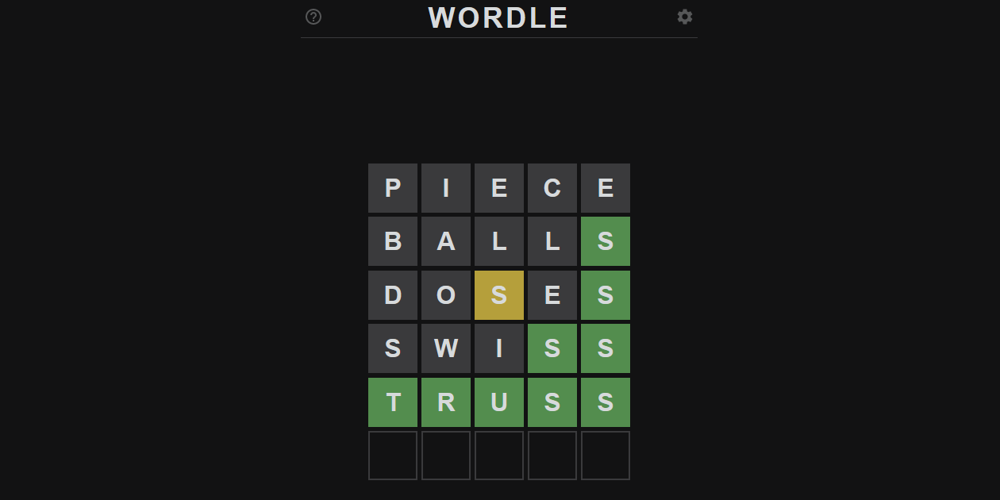

In this article we try to crack Wordle, a variation of mastermind played with (English) words.

===




# Introduction

[Wordle] is a conceptually simple game that you can play online.
(For those of you who know it, it's like [Mastermind] (the board game),
but with words.)
There is a secret word that you have to guess and you are given 6 tries
to find out what word is the secret word.
When you make a guess, you get some information back:

 - you are told which letters of the guess match letters of the secret word;
 - you are told which letters of the guess exist in the secret word,
 but are in the wrong position in the guess; and
 - you are told which letters of the guess don't exist in the secret word.

For example, assume that the secret word is “chess”, and you guess “caves”.

 - The “c” and the “s” are in their correct positions, when compared to the secret word.
 - The letter “e” in “caves” exists in the secret word, just not as the second-to-last letter.
 - The letters “a” and “v” do not exist in the secret word.

Here is how the game would represent this information:


What we want to do is write a Python program that plays Wordle for us.

By the way, I am only doing this because I was “nerd snipped” by [Will McGugan][will-mcgugan] on Twitter
([this][will-nerd-snipe] is the tweet at fault).


# How to play Wordle?

The very first step in writing a program that plays a game – Wordle, in this instance –
is determining the _algorithm_ used to play the game.
For Wordle, we will follow this strategy:

 - we start with a (big) list of words that could be the secret word;
 - whenever we give a guess, we look at our list of words and remove all words
 that do not respect the information we get back from our guess; and
 - we keep guessing until our list of possible words only has a single word – the secret word.

For example, our initial list of words could be something like
“balls”, “caves”, “chess”, “doses”, “piece”, “swiss”, and “truss”.
If I were playing perfectly, after my initial guess of “piece” I can already exclude
words like “doses” and “swiss” as the correct word.

Why?
Because I already know the secret word doesn't have any “e”s or “i”s.
However, because I can't hold a list of all 5-letter English words I know in my head,
I kept playing familiar words (like “doses” and “swiss”) to look for other tid-bits of information.

A computer won't struggle with this, so this is the strategy we will follow.


# TL;DR:

If all you care about is the code, you can get it from [here][gh-code].


# Getting the data

The first step in writing a program that plays Wordle for us is fetching a (big) list of English words.
I was lucky enough that [Will][will-mcgugan] had a [list handy][word-list],
from a free list of Scrabble words, or something like that.

(If you are on a Unix system, you may also get away with just using the [`words`][unix-words] file.)


# Scoring a word

The next step is figuring out how to represent the information regarding which letters go where.
In the game itself, we have a colour-coded representation.
For our little program, we can use an enumeration:

```py
import enum

class Tip(enum.Enum):
    ABSENT = 0
    PRESENT = 1
    CORRECT = 2
```

`Enum`s are a convenient way of representing a series of variables that are related and that are relevant,
not specifically because of their value, but because of their semantics.
In other words, we could choose **whatever three distinct values** we want to represent the letters that are in their correct positions,
the letters that are in the secret word, and the letters that are not in the secret word.
After we choose those three values, we just need to be able to compare them.
Hence, an `Enum` is in order.

With `Tip`, here is how we would represent the score of the word “caves” if the secret word were “chess”:

```py
score = [Tip.CORRECT, Tip.ABSENT, Tip.ABSENT, Tip.PRESENT, Tip.CORRECT]
```

Now that we know how to represent the score, we need to compute it.
That's easy, right?

Here is a Python function that does that:

```py
def score(secret, guess):
    score = []
    for secret_char, guess_char in zip(secret, guess):
        if secret_char == guess_char:
            score.append(Tip.CORRECT)
        elif guess_char in secret:
            score.append(Tip.PRESENT)
        else:
            score.append(Tip.ABSENT)

    return score
```

We can run this function on a couple of examples, and see what we get:

```py
>>> score("chess", "caves")
[<Tip.CORRECT: 2>, <Tip.ABSENT: 0>, <Tip.ABSENT: 0>, <Tip.PRESENT: 1>, <Tip.CORRECT: 2>]
>>> score("chess", "swiss")
[<Tip.PRESENT: 1>, <Tip.ABSENT: 0>, <Tip.ABSENT: 0>, <Tip.CORRECT: 2>, <Tip.CORRECT: 2>]
>>> score("doses", "slide")
[<Tip.PRESENT: 1>, <Tip.ABSENT: 0>, <Tip.ABSENT: 0>, <Tip.PRESENT: 1>, <Tip.PRESENT: 1>]
```

Now, have you spotted it yet?
The problem?

Take a closer look at the middle example:

```py
>>> score("chess", "swiss")
[<Tip.PRESENT: 1>, <Tip.ABSENT: 0>, <Tip.ABSENT: 0>, <Tip.CORRECT: 2>, <Tip.CORRECT: 2>]
```

Notice how the secret word only has two instances of the letter “s”.
On the other hand, the guess word has three “s”.
The last two are marked as being in the correct position, which means that the third “s” should be marked as absent.
After all, there is _no_ third “s” in the secret word.

In order to fix this issue, we take the following approach:

 - we create a pool of characters that can be used for `PRESENT` tips
 (composed of all characters that are _not_ correct); and then
 - we traverse the guess word, only flagging as `PRESENT` the guess characters
 that are available in the pool:

```py
def score(secret, guess):
    # All characters that are not correct go into the usable pool.
    pool = collections.Counter(s for s, g in zip(secret, guess) if s != g)
    # Create a first tentative score by comparing char by char.
    score = []
    for secret_char, guess_char in zip(secret, guess):
        if secret_char == guess_char:
            score.append(Tip.CORRECT)
        elif guess_char in secret and pool[guess_char] > 0:
            score.append(Tip.PRESENT)
            pool[guess_char] -= 1
        else:
            score.append(Tip.ABSENT)

    return score
```

This fixes our issue _and_ another one (of the same family),
preventing characters from being double-counted as `PRESENT`:

```py
>>> score("chess", "swiss")
[<Tip.ABSENT: 0>, <Tip.ABSENT: 0>, <Tip.ABSENT: 0>, <Tip.CORRECT: 2>, <Tip.CORRECT: 2>]
# ^ first "s" is no longer flagged as being present.

>>> score("chess", "eexss")
[<Tip.PRESENT: 1>, <Tip.ABSENT: 0>, <Tip.ABSENT: 0>, <Tip.CORRECT: 2>, <Tip.CORRECT: 2>]
# ^ first "e" is present
# but the second one ^ isn't, because "chess" only has one "e".
```


# Filtering words that match a score

After we score the guess with regards to the secret word, we need to update our list of possible words.
To do that, we go through the list of words and remove all the words that:

 - do not have the all the `CORRECT` letters in all the correct places;
 - have any of the letters that are marked as `ABSENT`; or
 - have a letter equal to a corresponding letter of the guess in a position that is _not_ `CORRECT`.

Now, writing a function that does this properly can be trickier than what it looks like
_if_ you don't pay enough attention to double-counting characters.

Let's assume that your function has the following signature:

```py
def filter_words(words, guess, score):
    ...
```

In that function,

 - `words` is a list of all words being considered;
 - `guess` is the word you just guessed; and
 - `score` is the score the guess received.

Then, the function returns a new list of words, that is a subset of the argument `words`,
containing all the words that can _still_ be the correct word.

Make sure that your `filter_words` function passes these tests:

```py
# The first "a" is correct, so it should be kept.
>>> filter_words(["abe", "ace"], "ark", score("a??", "ark"))
['abe', 'ace']

# "b" isn't present in the correct word, so "abe" should be dropped.
>>> filter_words(["abe", "ace"], "abi", score("a??", "abi"))
['ace']

# Guess has two "a" and correct word only has one, so "aazz" should be excluded.
>>> filter_words(["aazz"], "xxaa", score("azzz", "xxaa"))
[]

# Secret word has one "a" and it's not in the two last positions.
>>> filter_words(["azzz", "zazz", "zzaz", "zzza"], "xxaa", score("azzz", "xxaa"))
['azzz', 'zazz']
```

Go ahead, try to implement this function yourself...
I can wait :)

Alright, assuming you got this correct, or just don't care about the challenge,
here is my implementation:


```py
def filter_words(words, guess, score):
    """Filter words to only keep those that respect the score for the given guess."""

    new_words = []
    for word in words:
        # The pool of characters that account for the PRESENT ones is all the characters
        # that do not correspond to CORRECT positions.
        pool = collections.Counter(c for c, sc in zip(word, score) if sc != Tip.CORRECT)
        for char_w, char_g, sc in zip(word, guess, score):
            if sc == Tip.CORRECT and char_w != char_g:
                break  # Word doesn't have the CORRECT character.
            elif char_w == char_g and sc != Tip.CORRECT:
                break  # If the guess isn't CORRECT, no point in having equal chars.
            elif sc == Tip.PRESENT:
                if not pool[char_g]:
                    break  # Word doesn't have this PRESENT character.
                pool[char_g] -= 1
            elif sc == Tip.ABSENT and pool[char_g]:
                break  # ABSENT character shouldn't be here.
        else:
            new_words.append(word)  # No `break` was hit, so store the word.

    return new_words
```


# Playing the game against the computer

Now that the computer can filter the list of words down, we can play the game!

The program will load all the words from the list,
then it will ask you for your secret word.
After that, the computer trims down the list to only use words of the correct length,
and then will try random guesses until it gets it right!

Here is a possible implementation of this:

```py
import random

if __name__ == "__main__":
    WORD_LST = "WORD.LST"  # Point to a file with a word per line.

    with open(WORD_LST, "r") as f:
        words = [word.strip() for word in f.readlines()]

    print("Write your secret word:")
    secret = input(">>> ")

    words = [word for word in words if len(word) == len(secret)]
    while len(words) > 1:
        print(f"I'll guess randomly from my pool of {len(words)} words...")
        sample = ", ".join(words[:8])
        end = ", among others..." if len(words) > 8 else "."
        print(f"I'm considering {sample}{end}")

        guess = random.choice(words)
        print(f"Hmmm, I'll guess {guess!r}...")
        sc = score(secret, guess)
        print(f"\tMy guess scored {sc}...")
        words = filter_words(words, guess, sc)
        print()

    if not words:
        raise RuntimeError("I don't know any words that could solve the puzzle...")
    print(f"The secret word must be {words[0]!r}!")
```

That's how you can have the computer play against you.

Here is an example output from the program, when given “chess” as the secret word:

```txt
Write your secret word:
>>> chess
I'll guess randomly from my pool of 8672 words...
I'm considering aahed, aalii, aargh, abaca, abaci, aback, abaft, abaka, among others...
Hmmm, I'll guess 'sling'...
        My guess scored [<Tip.PRESENT: 1>, <Tip.ABSENT: 0>, <Tip.ABSENT: 0>, <Tip.ABSENT: 0>, <Tip.ABSENT: 0>]...

I'll guess randomly from my pool of 1277 words...
I'm considering abase, abash, abbas, abbes, abets, abuse, abuts, abyes, among others...
Hmmm, I'll guess 'zebus'...
        My guess scored [<Tip.ABSENT: 0>, <Tip.PRESENT: 1>, <Tip.ABSENT: 0>, <Tip.ABSENT: 0>, <Tip.CORRECT: 2>]...

I'll guess randomly from my pool of 205 words...
I'm considering aches, acmes, acres, akees, apers, apres, apses, areas, among others...
Hmmm, I'll guess 'emyds'...
        My guess scored [<Tip.PRESENT: 1>, <Tip.ABSENT: 0>, <Tip.ABSENT: 0>, <Tip.ABSENT: 0>, <Tip.CORRECT: 2>]...

I'll guess randomly from my pool of 117 words...
I'm considering aches, acres, akees, apers, apres, apses, areas, arses, among others...
Hmmm, I'll guess 'cores'...
        My guess scored [<Tip.CORRECT: 2>, <Tip.ABSENT: 0>, <Tip.ABSENT: 0>, <Tip.PRESENT: 1>, <Tip.CORRECT: 2>]...

I'll guess randomly from my pool of 3 words...
I'm considering chefs, chess, chews.
Hmmm, I'll guess 'chefs'...
        My guess scored [<Tip.CORRECT: 2>, <Tip.CORRECT: 2>, <Tip.CORRECT: 2>, <Tip.ABSENT: 0>, <Tip.CORRECT: 2>]...

I'll guess randomly from my pool of 2 words...
I'm considering chess, chews.
Hmmm, I'll guess 'chess'...
        My guess scored [<Tip.CORRECT: 2>, <Tip.CORRECT: 2>, <Tip.CORRECT: 2>, <Tip.CORRECT: 2>, <Tip.CORRECT: 2>]...

The secret word must be 'chess'!
```


# Using the computer as help to play the game

To have the computer help you, we can modify the code a bit.
Instead of asking for the secret word, the computer will suggest a guess;
after that, we use that guess in the game (for example, in the website [I linked to][wordle]),
and then we input the score we got back into the computer.

Let's take the code we wrote before and put it in a function,
and write this new playing mode in another function.
Most of the code is the same, or similar, so we'll try to reuse it:

```py
def get_random_word(words):
    print(f"I'll guess randomly from my pool of {len(words)} words...")
    sample = ", ".join(words[:8])
    end = ", among others..." if len(words) > 8 else "."
    print(f"I'm considering {sample}{end}")
    guess = random.choice(words)
    print(f"Hmmm, I'll guess {guess!r}...")
    return guess


def play_against_computer(words):
    print("Write your secret word:")
    secret = input(">>> ")

    words = [word for word in words if len(word) == len(secret)]
    while len(words) > 1:
        guess = get_random_word(words)
        sc = score(secret, guess)
        print(f"\tMy guess scored {sc}...")
        words = filter_words(words, guess, sc)
        print()

    return words


def play_with_computer(words):
    print("What's the length of the secret word?")
    length = int(input(">>> "))
    words = [word for word in words if len(word) == length]

    mapping = {"0": Tip.ABSENT, "1": Tip.PRESENT, "2": Tip.CORRECT}
    print(f"\nNOTE: when typing scores, use {mapping}.\n")
    while len(words) > 1:
        guess = get_random_word(words)
        print("How did this guess score?")
        user_input = input(">>> ")
        sc = [mapping[char] for char in user_input if char in mapping]
        words = filter_words(words, guess, sc)
        print()


if __name__ == "__main__":
    WORD_LST = "WORD.LST"  # Point to a file with a word per line.

    with open(WORD_LST, "r") as f:
        words = [word.strip() for word in f.readlines()]

    print("Do you want [h]elp, or do you want to play [a]gainst the computer?")
    option = input("[h/a] >>> ")
    if option.strip().lower() == "h":
        words = play_with_computer(words)
    else:
        words = play_against_computer(words)

    if not words:
        raise RuntimeError("I don't know any words that could solve the puzzle...")
    print(f"The secret word must be {words[0]!r}!")
```

Imagine that the website I linked to has the secret word “truss”.
If that were the case, here is how the program would help us
(the numbers are typed by _us_, after the website gives the score
for the guess that the computer suggests):

```txt
Do you want [h]elp, or do you want to play [a]gainst the computer?
[h/a] >>> h
What's the length of the secret word?
>>> 5

NOTE: when typing scores, use {'0': <Tip.ABSENT: 0>, '1': <Tip.PRESENT: 1>, '2': <Tip.CORRECT: 2>}.
I'll guess randomly from my pool of 8672 words...
I'm considering aahed, aalii, aargh, abaca, abaci, aback, abaft, abaka, among others...
Hmmm, I'll guess 'brick'...
How did this guess score?
>>> 02000

I'll guess randomly from my pool of 291 words...
I'm considering ardor, areae, areal, areas, arena, arete, argal, argle, among others...
Hmmm, I'll guess 'treen'...
How did this guess score?
>>> 22000

I'll guess randomly from my pool of 26 words...
I'm considering tramp, trams, traps, trapt, trash, trass, trawl, trays, among others...
Hmmm, I'll guess 'tryst'...
How did this guess score?
>>> 22020

I'll guess randomly from my pool of 3 words...
I'm considering trash, trass, truss.
Hmmm, I'll guess 'trass'...
How did this guess score?
>>> 22022

The secret word must be 'truss'!
```


# Playing Wordle online

If all you want is a small program that helps you beat the [online version][wordle] of Wordle,
then you can condense the code we have seen, and drop some of the generality,
to create this:

```py
import collections, random

with open("WORD.LST", "r") as f:
    words = [word.strip() for word in f.readlines() if len(word.strip()) == 5]

while len(words) > 1:
    print(f"Try {(guess := random.choice(words))!r}.")
    score = [int(char) for char in input(">>> ") if char in "012"]  # 0 for ABSENT, 1 for PRESENT, and 2 for CORRECT.
    words_ = []
    for word in words:
        pool = collections.Counter(c for c, sc in zip(word, score) if sc != 2)
        for w, g, sc in zip(word, guess, score):
            if ((sc == 2) != (w == g)) or (sc < 2 and bool(sc) != bool(pool[g])):
                break
            pool[g] -= sc == 1
        else:
            words_.append(word)  # No `break` was hit, so store the word.
    words = words_
print(words[0])
```

This runs in a very similar way, except it's more compact.
Most notably, the logic that handles the filtering has been simplified a bit.

This plays out like so:

```txt
Try 'dykey'.
>>> 00000
Try 'banal'.
>>> 00000
Try 'stomp'.
>>> 11000
Try 'cists'.
>>> 00112
truss
```

You can get the condensed version from [here][gh-code-condensed].


That's it for this article!
You can get the code [from here][gh-code].
If you have any questions or suggestions, leave them in the comments below!


[wordle]: https://www.nytimes.com/games/wordle/index.html
[mastermind]: https://en.wikipedia.org/wiki/Mastermind_(board_game)
[word-list]: https://willmcgugan.com/files/WORD.zip
[will-mcgugan]: https://twitter.com/willmcgugan
[will-nerd-snipe]: https://twitter.com/willmcgugan/status/1478043926636417026
[unix-words]: https://en.wikipedia.org/wiki/Words_(Unix)
[gh-code]: https://github.com/RodrigoGiraoSerrao/projects/blob/master/misc/wordle.py
[gh-code-condensed]: https://github.com/RodrigoGiraoSerrao/projects/blob/master/misc/wordle2.py
