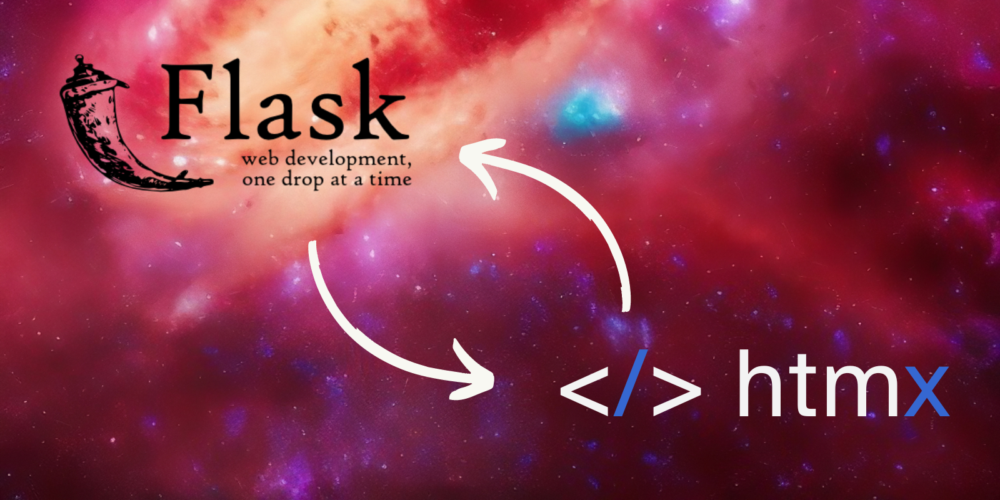
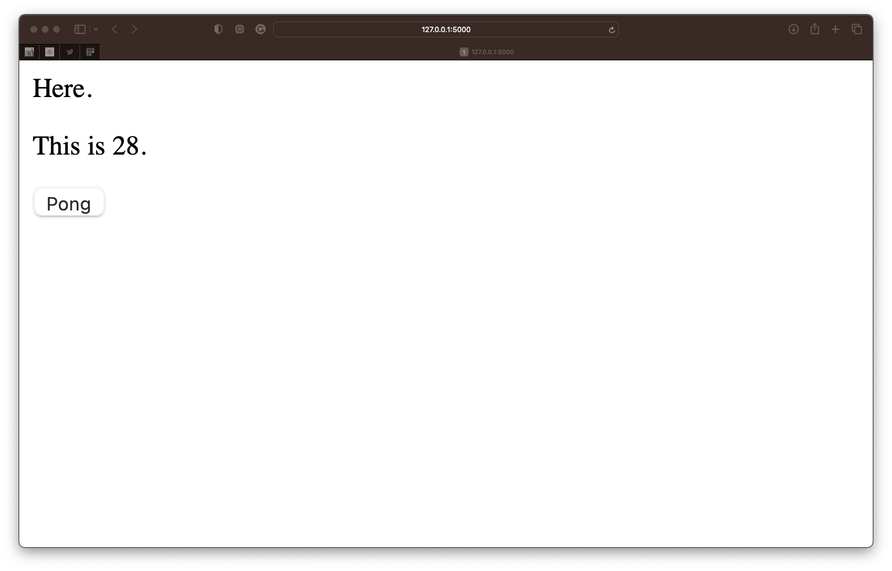

This short reference article shows how to stream data from a Flask web app to HTMX using server-side events (SSE).

===



# Introduction

I have been trying to create a web app with [Flask] and [HTMX] that updates the page periodically with data streamed from the Flask backend.
The [Flask documentation suggests that this should be possible][flask-streaming] if the response wraps a generator function and they show this example:

```py
@app.route('/large.csv')
def generate_large_csv():
    def generate():
        for row in iter_all_rows():
            yield f"{','.join(row)}\n"
    return app.response_class(generate(), mimetype='text/csv')
```

However, this doesn't work with an HTMX request.

I joined the HTMX Discord and I was told this is because HTMX buffers the complete response.

So, I went looking for other options and I found server-side events.


# How to stream data from Flask to HTMX in real-time

To be able to stream data back to HTMX and have it update in real-time, the original request needs to connect to SSE with the appropriate HTMX tags.

Then, the Flask backend must return a response with a generator, and the generator itself must return messages that follow the SSE specification.

The following example works with Flask 2.2.3, HTMX 1.8.6, and the SSE extension from HTMX:

 - `templates/index.html`:

```html
<!DOCTYPE html5>
<head>
    <script src="https://unpkg.com/htmx.org@1.8.6"></script>
    <script src="https://unpkg.com/htmx.org/dist/ext/sse.js"></script>
</head>
<body>
    <p>Here.</p>
    <div hx-ext="sse" sse-connect="/connect" sse-swap="message">
        Contents of this box will be updated in real time
        with every SSE message received from the chatroom.
    </div>
    <button hx-post="/pong" hx-swap="outerHTML">Pong</button>
</body>
```

 - `main.py`:

```py
import itertools
import time

from flask import Flask, render_template, Response


app = Flask(__name__)


@app.route("/")
def index():
    return render_template("index.html")


@app.route("/connect")
def publish_hello():
    def stream():
        for idx in itertools.count():
            msg = f"data: <p>This is {idx}.</p>\n\n"
            yield msg
            time.sleep(1)

    return Response(stream(), mimetype="text/event-stream")


@app.post("/ping")
def route_clicked():
    return """<button hx-post="/pong" hx-swap="outerHTML">Pong</button>"""


@app.post("/pong")
def route_pong():
    return """<button hx-post="/ping" hx-swap="outerHTML">Ping</button>"""


if __name__ == "__main__":
    app.run(debug=True)
```

If you run your Flask app and open it in your browser, you should see something like this:



The second paragraph should update every second with an increasing counter.

The button “Pong” below is to show that the Flask app still works and clicking the Ping / Pong buttons should POST a request to Flask that returns the other button.


# Start streaming on request

The example below connects as soon as the page loads but you may want to use SSE to stream data back from a specific request, instead of on page load.

To do that, what you can do is return the HTML that connects to SSE when _that_ event is triggered.
The example below shows another simple page with a button that says “Connect”.
When you click that button, we return the HTML that establishes the SSE connection with Flask and then we start streaming the data:

 - `index.html`:

```html
<!DOCTYPE html5>
<head>
    <script src="https://unpkg.com/htmx.org@1.8.6"></script>
    <script src="https://unpkg.com/htmx.org/dist/ext/sse.js"></script>
</head>
<body>
    <p>Here.</p>
    <button hx-post="/start-connection" hx-swap="outerHTML">Connect</button>
    <button hx-post="/pong" hx-swap="outerHTML">Pong</button>
</body>
```

 - `main.py`:

```py
import itertools
import time

from flask import Flask, render_template, Response


app = Flask(__name__)


@app.route("/")
def index():
    return render_template("index.html")


@app.post("/start-connection")
def start_connection():
    return """<div hx-ext="sse" sse-connect="/connect" sse-swap="message">
        Contents of this box will be updated in real time
        with every SSE message received from the chatroom.
    </div>"""


@app.route("/connect")
def publish_hello():
    def stream():
        for idx in itertools.count():
            msg = f"data: <p>This is {idx}.</p>\n\n"
            yield msg
            time.sleep(1)

    return Response(stream(), mimetype="text/event-stream")


@app.post("/ping")
def route_clicked():
    return """<button hx-post="/pong" hx-swap="outerHTML">Pong</button>"""


@app.post("/pong")
def route_pong():
    return """<button hx-post="/ping" hx-swap="outerHTML">Ping</button>"""


if __name__ == "__main__":
    app.run(debug=True)
```


# Disclaimer

I am not an expert in Flask/HTMX/web development, so these examples are here for my reference;
I cannot guarantee that they abide by web development best practices or anything of the sort.
With that said, feel free to drop a comment below if you have suggestions!


[flask]: https://flask.palletsprojects.com/en/2.2.x/
[htmx]: https://htmx.org
[flask-streaming]: https://flask.palletsprojects.com/en/2.1.x/patterns/streaming/#basic-usage
