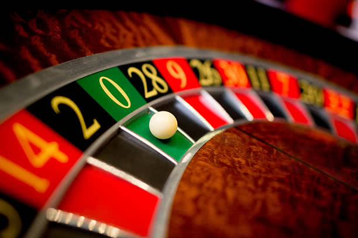

I was at the casino and I noticed that at a specific roulette table, the last 15 results had been red numbers. I approached the table to bet, but what was the best thing to do?

===

The game of roulette is a very easy to understand casino game. A spinning wheel with the numbers from $0$ to $36$ spins and an iron ball falls into one of the given numbers when the wheel stops. People bet can bet on the number, its colour, if it's even or odd, etc.

I heard this story that allegedly took place some time ago, where at a given casino there was a roulette table where for fifteen times in a row, the number came out red. A priori, this has a probability of less than $0.003\%$ of happening... But it happened. Of course people started joining that roulette table and started betting like crazy when they saw such an unlikely event unfold!

!!! What should they bet on? Should they bet `red` because the roulette seems to be giving off way more reds than blacks? Or should we bet `black` because the colour black hasn't come out in the last few spins?

For people who know a little bit of probability, the answer is clear to be "it makes no difference", because whatever already happened at the roulette wheel has no influence whatsoever in whatever is going to happen next. (Unless, of course, we are not talking about a fair roulette wheel...) But as I have come to notice, not everyone understands this concept intuitively, and some people end up acting on one of two biases:

 - They believe that things "will even out" and thus would start betting on `black` like crazy;
 - Take the 15 reds in a row to be some streak that ought to keep happening and keep betting on `red` like crazy.

Of course both bets are equally valid, but that is just it. They are _equally_ valid and have the same probability of winning, regardless of whatever already happened.

The important question is _"what is the probability of winning if you bet on `black`?"_. It is not $50\%$, like you might think at first! And that is why casinos are businesses that make money...