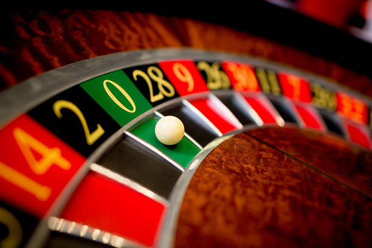

No outro dia eu fui ao casino e reparei que numa das mesas de roleta tinham saído 15 vezes seguidas um número vermelho. Quando vi aquilo decidi ir para essa mesa para também apostar, mas qual é que é a aposta que eu devo fazer?

===

O jogo da roleta é um jogo de casino relativamente simples. Uma bola metálica é largada sobre um disco que está a girar e que contém os números de $0$ a $36$. Quando o disco para de girar, a bola cai num dos números. As pessoas apostam no número que vai sair, na cor dele, se é par ou ímpar, etc.

Eu ouvi uma história, que aconteceu alegadamente há uns anos (não sei em que país), de uma mesa de roleta onde saiu um número vermelho 15 vezes de seguida. A priori, a probabilidade de isto acontecer é menos de $0.003\%$... Mas aconteceu. E claro que as pessoas se entusiasmaram quando viram aquilo acontecer e começaram a apostar _"à maluca"_.

!!! Qual é que é a melhor aposta a fazer? Apostamos no `vermelho` porque a roleta parece que está a dar muito mais números vermelhos que pretos? Ou apostamos `preto` porque a cor preta está em falta?

Para pessoas que sabem um pouco de probabilidade, a resposta é claramente "não faz diferença" porque o que quer que tenha acontecido na mesa da roleta não influencia o que quer que vá acontecer a seguir. (A não ser que o jogo esteja viciado...) Mas eu tenho vindo a reparar que nem todas as pessoas entendem este conceito ou que nem todas as pessoas têm a intuição certa quanto a isto, e começam a exibir um de dois comportamentos enviesados:

 - Acreditam que as coisas têm de se equilibrar e portanto começam a apostar no `preto` por causa disso;
 - Acreditam que os 15 vermelhos que saíram de seguida dão balanço para sair `vermelho` outra vez e portanto é nisso que apostam;

Claro que as duas apostas são igualmente válidas, mas não passa disso: não há motivo nenhum para alguma das apostas ser melhor que a outra. Mesmo sabendo que já saíram números vermelhos 15 vezes seguidas.

A questão que realmente importa é _"qual é a probabilidade de ganhar, se apostar no `preto`?"_. É que essa probabilidade não é $50\%$, ao contrário do que poderíamos pensar! E por isso é que os casinos são um negócio...