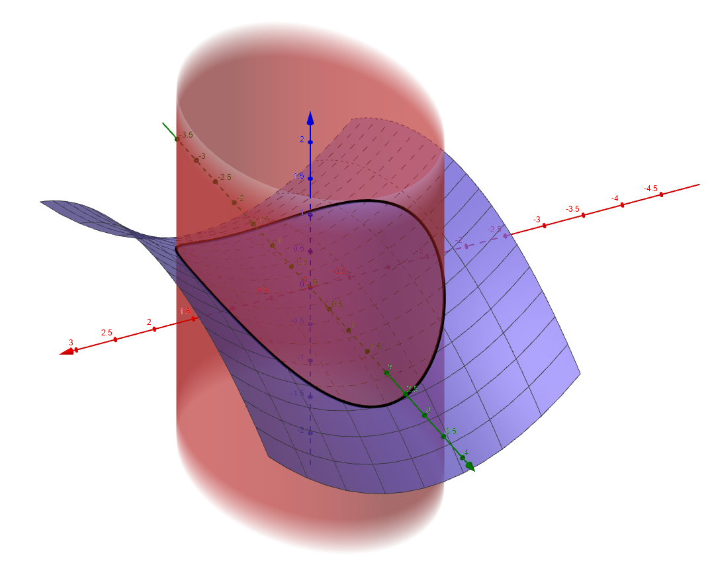

Surface(t,v,((t^(2))/(4))-((v^(2))/(9)),t,-2,2,v,-3,3)

((x^(2))/(2))+((y^(2))/(4))=1

Curve(sqrt(2) cos(t),2 sin(t),((cos^(2)(t))/(2))-((4 sin^(2)(t))/(9)),t,0,2 π)

Sequence(Curve(t,v,((t^(2))/(4))-((v^(2))/(9)),t,-sqrt(2-((v^(2))/(2))),sqrt(2-((v^(2))/(2)))),v,-2,2,0.02)

In this article I compute the total surface area of a pringle.

===

# TL;DR

A pringle has a surface area of approximately ??? cm².

# Preparation

In this article I will be computing the surface area of a pringle,
which is sort of a chip with a very notorious shape.

The reason why I am computing this is... because I can!
And because a friend asked me for it.
I have no idea why my friend needs this, though...

In mathematical terms, the shape of a pringle is a hyperbolic paraboloid.
This is a surface that is given by the equation

$$
z = \frac{x^2}{a^2} - \frac{y^2}{b^2} ~.
$$

Picking $a = 2$ and $b = 3$, we get the following surface:

However, the equation above defines an infinite surface.
As we all know, pringles are finite.
We'll have to circle back to this.

Taking a look at [Paul's Online Notes][paul-surface],
we can see what is needed to figure out the area of a surface in 3D:
we need to be able to parametrise the surface as $z = f(x, y)$
(like we just did) and then we need to compute the double integral

$$
\iint_{D} \sqrt{f_x^2 + f_y^2 + 1} dA ~.
$$

The $D$ in the double integral above is going to be the region
that we integrate over, and it tells us the values that $x$ and $y$ can take.

To define $D$, it suffices to find bounds for $x$ and $y$,
and an ellipse in the $xy$ plane seems to be a good fit.

If we think of the region

$$
\{(x, y) \in \mathbb{R}^2: \frac{x^2}{2} + \frac{y^2}{4} \leq 1\} ~,
$$

we can get a better idea for the pringle that we are actually defining:

To finish this off, we can “fill” the surface in and remove the other drawings, to get a pringle:

This is the pringle we will be finding the surface area of.

# Setting up the integral

To set up the integral that we saw above, we need to know the bounds for $x$ and $y$.

If we integrate over $x$ last, then $x$ goes from $-\sqrt{2}$ to $\sqrt{2}$.
As a function of $x$, how does $y$ vary?

Well, the ellipsis's perimeter is defined by

$$
\frac{x^2}{2} + \frac{y^2}{4} = 1 \iff y = \pm\sqrt{4 - 2x^2} ~.
$$

Therefore, $y$ varies from $-\sqrt{4 - 2x^2}$ to $\sqrt{4 - 2x^2}$.

All in all, the integral we want to compute is

$$
\int_{-\sqrt{2}}^{\sqrt{2}}\int_{-\sqrt{4 - 2x^2}}^{\sqrt{4 - 2x^2}}\sqrt{f_x^2 + f_y^2 + 1}~dydx ~.
$$

$f_x$ and $f_y$ are the partial derivatives of $f$:

$$
z = f(x, y) = \frac{x^2}{4} - \frac{y^2}{9} \implies \begin{cases}
f_x = \frac12x \\
f_y = -\frac29y
\end{cases} ~ .
$$

Putting this back into the integral yields the following:

$$
\int_{-\sqrt{2}}^{\sqrt{2}}\int_{-\sqrt{4 - 2x^2}}^{\sqrt{4 - 2x^2}}\sqrt{\frac14x^2 + \frac{4}{81}y^2 + 1}~dydx ~.
$$

Isn't this just a lovely integral? 😭

# Changes of variables

Even though Mathematica cracked this integral and said the answer was approximately 9.62, we are going to crack on and try to solve this by hand.

To make this integral more digestible, we want to use polar coordinates.
After all, we are integrating over a round-_ish_ region.

However, before using polar coordinates, we want to turn the square root
into something like $\sqrt{u^2 + v^2 + 1}$.

In other words, we will do two changes of variables.

Say we want to integrate $f(x, y)$ over the region $R$.
If the transformation $x = g(u, v)$, $y = h(u, v)$ turns $R$ into
another region $S$, then [Paul's Online Notes on changes of variables][paul-coordinates]
state that these two integrals are the same:

$$
\iint_R f(x, y) dA = \iint_S f(g(u, v), h(u, v))\left|\frac{\partial(x, y)}{\partial(u, v)} \right| \bar{dA} ~.
$$

The $\left|\frac{\partial(x, y)}{\partial(u, v)} \right|$ above is the Jacobian
of the transformation, and is given by

$$
\frac{\partial g}{\partial u}\frac{\partial h}{\partial v} - \frac{\partial g}{\partial v}\frac{\partial h}{\partial u}
$$

In fact, this follows from the rule of the derivative of the composition
of two functions.
If you know that $(f(g(x)))' = f'(g(x))g'(x)$,
then believing the equality becomes a lot easier.

## Ellipse into circle

First, we need to make sure that what's under the square root
is more pleasant to the eye.

Therefore, if we write

$$
\begin{cases}
x = g(u, v) = 2u \\
y = h(u, v) = \frac92v
\end{cases} ~,
$$

our Jacobian $\left|\frac{\partial(x, y)}{\partial(u, v)} \right|$ is just $9$.

Then, by 
our integral will become

$$

$$

## Polar coordinates

[paul-surface]: https://tutorial.math.lamar.edu/classes/calciii/SurfaceArea.aspx
[paul-coordinates]: https://tutorial.math.lamar.edu/Classes/CalcIII/ChangeOfVariables.aspx
