This tutorial will introduce beginners to the many features that Textual offers to build elegant and lightweight TUIs.

===

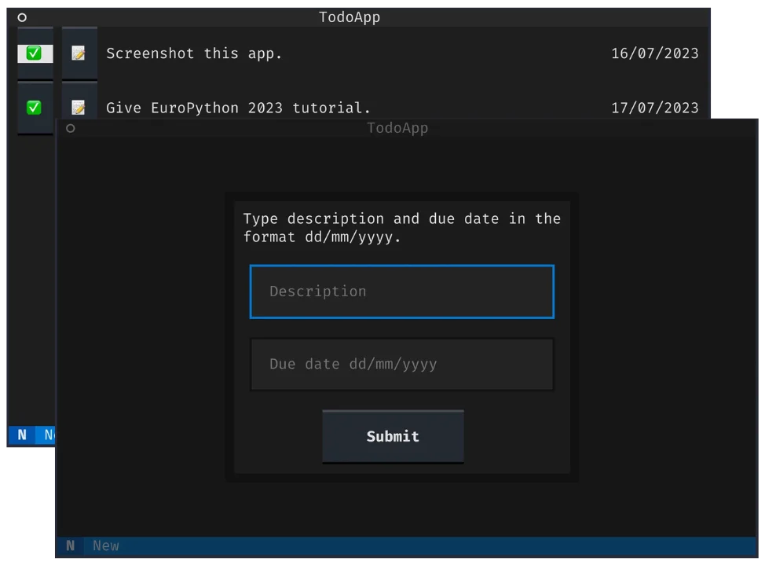


# Introduction

This tutorial will teach you the basics that you need to use [Textual] to build terminal user interfaces (TUIs).

This is an unofficial written version of [a tutorial I gave at EuroPython 2023 in Prague][ep-tutorial].

In case you don't know what Textual is, go ahead and read the description below.
Otherwise, let's get building!


## What is Textual?

[Textual] is a Python framework that lets users build applications that run directly in the terminal.
Quoting the [Textual] documentation, some of the advantages of using Textual to build applications include:

 - Rapid development: you can use your existing Python skills to build a beautiful user interface.
 You don't need to learn new languages to write user interfaces.
 - Low requirements: you can run Textual on a single board computer if you want to.
 - Cross-platform: Textual runs just about everywhere you can run Python.
 - Remote: Textual apps can run over SSH.
 - CLI integration: Textual apps can be launched and run from the command prompt.
 - Open source: Textual is licensed under MIT.


# Setup

To get ready for this tutorial, create a new folder, create a new virtual environment, and install Textual!

```bash
~:$ mkdir textual-tutorial
~:$ cd textual-tutorial

~/textual-tutorial:$ python -m venv .venv
~/textual-tutorial:$ . .venv/bin/activate

~/textual-tutorial:$ python -m pip install textual
```

To verify that the installation was successful, run the command

```bash
~/textual-tutorial:$ python -m textual
```

That should open the Textual demo app.
It should look something like this:


To quit the app, press <kbd>Ctrl</kbd> + <kbd>C</kbd>.

! This tutorial was written for Textual 0.29.0.
! Some information in this tutorial may become outdated.
! Check the [Textual docs][textual-docs] for updated information and [join the Textual Discord][textual-discord] to talk to us.


# Your first Textual app

Textual lets you build TUIs – terminal user interfaces.
These are programs that provide an interface for the user to interact with, but they run inside the terminal.

In Textual, the program that shows things to the user and with which the user interacts is called an _app_.
Let us see how to build your first, most basic app.

An application, in Textual, is a class that inherits from `textual.app.App`.
Then, to _run_ your app, you need to instantiate it and call its method `run`:

```py
# your_first_app.py
from textual.app import App


class MyApp(App):
    pass


MyApp().run()
```

Run your app with the command:

```bash
~:$ python your_first_app.py
```

It should show a black screen, which means your app is running!
It does _nothing_, but it is running!
To exit your app, press <kbd>Ctrl</kbd> + <kbd>C</kbd>.


# Showing widgets on the screen

For your app to do something useful, you will want to add _widgets_ to it.
Widgets are the interface elements that the user interacts with and that you can use to convey information to the user.

Textual has an [extensive widget library][textual-widget-gallery] that includes:

 - app headers and footers;
 - labels;
 - buttons;
 - inputs;
 - radio buttons and checkboxes;
 - switches;
 - tabs;
 - etc.


## Composing widgets

Now I will show you how to use widgets in your apps.
We will start by adding a header and a button to our app.
To add the widgets to the app we need to import them:

```py
from textual.widgets import Button, Header
```

Next, we need to know how to tell Textual to display the widgets inside our app.
We do this via the `App.compose` method, which must return an iterable of widgets.
For ease of use, it is recommended that you yield your widgets one at a time:

```py
# widgets.py
from textual.app import App
from textual.widgets import Button, Header


class MyApp(App):
    def compose(self):
        yield Header()
        yield Button()


MyApp().run()
```

If you run this app, you should see an app with a header with the title “MyApp” and a button with the text “Button”, like the image below shows:

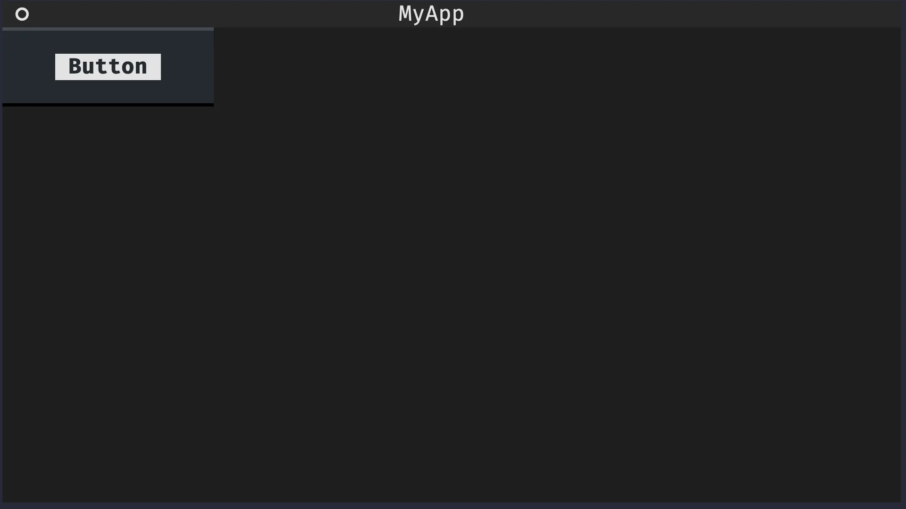


## Customising widgets upon instantiation

Many widgets can be customised when they are instantiated.
For example, the header can be set to show a clock with the current time and a button can have a non-default text:

```py
# widgets.py
from textual.app import App
from textual.widgets import Button, Header


class MyApp(App):
    def compose(self):
        yield Header(show_clock=True)
        yield Button("Click me!")


MyApp().run()
```

If you run the app now, you will see a clock in the upper right corner and you will see the text “Click me!” inside the button:

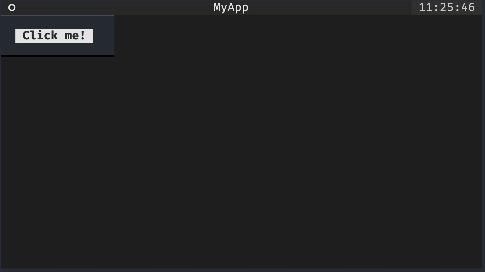


## Adding inputs to your app

!!! Go to the [Textual widgets reference][textual-widgets] and figure out how to include an input field in your app.
!!! Customise it so that it has some placeholder text saying “Name:”.
!!! Do this by locating the `Input` widget in the reference and looking at the subsection “A Simple Example”.

The solution to this is to add the widget `Input` to the import list and then yield it inside the method `MyApp.compose`.
Additionally, the widget `Input` has a parameter `placeholder` that can be used to specify the placeholder text of the input field in the app:

```py
from textual.app import App
from textual.widgets import Button, Header, Input


class MyApp(App):
    def compose(self):
        yield Header(show_clock=True)
        yield Button("Click me!")
        yield Input(placeholder="Name:")


MyApp().run()
```

This app looks like this:

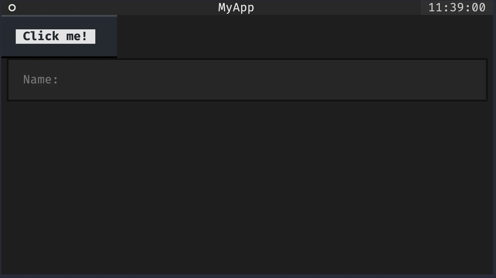

Try swapping the lines `yield Button(...)` and `yield Input(...)` to see what difference that makes.


# Compound widgets

## Rationale

When building applications, it is common to group some fundamental widgets to create a more complex widget that has a particular significance in your app.
For example, we can modify the previous application to include a label next to the input field:

```py
from textual.app import App
from textual.widgets import Button, Header, Input, Label


class MyApp(App):
    def compose(self):
        yield Header(show_clock=True)
        yield Label("Name:")
        yield Input(placeholder="name")
        yield Button("Click me!")


MyApp().run()
```

If you extend your application to also ask for the user's surname and email, you will likely want to repeat the pattern:

 - a label and an input for the surname; and
 - a label and an input for the email.

Something along these lines:

```py
from textual.app import App
from textual.widgets import Button, Header, Input, Label


class MyApp(App):
    def compose(self):
        yield Header(show_clock=True)
        yield Label("Name:")
        yield Input(placeholder="name")
        yield Label("Surname:")
        yield Input(placeholder="surname")
        yield Label("Email:")
        yield Input(placeholder="email")

        yield Button("Click me!")


MyApp().run()
```

As we notice the pattern, we may extract it and implement a widget called `LabelledInput` that is composed of a label and a related input.
When we put together two or more widgets to create a more complex widget, we say we build a compound widget.


## Defining a compound widget

Compound widgets are regular widgets, but instead of having to implement their functionality from scratch, you can use other widgets as a starting point.
To do this, you need to create the class that is going to represent your compound widget.

Much like you inherited from `textual.app.App` to create your own app, you will need to inherit from `textual.widget.Widget` to create your own widget:

```py
from textual.widget import Widget


class LabelledInput(Widget):
    pass
```

This prepares `LabelledInput` to become a compound widget.
What is left is specifying what this compound widget is composed of.
Similarly to apps, compound widgets can have a method `compose` that specifies what are the widgets that make it up.

In the case of our `LabelledInput`, it will be composed of a label and an input:

```py
from textual.widget import Widget
from textual.widgets import Input, Label


class LabelledInput(Widget):
    def compose(self):
        yield Label("Label:")
        yield Input(placeholder="label")
```


## Using a compound widget

Compound widgets are used like any other widget.
For instance, you can yield it inside the method `compose` of your app:

```py
from textual.app import App
from textual.widget import Widget
from textual.widgets import Button, Header, Input, Label


class LabelledInput(Widget):
    def compose(self):
        yield Label("Label:")
        yield Input(placeholder="label")


class MyApp(App):
    def compose(self):
        yield Header(show_clock=True)
        yield LabelledInput()  # !!!
        yield Button("Click me!")


MyApp().run()
```

If you run this app, it will look like the button disappeared:

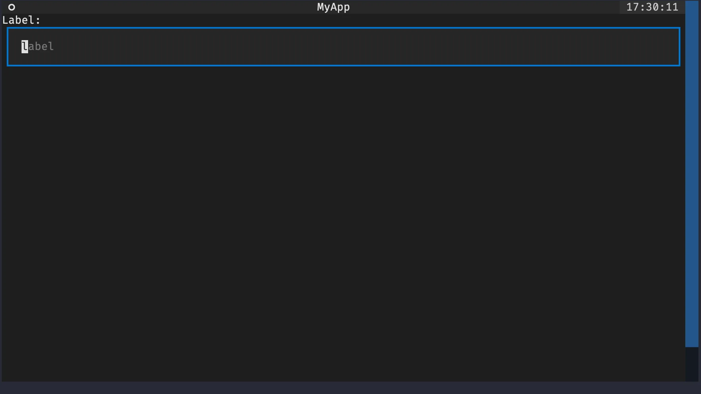

However, if you look closely, you will notice a scrollbar on the right that lets you scroll until you see the button.
This odd behaviour is explained by the fact that `Widget`, which `LabelledInput` inherits from, is too tall by default.

The full discussion about [Textual CSS](#textual-css) will only happen later down the road, but you will get a quick taste now.
Textual CSS is a markup language that you can use to modify the way your widgets look.
In this particular case, we want the `LabelledInput` widgets to have a much smaller height, so that is what we will do.

Here is the updated compound widget, with 5 new lines of code:

```py
from textual.app import App
from textual.widget import Widget
from textual.widgets import Button, Header, Input, Label


class LabelledInput(Widget):
    DEFAULT_CSS = """
    LabelledInput {
        height: 4;
    }
    """

    def compose(self):
        yield Label("Label:")
        yield Input(placeholder="label")


class MyApp(App):
    def compose(self):
        yield Header(show_clock=True)
        yield LabelledInput()
        yield Button("Click me!")


MyApp().run()
```

The class variable `DEFAULT_CSS` is responsible for specifying that the height of the widget `LabelledInput` should be 4, instead of whatever value was set before.

This app now has the look that we expected:


Try playing around with the value in front of `height:` to see how the look of the app changes when that value changes.


## Customising a compound widget upon instantiation

Like all other widgets, compound widgets can also be customised upon instantiation.
Given that a compound widget contains sub-widgets, it is common for some of the customisation options of said sub-widgets to be exposed by the compound widget itself.

For our `LabelledInput` example, we will let the user customise the text inside the label:

```py
# ...

class LabelledInput(Widget):
    DEFAULT_CSS = """
    LabelledInput {
        height: 4;
    }
    """

    def __init__(self, label):
        super().__init__()  # <- SUPER important.
        self.label = label

    def compose(self):
        yield Label(f"{self.label}:")
        yield Input(placeholder=self.label.lower())
```

When overriding the [dunder method `__init__`][dunder-init] of your compound widget, be particularly careful about calling `super().__init__()`!
If you forget that, you will get all sorts of funny errors when using your compound widget inside an app.

With this improved version of `LabelledInput`, we can now reproduce the form we had before:

```py
from textual.app import App
from textual.widget import Widget
from textual.widgets import Button, Header, Input, Label


class LabelledInput(Widget):
    DEFAULT_CSS = """
    LabelledInput {
        height: 4;
    }
    """

    def __init__(self, label):
        super().__init__()
        self.label = label

    def compose(self):
        yield Label(f"{self.label}:")
        yield Input(placeholder=self.label.lower())


class MyApp(App):
    def compose(self):
        yield Header(show_clock=True)
        yield LabelledInput("Name")
        yield LabelledInput("Surname")
        yield LabelledInput("Email")
        yield Button("Click me!")


MyApp().run()
```

This application looks like this:

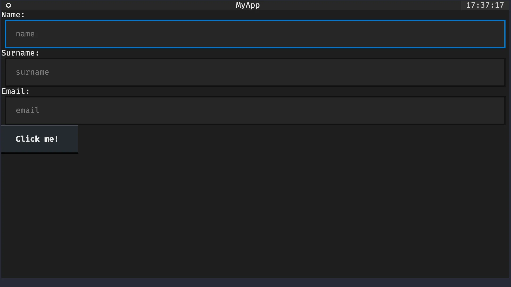


# Key bindings and actions

In Textual, you can _bind_ key presses to methods in your application.
To “bind” a key press means that you can automatically call a given method when the user presses a certain key or a set of keys.
For example, you could make it so that pressing <kbd>Esc</kbd> quits your application or pressing <kbd>Ctrl</kbd> + <kbd>D</kbd> toggles dark mode.

Textual allows such bindings via _actions_.
More precisely, via _action methods_.


## Action methods

Action methods are regular app methods that follow a naming convention.
An action method should start with `action_`.
In the app below, the method `action_ring_a_bell` is an action method:

```py
from textual.app import App


class MyApp(App):
    def action_ring_a_bell(self):
        self.bell()


MyApp().run()
```

The action method `action_ring_a_bell` implicitly defines an action called `ring_a_bell`, which is what comes after `action_` in the method name.
Now, we need to tell Textual that the action `ring_a_bell` should be triggered when the user presses the key <kbd>B</kbd>.


## Declaring a binding

Applications have a class variable `BINDINGS` that can be used to bind keys to actions.
In its simplest form, the class variable `BINDINGS` is a list of tuples, each tuple declaring a binding.

To bind the key <kbd>B</kbd> to the action `ring_a_bell`, all we need is the tuple `("b", "ring_a_bell")`:

```py
from textual.app import App


class MyApp(App):
    BINDINGS = [("b", "ring_a_bell")]

    def action_ring_a_bell(self):
        self.bell()


MyApp().run()
```

If you run this app and press <kbd>B</kbd>, you should hear the system bell.
This means you successfully created your first key binding!
Take a moment to celebrate!
Turn the volume of your computer up and hit the key <kbd>B</kbd> repeatedly!


## Action naming

Just to be clear, Textual does not care about the specific name that you give to your action.
The only thing that Textual needs is for you to be consistent across the declaration of the class variable `BINDINGS` and the name of your action method.

For example, we could simplify the action name to `bell`:

```py
from textual.app import App


class MyApp(App):
    BINDINGS = [("b", "bell")]
    #          vvvv    ^^^^
    def action_bell(self):
        self.bell()


MyApp().run()
```


## Display actions in the footer

In order to let the user know which key bindings are available, Textual provides the widget `Footer`.
The widget `Footer` will show the key bindings at the bottom of your application.
For that, you need two things:

 1. you need to add the widget `Footer` to your app; and
 2. you need to add a description to your key binding.

In the class attribute `BINDINGS`, the description of a key binding is the third element of the tuple that defines the binding.
So, if we revisit the previous example, the code below will display the footer widget which will contain an indication that the key <kbd>B</kbd> will ring a bell:

```py
from textual.app import App
from textual.widgets import Footer


class MyApp(App):
    BINDINGS = [("b", "bell", "Ring")]

    def compose(self):
        yield Footer()

    def action_bell(self):
        self.bell()


MyApp().run()
```

The image below shows what the footer looks like:

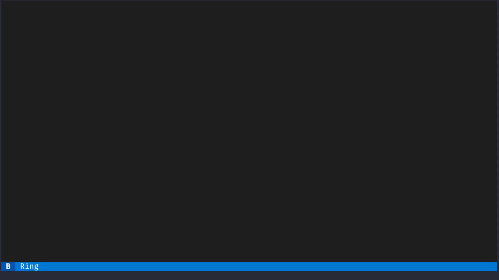


# Dynamic widget creation

So far, the only widgets we had in our apps were instantiated inside the method `compose`.
However, widgets can also be added dynamically to your app.
You do this by calling the app method `mount`.

For example, we can modify the previous key binding to add a label to the application whenever the key <kbd>B</kbd> is pressed:

```py
from textual.app import App
from textual.widgets import Footer, Label


class MyApp(App):
    BINDINGS = [("b", "bell", "Ring")]

    def compose(self):
        yield Footer()

    def action_bell(self):
        self.bell()
        self.mount(Label("Ring!"))


MyApp().run()
```

If you run this application and press <kbd>B</kbd> a couple of times, you should see some labels with the text “Ring!” show up, as the next image shows:


# Build your first TODO app prototype

## Quick recap

Take a moment to stretch, you already learned a lot!
Here is a quick recap of the things you already know:

 - Textual applications are created by inheriting from `textual.app.App`;
 - the app method `compose` is responsible for putting widgets on the screen;
 - the best way to use the method `compose` is by yielding the widgets you want to put in the app;
 - widgets can be customised upon instantiation;
 - how to create compound widgets by way of using the widget's method `compose`;
 - the class variable `DEFAULT_CSS` can be used to control the height of a compound widget;
 - methods can be bound to key presses via the app's class variable `BINDINGS`;
 - an _action method_ is a method whose name starts with `action_`;
 - key bindings can have a description and then shown in the app widget `Footer`; and
 - you can dynamically add a widget to an app with the app method `mount`.


## Challenge

I want to challenge you to take everything you learned so far and create your first prototype of the TODO app we will be creating.

Here are the requirements for this challenge:

 - your app should have a header and a footer;
 - you should define a compound widget called `TodoItem` that is going to represent each entry in your app;
   - the `TodoItem` should have two labels, one for the description of the item and the other for the due date; and
   - create the labels inside `TodoItem` with some dummy data like “I should get this done!” for the description and “dd/mm/yyyy” for the date.
 - create a key binding so that pressing <kbd>N</kbd> creates a new `TodoItem` that gets added to the app.

If you follow all the requirements, run your app, and press <kbd>N</kbd> a couple of times, you should get something like this:

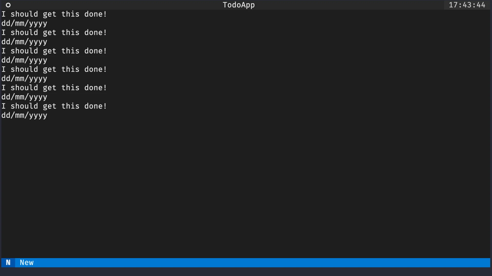


## Code for the first prototype

There are multiple ways to implement an application that behaves as defined above.
The code below is my proposal:

```py
from textual.app import App
from textual.widget import Widget
from textual.widgets import Footer, Header, Label


class TodoItem(Widget):
    DEFAULT_CSS = """
    TodoItem {
        height: 2;
    }
    """

    def compose(self):
        yield Label("Label:")
        yield Input(placeholder="label")


class MyApp(App):
    def compose(self):
        yield Header(show_clock=True)
        yield LabelledInput()
        yield Button("Click me!")


MyApp().run()
```


# Layout containers

One thing that you probably noticed already is that all the widgets we have been creating and composing are getting stacked vertically.
However, there are times when we would prefer widgets stacked horizontally.
We will learn to do this with containers.

In Textual, a container is a widget that groups many widgets.
Typically, Textual containers provide a bit of extra functionality on top of the grouping.

For example, the containers `Horizontal` and `Vertical` change how their child widgets get stacked.
A container is used like a context manager and inside the context manager you just have to yield the children of that container.
The app below gives an example:

```py
from textual.app import App
from textual.containers import Horizontal
from textual.widgets import Label


class MyApp(App):
    def compose(self):
        yield Label("first label!")
        with Horizontal():
            yield Label("second label.")
            yield Label("third label...")


MyApp().run()
```

If you run this app, you will see the first label on a line of its own.
The second and third labels, which are now side-by-side, will be under the first one.
The image below shows this:

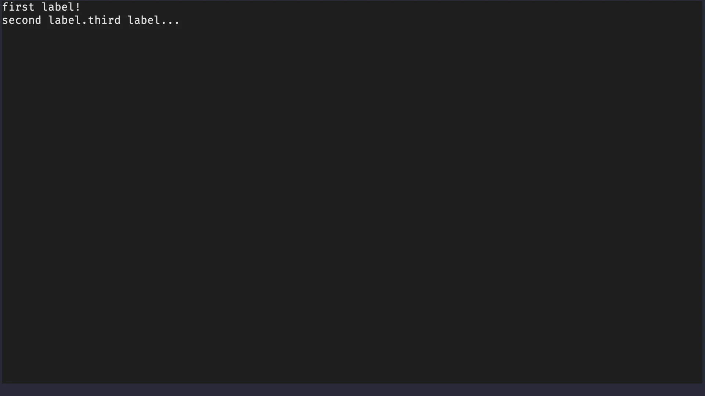


# Messages and message handling

## What are Textual messages?

Messages are how Textual notifies the app that something occurred.
For example, when the user presses a button, Textual issues a message for that.
If you want your application to do something whenever the user presses a button, you need to _handle that message_.

Many built-in widgets define useful messages that are classes defined inside the widget namespace.
For example,

 - for the widget `Button`, the message that is sent when the button is pressed is `Button.Pressed`; and
 - for the widget `Input`, the message that is sent when the input value changes is `Input.Changed`.

Built-in widgets have all of their messages listed in the widgets reference.
For example, if you [open the widget `Button` reference](https://textual.textualize.io/widgets/button/#messages) you will find the `Button.Pressed` message.

What is left is knowing how to _handle_ such messages.


## Handler methods

When a message is _posted_ – such as the message `Button.Pressed` when the user presses a button – Textual will look for a special method called a _handler method_.
Such a _handler method_ is a regular Python method with a special naming convention.

If you implement a method called `on_button_pressed`, Textual will call that method whenever a button is pressed.

To test this out, we can create a simple app with a single button and a method called `on_button_pressed` that will play the app bell.
Here it is:

```py
from textual.app import App
from textual.widgets import Button


class MyApp(App):
    def compose(self):
        yield Button("Ring")

    def on_button_pressed(self):
        self.bell()


MyApp().run()
```

Try running your app and pressing the button.
You should hear a bell.


## Handler method naming

A handler method is any method that follows this naming convention:

 - the name starts with `on_`; and
 - the name ends with the message namespace and message name in snake case.

Here are two examples of handler methods:

 1. The message `Button.Pressed` is associated with button presses and it can be handled by a method called `on_button_pressed`.
 2. The message `Input.Changed` is associated with changes to an input field and it can be handled by a method called `on_input_changed`.

!!! Try implementing a handler method for the message `Input.Changed` that also calls the app bell.
!!! If you do it correctly, you should hear a bell whenever you type inside your app's input field.

We can do this if we yield an input inside `compose` and if we implement a method called `on_input_changed`:

```py
from textual.app import App
from textual.widgets import Button, Input


class MyApp(App):
    def compose(self):
        yield Button("Ring")
        yield Input()

    def on_button_pressed(self):
        self.bell()

    def on_input_changed(self):
        self.bell()


MyApp().run()
```


# Custom messages

You can also create custom messages by inheriting from `textual.message.Message`.
Custom messages are especially useful when you create your own (compound) widgets.

Messages are the correct way for widgets to communicate with the app.
Thus, if we want to be able to edit and dismiss TODO items, we will need custom messages for that.


## Create a message

Creating a message can be as simple as _just_ inheriting from `Message`:

```py
from textual.message import Message


class Ring(Message):
    pass
```

The code above defines a new message `Ring`.
Now, we need to see how to use this message.


## Posting a message

In Textual, we talk about _posting messages_, which essentially means that widgets and apps get notified of things.
If you have a message that you would like to propagate, you can call the method `post_message` on the widget/app that should receive the notification.

For example, whenever the user presses the button of the app below, the app is notified of the message `Ring`.

```py
from textual.app import App
from textual.message import Message
from textual.widgets import Button


class Ring(Message):
    pass


class MyApp(App):
    def compose(self):
        yield Button("Ring")

    def on_button_pressed(self):
        self.post_message(Ring())


MyApp().run()
```


## Handling custom messages

You can handle custom messages in the same way as you would handle a built-in message.
All you need to do is follow the naming convention.

The message `Ring` is not nested inside anything, so its handler method is called `on_ring`.
If we add that method to the app, now the app rings whenever the button is pressed:

```py
from textual.app import App
from textual.message import Message
from textual.widgets import Button


class Ring(Message):
    pass


class MyApp(App):
    def compose(self):
        yield Button("Ring")

    def on_button_pressed(self):
        self.post_message(Ring())

    def on_ring(self):
        self.bell()


MyApp().run()
```


## Custom messages inside compound widgets

When compound widgets need custom messages, those are typically defined inside the widget, much like the message `Pressed` for buttons is actually defined inside `Button`.

Supposing that we had a custom widget `RingerWidget`, then we could move the message `Ring` inside that widget:

```py
from textual.message import Message
from textual.widget import Widget


class RingerWidget(Widget):
    class Ring(Message):
        pass
```

By doing so, the handler method for the message `RingerWidget.Ring` now becomes `on_ringer_widget_ring`.


# Self-removing widget

Much like you can add widgets dynamically to your application, you can also remove them.
To do this, all you need to do is call the method `remove` on the widget.

We will use this method to implement a widget that requests its own deletion.
To achieve this, we will also need to use a custom message.
Here is the whole flow for this pattern:

 - the compound widget posts a message to request deletion;
 - the deletion request holds a reference to the widget that wants to be deleted; and
 - the app handles the deletion request by calling the method `remove`.

Here is the implementation of this pattern:

```py
from textual.app import App
from textual.message import Message
from textual.widget import Widget
from textual.widgets import Button


class Deletable(Widget):
    class DeletionRequest(Message):
        def __init__(self, to_delete):
            super().__init__()
            self.to_delete = to_delete

    def compose(self):
        yield Button("Delete me.")

    def on_button_pressed(self):
        self.post_message(Deletable.DeletionRequest(self))


class MyApp(App):
    def compose(self):
        yield Deletable()

    def on_deletable_deletion_request(self, message):
        message.to_delete.remove()


MyApp().run()
```

This may sound like a convoluted pattern.
For example, why don't we just do `self.remove()` inside `Deletable.on_button_pressed`?

Unless the _only_ purpose of your widget is to delete itself, you are better off delegating the deletion of the widget to the app.
By using a custom message, you give the app a chance to react to the deletion request and handle it in the best way.
For example, you may need to perform some cleanup before/after deleting the widget.


# Reactive attributes

A _reactive attribute_ is a Textual mechanism that lets you _react_ to attribute changes.


## Automatic UI updates

For example, the app below rings a bell whenever the attribute `counter` is increased.
To do this, we define `counter` at the class level as a `reactive` instance and we implement a special method:

```py
from textual.app import App
from textual.reactive import reactive
from textual.widgets import Button


class MyApp(App):
    counter = reactive(0)

    def compose(self):
        yield Button("+1")

    def on_button_pressed(self):
        self.counter += 1

    def watch_counter(self):
        self.bell()


MyApp().run()
```

The line `counter = reactive(0)` sets the attribute `counter` to a reactive attribute and initialises it with the value `0`.

The method `watch_counter` is a _watch method_.
A watch method is a regular method that follows the naming convention of starting with the prefix `watch_`.

When the reactive attribute `counter = reactive(0)` is changed, Textual will look for an associated watch method and it will call it.
In this case, the associated watch method is `watch_counter`.

If the reactive attribute were named `foo`, then the watch method would be `watch_foo`.
The naming scheme is similar to that of actions.

A slightly more interesting variation of the app above uses a label to display the value of the counter.
We just need to use the method `update` to update the value that the label is displaying:

```py
from textual.app import App
from textual.reactive import reactive
from textual.widgets import Button, Label


class MyApp(App):
    counter = reactive(0)

    def compose(self):
        self.label = Label()
        yield self.label
        yield Button("+1")

    def on_button_pressed(self):
        self.counter += 1

    def watch_counter(self):
        self.label.update(str(self.counter))


MyApp().run()
```

Notice how we save a reference to the label inside the method `compose` so that we can refer to it inside `watch_counter`.

If you run this app and you press the button repeatedly, you will see the value of the label increase, like the animation below shows:

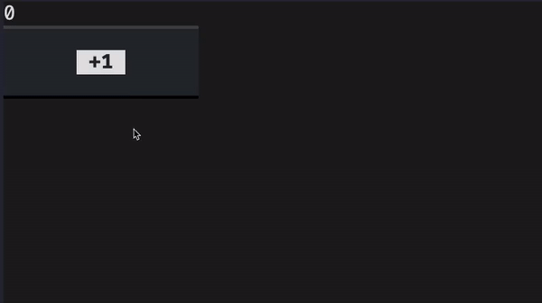


## Reactive attribute lifecycle

Reactives warrant a warning, though.
Watch methods of reactive attributes will often interact with other widgets, possibly other reactive attributes, etc.
This means that you need to make sure that those things already exist when you assign to the reactive attribute the first time.

For instance, if your reactive attribute needs to interact with other widgets, those widgets are typically initialised inside the method `__init__`.
Thus, a safer version of the previous app would be the following:

```py
from textual.app import App
from textual.reactive import reactive
from textual.widgets import Button, Label


class MyApp(App):
    counter = reactive(0)

    def __init__(self):
        self.label = Label()
        super().__init__()

    def compose(self):
        yield self.label
        yield Button("+1")

    def on_button_pressed(self):
        self.counter += 1

    def watch_counter(self):
        self.label.update(str(self.counter))


MyApp().run()
```


# Decorator `on`

The decorator `on` is a convenience decorator that you can use to declare arbitrary message handlers that don't follow the message handling naming convention.

For example, in the previous app, we could have written a method `increment_counter` that increments the counter:

```py
def increment_counter(self):
    self.counter += 1
```

Then, we could have used the decorator `on` to say that that method should be called whenever the message `Button.Pressed` is posted.
Here is how you would do it, after importing the decorator `on` from `textual`:

```py
from textual import on  # !!!
from textual.app import App
from textual.reactive import reactive
from textual.widgets import Button, Label


class MyApp(App):
    counter = reactive(0)

    def compose(self):
        self.label = Label()
        yield self.label
        yield Button("+1")

    @on(Button.Pressed)  # !!!
    def update_counter(self):
        self.counter += 1

    def watch_counter(self):
        self.label.update(str(self.counter))


MyApp().run()
```

For such a simple use case, the decorator `on` isn't particularly advantageous when compared to the message handling naming convention.

However, there is another scenario in which the decorator `on` becomes an excellent alternative.


## Motivation for the decorator `on`

We want to extend the previous app to include buttons that increment the counter by 10 and by 100.
We can add those buttons to the app easily:

```py
from textual import on
from textual.app import App
from textual.reactive import reactive
from textual.widgets import Button, Label


class MyApp(App):
    counter = reactive(0)

    def compose(self):
        self.label = Label()
        yield self.label
        yield Button("+1")
        yield Button("+10")
        yield Button("+100")

    @on(Button.Pressed)  # !!!
    def increment_counter(self):
        self.counter += 1

    def watch_counter(self):
        self.label.update(str(self.counter))


MyApp().run()
```

However, regardless of the button you press, the counter only increases by 1:

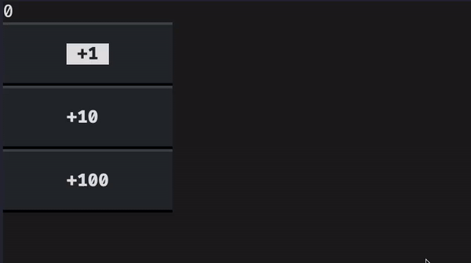

We need to be able to tell the buttons apart and then we need to increment the counter accordingly.


## Widget identifiers

To tell the buttons apart, we can assign a unique identifier to each one of them:

```py
# ...

class MyApp(App):
    counter = reactive(0)

    def compose(self):
        self.label = Label()
        yield self.label
        yield Button("+1", id="one")
        yield Button("+10", id="ten")
        yield Button("+100", id="hundred")

# ...
```

Then, we can use the optional parameter of the decorator `on` to specify that a given method should only be called if we get a message `Button.Pressed` from the button with the given identifier:

```py
# ...

class MyApp(App):
    counter = reactive(0)

    def compose(self):
        self.label = Label()
        yield self.label
        yield Button("+1", id="one")
        yield Button("+10", id="ten")
        yield Button("+100", id="hundred")

    @on(Button.Pressed, "#one")
    def plus_one(self):
        self.counter += 1

    @on(Button.Pressed, "#ten")
    def plus_ten(self):
        self.counter += 10

    @on(Button.Pressed, "#hundred")
    def plus_hundred(self):
        self.counter += 100

# ...
```

Notice that, to filter the buttons by their identifier inside the decorator `on`, we need to prefix the identifier with the character `#`.
There is a reason for this and that reason should become clear when you learn about [Textual CSS](#textual-css).


# Modal screens

A Textual screen is like a page in your application.
Different screens can have different purposes.

In our TODO app, we are going to have the main screen that shows all the pending TODO items and we are going to have a second screen where the user can fill in the details (description and date) of a TODO item.

We will use modal screens for this because, if I'm being honest, modal screens look really cool.


## Creating a modal screen

Creating a modal screen is essentially like creating a compound widget or an app:
you need to create a class that inherits from `textual.screen.ModalScreen` and then you use the method `compose` to determine what widgets go up on that screen.

The class `MyModalScreen` implements a modal screen with a button:

```py
from textual.screen import ModalScreen
from textual.widgets import Button, Label


class MyModalScreen(ModalScreen):
    def compose(self):
        yield Label("My modal screen")
        yield Button("Exit")
```


## Showing a modal screen

Custom screens are used when you _push_ them with the method `push_screen`.
The method `push_screen` will push its argument screen on top of the current interface.
You can push many screens on top of each other and Textual will keep track of the screen stack for you.

To show our modal screen, we will create a barebones app that pushes the modal screen when the app's button is pressed:

```py
from textual.app import App
from textual.screen import ModalScreen
from textual.widgets import Button, Label


class MyModalScreen(ModalScreen):
    def compose(self):
        yield Label("My modal screen")
        yield Button("Exit")


class MyApp(App):
    def compose(self):
        yield Button("Push modal!")

    def on_button_pressed(self):
        self.push_screen(MyModalScreen())


MyApp().run()
```

After the modal is pushed, this is what the application looks like:

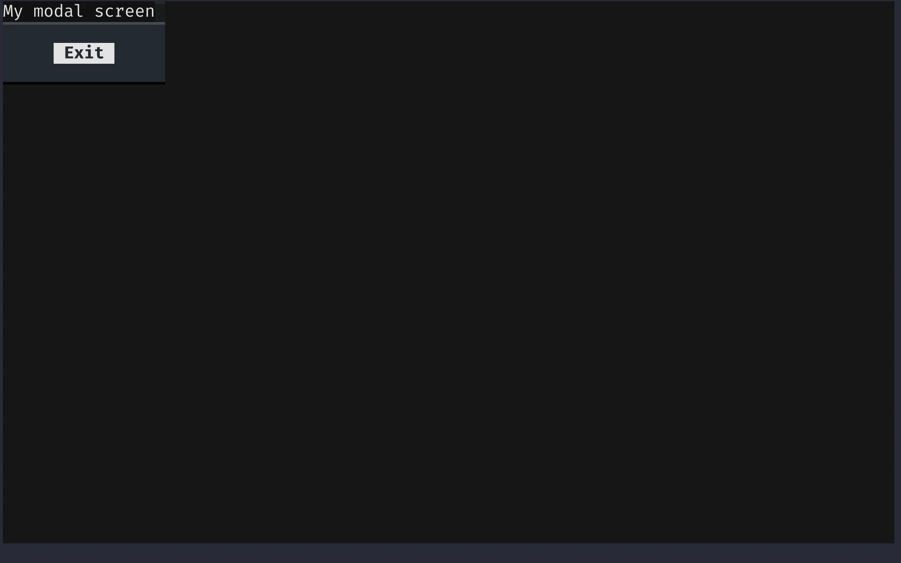


## Styling the modal appropriately

Above I wrote the following: “modal screens look cool”.
However, the modal screen I just showed doesn't look that good, but that's straightforward to fix.
We just add these four lines to our modal screen class:

```py
from textual.screen import ModalScreen
from textual.widgets import Button, Label


class MyModalScreen(ModalScreen):
    # Added this:
    DEFAULT_CSS = """
    MyModalScreen {
        align: center middle;
    }
    """

    def compose(self):
        yield Label("My modal screen")
        yield Button("Exit")
```

With this simple addition, that is again a sneak peek into the [Textual CSS](#textual-css) feature that I'm about to show you, the modal screen immediately looks infinitely better.
It doesn't look great _yet_, but we can already see that what makes the modal screen so nice is the background transparency that lets you see what is under the modal screen, just like the image below shows:

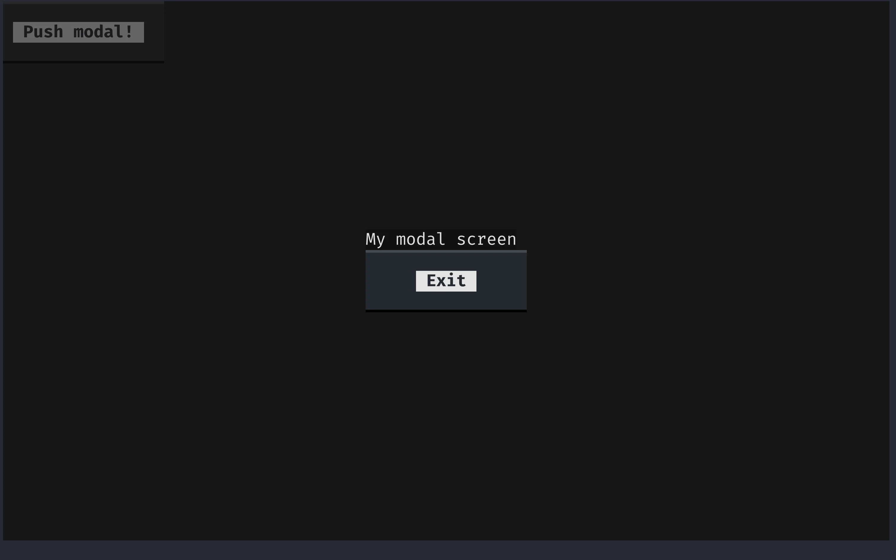


## Exiting a modal screen

The main way in which you can exit a modal screen is via the `dismiss` method.
In our modal screen class, we can add a handler method for the message `Button.Pressed` and we can dismiss the screen inside that method:

```py
from textual.app import App
from textual.screen import ModalScreen
from textual.widgets import Button, Label


class MyModalScreen(ModalScreen):
    DEFAULT_CSS = """
    MyModalScreen {
        align: center middle;
    }
    """

    def compose(self):
        yield Label("My modal screen")
        yield Button("Exit")

    def on_button_pressed(self):
        self.dismiss()
```

If you run the app now, you can open the modal screen and then you can dismiss it to get back to your application.


## Screen callback

The final thing you need to learn about (modal) screens is that they can return results via a callback system.
When you push the screen to the stack with the method `push_screen`, you can provide an additional argument that is a callback function.
This callback function will be called when you use the method `dismiss` to leave the screen.
If you pass an argument to `dismiss`, that argument will be passed into the callback function.

For example, the modal screen below takes note of the timestamp of when it was dismissed and displays it in the main app interface:

```py
import time

from textual.app import App
from textual.screen import ModalScreen
from textual.widgets import Button, Label


class MyModalScreen(ModalScreen):
    DEFAULT_CSS = """
    MyModalScreen {
        align: center middle;
    }
    """

    def compose(self):
        yield Label("My modal screen")
        yield Button("Exit")

    def on_button_pressed(self):
        self.dismiss(time.time())  # <--


class MyApp(App):
    def compose(self):
        yield Button("Push modal!")

    def on_button_pressed(self):
        self.push_screen(MyModalScreen(), self.modal_screen_callback)  # <--

    def modal_screen_callback(self, time):  # <--
        self.mount(Label(f"Modal dismissed at {time}."))


MyApp().run()
```


# Enhance your TODO app prototype

## Quick recap

Get up, take a little stroll, and give your eyes and brain a rest.
That was plenty of information!

Over the past sections, you learned about:

 - layout containers such as `Horizontal`;
 - Textual messages;
 - handler methods and the associated naming convention with `on_`;
 - creating custom messages for compound widgets;
 - message posting via the method `post_message`;
 - dynamic widget removal via the method `remove`;
 - reactive attributes and watcher methods (`watch_`);
 - the decorator `on` to handle methods;
 - using identifiers to distinguish widgets and their events;
 - modal screens and how to create them; and
 - getting values from a screen by using a screen callback.


## Challenge

Now, I want you to take the things you just learned, and use them to improve the prototype you have from the first challenge.
Bear in mind that the features I will ask you to add to the app do not require many lines of code but they will also not be trivial to implement if you are just starting out with Textual!

So, here are the features I would like for you to add to your app:

 - create a modal screen that asks for a description and a date (no need to do parsing/validation for now);
 - add two buttons to your TODO item compound widget:
   - one to dismiss the TODO item; and
   - the other to edit the TODO item.
 - use a layout container so that your TODO item compound widget looks better;
 - add custom messages that the two buttons should post when they are pressed;
 - handle the custom messages in the app so that:
   - one of the buttons of the TODO item removes the TODO item from the app; and
   - the other button opens the modal to update the TODO item.
 - add two reactives to the TODO item, one for the description and another for the due date, so that updating those will in turn update the labels in the widget;


## Code for the second iteration

A possible implementation of an app as defined above follows:

```py
from functools import partial

from textual import on
from textual.app import App
from textual.containers import Horizontal
from textual.message import Message
from textual.reactive import reactive
from textual.screen import ModalScreen
from textual.widget import Widget
from textual.widgets import Button, Footer, Header, Input, Label


class TodoItemDetailsScreen(ModalScreen):
    DEFAULT_CSS = """
    TodoItemDetailsScreen {
        align: center middle;
    }
    """

    def compose(self):
        self.description_input = Input(placeholder="description")
        self.date_input = Input(placeholder="date")
        yield Label("Description:")
        yield self.description_input
        yield Label("Date:")
        yield self.date_input
        yield Button("Submit")

    def on_button_pressed(self):
        data = (self.description_input.value, self.date_input.value)
        self.dismiss(data)


class TodoItem(Widget):
    DEFAULT_CSS = """
    TodoItem {
        height: 2;
    }
    """

    description = reactive("")
    date = reactive("")

    class Edit(Message):
        def __init__(self, item):
            super().__init__()
            self.item = item

    class Delete(Message):
        def __init__(self, item):
            super().__init__()
            self.item = item

    def __init__(self):
        super().__init__()
        self.description_label = Label()
        self.date_label = Label()

    def compose(self):
        with Horizontal():
            yield Button("Delete", id="delete")
            yield Button("Edit", id="edit")
            yield self.description_label
            yield self.date_label

    def watch_description(self, description):
        self.description_label.update(description)

    def watch_date(self, date):
        self.date_label.update(date)

    @on(Button.Pressed, "#edit")
    def edit_request(self):
        self.post_message(self.Edit(self))

    @on(Button.Pressed, "#delete")
    def delete_request(self):
        self.post_message(self.Delete(self))


class TodoApp(App):
    BINDINGS = [("n", "new_item", "New")]

    def compose(self):
        yield Header(show_clock=True)
        yield Footer()

    def action_new_item(self):
        self.push_screen(TodoItemDetailsScreen(), self.new_item_callback)

    def new_item_callback(self, data):
        item = TodoItem()
        description, date = data
        item.description = description
        item.date = date
        self.mount(item)

    def edit_item_callback(self, item, data):
        description, date = data
        item.description = description
        item.date = date

    def on_todo_item_delete(self, message):
        message.item.remove()

    def on_todo_item_edit(self, message):
        self.push_screen(
            TodoItemDetailsScreen(), partial(self.edit_item_callback, message.item)
        )


TodoApp().run()
```


# `textual-dev`

In preparation for the feature you will learn next, Textual CSS, it is recommended that you install the _Textual devtools_.
The Textual devtools include a command `textual` that contains many helpful tools for developers writing Textual applications.

If you are currently going through this tutorial inside a virtual environment, installing `textual-dev` may be as simple as running the command `python -m pip install textual-dev`.
After you install `textual-dev`, make sure it worked by running `textual --version`.
The output should be a version number equal to or above `0.29.0`, which is the current version at the time of writing.


# Textual CSS

Textual CSS is a feature that I teased a couple of times already and that is fundamental if you want your app to look good.
Based on the browser CSS, Textual CSS is a language that allows you to customise the look of your app.

Textual supports dozens of styles, so the purpose of this section is not to go over all of them.
This section will show you how to use Textual CSS and you are then free to browse the [Textual styles reference][textual-styles-reference] to learn about all the styles available and their usage.


## Adding CSS to elements

_Most_ of the time, and especially if you are starting out, the best way to add CSS to your app, your screens, and your custom widgets, is via an external CSS file.
Then, you hook the external CSS file to your app via the class variable `CSS_PATH`.

The path in the class variable `CSS_PATH` is always taken relative to the path of the file in which the app is defined.
Thus, it is practical and common to have your app file in the same directory as your CSS file.

The app below shows how to define an app that will read its CSS from a file called `basic_css.css`:

```py
from textual.app import App
from textual.widgets import Label


class MyApp(App):
    CSS_PATH = "basic_css.css"

    def compose(self):
        yield Label("This is some text!")


MyApp().run()
```

Now, it is just a matter of knowing how the Textual CSS syntax works and you are good to go!


## Textual CSS syntax

A Textual CSS file is composed of rule blocks.
Each rule block is composed of:

 1. a selector;
 2. an opening bracket `{`;
 3. any number of styles; and
 4. a closing bracket `}`.

The styles are lines of the form `style-name: value;`, where the style name is as seen in the [Textual styles reference][textual-styles-reference] and the valid values are also shown there.

A valid CSS block would be:

```sass
Label {
    background: red;
    width: 50%;
    content-align-horizontal: right;
}
```

The block above will make sure that all labels have a red background, a width equal to 50% of the width of its container, and the text aligned on the right.

To test this out, save the CSS above in the file `basic_css.css` and then run your application.
You should see a red label:

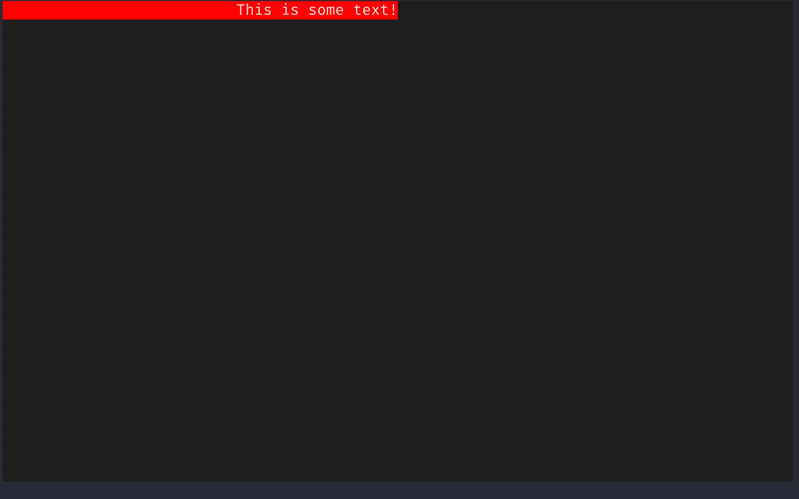


## Hot reloading

After having installed `textual-dev`, you got access to a command `textual` that has a subcommand `run`.
The command `textual run` can be used to run your Textual applications as per usual.
However, if you run the command `textual run --dev`, then you are running your application in development mode, which enables a very useful feature when you are using Textual CSS:
hot reloading.

If you run your application with `textual run --dev app_file.py`, if you make changes to the CSS file, and if you save the CSS file, the changes should take effect in the app without having to restart the app.
This is very convenient.

To try this out, run the app from before and change the background colours to `blue` or `green`, for example, or perhaps try different percentages for the value of `width`.

The GIF below shows some of these changes.


## Basic selectors

To learn more about selectors, we'll start by defining an app with some labels:

```py
from textual.app import App
from textual.widgets import Label


class MyApp(App):
    CSS_PATH = "label_css.css"

    def compose(self):
        yield Label("Plain.")
        yield Label("With a class", classes="blue_bg")
        yield Label("With an id", classes="blue_bg", id="label")


MyApp().run()
```

Notice the two keyword parameters used for the last two labels.
Now, paste the CSS below into the file `label_css.css` and run your app with hot reloading.

```sass
Label {
    background: red;
}
```

Running the app, the three labels should have a red background.


### Type selectors

The word `Label` in the CSS file is a CSS selector that targets all widgets that are instances of `Label`.
In our app, that's the three widgets there.
Keep in mind that such a selector targets all widgets that are of the type `Label` or that inherited from `Label`.
So, for example, `Label` in the CSS file could be replaced by `Widget`, which will target the 3 labels (because they are widgets) but also the whole screen!

Fix this by changing it back to `Label`.


### Class selectors

In Textual, we can use the parameter `classes` when creating a widget to add information to it regarding how it should be styled.
The same CSS class can be applied across different widgets of different types, which can help ensure a consistent look across your app.

Open the CSS file and change it to include a second block:

```sass
Label {
    background: red;
}

.blue_bg {
    background: blue;
}
```

When a selector starts with a dot, it will target all widgets that contain that class.
If you save the CSS, your app should now have two labels with a blue background: the two bottom ones.
This also shows that CSS rules have different levels of precedence, and a class rule has precedence over a regular type rule.


### Identifier selectors

Finally, Textual CSS can also use a widget's identifier to target that widget specifically.
For example, if you change the CSS file to include a third block, you will see that the bottom label will now have a green background:

```sass
Label {
    background: red;
}

.blue_bg {
    background: blue;
}

#label {
    background: green;
}
```

Identifier selectors start with a `#` and take precedence over class selectors and type selectors.

With these three rules in place, the app looks like this:

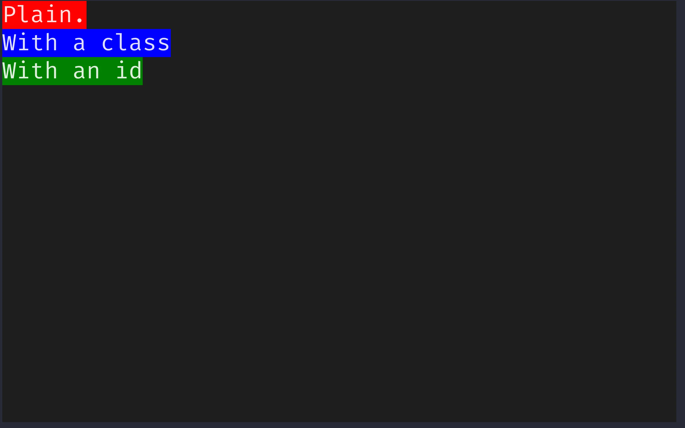


## CSS selectors in other Textual features

CSS selectors are used by other Textual features.
For example, we already saw that the decorator `on` uses selectors to further filter when to use certain message handlers.
I just didn't tell you explicitly we were using CSS selectors.

Another feature you are learning next, [querying](#querying), also uses CSS selectors.


## Combining selectors

Selectors can be further combined to target more specific widgets:

 - selectors separated by spaces indicate nesting, for example `Horizontal Label` selects all labels that are nested inside a container `Horizontal`;
 - selectors separated `>` indicate _immediate_ nesting, for example, `Horizontal > Label` selects all labels that are nested directly inside a container `Horizontal`;
 - selectors that are concatenated together select widgets that match all of those selectors, for example, `Label.blue_bg` will select all labels that also have the class `blue_bg`.

```sass
Horizontal Label {
    /* all labels that are nested inside a container `Horizontal`. */
    background: red;
}

Horizontal > Label {
    /* all labels that are nested directly inside a container `Horizontal`. */
    background: green;
}

Label.blue_bg {
    /* all labels that also have the class `blue_bg`. */
    background: blue;
}
```


# Querying

Querying is a way in which you can access your app's widgets from within other methods.
You can access a single widget or you can access a group of (related) widgets and then work on those.


## Single-result queries

We can consider a simple app that asks the user for its name:

```py
from textual.app import App
from textual.widgets import Button, Header, Input


class MyApp(App):
    def compose(self):
        yield Header(show_clock=True)
        yield Input(placeholder="Name:")
        yield Button("Submit")


MyApp().run()
```

Now, we want to implement the `Button.Pressed` handler so that the app creates a label with the user name.
Because the application has a single widget `Input`, we can use the method `query_one` to fetch it.
The method `query_one` accepts a CSS selector.

After accessing the widget `Input` with `query_one(Input)`, we can use the attribute `value` to get access to the text written inside the field.
Like so:

```py
from textual.app import App
from textual.widgets import Button, Header, Input, Label


class MyApp(App):
    def compose(self):
        yield Header(show_clock=True)
        yield Input(placeholder="Name:")
        yield Button("Submit")

    def on_button_pressed(self):
        name = self.query_one(Input).value
        self.mount(Label(name))


MyApp().run()
```

If you run the app, type your name inside the input field, and then click the button, the name you typed shows up in a new label under the button:

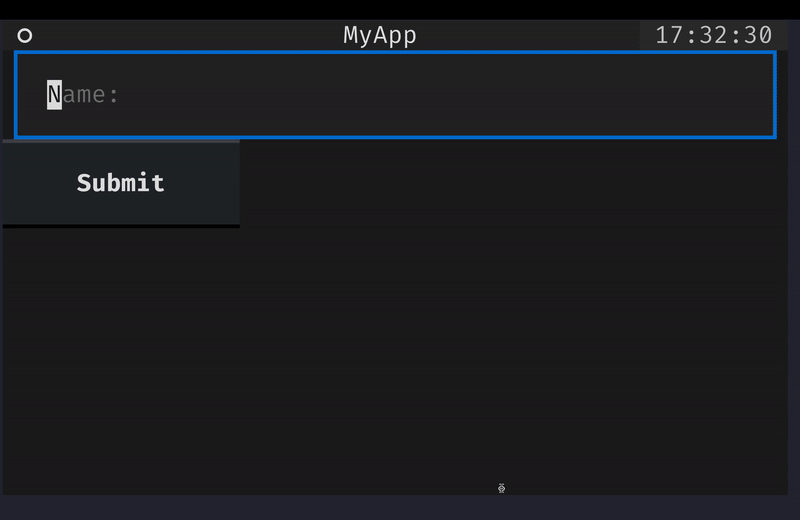

Querying a single widget and saving an explicit reference to that widget before composing it are typically two orthogonal approaches to managing widget interactions.
So far, we had been saving explicit references to all widgets we cared about as class variables.
Now, you can get to them with `query_one`.


## Querying multiple widgets

Sometimes, your application will have more than one widget that matches the query.
When that is the case, using `query_one` will raise an error.
That happens because `query_one` expects exactly one widget in the app to match the selector given.

In all other cases you must use the method `query`.
This method returns an iterable with all the results.
On top of allowing iteration, the result of a query provides some useful methods to interact with all the results.
For example, the methods `first` and `last` can be used to access the first and last widgets that matched the query, respectively.

Here, we modified the previous app to include one more `Input` and then use `query` to access all inputs and their values:

```py
from textual.app import App
from textual.widgets import Button, Header, Input, Label


class MyApp(App):
    def compose(self):
        yield Header(show_clock=True)
        yield Input(placeholder="Name:")
        yield Input(placeholder="Surname:")
        yield Button("Submit")

    def on_button_pressed(self):
        data = " ".join(input.value for input in self.query(Input))
        self.mount(Label(data))


MyApp().run()
```


# Workers

Workers are a life-changing feature that you will want to use for any app that uses some form of concurrency.
In complex apps that interact with many external APIs, you will probably want to use workers.


## The issue

There are also simpler cases where workers are really useful, for example when loading lots of data into your app.
If you are not careful, you might write a loading method that _blocks_ the interface while it is loading, which will make it look like it froze!

We're talking about this here for precisely the same reason.
While it is unlikely that you will add enough TODO items to your app that loading them would take more than a split second, the type of application lends itself nicely to this pattern and so I will take this opportunity to show it.

Consider the application below that reads a file and creates a label for each line on the fly:

```py
# import time

from textual.app import App
from textual.widgets import Button, Input, Label


class MyApp(App):
    def compose(self):
        yield Input(placeholder="filepath")
        yield Button("Load!")

    def on_button_pressed(self):
        filepath = self.query_one(Input).value
        self.load_data(filepath)

    def load_data(self, filepath):
        with open(filepath, "r") as f:
            for line in f:
                # time.sleep(2)
                self.mount(Label(line.strip()))


MyApp().run()
```

If the file being read is too big, there might be a significant amount of time during which nothing seems to happen in the application.
What is more, you won't even be able to interact with the input field or the other widgets.

To see this in action, it suffices to add a call to `time.sleep(2)` inside the loop `for line in f:` and you will see the app frozen.


## The decorator `work`

The decorator `work` will use a thread to circumvent this problem.
While the details of the inner workings are beyond my knowledge right now, I can tell you that fixing our loading is trivial:

```py
# import time

from textual import work
from textual.app import App
from textual.widgets import Button, Input, Label


class MyApp(App):
    def compose(self):
        yield Input(placeholder="filepath")
        yield Button("Load!")

    def on_button_pressed(self):
        filepath = self.query_one(Input).value
        self.load_data(filepath)

    @work
    def load_data(self, filepath):
        with open(filepath, "r") as f:
            for line in f:
                # time.sleep(2)
                self.call_from_thread(self.mount, Label(line.strip()))


MyApp().run()
```

We only needed to make two changes:

 1. we added the decorator `work` around the method that we want to not block the interface; and
 2. we started using the method `self.call_from_thread` instead of calling the method `self.mount` directly.

That's because most Textual methods aren't thread safe, so we need to use `self.call_from_thread` to schedule the method calls.

Even with the calls to `sleep`, the app above shouldn't block.
You should be able to interact with it while the application loads the file you pointed to.
The animation below shows this.
While there are two second intervals between each new label appearance, the remainder of the application remains responsive:

 - the button style changes when I hover it;
 - the input is still focusable; and
 - I can edit the contents of the input.

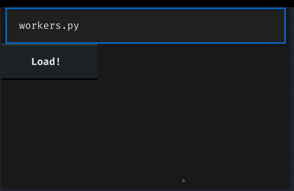


# `on_mount`

Still thinking about the same problem, there will be times where you want to trigger a load action “as soon as possible” without the user having to intervene.
When that is the case, you will likely want to consider using the handler method `on_mount`.

When an app, a screen, or a widget is composed, that widget will receive a built-in event called `Mount`.
Thus, inside the handler `on_mount` is the earliest moment at which you know the widget was already put on the screen.

In an example similar to the previous one, if your data comes from a fixed source (for example, a specific file), you can call the load method from inside `on_mount`:

```py
# import time

from textual import work
from textual.app import App
from textual.widgets import Label


class MyApp(App):
    def on_mount(self):
        self.load_data()

    @work
    def load_data(self):
        with open("path/to/data", "r") as f:
            for line in f:
                # time.sleep(2)
                self.call_from_thread(self.mount, Label(line.strip()))


MyApp().run()
```

This is _usually_ better than loading the data inside `__init__`, for example, because when something is initialised it doesn't mean it will be composed anytime soon, so we might be wasting resources if we start loading the data right away.


# Finish your TODO app

This was the third and final stretch, where you learned about features such as Textual CSS, hot reloading, querying, workers, and the event `Mount`.
Now, I'd like you to use this knowledge to polish your TODO app:

 - add data persistence to your app (keep it simple, like a JSON file or something of the sort); and
 - style your app to make it look as awesome as you can.

In case you are not very imaginative, you _can_ try to make your app look like mine, which I show below.

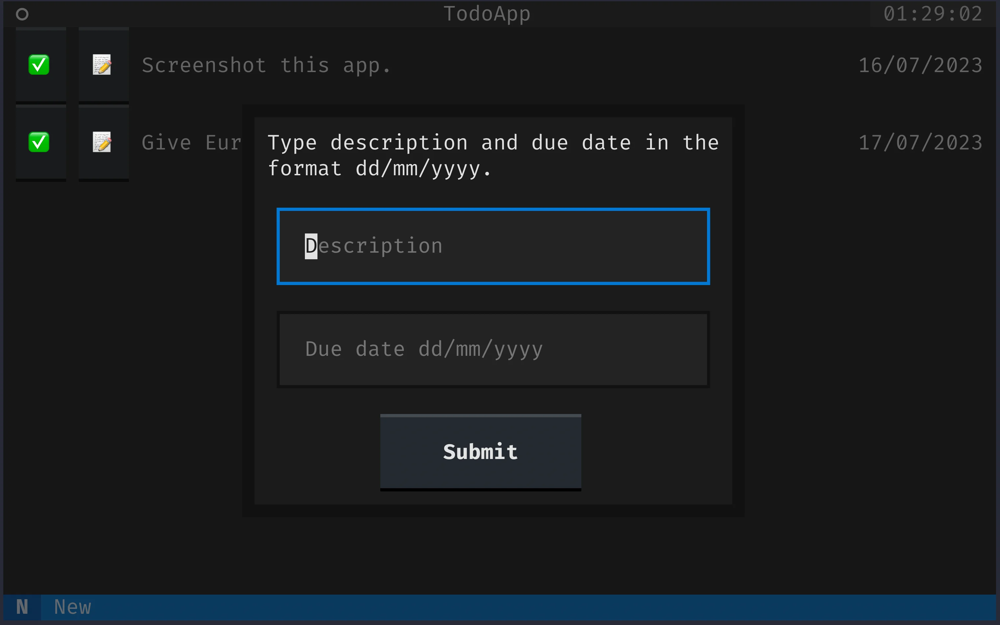

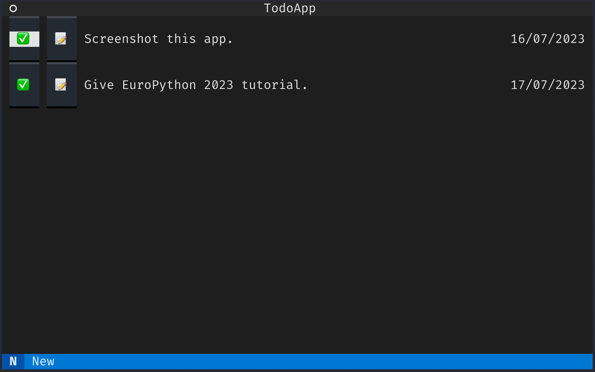

!!! To make such short buttons, you will want to look at the style `min-width`.
!!! `Button` sets a default value of `16`, so you'll want to overwrite that with a smaller value.

!!! To style the modal screen, it may also help to put all of the widgets inside a plain `textual.containers.Container`.


# Final code

The final code for the app amounts to 130 lines of awesomeness:

```py
from functools import partial
import json

from textual import on, work
from textual.app import App
from textual.containers import Center, Container, Horizontal
from textual.message import Message
from textual.reactive import reactive
from textual.screen import ModalScreen
from textual.widget import Widget
from textual.widgets import Button, Footer, Header, Input, Label


class TodoItemDetailsScreen(ModalScreen):
    DEFAULT_CSS = """
    TodoItemDetailsScreen {
        align: center middle;
    }
    """

    def compose(self):
        self.description_input = Input(placeholder="Description")
        self.date_input = Input(placeholder="Due date dd/mm/yyyy")
        with Container():
            yield Label("Type description and due date in the format dd/mm/yyyy.")
            yield self.description_input
            yield self.date_input
            with Center():
                yield Button("Submit")

    def on_button_pressed(self):
        data = (self.description_input.value, self.date_input.value)
        self.dismiss(data)


class TodoItem(Widget):
    DEFAULT_CSS = """
    TodoItem {
        height: 2;
    }
    """

    description = reactive("")
    date = reactive("")

    class Edit(Message):
        def __init__(self, item):
            super().__init__()
            self.item = item

    class Delete(Message):
        def __init__(self, item):
            super().__init__()
            self.item = item

    def __init__(self):
        super().__init__()
        self.description_label = Label(id="description")
        self.date_label = Label(id="date")

    def compose(self):
        with Horizontal():
            yield Button("✅", classes="emoji-button", id="done")
            yield Button("📝", classes="emoji-button", id="edit")
            yield self.description_label
            yield self.date_label

    def watch_description(self, description):
        self.description_label.update(description)

    def watch_date(self, date):
        self.date_label.update(date)

    @on(Button.Pressed, "#edit")
    def edit_request(self):
        self.post_message(self.Edit(self))

    @on(Button.Pressed, "#delete")
    def delete_request(self):
        self.post_message(self.Delete(self))


class TodoApp(App):
    BINDINGS = [("n", "new_item", "New")]

    CSS_PATH = "todo.css"

    def compose(self):
        yield Header(show_clock=True)
        yield Footer()

    def on_mount(self):
        self.load_data()

    def action_new_item(self):
        self.push_screen(TodoItemDetailsScreen(), self.new_item_callback)

    def new_item_callback(self, data):
        item = TodoItem()
        description, date = data
        item.description = description
        item.date = date
        self.mount(item)

    def edit_item_callback(self, item, data):
        description, date = data
        item.description = description
        item.date = date

    def on_todo_item_delete(self, message):
        message.item.remove()

    def on_todo_item_edit(self, message):
        self.push_screen(
            TodoItemDetailsScreen(), partial(self.edit_item_callback, message.item)
        )

    @work
    def save_data(self):
        to_dump = [(item.description, item.date) for item in self.query(TodoItem)]
        with open("data.json", "w") as f:
            json.dump(to_dump, f, indent=4)

    @work
    def load_data(self):
        with open("data.json", "r") as f:
            loaded = json.load(f)
        for description, date in loaded:
            item = TodoItem()
            item.description = description
            item.date = date
            self.call_from_thread(self.mount, item)


TodoApp().run()
```

As for the CSS, this is what I have:

```sass
TodoItem > Horizontal > Label {
    width: 1fr;
    height: 1fr;
    content-align: left middle;
}

TodoItem > Horizontal > #date {
    width: 10;
}

TodoItem > Horizontal > * {
    margin: 0 1;
}

TodoItem {
    align: center middle;
    height: 3;
}

TodoItemDetailsScreen {
    align: center middle;
}

TodoItemDetailsScreen > Container > Label {
    width: 100%;
    padding-left: 1;
    padding-right: 1;
}

TodoItemDetailsScreen > Container > Input {
    margin: 1
}

TodoItemDetailsScreen > Container {
    border: thick $background;
    background: $boost;
    width: 50%;
    height: auto;
}

.emoji-button {
    min-width: 4;
    width: 4;
    content-align: center middle;
}
```


# Further challenges

To conclude this tutorial, I'd like to leave you with a couple more challenges for you to tackle.
None of these are extremely difficult from the technical point of view, but they will require some thinking and you will also probably have to look around in the documentation for missing pieces of the puzzle.

 - Auto-fill the modal screen when you are editing a TODO item;
 - Validate the date before dismissing the modal to prevent bad dates;
 - Use <kbd>Esc</kbd> to dismiss modal screen, which should revert changes if you were editing an item and simply do nothing if you were creating a new item;
 - Sort items by due date; and
 - Add a separate tab where you keep all the items that have been completed already.

Take a crack at this and then let me know how you get on!
You can share your progress, and eventually get some help, in the [Textual Discord][textual-discord]!


[list-comps]: /blog/pydonts/list-comprehensions-101
[textual]: https://textual.textualize.io
[ep-tutorial]: https://ep2023.europython.eu/session/build-a-terminal-todo-app-with-textual
[textual-discord]: https://discord.gg/Enf6Z3qhVr
[dunder-init]: /blog/object-initialisation-with-__init__

[textual-docs]: https://textual.textualize.io
[textual-widget-gallery]: https://textual.textualize.io/widget_gallery/
[textual-widgets]: https://textual.textualize.io/widgets/
[textual-styles-reference]: https://textual.textualize.io/styles/
