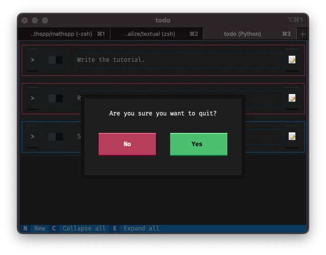
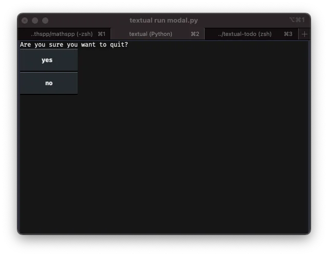
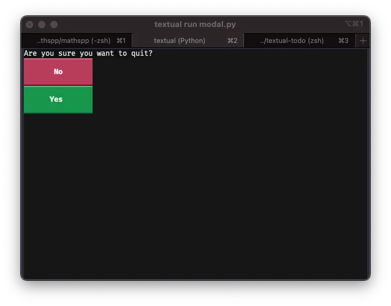
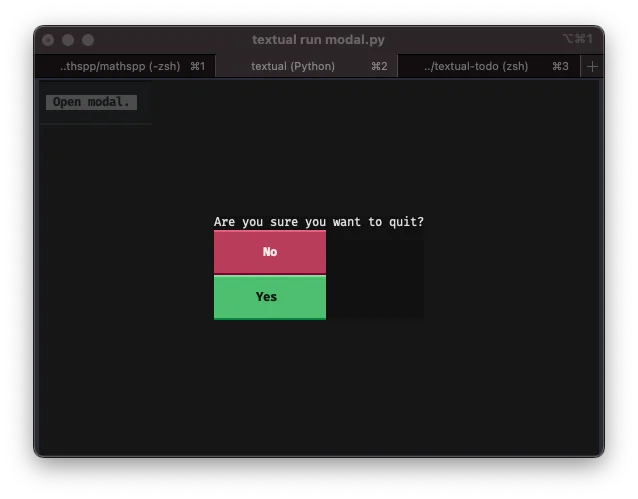
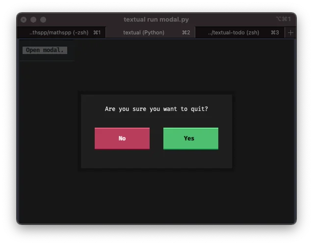
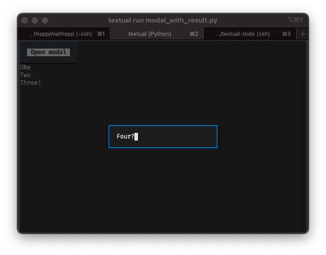

This is a short tutorial on how to use modal screens with Textual.

===


! This tutorial was written with/for [Textual] 0.24.1.

## Introduction

This short tutorial will teach you how to use modal screens in [Textual].

A modal screen is a screen that is typically used for a quick interaction with the user before going back to the main application.

As a quick example, here is [my TODO app][todo-blog] showing a modal to confirm exiting the app:




## Building a modal screen

### Inheriting from `ModalScreen`

The first modal screen we will build is the exit screen from the demo above.
A modal screen needs to inherit from `ModalScreen`, so that is the first thing we need to do:

```py
from textual.screen import ModalScreen


class ExitScreen(ModalScreen):
    """A modal exit screen."""
```


### Composing the screen

Next, we need to compose the children widgets that we will need in this screen.
We need a label and two buttons, so let us yield them:

```py
from textual.app import ComposeResult
from textual.screen import ModalScreen
from textual.widgets import Button, Label


class ExitScreen(ModalScreen):
    """A modal exit screen."""

    def compose(self) -> ComposeResult:
        yield Label("Are you sure you want to quit?")
        yield Button("no")
        yield Button("yes")
```

Now, in order to be able to see this modal screen, we can whip up a dummy app whose only job is to open this modal screen:

```py
from textual.app import App, ComposeResult

...

class DummyApp(App[None]):
    def compose(self) -> ComposeResult:
        yield Button("Open modal.")

    def on_button_pressed(self) -> None:
        self.push_screen(ExitScreen())


app = DummyApp()
if __name__ == "__main__":
    app.run()
```

This already runs, although it doesn't do much:




### Wiring up the modal

A modal screen is just like a regular screen in terms of its functioning, so we can wire the buttons in the usual way:

 - we will change their variants (to add some styling);
 - we will add an ID to each button to be able to distinguish which button was pressed; and
 - we will act accordingly to the button pressed:
   - if the button pressed was “Yes”, we exit the app; and
   - if the button pressed was “No”, we go back to the app.

First, we change the buttons:

```py
...

class ExitScreen(ModalScreen):
    """A modal exit screen."""

    def compose(self) -> ComposeResult:
        yield Label("Are you sure you want to quit?")
        yield Button("No", id="yes", variant="error")
        yield Button("Yes", id="no", variant="success")

...
```

Now, we can add handlers for each button press.
Using the new [`@on` decorator][textual-docs-on], this is straightforward:

```py
from textual import on
...

class ExitScreen(ModalScreen):
    ...

    @on(Button.Pressed, "#yes")
    def exit_app(self) -> None:
        self.app.exit()

    @on(Button.Pressed, "#no")
    def back_to_app(self) -> None:
        self.app.pop_screen()

...
```

Now, our modal screen works _although_ it does _not_ look like a modal screen:



We will style the screen next.


### Styling the modal screen

#### Make it look like a modal

The first thing we will do is make the modal screen _look_ like a modal screen.
To do this, we will wrap all the children of the modal screen in a container so that we can align them in the middle of the modal screen.

By making the container have auto dimensions, we will leave “empty” space in the modal's background that will then get the default transparency style to show the screen that is “under” the modal:

```py
...
from textual.containers import Container


class ExitScreen(ModalScreen):
    """A modal exit screen."""

    DEFAULT_CSS = """
    ExitScreen {
        align: center middle;
    }

    ExitScreen > Container {
        width: auto;
        height: auto;
    }
    """

    def compose(self) -> ComposeResult:
        with Container():
            yield Label("Are you sure you want to quit?")
            yield Button("No", id="no", variant="error")
            yield Button("Yes", id="yes", variant="success")

...
```

This is enough to allow us to see the background screen through the modal:



Now, with a horizontal container and some CSS, we can tidy up the modal screen a bit more:

```py
...
from textual.containers import Container, Horizontal


class ExitScreen(ModalScreen):
    """A modal exit screen."""

    DEFAULT_CSS = """
    ExitScreen {
        align: center middle;
    }

    ExitScreen > Container {
        width: auto;
        height: auto;
        border: thick $background 80%;
        background: $surface;
    }

    ExitScreen > Container > Label {
        width: 100%;
        content-align-horizontal: center;
        margin-top: 1;
    }

    ExitScreen > Container > Horizontal {
        width: auto;
        height: auto;
    }

    ExitScreen > Container > Horizontal > Button {
        margin: 2 4;
    }
    """

    def compose(self) -> ComposeResult:
        with Container():
            yield Label("Are you sure you want to quit?")
            with Horizontal():
                yield Button("No", id="no", variant="error")
                yield Button("Yes", id="yes", variant="success")

...
```

This creates a modal screen that looks like this:



This already looks quite good!


#### Styling tip

When you are writing CSS for your apps, screens, components, etc, my suggestion is that you always use the [live editing][textual-docs-live-editing] features of Textual.

In the above, I just added the CSS into the attribute `DEFAULT_CSS` because I already knew what CSS I wanted to add.


## Getting a result from a modal

### Creating the modal

Now that we have seen how to create a modal, I will show you how to get a result back from the modal.
For example, if your modal asks for some user input, how can you get that input back?

Like applications, screens are generics and can be typed with the type of their result.
If we are creating a modal that asks for user input, our modal will return a string:

```py
class InputModal(ModalScreen[str]):
    ...
```

This is what our input modal will look like:

```py
from textual.containers import Container
from textual.screen import ModalScreen
from textual.widgets import Input


class InputModal(ModalScreen[str]):
    DEFAULT_CSS = """
    InputModal {
        align: center middle;
    }

    InputModal > Container {
        width: auto;
        height: auto;
    }

    InputModal > Container > Input {
        width: 32;
    }
    """

    def compose(self) -> ComposeResult:
        with Container():
            yield Input()
```

Now, we create a dummy app that fires up the modal screen:

```py
from textual.app import App, ComposeResult
from textual.containers import Container
from textual.screen import ModalScreen
from textual.widgets import Button, Input, TextLog


class InputModal(ModalScreen[str]):
    ...


class DummyApp(App[None]):
    CSS = """
    TextLog {
        height: 1fr;
    }
    """

    def compose(self) -> ComposeResult:
        yield Button("Open modal")
        yield TextLog()

    def on_button_pressed(self) -> None:
        self.push_screen(InputModal())


app = DummyApp()
if __name__ == "__main__":
    app.run()
```

Now we can answer the question: how can we get the input value back?


### Dismissing a modal with a result

To get a result out of a modal screen, we need to call the method `dismiss` with the result as an argument.
We want to do this when the input is submitted, so we can do it in an event handler:

```py
class InputModal(ModalScreen[str]):
    ...

    def on_input_submitted(self) -> None:
        #    vvvvvvv dismiss the modal screen;
        self.dismiss(self.query_one(Input).value)
        # with this  ^^^^^^^^^^^^^^^^^^^^^^^^^^^ result value.
```

Try your app at this point.
Open the model, writing something, and then press <kbd>Enter</kbd>.
This will close your modal screen but it won't do anything with the result.


### Handling a modal result with a callback

To _handle_ the result of the modal screen, we need to pass a callback when we push the modal screen in the first place.
For our dummy app, let us write the input value to the text log, so we can write a callback that accepts the result string and writes it:

```py
class DummyApp(App[None]):
    ...

    def on_button_pressed(self) -> None:
        # Note the extra argument here vvvvvvvvvvvvvvvvvvvvvvvvv
        self.push_screen(InputModal(), self.input_modal_callback)

    def input_modal_callback(self, result: str) -> None:
        """Handle the modal result by writing it to the TextLog."""
        self.query_one(TextLog).write(result)
```

Alternatively, we could have passed the `write` method of the `TextLog` directly to the `push_screen` method:


```py
class DummyApp(App[None]):
    ...

    def on_button_pressed(self) -> None:
        self.push_screen(InputModal(), self.query_one(TextLog).write)
```

If you open your app, open the modal, write something, and then press <kbd>Enter</kbd>, what you wrote should end up in the text log!
You can do this as many times as you want:




## Conclusion

This short tutorial showed you how to use modal screens, how to create them and dismiss them, and how to get results back into the app.

If you have any questions, feel free to join the [Textual Discord server][textual-discord] where you will find many people that are willing to help!
As usual, you can also just leave a comment below!

See you around.

! This tutorial was written with/for [Textual] 0.24.1.


[todo-blog]: /blog/textual-tutorial-build-a-todo-app-in-python
[textual-docs-on]: https://textual.textualize.io/guide/events/#on-decorator
[textual]: https://textual.textualize.io
[textual-docs-live-editing]: https://textual.textualize.io/guide/devtools/#live-editing
[textual-discord]: https://discord.gg/Enf6Z3qhVr
