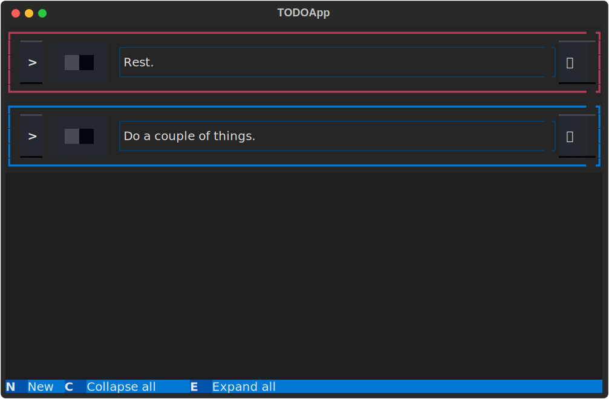
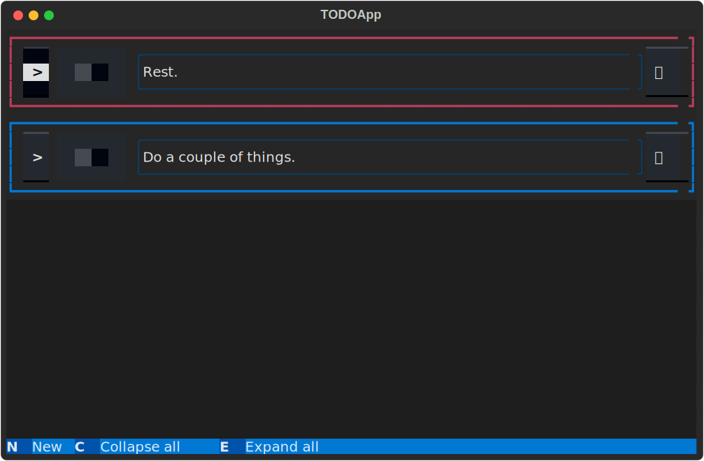

Learn how to build a simple TODO app in Python with this step-by-step Textual tutorial.

===


# Introduction

In this tutorial, I will show you to build a TODO app with [Textual], a Python framework for terminal user interfaces.
The TODO app will look like this:


This tutorial was based on [a PR I made for the Textual documentation][closed-pr], which was eventually was closed and not merged.
Instead of letting all my work go to waste, I revised the contents of the PR and I am sharing it here with you.

In case you don't know what Textual is, go ahead and read the description below.
Otherwise, let's get building!


## What is Textual?

[Textual] is a Python framework that lets users build applications that run directly in the terminal.
Quoting the [Textual] website, some of the advantages of using Textual to build applications include:

 - Rapid development: you can use your existing Python skills to build a beautiful user interface.
 You don't need to learn new languages to write user interfaces.
 - Low requirements: you can run Textual on a single board computer if you want to.
 - Cross-platform: Textual runs just about everywhere you can run Python.
 - Remote: Textual apps can run over SSH.
 - CLI integration: Textual apps can be launched and run from the command prompt.
 - Open source: Textual is licensed under MIT.


## Get the code

The code for this app can be found in the [textual-todo GitHub repository][textual-todo].
Feel free to star the repository and fork it to play around with the code.


## Getting up to speed

This tutorial assumes you already know the _essentials_ about Textual.
If you are a complete newcomer to Textual, I recommend you take a look at the [Textual tutorial][textual-tutorial] before diving into this article.
The Textual tutorial should teach you everything you need to follow along with this one! 😉


# TODO app architecture

Our TODO app will have the following features:

 - add arbitrarily many new TODO items;
 - set and edit a description of the TODO item;
 - set and edit the due date for each item;
 - items colour-coded by whether the item is late, on time, or only due in the future;
 - items are sorted automatically by due date;
 - long item descriptions are collapsible;
 - mark items as done; and
 - persistence of TODO items across runs.

The starting point for this application is going to be a custom compound widget.
A compound widget is a custom widget that is implemented by combining multiple other widgets.

We will start by building an editable text widget that shows some text and then contains two buttons:
one lets us edit the text and the other confirms the changes we made to the text.
We will use this simpler compound widget to illustrate the points made above.

Then, we will subclass that widget to create a more specialised editable text widget that is specifically used for dates.

Finally, we will use both those widgets to build yet another compound widget which will be the main building block of the TODO tracking app.

So, we will build:

 - a custom `EditableText` widget that displays text which can be edited with the click of a button;
 - a custom `DatePicker` widget that is just like an `EditableText`, but specialised for dates; and
 - a custom `TodoItem` widget that combines both to form a single TODO item in our app.

Our TODO app will build on top of these widgets.


# `EditableText`

## Structuring your compound widget

The `EditableText` widget is a widget that contains a label to display text.
If the "edit" button is pressed, the label is switched out and the user sees an input field to edit the text.
When the "confirm" button is pressed, the label comes back into view to display the new text.

Taking this into account, the widget `EditableText` will need to yield the following sub-widgets in its `compose` method:

 - a `Label` to display the text;
 - an `Input` to allow editing of the text;
 - a `Button` to switch to editing mode; and
 - a `Button` to switch to display mode.

Below, you can find the skeleton for our widget `EditableText`.
We inherit from `Static`, instead of from `Widget`, because `Static` does some extra work for us, like caching the rendering.

```py
# editabletext.py
from textual.app import App, ComposeResult
from textual.widgets import Button, Input, Label, Static


class EditableText(Static):
    """Custom widget to show (editable) static text."""

    def compose(self) -> ComposeResult:
        yield Label()
        yield Input()
        yield Button()
        yield Button()


class EditableTextApp(App[None]):
    def compose(self) -> ComposeResult:
        yield EditableText()


app = EditableTextApp()


if __name__ == "__main__":
    app.run()
```

Running this app produces the following output:


!!! Textual apps provide the method `app.save_screenshot` that makes it **very** convenient to create SVG screenshots of your apps.
!!! That is what I used to generate all the outputs you will see in this tutorial.


## Enabling the styling of your compound widget

When you create a compound widget, and especially if you have reusability in mind, you need to set up your widget in such a way that it can be styled by users.
This may entail documenting well the specific widgets that make up your compound widget or it may include using semantic classes that identify the purpose of the sub-widgets.

In this tutorial, we will add classes to each sub-widget that identify the purpose of each sub-widget.
There is an added advantage of using classes to identify the components of our compound widget, and that has to do with the fact that you don't have to commit to using a specific class for a specific sub-widget/functionality.

On top of adding classes that identify the purpose of each sub-widget, we will also use a class to hide either the input or the label, depending on whether we are currently editing or displaying text.

After adding the classes to our widgets, we can style them.

After adding a couple of semantic classes and setting the class variable `DEFAULT_CSS`, `EditableText` looks like this:

```py
# editabletext.py
from textual.app import App, ComposeResult
from textual.widgets import Button, Input, Label, Static


class EditableText(Static):
    """Custom widget to show (editable) static text."""

    DEFAULT_CSS = """
    EditableText {
        layout: horizontal;
        width: 1fr;
        height: 3;
    }

    .editabletext--input {
        width: 1fr;
    }

    .editabletext--label {
        width: 1fr;
        height: 3;
        padding-left: 2;
        border: round $primary;
    }

    .editabletext--edit {
        box-sizing: border-box;
        min-width: 0;
        width: 4;
    }

    .editabletext--confirm {
        box-sizing: border-box;
        min-width: 0;
        width: 4;
    }

    EditableText .ethidden {
        display: none;
    }
    """

    def compose(self) -> ComposeResult:
        yield Input(
            placeholder="Type something...", classes="editabletext--input ethidden"
        )
        yield Label("", classes="editabletext--label")
        yield Button("📝", classes="editabletext--edit")
        yield Button("✅", classes="editabletext--confirm ethidden")


class EditableTextApp(App[None]):
    def compose(self) -> ComposeResult:
        yield EditableText()


app = EditableTextApp()


if __name__ == "__main__":
    app.run()
```

!!! The classes have verbose names, like `editabletext--input`, to minimise the risk of name clashing in larger applications.
!!! The same applies to the class `ethidden` that is used to control whether the input or the label is being shown and to control which button is displayed.

Running this example will generate output that is significantly different from last time:


## Wiring the components together

We have our four components laid out and styled but we still need to wire them in order to implement the kind of behaviour we want.

To that end, we will do the following modifications:

 - save the sub-widgets as attributes for easier retrieval later;
 - implement a property `is_editing` to determine whether we are in editing mode or not;
 - implement a handler for button presses; and
 - switch between editing and display modes when the buttons are pressed through two methods `switch_to_editing_mode` and `switch_to_display_mode`.

The modified code looks like this:

```py
# editabletext.py
from textual.app import App, ComposeResult
from textual.widgets import Button, Input, Label, Static


class EditableText(Static):
    """Custom widget to show (editable) static text."""

    DEFAULT_CSS = """
    EditableText {
        layout: horizontal;
        width: 1fr;
        height: 3;
    }

    .editabletext--input {
        width: 1fr;
    }

    .editabletext--label {
        width: 1fr;
        height: 3;
        padding-left: 2;
        border: round $primary;
    }

    .editabletext--edit {
        box-sizing: border-box;
        min-width: 0;
        width: 4;
    }

    .editabletext--confirm {
        box-sizing: border-box;
        min-width: 0;
        width: 4;
    }

    EditableText .ethidden {
        display: none;
    }
    """

    _confirm_button: Button
    """The button to confirm changes to the text."""
    _edit_button: Button
    """The button to start editing the text."""
    _input: Input
    """The field that allows editing text."""
    _label: Label
    """The label that displays the text."""

    def compose(self) -> ComposeResult:
        self._input = Input(
            placeholder="Type something...", classes="editabletext--input ethidden"
        )
        self._label = Label("", classes="editabletext--label")
        self._edit_button = Button("📝", classes="editabletext--edit")
        self._confirm_button = Button(
            "✅", classes="editabletext--confirm ethidden", disabled=True
        )

        yield self._input
        yield self._label
        yield self._edit_button
        yield self._confirm_button

    @property
    def is_editing(self) -> bool:  # The property `is_editing` checks if the internal `Input` widget is being shown or not.
        """Is the text being edited?"""
        return not self._input.has_class("ethidden")

    def on_button_pressed(self) -> None:  # When we press the edit/confirm button, we check in which mode we are in and switch to the other one.
        if self.is_editing:
            self.switch_to_display_mode()
        else:
            self.switch_to_editing_mode()

    def switch_to_editing_mode(self) -> None:
        if self.is_editing:
            return

        self._input.value = str(self._label.renderable)

        self._label.add_class("ethidden")
        self._input.remove_class("ethidden")

        self._edit_button.disabled = True
        self._edit_button.add_class("ethidden")
        self._confirm_button.disabled = False
        self._confirm_button.remove_class("ethidden")

    def switch_to_display_mode(self) -> None:
        if not self.is_editing:
            return

        self._label.renderable = self._input.value

        self._input.add_class("ethidden")
        self._label.remove_class("ethidden")

        self._confirm_button.disabled = True
        self._confirm_button.add_class("ethidden")
        self._edit_button.disabled = False
        self._edit_button.remove_class("ethidden")


class EditableTextApp(App[None]):
    def compose(self) -> ComposeResult:
        yield EditableText()


app = EditableTextApp()


if __name__ == "__main__":
    app.run()
```

We implement the button handler in terms of two auxiliary methods because those two methods will provide the interface for users to programmatically change the mode the widget is in.

!!! When creating a compound widget, use methods to add the ability for the users (for example, in apps) to control the compound widget programmatically.

If you run this code, you get the same output.
However, this time, if you press the “edit” button the widget goes into edit mode and the `Input` is enabled.
Here is what that looks like:


## Communicating with the compound widget

When you need to communicate with the compound widget, for example, to manipulate its state, you should try to do that through methods or reactive attributes documented for that effect.

Thus, when you are implementing a compound widget, you need to think of the methods that the user will need because we don't want users to mess with the internals of the compound widget.

In our `EditableText` example, we have two "public" methods that users are welcome to use: `switch_to_display_mode` and `switch_to_edit_mode`.

For an example use case, we will create a small app that uses some `EditableText` widgets and we will use `switch_to_edit_mode` to ensure all `EditableText` instances are ready to be edited when the app launches:

```py
# name_app.py
from textual.app import App, ComposeResult
from textual.widgets import Label

from editabletext import EditableText


class NameApp(App[None]):
    def compose(self) -> ComposeResult:
        yield Label("First name")
        yield EditableText()
        yield Label("Last name")
        yield EditableText()
        yield Label("Preferred name")
        yield EditableText()

    def on_mount(self) -> None:
        for editable_text in self.query(EditableText):
            editable_text.switch_to_editing_mode()  # Set all EditableTexts to edit mode.


app = NameApp()


if __name__ == "__main__":
    app.run()
```

As you can see, the app above uses the “public method” `switch_to_editing_mode` to switch all `EditableText` widgets to edit mode.
As a result, running this app will show the three `EditableText` widgets in edit mode:


In the output above, you know the three `EditableText` widgets are in edit mode because you can see the placeholder text in the internal `Input` widgets and because the button that is being shown is the emoji ✅ to confirm changes.


## Posting custom messages

A compound widget provides public methods and (reactive) attributes for the user to interact with it.
In the reverse direction, for the compound widget to interact with the user, it must define and post custom messages.
In the case of our widget `EditableText`, those messages will be:

 - `EditableText.Display`, posted when the widget switches into display mode; and
 - `EditableText.Edit`, posted when the widget switches into edit mode.

Furthermore, when handling the message `Button.Pressed` from the sub-widget `Button`, we need to use the method `.stop` to prevent it from bubbling.
If we do not, app implementers may inadvertently handle button presses that are internal to the widget `EditableText`.

This is the final change we will make to the widget `EditableText`:

```py
from __future__ import annotations

from textual.app import App, ComposeResult
from textual.message import Message
from textual.widgets import Button, Input, Label, Static


class EditableText(Static):
    """Custom widget to show (editable) static text."""

    DEFAULT_CSS = """
    EditableText {
        layout: horizontal;
        width: 1fr;
        height: 3;
    }

    .editabletext--input {
        width: 1fr;
        height: 3;
    }

    .editabletext--label {
        width: 1fr;
        height: 3;
        border: round $primary;
    }

    .editabletext--edit {
        min-width: 0;
        width: 4;
    }

    .editabletext--confirm {
        min-width: 0;
        width: 4;
    }

    EditableText .ethidden {
        display: none;
    }
    """

    _confirm_button: Button
    """The button to confirm changes to the text."""
    _edit_button: Button
    """The button to start editing the text."""
    _input: Input
    """The field that allows editing text."""
    _label: Label
    """The label that displays the text."""

    class Display(Message):  # Posted when the widget switches to display mode.
        """The user switched to display mode."""

        editable_text: EditableText
        """The EditableText instance that changed into display mode."""

        def __init__(self, editable_text: EditableText) -> None:
            self.editable_text = editable_text
            super().__init__()

    class Edit(Message):  # Posted when the widget switches to edit mode.
        """The user switched to edit mode."""

        editable_text: EditableText
        """The EditableText instance that changed into edit mode."""

        def __init__(self, editable_text: EditableText) -> None:
            self.editable_text = editable_text
            super().__init__()

    def compose(self) -> ComposeResult:
        self._input = Input(
            placeholder="Type something...", classes="editabletext--input ethidden"
        )
        self._label = Label("", classes="editabletext--label")
        self._edit_button = Button("📝", classes="editabletext--edit")
        self._confirm_button = Button(
            "✅", classes="editabletext--confirm ethidden", disabled=True
        )

        yield self._input
        yield self._label
        yield self._edit_button
        yield self._confirm_button

    @property
    def is_editing(self) -> bool:
        """Is the text being edited?"""
        return not self._input.has_class("ethidden")

    def on_button_pressed(self, event: Button.Pressed) -> None:
        event.stop()  # We prevent the message `Button.Pressed` from bubbling up the DOM hierarchy.
        if self.is_editing:
            self.switch_to_display_mode()
        else:
            self.switch_to_editing_mode()

    def switch_to_editing_mode(self) -> None:
        if self.is_editing:
            return

        self._input.value = str(self._label.renderable)

        self._label.add_class("ethidden")
        self._input.remove_class("ethidden")

        self._edit_button.disabled = True
        self._edit_button.add_class("ethidden")
        self._confirm_button.disabled = False
        self._confirm_button.remove_class("ethidden")

        self.post_message(self.Edit())  # We post this so that container apps / screens can react appropriately.

    def switch_to_display_mode(self) -> None:
        if not self.is_editing:
            return

        self._label.renderable = self._input.value

        self._input.add_class("ethidden")
        self._label.remove_class("ethidden")

        self._confirm_button.disabled = True
        self._confirm_button.add_class("ethidden")
        self._edit_button.disabled = False
        self._edit_button.remove_class("ethidden")

        self.post_message(self.Display())  # We post this so that container apps / screens can react appropriately.


class EditableTextApp(App[None]):
    def compose(self) -> ComposeResult:
        yield EditableText()


app = EditableTextApp()


if __name__ == "__main__":
    app.run()
```

Now that we have custom event handling, we can extend the previous example app to include a `TextLog` that logs when our new custom messages are handled.
This is the extended version of that example:

```py
# name_app.py
from textual.app import App, ComposeResult
from textual.widgets import Label, TextLog

from editabletext import EditableText


class NameApp(App[None]):
    CSS = """
    TextLog {
        height: 1fr;
    }
    """

    def compose(self) -> ComposeResult:
        yield Label("First name")
        yield EditableText(id="first")
        yield Label("Last name")
        yield EditableText(id="last")
        yield Label("Preferred name")
        yield EditableText(id="preferred")
        yield TextLog()

    def on_mount(self) -> None:
        for editable_text in self.query(EditableText):
            editable_text.switch_to_editing_mode()

    def on_editable_text_edit(self, event: EditableText.Edit) -> None:
        self.query_one(TextLog).write(f"Editing @ {event.editable_text.id}")

    def on_editable_text_display(self, event: EditableText.Display) -> None:
        self.query_one(TextLog).write(f"Displaying @ {event.editable_text.id}")


app = NameApp()


if __name__ == "__main__":
    app.run()
```

After running the app above, typing my first name, and changing the first `EditableText` into display mode, the app looks like this:


# `DatePicker`

Now, we are going to implement a `DatePicker` widget at the expense of the widget `EditableText`, but users of the widget `DatePicker` do not need to know that.
This means that we do not want the messages `EditableText.Display` and `EditableText.Edit` to be posted when using a `DatePicker`.

In the widget `DatePicker`, we define more appropriate messages to post when the date is selected and cleared.
First, we start by providing a property `date` that parses the date text into a valid date.
Then, when we receive a message `Display` or `Edit` from the superclass (because the user started editing the date or because the user is done editing the date), we prevent it from bubbling with the method `.stop` and post our custom `DatePicker` messages instead:

```py
# datepicker.py
from __future__ import annotations

import datetime as dt

from textual.message import Message

from editabletext import EditableText


class DatePicker(EditableText):
    class DateCleared(Message):  # The message `DateCleared` is to be used when the date is edited and completely erased.
        """Posted when the date selected is cleared."""

        date_picker: DatePicker
        """The DatePicker instance that had its date cleared."""

        def __init__(self, date_picker: DatePicker) -> None:
            super().__init__()
            self.date_picker = date_picker

    class Selected(Message):  # The message `Selected` is sent when the user inputs a valid date and confirms it.
        """Posted when a valid date is selected."""

        date_picker: DatePicker
        """The DatePicker instance that had its date selected."""
        date: dt.date
        """The date that was selected."""

        def __init__(self, date_picker: DatePicker, date: dt.date) -> None:
            super().__init__()
            self.date_picker = date_picker

    # We handle the message `EditableText.Display` from the superclass to prevent it
    # from bubbling and then we post the appropriate message from `DatePicker`.
    def on_editable_text_display(self, event: EditableText.Display) -> None:
        event.stop()
        date = self.date
        if date is None:
            self.post_message(self.DateCleared(self))
        else:
            self.post_message(self.Selected(self, date))

    # We handle the message `EditableText.Edit` from the superclass to prevent it from bubbling.
    def on_editable_text_edit(self, event: EditableText.Edit) -> None:
        event.stop()

    @property
    def date(self) -> dt.date | None:
        """The date picked or None if not available."""
        try:
            return dt.datetime.strptime(self._input.value, "%d-%m-%Y").date()
        except ValueError:
            return None
```


On top of doing this custom message handling, we also:

 - modify the placeholder text in the underlying `Input` widget;
 - add a bell sound when the user tries to input a date that cannot be parsed; and
 - add a bit of default CSS to make the `DatePicker` fit around the date.

Here is the modified code:

```py
# datepicker.py
from __future__ import annotations

import datetime as dt

from textual.app import ComposeResult
from textual.message import Message

from editabletext import EditableText


class DatePicker(EditableText):
    class DateCleared(Message):
        """Posted when the date selected is cleared."""

        date_picker: DatePicker
        """The DatePicker instance that had its date cleared."""

        def __init__(self, date_picker: DatePicker) -> None:
            super().__init__()
            self.date_picker = date_picker

    class Selected(Message):
        """Posted when a valid date is selected."""

        date_picker: DatePicker
        """The DatePicker instance that had its date selected."""
        date: dt.date
        """The date that was selected."""

        def __init__(self, date_picker: DatePicker, date: dt.date) -> None:
            super().__init__()
            self.date_picker = date_picker
            self.date = date

    def compose(self) -> ComposeResult:
        super_compose = list(super().compose())
        self._input.placeholder = "dd-mm-yy"
        yield from super_compose

    def switch_to_display_mode(self) -> None:
        """Switch to display mode only if the date is empty or valid."""
        if self._input.value and self.date is None:
            self.app.bell()
            return
        return super().switch_to_display_mode()

    def on_editable_text_display(self, event: EditableText.Display) -> None:
        event.stop()
        date = self.date
        if date is None:
            self.post_message(self.DateCleared(self))
        else:
            self.post_message(self.Selected(self, date))

    def on_editable_text_edit(self, event: EditableText.Edit) -> None:
        event.stop()

    @property
    def date(self) -> dt.date | None:
        """The date picked or None if not available."""
        try:
            return dt.datetime.strptime(self._input.value, "%d-%m-%Y").date()
        except ValueError:
            return None
```

!!! When creating a widget by inheriting from another widget, be sure to determine whether or not you want the super class's messages to be available to be handled by other apps.


# Showcasing `EditableText` and `DatePicker`

A short app can show both widgets we built so far next to each other:

```py
# editables_app.py
from textual.app import App, ComposeResult

from datepicker import DatePicker
from editabletext import EditableText


class EditablesApp(App[None]):
    def compose(self) -> ComposeResult:
        yield EditableText()
        yield DatePicker()


app = EditablesApp()


if __name__ == "__main__":
    app.run()
```

After switching both widgets to edit mode, the app looks like this:


# `TodoItem`

The implementation of `TodoItem` puts together an `EditableText`, a `DatePicker`, and some other built-in widgets to build a more complex compound widget.
This implementation shows the same techniques discussed previously, namely:

 - Posting custom messages to communicate with apps or screens that might contain this widget.
 For example, when the item is marked as done we emit a message `TodoItem.Done`.
 - Intercepting messages from sub-widgets and posting other messages with richer context.
 For example, when the date of the item is changed, we emit a custom message `TodoItem.DueDateChanged` instead of letting the message `DatePicker.Selected` bubble up.
 This is good because:
    - it is semantically richer than letting the event `DatePicker.Selected` bubble up;
    - it gives access to the whole compound widget if users wish to know when a TODO item due date changes; and
    - it unburdens the user from tracking what are the sub-widgets that `TodoItem` is composed of.
 - Creating methods that allow containing apps and screens to interact with the widget without having to make assumptions about the widget's internals.
 For example, we provide a property attribute `date` to access the due date and methods to manipulate the item's status message (`reset_status` and `set_status_message`).

We want to build a widget that looks like this:


## Composing the components

The first thing that we need to do is create all of the pieces that make up the `TodoItem`:

 1. A button that is used to hide/display details of the item.
 2. A switch to mark items as done.
 3. An editable text area for the description of the TODO item.
 4. A label to hold the text `"Due date:"`.
 5. A date picker to select the due date.
 6. A status label that will be used to display status messages.

The first three components are grouped in the top row and the last three components are grouped in the bottom row.
The code below shows the skeleton for the `TodoItem`.
In it, we also add some classes that will make it easier to style the `TodoItem` correctly:

```py
# todoitem.py
from __future__ import annotations

from textual.app import ComposeResult
from textual.containers import Horizontal
from textual.widgets import Button, Input, Label, Static, Switch

from datepicker import DatePicker
from editabletext import EditableText


class TodoItem(Static):
    """Widget that represents a TODO item with a description and a due date."""

    _show_more: Button
    """Sub widget to toggle the extra details about the TODO item."""
    _done: Switch
    """Sub widget to tick a TODO item as complete."""
    _description: EditableText
    """Sub widget holding the description of the TODO item."""
    _top_row: Horizontal
    """The top row of the widget."""
    _status: Label
    """Sub widget showing status information."""
    _due_date_label: Label
    """Sub widget labeling the date picker."""
    _date_picker: DatePicker
    """Sub widget to select due date."""
    _bot_row: Horizontal
    """The bottom row of the widget."""

    def compose(self) -> ComposeResult:
        self._show_more = Button("v", classes="todoitem--show-more")
        self._done = Switch(classes="todoitem--done")
        self._description = EditableText(classes="todoitem--description")
        self._top_row = Horizontal(
            self._show_more,
            self._done,
            self._description,
            classes="todoitem--top-row",
        )

        self._due_date_label = Label("Due date:", classes="todoitem--duedate")
        self._date_picker = DatePicker(classes="todoitem--datepicker")
        self._status = Label("", classes="todoitem--status")
        self._bot_row = Horizontal(
            self._status,
            self._due_date_label,
            self._date_picker,
            classes="todoitem--bot-row",
        )

        yield self._top_row
        yield self._bot_row

    def on_mount(self) -> None:
        self._description.switch_to_editing_mode()
        self._date_picker.switch_to_editing_mode()
        self.query(Input).first().focus()
```

At this point, the `TodoItem` looks terrible because we still have to tell Textual what goes where.
To fix this, we use the classes we added above to style the `TodoItem` appropriately.


## Adding CSS to the `TodoItem`

This is the Textual CSS that is going to be the `DEFAULT_CSS` for the `TodoItem`.

```sass
TodoItem {
    background: $boost;
    /* May seem redundant but prevents resizing when date is selected/cleared. */
    border: heavy $panel-lighten-3;
    padding: 0 1;
}

/* Make sure the top row can be as tall as needed. */
.todoitem--top-row {
    height: auto;
}

.todoitem--top-row .editabletext--label {
    height: auto;
}

TodoItem EditableText {
    height: auto;
}

/* On the other hand, the bottom row is always 3 lines tall. */
.todoitem--bot-row {
    height: 3;
    align-horizontal: right;
}

/* Style some sub-widgets. */
.todoitem--show-more {
    min-width: 0;
    width: auto;
}

.todoitem--status {
    height: 100%;
    width: 1fr;
    content-align-vertical: middle;
    text-opacity: 70%;
    padding-left: 3;
}

.todoitem--duedate {
    height: 100%;
    content-align-vertical: middle;
    padding-right: 1;
}

.todoitem--datepicker {
    width: 21;
    box-sizing: content-box;
}

.todoitem--datepicker .editabletext--label {
    border: tall $primary;
    padding: 0 2;
    height: 100%;
}
```

This was the result of a lot of experimentation and tinkering, so you would **not** be expected to come up with this off the bat.
When I am styling my widgets, I often create a simple app that just displays one such widget:

```py
# todo_item_demo.py
from textual.app import App, ComposeResult

from todoitem import TodoItem


class DemoApp(App[None]):
    def compose(self) -> ComposeResult:
        yield TodoItem()


app = DemoApp(css_path="my_test_css.css")

if __name__ == "__main__":
    app.run()
```

Notice how I am linking the `DemoApp` with the CSS file `my_test_css.css`, which starts out empty.
Then, I run the app with the command `textual run --dev todo_item_demo.py` and I start making edits to the CSS file `my_test_css.css`.
By using the switch `--dev`, Textual will reload the CSS every time you save it, so you can see your changes live!

!!! Use `textual run --dev myapp.py` to run your app if you want Textual to look for changes in your CSS files.


## Custom messages

Next up is creating our custom messages for the `TodoItem`.
Remember that custom messages are typically used to signal relevant events.
For our widget, those happen when:

 - the due date changes;
 - the due date is cleared; and
 - the item is marked as done.

So, we create the relevant messages:

```py
import datetime as dt

from textual.message import Message  # <- Don't forget this import!


class TodoItem(Static):
    """Widget that represents a TODO item with a description and a due date."""

    DEFAULT_CSS = ""  # Omitted for brevity.

    class DueDateChanged(Message):
        """Posted when the due date changes."""

        todo_item: TodoItem

        def __init__(self, todo_item: TodoItem, date: dt.date) -> None:
            self.todo_item = todo_item
            self.date = date
            super().__init__()

    class DueDateCleared(Message):
        """Posted when the due date is reset."""

        todo_item: TodoItem

        def __init__(self, todo_item: TodoItem) -> None:
            self.todo_item = todo_item
            super().__init__()

    class Done(Message):
        """Posted when the TODO item is checked off."""

        todo_item: TodoItem

        def __init__(self, todo_item: TodoItem) -> None:
            self.todo_item = todo_item
            super().__init__()

    # ...
```


## Adding access to the due date

The `TodoItem` contains a `DatePicker` that is supposed to supply the due date.
Thus, we need to create an interface at the `TodoItem`-level to access the due date, which is currently held in an internal part of the `TodoItem`.

To do this, we add a property `due_date` that returns the date from a cache, and that updates the cache if needed.
The modified `TodoItem` becomes:

```py
from __future__ import annotations

import datetime as dt

from textual.app import ComposeResult
from textual.containers import Horizontal
from textual.message import Message
from textual.widgets import Button, Input, Label, Static, Switch

from .datepicker import DatePicker
from .editabletext import EditableText


class TodoItem(Static):
    """Widget that represents a TODO item with a description and a due date."""

    DEFAULT_CSS = ""  # Default CSS.

    # Custom messages.

    # Other "private" attributes.

    _cached_date: None | dt.date = None
    """The date in cache."""

    # ...

    @property
    def due_date(self) -> dt.date | None:
        """Date the item is due by, or None if not set."""
        if self._cached_date is None:
            self._cached_date = self._date_picker.date
        return self._cached_date
```

## Collapse the details

Up next, we will add the functionality that hides extra details when the small button on the left, `_show_more`, is clicked.
For this, we only need two things:

 1. a button handler that adds a custom class `todoitem--collapsed` to the `TodoItem`; and
 2. some custom CSS to hide the bottom row and make the top row smaller if the item is collapsed.

This is the button handler we need to add to our `TodoItem` implementation:

```py
class TodoItem(Static):
    # ...

    def on_button_pressed(self, event: Button.Pressed) -> None:
        """Toggle the collapsed state."""
        event.stop()
        if self.is_collapsed:
            self.expand_description()
        else:
            self.collapse_description()
```

All we have to do is implement the property `is_collapsed`, the auxiliary methods `expand_description` and `collapse_description`, and use an extra class `todoitem--collapsed` to signal that we are collapsed:

```py
class TodoItem(Static):
    # ...

    def collapse_description(self) -> None:
        """Collapse this item if not yet collapsed."""
        self.add_class("todoitem--collapsed")
        self._show_more.label = ">"

    def expand_description(self) -> None:
        """Expand this item if not yet expanded."""
        self.remove_class("todoitem--collapsed")
        self._show_more.label = "v"

    @property
    def is_collapsed(self) -> bool:
        """Is the item collapsed?"""
        return self.has_class("todoitem--collapsed")
```

We also need to add a couple of styles to the attribute `DEFAULT_CSS` so that the styling is updated accordingly:

```sass
/* Restyle top row when collapsed and remove bottom row. */
.todoitem--top-row .todoitem--collapsed {
    height: 3;
}

.todoitem--top-row .editabletext--label .todoitem--collapsed {
    height: 3;
}

TodoItem.todoitem--collapsed .editabletext--label {
    height: 3;
}

.todoitem--collapsed .todoitem--bot-row {
    display: none;
}
```

After setting these two things, we can toggle a `TodoItem` between the full state:


And the collapsed state:


## Changing the status message

The next thing we will do is provide an interface for the user to change the status message.
The status message is a label to the left of the due date and it will show important information.

We will provide a method `set_status_message` that can be used to edit the status message.
Additionally, we will have a helper method `reset_status` that will set the status message to a standard message saying how much time is left until the due date of the TODO item.

When a user sets the status message via `set_status_message`, they will be able to specify an interval after which the message should be reset.

The logic to set the status message is this:

```py
class TodoItem(Static):
    # ...

    def set_status_message(self, status: str, duration: float | None = None) -> None:
        """Set the status for a determined period of time.

        Args:
            status: The new status message.
            duration: How many seconds to keep the status message for.
                Setting this to None will keep it there until it is changed again.
        """
        self._status.renderable = status
        self._status.refresh()

        if duration is not None:
            self.set_timer(duration, self.reset_status)
```

The implementation of `reset_status` is equally straightforward.
We just need to compute the difference between today and the due date and see how big it is:

```py
class TodoItem(Static):
    # ...

    def reset_status(self) -> None:
        """Resets the status message to indicate time to deadline."""
        self._status.renderable = ""
        today = dt.date.today()
        date = self.due_date

        if date is None:
            self.set_status_message("")
            return

        delta = (date - today).days
        if delta > 1:
            self.set_status_message(f"Due in {delta} days.")
        elif delta == 1:
            self.set_status_message("Due in 1 day.")
        elif delta == 0:
            self.set_status_message("Due today.")
        elif delta == -1:
            self.set_status_message("1 day late!")
        else:
            self.set_status_message(f"{abs(delta)} days late!")
```


## Handling date selection

We will add a bit of CSS to style the `TodoItem` when a date is selected.
We will add a coloured border around the `TodoItem` depending on whether the due date has already passed, the due date is in the present day, or the due date is in the future.
For that, we will use three new classes:

 1. `todoitem--due-late` for when the TODO item was due in the past;
 2. `todoitem--due-today` for when the TODO item is due in the present day; and
 3. `todoitem--due-in-time` for when the TODO item is only due in the future.

Because `DatePicker` posts a message when a date is selected, we can implement a handler `on_date_picker_selected` to add the correct CSS class.
We also set a temporary status message and post our custom message `DueDateChanged` so that apps can react upon it:

```py
class TodoItem(Static):
    # ...

    def on_date_picker_selected(self, event: DatePicker.Selected) -> None:
        """Colour the TODO item according to its deadline."""
        # Prevent the DatePicker event from bubbling because we have our own.
        event.stop()
        date = event.date
        # If there wasn't _really_ a change, nothing needs to be done.
        if date == self._cached_date:
            return

        self._cached_date = date
        self.set_status_message("Date updated.", 1)

        today = dt.date.today()
        # Removing all is easier than figuring out which one to remove.
        self.remove_class(
            "todoitem--due-late", "todoitem--due-today", "todoitem--due-in-time"
        )
        if date < today:
            self.add_class("todoitem--due-late")
        elif date == today:
            self.add_class("todoitem--due-today")
        else:
            self.add_class("todoitem--due-in-time")

        # Post our custom message so that apps can know the due date was changed.
        self.post_message(self.DueDateChanged(self, date))
```

We must also add some CSS to style the `TodoItem` accordingly:

```sass
/* Change border colour according to due date status. */
TodoItem.todoitem--due-late {
    border: heavy $error;
}

TodoItem.todoitem--due-today {
    border: heavy $warning;
}

TodoItem.todoitem--due-in-time {
    border: heavy $accent;
}
```

Thankfully, Textual has a [great design system][textual-design-system], so I can rely on its pre-defined colours `$error`, `$warning`, and `$accent`.

Here is what an app looks like if it has three `TodoItem`, each with a different due date status (the screenshot was taken on the 15th of March, 2023):


## Handling date clearance

Similarly, if the due date is cleared, we need to update the internal status of the `TodoItem`:

```py
class TodoItem(Static):
    # ...

    def on_date_picker_cleared(self, event: DatePicker.DateCleared) -> None:
        """Clear all styling from a TODO item with no due date."""

        # Prevent the DatePicker event from bubbling up because we have our own.
        event.stop()
        if self._cached_date is None:
            return

        self._cached_date = None
        self.set_status_message("Date cleared.", 1)
        # Again, it is easier to remove all classes than to figure out the correct one.
        self.remove_class(
            "todoitem--due-late",
            "todoitem--due-today",
            "todoitem--due-in-time",
        )

        # Post our custom message so that apps can know the due date was cleared.
        self.post_message(self.DueDateCleared(self))
```


## Marking an item as done

To conclude, we just need to post the message `TodoItem.Done` when the switch is toggled:

```py
class TodoItem(Static):
    # ...

    def on_switch_changed(self, event: Switch.Changed) -> None:
        """Emit event saying the TODO item was completed."""
        event.stop()
        self.post_message(self.Done(self))
```

Now that we have this powerful widget `TodoItem`, we can build our TODO app! 🎉


# TODO App

Our application will allow creating new TODO items, sorting them by due date, and checking them off as complete.

After creating a couple of TODO items, this is what the app looks like:


Let us build this step by step.

! I like running things, so I always build my applications in small steps that let me test what I am doing.
! At every point in time, you can run your app and see what it looks like and how it works!
! In fact, you are encouraged to do that!


## App structure

We can start with a minimal skeleton that prepares the app to hold `TodoItem` widgets.
We do this by creating an empty container and yielding it.

```py
# todo.py
from __future__ import annotations

from textual.app import App, ComposeResult
from textual.containers import Vertical
from textual.widgets import Footer


class TODOApp(App[None]):
    """A simple and elegant TODO app built with Textual."""

    _todo_container: Vertical
    """Container for all the TODO items that are due."""

    def compose(self) -> ComposeResult:
        self._todo_container = Vertical(id="todo-container")
        yield self._todo_container
        yield Footer()


app = TODOApp()


if __name__ == "__main__":
    app.run()
```

Running this app won't do much, but it _works_.


## Adding new items

The first obvious feature we want is the ability to add items.
We will do this by [creating a binding][textual-bindings] on the letter `N`, so that pressing it creates a new item.
We do this by defining the binding in `TODOApp.BINDINGS` and then implementing the corresponding method.

Because we want our app to scroll to the newly created item, we will have to implement an `async` method.
By making the method `async`, we can `await` for the TODO item to be mounted and then we can scroll to it.

```py
class TODOApp(App[None]):
    """A simple and elegant TODO app built with Textual."""

    BINDINGS = [
        ("n", "new_todo", "New"),
    ]

    _todo_container: Vertical
    """Container for all the TODO items that are due."""

    def compose(self) -> ComposeResult:
        self._todo_container = Vertical(id="todo-container")
        yield self._todo_container
        yield Footer()

    async def action_new_todo(self) -> None:  # Notice that we made this an async method.
        """Add a new TODO item to the list."""
        new_todo = TodoItem()  # Don't forget to import `TodoItem`!
        # We use `await` because we need to wait for the item to be mounted.
        await self._todo_container.mount(new_todo)
        new_todo.scroll_visible()
        new_todo.set_status_message("Add description and due date.")
```


## Deleting completed items

Even simpler than adding new items is deleting the ones that are marked as completed:

```py
class TODOApp(App[None]):
    # ...

    async def on_todo_item_done(self, event: TodoItem.Done) -> None:
        """If an item is done, get rid of it.

        In a more conventional TODO app, completed items would likely be archived
        instead of completely obliterated.
        """
        await event.todo_item.remove()
```


## Sorting by date

The next thing we are doing is not completely trivial, which is sorting the items by date.
To keep things simpler, we will use handlers to figure out when the due date on a specific item changes, and we will use insertion sorting to keep it in the correct place:

```py
class TODOApp(App[None]):
    # ...

    def on_todo_item_due_date_changed(self, event: TodoItem.DueDateChanged) -> None:
        self._sort_todo_item(event.todo_item)

    def on_todo_item_due_date_cleared(self, event: TodoItem.DueDateCleared) -> None:
        self._sort_todo_item(event.todo_item)

    def _sort_todo_item(self, item: TodoItem) -> None:
        """Sort the given TODO item in order, by date."""

        if len(self._todo_container.children) == 1:
            return

        # Look for the first TODO item that should come AFTER the `item`.
        date = item.due_date
        for idx, todo in enumerate(self._todo_container.query(TodoItem)):
            if todo is item:  # Ignore itself.
                continue
            if todo.due_date is None or (date is not None and todo.due_date > date):
                self._todo_container.move_child(item, before=idx)
                return

        # Move `item` to the end of the container.
        end = len(self._todo_container.children) - 1
        if self._todo_container.children[end] != item:
            self._todo_container.move_child(item, after=end)
```


## Bindings to expand and collapse all

We will add two other actions to expand or collapse all the items in the app.
These will be bindings with two corresponding action methods:

```py
class TODOApp(App[None]):
    """A simple and elegant TODO app built with Textual."""

    BINDINGS = [
        ("n", "new_todo", "New"),
        ("c", "collapse_all", "Collapse all"),
        ("e", "expand_all", "Expand all"),
    ]

    # ...

    def action_collapse_all(self) -> None:
        for todo_item in self._todo_container.query(TodoItem):
            todo_item.collapse_description()

    def action_expand_all(self) -> None:
        for todo_item in self._todo_container.query(TodoItem):
            todo_item.expand_description()
```


## Data persistence

Finally, we need to implement methods to save and retrieve the information about each TODO item from a file.
For the sake of simplicity, we will keep everything inside an array in a JSON file, where each TODO item is a dictionary with its due date and description.


### Initial data

To be able to read the TODO items from a JSON file, we will modify the `TodoItem`, `DatePicker`, and `EditableText`, to accept default values when instantiating.
We start with `EditableText`:

```py
# editabletext.py
class EditableText(Static):
    # ...

    _initial_value: str = ""
    """The initial value to initialise the instance with."""

    # ...

    def __init__(self, value: str = "", *args, **kwargs) -> None:
        # We store the initial value and pass the remainder of the arguments to super.
        self._initial_value = value
        super().__init__(*args, **kwargs)

    def compose(self) -> ComposeResult:
        self._input = Input(
            # We use the initial value here.
            value=self._initial_value,
            placeholder="Type something...",
            classes="editabletext--input ethidden",
        )
        # Ditto for the label.
        self._label = Label(self._initial_value, classes="editabletext--label")
        self._edit_button = Button("📝", classes="editabletext--edit")
        self._confirm_button = Button(
            "✅", classes="editabletext--confirm ethidden", disabled=True
        )

        yield self._input
        yield self._label
        yield self._edit_button
        yield self._confirm_button
```

Because `DatePicker` inherits from `EditableText`, we do not need to do anything.
We _could_ do date validation, but we will leave that for the [exercises].

For the `TodoItem`, we accept two values and use one for the `EditableText` and the other for the `DatePicker`.
Then, we need to use the information about the initial values to determine whether or not we should switch the `EditableText` to editing mode, and the same thing for `DatePicker`.

First, we accept the initial description and date:

```py
class TodoItem(Static):
    # ...

    _initial_description: str = ""
    """The initial description to initialise the instance with."""
    _initial_date: str = ""
    """Date string to initialise the instance with."""

    def __init__(self, description: str = "", date: str = "", *args, **kwargs) -> None:
        self._initial_description = description
        self._initial_date = date
        super().__init__(*args, **kwargs)
```

Then, we need to modify the method `compose` to make use of that information:

```py
class TodoItem(Static):
    # ...

    def compose(self) -> ComposeResult:
        self._show_more = Button("v", classes="todoitem--show-more")
        self._done = Switch(classes="todoitem--done")
        self._description = EditableText(  # We feed the initial description here.
            self._initial_description, classes="todoitem--description"
        )

        # ...

        self._date_picker = DatePicker(  # We feed the initial date here.
            self._initial_date, classes="todoitem--datepicker"
        )
        
        # ...
```

Finally, we use that information when mounting the widget to determine whether or not we should set our components to editing mode:

```py
class TodoItem(Static):
    # ...

    def on_mount(self) -> None:
        if not self._initial_description:
            self._description.switch_to_editing_mode()
            self.query(Input).first().focus()
        if self.due_date is None:  # If there was no date (or if it is invalid):
            self._date_picker.switch_to_editing_mode()
            if self._initial_description:  # Be sure not to "steal" focus.
                self.query(Input).last().focus()
```


### Loading data from the file

After setting all of this in place, we can read the data from our JSON file after mounting the app.
Notice that we won't be fussed if the file doesn't exist.
We will just create it later when saving the data.

```py
# todo.py
import json

DATA_FILE = "items.json"

class TODOApp(App[None]):
    # ...

    async def on_mount(self) -> None:
        await self._read_from_file(DATA_FILE)

    async def _read_from_file(self, path: str) -> None:
        """Import TODO items from a JSON file."""
        try:  # Try to load data from a file, otherwise initialise it as empty.
            with open(path, "r") as f:
                data = json.load(f)
        except FileNotFoundError:
            data = []

        for item in data:
            new_todo = TodoItem(item["description"], item["date"])
            await self._todo_container.mount(new_todo)

        self.collapse_all()
```

If you create a couple of items in a file `items.json`:

```json
[
    {
        "description": "Do a couple of things.",
        "date": "03-08-2023"
    },
    {
        "description": "Rest.",
        "date": "25-12-2020"
    }
]
```

You can run your app and it will look like this:


However, there are two issues with this.
First, the items are not styles correctly.
Second, the items are not ordered!

These two things were not done because the `TodoItem` usually adds the style when handling a `DatePicker` event and because the `TODOApp` sorts the items when handling a `TodoItem.DueDateXXX` event.
So, we have to do these two things by hand.

To sort the item, we just have to add `self._sort_todo_item(new_todo)` after mounting the new item.


### Styling items on load

To add styling, we will update the `TodoItem` to provide a method `TodoItem.update_style` that updates its style:

```py
# todoitem.py
class TodoItem(Static):
    # ...

    def on_date_picker_selected(self, event: DatePicker.Selected) -> None:
        """Colour the TODO item according to its deadline."""
        event.stop()
        date = event.date
        if date == self._cached_date:
            return

        self._cached_date = date
        self.set_status_message("Date updated.", 1)

        self.update_style()  # The code that was here is now a new method.

        self.post_message(self.DueDateChanged(self, date))

    def update_style(self) -> None:
        """Update the class associated with the TODO item."""
        date = self._cached_date
        if date is None:
            return

        today = dt.date.today()
        self.remove_class(
            "todoitem--due-late", "todoitem--due-today", "todoitem--due-in-time"
        )
        if date < today:
            self.add_class("todoitem--due-late")
        elif date == today:
            self.add_class("todoitem--due-today")
        else:
            self.add_class("todoitem--due-in-time")
```

Then, we can call that method when mounting the loaded items:

```py
class TODOApp(App[None]):
    # ...

    async def _read_from_file(self, path: str) -> None:
        # ...

        for item in data:
            new_todo = TodoItem(item["description"], item["date"])
            await self._todo_container.mount(new_todo)
            new_todo.update_style()  # Update the style.
            new_todo.reset_status()  # We set the default status message.
            self._sort_todo_item(new_todo)  # Sort into its place.

        self.action_collapse_all()
```

After these two additions, the items look correct when opening the app:




### Saving data on change

On top of loading the data when opening the app, we want to save the data when there are changes to the items.
This can happen in a couple of situations:

 - when an item is added;
 - when a description is changed;
 - when an item is marked as done;
 - when an item has its due date cleared; and
 - when an item has its due date changed.

In all of these situations, we can call a new method `_save_to_file` that dumps the JSON data into a file:

```py
class TODOApp(App[None]):
    # ...

    def _save_to_file(self) -> None:
        data = [
            {
                # Fetch the item description.
                "description": str(todo._description._label.renderable),
                # Fetch the item due date.
                "date": str(todo._date_picker._label.renderable),
            }
            for todo in self._todo_container.query(TodoItem)
        ]

        with open(DATA_FILE, "w") as f:
            json.dump(data, f)
```

After implementing this method, we just need to sprinkle it everywhere:

```py
# todo.py

from editabletext import EditableText

class TODOApp(App[None]):
    # ...

    async def action_new_todo(self) -> None:
        # ...
        self._save_to_file()

    async def on_todo_item_done(self, event: TodoItem.Done) -> None:
        # ...
        self._save_to_file()

    def on_todo_item_due_date_changed(self, event: TodoItem.DueDateChanged) -> None:
        # ...
        self._save_to_file()

    def on_todo_item_due_date_cleared(self, event: TodoItem.DueDateCleared) -> None:
        # ...
        self._save_to_file()

    # We add a new handler to know when a description was changed:
    def on_editable_text_display(self, event: EditableText.Display) -> None:
        self._save_to_file()
```


## Fixing a funny bug

Lastly, before concluding this tutorial, we will fix a funny bug that you may have encountered while playing with your app.
If you collapse or expand an item, it may interfere with the surrounding items:



To fix this, all we have to do is ask the `TodoItem` to refresh its layout when we collapse it or expand it:

```py
# todoitem.py
class TodoItem(Static):
    # ...

    def collapse_description(self) -> None:
        """Collapse this item if not yet collapsed."""
        self.add_class("todoitem--collapsed")
        self._show_more.label = ">"
        self.refresh(layout=True)

    def expand_description(self) -> None:
        """Expand this item if not yet expanded."""
        self.remove_class("todoitem--collapsed")
        self._show_more.label = "v"
        self.refresh(layout=True)
```


# Conclusion

That is it for this tutorial.
If you have come this far, well done! 🎉

In this tutorial, you built a Textual TODO app that:

 - can handle arbitrarily many TODO items;
 - sets and edits descriptions of the TODO items;
 - sets and edits the due date for each item;
 - has items that are colour-coded by whether the item is late, on time, or only due in the future;
 - has items that are sorted automatically by due date;
 - allows collapsing details of long items;
 - allows setting items as completed; and
 - saves and loads the item data from an external source.

Remember that you can find the app code in [this GitHub repository][textual-todo], so go ahead and star the repository and fork it.

This was a fairly fast-paced tutorial, so feel free to let me know if you think this tutorial could be improved by expanding on some sections or by adding explanations about things I omitted.
To do that, leave a comment below, [reach out directly to me][contacts], or find me (or another Textual dev) in the [Textual discord][textual-discord].

If you want to keep playing with the app, then, by all means: go for it!
I added a couple of suggestions for improvements you can make, on top of all other changes or features you might want to implement!


# Improvements and exercises

During this tutorial, we developed a couple of custom compound widgets.
We tried to make them reusable by implementing public interfaces that apps can use to interact with them and by defining custom messages that they can use to interact with the apps.

In that sense, there were a couple of behaviours that could have been improved for that, and I leave those improvements as exercises for you:

 1. Add date validation to the initial value for the `DatePicker`.
 2. The `TodoItem` uses queries for `Input` in its method `on_mount` to add focus to the correct input area, which _assumes_ there is an `Input` to focus inside the `EditableText`/`DatePicker`.
 Remove this assumption by implementing a “public” method in `EditableText` that lets the user focus the editable area.
 3. Loading the data is being done synchronously, which is not ideal if there is a lot of data.
 Try rewriting the data loading asynchronously.
 4. Modify the app to read the items from a file `items.json` that is in the same directory as the app script.
 While you are at it, change it so that we use `Path` objects from the module `pathlib` instead of just strings.
 5. When saving the item data, we reach far into the specific widgets used in the `TodoItem` to find the description and the due date in a string format.
 Add public methods/properties that provide access to this information, so that we do not need to depend on the specific architecture of our widgets to implement this functionality.
 6. Similarly, we make use of the fact that we _know_ that the `TodoItem` uses an `EditableText` for its description to handle the moments when item descriptions are changed.
 Instead, `TodoItem` should emit a message for when that happens, and _that_ is the message that we should handle.
 This is akin to the relationship between the messages `DatePicker.DateSelected` and `TodoItem.DueDateChanged` / `DatePicker.DateCleared` and `TodoItem.DueDateCleared`.
 7. We dump _all_ the data every time a single item changes.
 Can you make this more efficient?

[textual]: https://textual.textualize.io
[closed-pr]: https://github.com/Textualize/textual/pull/1818
[textual-tutorial]: https://textual.textualize.io/tutorial
[textual-todo]: https://github.com/mathspp/textual-todo
[textual-design-system]: https://textual.textualize.io/guide/design/
[textual-bindings]: https://textual.textualize.io/guide/actions/#bindings
[exercises]: #exercises
[textual-discord]: https://discord.gg/Enf6Z3qhVr
[contants]: /about#contacts
