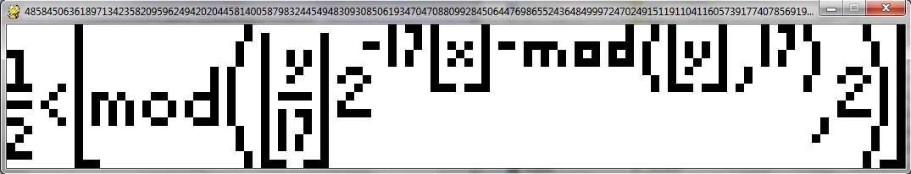

This post gives you the code to mess around with "Tupper's self-referential formula", a formula that plots itself.

===

# The formula that plots itself

By the end of this blog post, I hope that you know how to make mathematical drawings and why the number

$$
N \approx 4.85845063618971342358209596 \times 10^{543}
$$

is so special.

Given a function $f(x, y)$, how can you use it to make a drawing? Well, we just imagine the whole plane as a white, clean grid, and then we fill with black the squares at the positions $(x,y)$ such that $f(x,y) > \frac{1}{2}$. In a way, it is as if the function $f$ is telling us whether to use white or black, i.e., to leave the square empty ($0$) or filled in ($1$).

(More rigorously, we divide the plane into unit squares and assign each square the coordinates of its lower-left corner.)

If we take, for example, $f(x, y) = x + y$, then square $(0,0)$ would be white because $f(0, 0) = 0 < \frac{1}{2}$ but the squares $(0, 1)$ and $(1, 0)$ would be black because $f(0, 1) = f(1, 0) = 1 > \frac{1}{2}$.

As another example, take $f$ to be this function:

$$
f(x, y) = \left\lfloor \text{mod}\left(\left\lfloor\frac{y}{17} \right\rfloor 2^{-17\lfloor x \rfloor -  \text{mod}(\lfloor y \rfloor, 17)}, 2\right) \right\rfloor
$$

where $\lfloor n \rfloor$ denotes the [floor function](https://en.wikipedia.org/wiki/Floor_and_ceiling_functions) and $\text{mod}(a, b)$ denotes the [modulo operator](https://en.wikipedia.org/wiki/Modulo_operation). This function looks way more interesting, doesn't it? Yes, it does! And if you look in the right place, this is what is plotted by this function:

What is going on here..? The function I just showed you, called [Tupper's self-referential formula](https://en.wikipedia.org/wiki/Tupper%27s_self-referential_formula), is a formula that plots itself! But you might be suspicious because I said *if you look in the **right** place*. What is this *place* then?

Quite simply, define

$$
N=4858450636189713423582095962494202044581400587983244549483093085061934704708809928450644769865524364849997247024915119110411605739177407856919754326571855442057210445735883681829823754139634338225199452191651284348332905131193199953502413758765239264874613394906870130562295813219481113685339535565290850023875092856892694555974281546386510730049106723058933586052544096664351265349363643957125565695936815184334857605626529915320311182856118951164066401426579727262440270286409619368825536815027849325692956320299303330714849102058741137034502,
$$

(a 544-digit-long number). Then, the image I showed you is the rectangular area with the lower-left corner $(0, N)$ and the upper-right corner $(105, N + 16)$ (so it is a $106 \times 17$ rectangle). Quite impressive, right? Self-references are always fun!

But that is not all... If you look hard enough, you can find literally anything inside that $106\times17$ rectangle! For example, taking

$$
N=677269797063266389145771001639366162904443300634759368354244105189144417475687924080590138582401925400953401198762670070868017028632609067495842127259345485889052110555312844858658969250766978033911456684637024394115209279287448522343527514061700072005928325124098808483476326307953390156875355289624192978628506335125351370018499785193486797521350328711540234844414805471938182060305235921541912512179523099720166772353828125144439537587189530425493554812515912471900753848603802337280,
$$

you can find the name of this site "mathspp" and a winking face ";)":

")

Now the really important question is... How does one find such values for $N$? Well, you can watch [this Numberphile YouTube video](https://www.youtube.com/watch?v=_s5RFgd59ao), or I can tell you all about it...

You start with a $106\times17$ grid and you colour it (with black/white) the way you want. Then you will construct a bit sequence: you start on the top-right corner, and write down a $1$ if that square is black, $0$ if that square is white. Then you go down one square, and repeat. You do this column by column, top to bottom, right to left. When you finish, you convert your bit sequence to decimal and multiply it by $17$. That gives you the right position on the plot. In the video I linked, they tell you to start at the opposite end (lower-left) but then the plot will be flipped.

Of course doing this by hand is suicidal. What I did is create a program that lets me draw in a grid and then creates the number for me. Then, I created another small program that takes a number and draws the corresponding plot. Both Python programs can be found in [this Github repo](https://github.com/rodrigogiraoserrao/projects/tree/master/TupperFormula). After drawing, press <kbd>S</kbd> to save the number to the file `numbers.txt`. To draw a number, first dump it in the file `number2draw.txt` and then run the drawing program.

You can find the Python programs in [this GitHub repo](https://github.com/rodrigogiraoserrao/projects/tree/master/TupperFormula).

