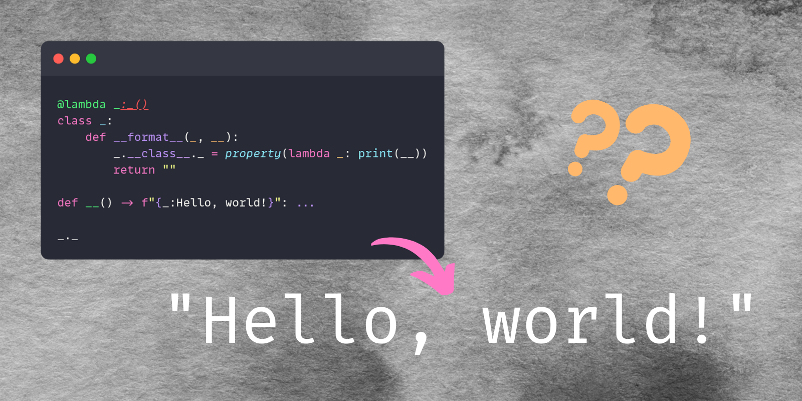

In this article we go over the most obscure “Hello, world!” Python program I have ever seen.

===

<script async src="https://platform.twitter.com/widgets.js" charset="utf-8"></script>




## The code

In this article we are going to be unravelling this monstrous piece of Python code:

```py
@lambda _: _()
class _:
    def __format__(_, __):
        _.__class__._ = property(lambda _: print(__))
        return ""

def __() -> f"{_:Hello, world!}": ...

_._
```

If you run this program with Python 3.9+, the output is `"Hello, world!"`.
But how does that work?

I will walk you through what is going on.

First, I am going to tell you how I found out what the code is doing.
This is useful because it helps you see how you can tackle a piece of code you don't understand.

This explanation/walkthrough might be a bit confusing because I will be narrating my thoughts and tests as I do them.
That's why I will also include a clearer explanation of what is going on, assuming you already understand all the components.


## Walking through the code

### Renaming

The first thing I need to do, to understand what is going on, is to give more reasonable names to things.

So, I will go through the code and replace the underscore `_` and double-underscore `__` names with more useful names:

```py
@lambda cls: cls()
class C:
    def __format__(self, fmt):
        self.__class__.prop = property(lambda _: print(fmt))
        return ""

def _() -> f"{C:Hello, world!}": ...

C.prop
```

Here are my name changes and the reason why I made them:

 - The argument `_` in `@lambda _: _()` was changed to `cls` because the lambda is being used as a decorator, and the whole class beneath is the argument, so the argument to lambda is a class.
 - The class we have, `class _`, is a generic class, so I'm giving it a generic name like `C`.
 - The parameters in the [dunder method][dunder-method] `__format__` are “standard”, and you can check the documentation for their usual names, so that is why I went for `def __format__(self, fmt): ...`.
 By changing the parameters in the definition of `__format__`, I also had to adjust the first `_` in `_.__class__._` and the `__` in `lambda _: print(__)`.
 - The `_` in `lambda _: print(...)` was left unchanged because that is an actual throwaway value. In other words, the argument to that lambda is never used, so we do not care about the name of the argument. [It is customary to use `_` as a name for a variable we don't actually care about][underscore-as-sink].
 - For the same reason, I changed the function name from `__` to `_`. Previously, it was called `__` in order not to clash with the class definition, but now we can use the name `_` because we never really use that function. Thus, we used the underscore as a sink again.
 - Finally, the second `_` in `_.__class__._` was changed into `prop`, because that is short for “property”, which is what was getting assigned to `_`.
 - At the end of the program, `_._` is `C.prop` because the global name `_` is the class and the attribute `_` is the property that we fiddle with inside `__format__`.


Now, there are three blocks of code that we need to parse and understand.

The first one is the decorated class definition:

```py
@lambda cls: cls()
class C:
    def __format__(self, fmt):
        self.__class__.prop = property(lambda _: print(fmt))
        return ""
```

The second one is the annotated function definition:

```py
def _() -> f"{C:Hello, world!}": ...
```

And the third one is the attribute access:

```py
C.prop
```


### Decorated class definition

Python decorators are insanely powerful and,
to be honest, one of my favourite language features!

They are often misunderstood and their difficulty is overestimated.
Their essence is quite graspable, though!
The syntax `@decorator` is just syntactic sugar that takes whatever is under the decorator, passes it into the decorator as its only argument, and reassigns the result of the decorator to the same name.

So, this code:

```py
@decorator
def foo():
    ...
```

Is actually equivalent to this:

```py
def foo():
    ...

foo = decorator(foo)
```

Notice how

 1. we define the function as usual;
 2. we call the decorator with the function as its only argument, `decorator(foo)`; and
 3. we assign the result back to the name of the function that was also the argument, `foo = ...`.

Therefore, the class definition, that looked like this:

```py
@lambda cls: cls()
class C:
    ...
```

is, therefore, equivalent to this:

```py
class C:
    ...

C = (lambda cls: cls())(C)
```

This may look too confusing, so let me give a name to the `lambda`:

```py
class C:
    ...

f = lambda cls: cls()
C = f(C)
```

However, if you look at it, the function just takes the class and builds an instance out of it!
That is what the lambda decorator is doing here:
it is replacing the class with an instance of it.

So, a saner way of writing this code would do without the lambda,
and instead create a new variable for the instance of `C`:

```py
class C:
    ...

C_obj = C()

def _() -> f"{C_obj:Hello, world!}": ...

C_obj.prop
```


### Annotated function definition

Now that we have defined a class,
we define our function `_` with

```py
def _() -> f"{C_obj:Hello, world!}": ...
```

Notice that the function is,
for all practical purposes, “empty”.
Its body is `...` which is the same as if we had written `pass` inside the function.
In other words, calling the function does absolutely nothing.

On the other hand, the function annotation does something interesting!
The function annotation contains a formatted string: `f"{C_obj:Hello, world!}"`.

 - On the left of the colon, we have `C_obj`: the object that is being formatted.
 - On the right of the colon, we have `Hello, world!`, which is the format specification.

Having `Hello, world!` to the right of the colon might look weird.
You are likely to be more used to seeing string formatting like this:

```py
>>> f"x is {x:>10}"
'x is   0.123456'
>>> f"x is {x:.2f}"
'x is 0.12'
```

However, the format specifier (the things to the right of `:`) can be _anything_.
It is the object that is being formatted that needs to interpret that format inside the [dunder method `__format__`, the method responsible for doing formatting][custom-formatting-__format__].

So, what is going on in our code?
The class `C` implements `__format__`,
and that method is called when we reach the formatted string.
The argument `self` is `C_obj`, the class `C` instance.
The argument `fmt` is a string containing whatever is to the right of `:`,
which is `"Hello, world!"` in our case.

Then, we run an assignment:

```py
class C:
    def __format__(self, fmt):
        self.__class__.prop = ...
```

What is `self.__class__.prop`?
The dunder attribute `__class__` gives you a reference to the class of the object, so `self.__class__` is a way to access the class of `self`.
In our case, that class is `C`.
In the original weird case, we need to use `__class__` to access the class because we lost the name of the class.
However, we have better naming now, which means we could write:

```py
class C:
    def __format__(self, fmt):
        C.prop = ...
```

Now we just need to check what we are assigning to the attribute `prop`.

`property` is a built-in that allows you to define _properties_.
(Who would have known?!)

A property is just like an attribute,
but instead of giving you a fixed value,
it calls a function to _compute_ the value of that attribute.

For example, here is a class that wraps the built-in type `list` and
that provides a _property_ `length` that returns the length of the list:

```py
class MyList(list):
    @property
    def length(self):
        return len(self)

lst = MyList([1, 2, 3])
print(lst.length)
## 3
```

In the example above, we used `@property`, but the `@` is just syntactic sugar.
We can call `property` directly, just like we do in our crazy program.
Thus, what we are saying is that `C.prop` will call the anonymous function `lambda _: print(fmt)` when accessed.
The lambda function, in turn, prints the value of `fmt` when called.

Finally, we return `""` because the dunder method `__format__` must return a string.


### The final touch

To wrap everything up, the program ends with `C_instance.prop`,
thus accessing the attribute `prop` of `C_instance`.
Now, `prop` is a property, so we must run the `lambda` function from before.
When we do, we run the expression `print(fmt)`,
but what is `fmt`?

The value of `fmt` was defined earlier,
when the function annotation ran and called the dunder method `__format__`.
Python can remember the value of `fmt`,
which was `"Hello, world!"`, so that is what is printed.

And that is how the most obfuscated “Hello, world!” program works!


## The short explanation

For someone who understands all of the pieces of the puzzle involved,
a much shorter explanation can be given.

In fact, this program works because the function definition forces the evaluation of the function annotation,
which implicitly invokes the dunder method `__format__`.
This ends up creating a property that prints the original format specification (`"Hello, world!"`) when accessed.
Finally, the program concludes by accessing that same property, triggering the call.


## Source

This short blog post was written as an expanded version of a Twitter thread I posted which,
in turn, depended on a tweet posted by Ned Batchelder.

<blockquote class="twitter-tweet"><p lang="en" dir="ltr">This insane program prints “Hello, world!”, but how?<br><br>Come with me as I unravel this madness. <a href="https://t.co/gfjDj4xXkH">https://t.co/gfjDj4xXkH</a></p>&mdash; Rodrigo 🐍📝 (@mathsppblog) <a href="https://twitter.com/mathsppblog/status/1546249080485076994?ref_src=twsrc%5Etfw">July 10, 2022</a></blockquote>


[dunder-method]: /blog/pydonts/dunder-methods
[underscore-as-sink]: /blog/pydonts/usages-of-underscore#underscore-as-a-sink
[custom-formatting-__format__]: /blog/pydonts/string-formatting-comparison#custom-formatting
