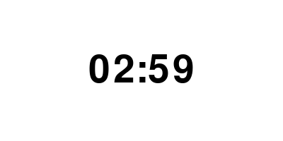
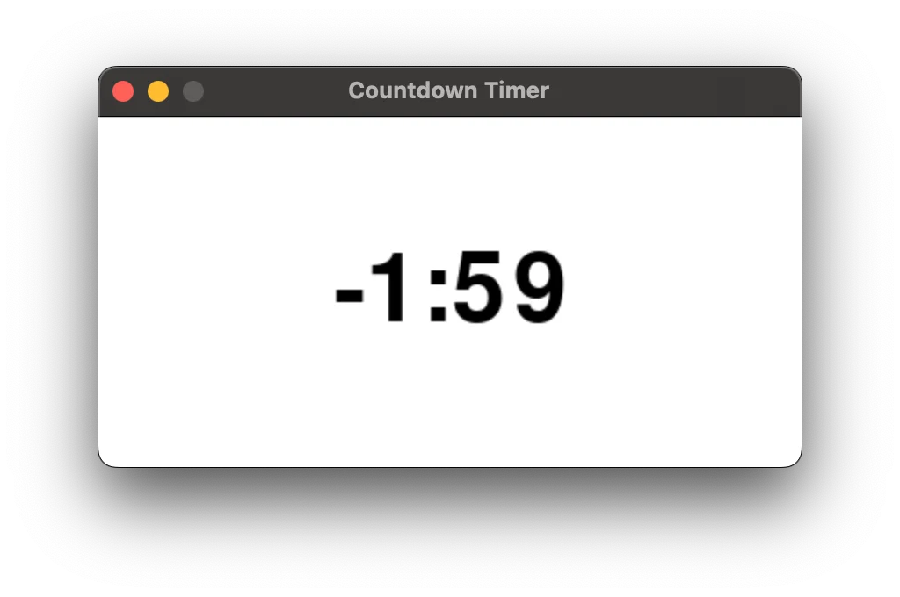

I used an LLM to write a countdown timer and I have mixed feelings about the result.

===


# Using an LLM to write a countdown timer

In this article I will tell you the short story of how I used an LLM to write a simple countdown timer for me.
I will show you the code, what went well, and what went wrong.

The timer we will be building will accept the number of minutes as a command argument:

```bash
python cd.py 3
```

And it will then display a countdown timer like the GIF below shows:




## First iteration

To get the first iteration of the code, here the prompt I gave to GPT-4o:

 > “Write a pygame script that accepts a number of minutes using sys.argv and creates a basic countdown timer displaying the time as 10:00, 09:59, etc, all the way to 00:00.
 > The background should be white and the numbers should be black. Use basic event handling to allow quitting the countdown and pressing space should add another minute to the timer.”

<details>
<summary>Full code of the first iteration.</summary>  
  
  
```py
import sys
import pygame
from pygame.locals import QUIT, KEYDOWN, K_SPACE

# Initialize pygame
pygame.init()

# Screen dimensions and colors
SCREEN_WIDTH, SCREEN_HEIGHT = 400, 200
WHITE = (255, 255, 255)
BLACK = (0, 0, 0)

# Fonts and other settings
FONT = pygame.font.Font(None, 80)
FPS = 60

# Parse command-line argument for the timer duration
if len(sys.argv) != 2 or not sys.argv[1].isdigit():
    print("Usage: python countdown.py <minutes>")
    sys.exit(1)

minutes = int(sys.argv[1])
seconds = minutes * 60

# Set up the display
screen = pygame.display.set_mode((SCREEN_WIDTH, SCREEN_HEIGHT))
pygame.display.set_caption("Countdown Timer")

# Clock for controlling the frame rate
clock = pygame.time.Clock()

running = True
while running:
    # Event handling
    for event in pygame.event.get():
        if event.type == QUIT:
            running = False
        elif event.type == KEYDOWN:
            if event.key == K_SPACE:
                seconds += 60

    # Timer logic
    if seconds > 0:
        seconds -= 1 / FPS

    # Render the timer
    screen.fill(WHITE)
    minutes_display = int(seconds // 60)
    seconds_display = int(seconds % 60)
    time_text = f"{minutes_display:02}:{seconds_display:02}"
    text_surface = FONT.render(time_text, True, BLACK)
    text_rect = text_surface.get_rect(center=(SCREEN_WIDTH // 2, SCREEN_HEIGHT // 2))
    screen.blit(text_surface, text_rect)

    # Update the display
    pygame.display.flip()

    # Cap the frame rate
    clock.tick(FPS)

# Quit pygame
pygame.quit()
```  
  

</details>

I know a bit of pygame so I glanced through the code and it look promising enough, so I ran it with `python cd.py 3` and the countdown started.
I pressed <kbd>SPACE</kbd> and the countdown increased by 1 minute.
Everything looked fine.


## Adding a new feature

After this first iteration I wanted to change the code so that, after the countdown was finished, the background and foreground colours flipped each second.
This is what I typed:

 > “Change the code so that when the timer hits 0, the background and foreground colours reverse each second.”

GPT-4o promptly replied with some edited code.

<details>
<summary>Full code of the second iteration.</summary>

<pre><code class="language-py language-python">import sys
import pygame
from pygame.locals import QUIT, KEYDOWN, K_SPACE

# Initialize pygame
pygame.init()

# Screen dimensions and colors
SCREEN_WIDTH, SCREEN_HEIGHT = 400, 200
WHITE = (255, 255, 255)
BLACK = (0, 0, 0)

# Fonts and other settings
FONT = pygame.font.Font(None, 80)
FPS = 60

# Parse command-line argument for the timer duration
if len(sys.argv) != 2 or not sys.argv[1].isdigit():
    print("Usage: python countdown.py <minutes>")
    sys.exit(1)

minutes = int(sys.argv[1])
seconds = minutes * 60

# Set up the display
screen = pygame.display.set_mode((SCREEN_WIDTH, SCREEN_HEIGHT))
pygame.display.set_caption("Countdown Timer")

# Clock for controlling the frame rate
clock = pygame.time.Clock()

reverse_colors = False  # <-- NEW
color_timer = 0         # <-- NEW

running = True
while running:
    # Event handling
    for event in pygame.event.get():
        if event.type == QUIT:
            running = False
        elif event.type == KEYDOWN:
            if event.key == K_SPACE:
                seconds += 60

    # Timer logic
    if seconds > 0:
        seconds -= 1 / FPS
    # vvv NEW
    else: 
        # Reverse colors every second when the timer hits 0
        color_timer += 1 / FPS
        if color_timer >= 1:
            reverse_colors = not reverse_colors
            color_timer = 0
    # ^^^ NEW

    # Set colors based on reverse state
    bg_color = BLACK if reverse_colors else WHITE    # <-- NEW
    text_color = WHITE if reverse_colors else BLACK  # <-- NEW

    # Render the timer
    screen.fill(bg_color)
    #           ^^^^^^^^ edited
    minutes_display = int(seconds // 60)
    seconds_display = int(seconds % 60)
    time_text = f"{minutes_display:02}:{seconds_display:02}"
    text_surface = FONT.render(time_text, True, text_color)
    #                                           ^^^^^^^^^^ edited
    text_rect = text_surface.get_rect(center=(SCREEN_WIDTH // 2, SCREEN_HEIGHT // 2))
    screen.blit(text_surface, text_rect)

    # Update the display
    pygame.display.flip()

    # Cap the frame rate
    clock.tick(FPS)

# Quit pygame
pygame.quit()
</code></pre>

</details>


I wanted to see what this looked like, so I let a timer get to 0 and then I see this:




## Poor timekeeping

At this point I decided I should take a better look at what the code was doing.
I quickly realised that the code was doing something funny to keep track of time.
At each frame, the code runs this:

```py
# ...

# Timer logic
if seconds > 0:
    seconds -= 1 / FPS

# ...
```

I looked around and noticed that the variable `seconds` was initialised to the total number of seconds that the timer would have to run for.

This is a very bad way of keeping track of time.
For multiple reasons!

1. if my code runs at a slower framerate than the defined FPS, the timer will take longer to finish. E.g., if my computer is slow and the true framerate is half of what's set in the variable `FPS`, a 2 minute countdown would take 4 minutes instead;
2. frames might take a different amount of time to run and I'm decrementing the value of `seconds` by a fixed value each time, which is inaccurate; and
3. since floating point arithmetic is riddled with rounding errors, I'm asking for trouble in the last frame, where seconds -= 1 / FPS will likely lead to a negative result, which is why the timer ends at -1:59.

To fix this, I prompted the LLM to keep track of time in a saner way.


## Better timekeeping

This is my prompt:

 > “Modify the code. Instead of reducing the time left by subtracting 1 / FPS, at the start use time.time to compute the time when the timer will end and at each frame compute how many minutes and seconds are left for that.”

Then, predicting an issue that I hadn't checked for yet, I added another two sentences:

 > “If the user presses space, 1 more minute should be added to the timer. If the timer already stopped, it should restart.”

I got a new version of the code.

<details>
<summary>Full code of the iteration with fixed timekeeping.</summary>

<pre><code class="language-py language-python">import sys
import pygame
import time
from pygame.locals import QUIT, KEYDOWN, K_SPACE

# Initialize pygame
pygame.init()

# Screen dimensions and colors
SCREEN_WIDTH, SCREEN_HEIGHT = 400, 200
WHITE = (255, 255, 255)
BLACK = (0, 0, 0)

# Fonts and other settings
FONT = pygame.font.Font(None, 80)
FPS = 60

# Parse command-line argument for the timer duration
if len(sys.argv) != 2 or not sys.argv[1].isdigit():
    print("Usage: python countdown.py <minutes>")
    sys.exit(1)

minutes = int(sys.argv[1])
remaining_time = minutes * 60
end_time = time.time() + remaining_time

# Set up the display
screen = pygame.display.set_mode((SCREEN_WIDTH, SCREEN_HEIGHT))
pygame.display.set_caption("Countdown Timer")

# Clock for controlling the frame rate
clock = pygame.time.Clock()

reverse_colors = False
color_timer = 0

running = True
while running:
    # Event handling
    for event in pygame.event.get():
        if event.type == QUIT:
            running = False
        elif event.type == KEYDOWN:
            if event.key == K_SPACE:
                if remaining_time <= 0:
                    remaining_time = 60  # Restart timer if already stopped
                else:
                    remaining_time += 60
                end_time = time.time() + remaining_time

    # Timer logic
    current_time = time.time()
    if remaining_time > 0:
        remaining_time = max(0, end_time - current_time)
    else:
        # Reverse colors every second when the timer hits 0
        color_timer += 1 / FPS
        if color_timer >= 1:
            reverse_colors = not reverse_colors
            color_timer = 0

    # Set colors based on reverse state
    bg_color = BLACK if reverse_colors else WHITE
    text_color = WHITE if reverse_colors else BLACK

    # Render the timer
    screen.fill(bg_color)
    minutes_display = int(remaining_time // 60)
    seconds_display = int(remaining_time % 60)
    time_text = f"{minutes_display:02}:{seconds_display:02}"
    text_surface = FONT.render(time_text, True, text_color)
    text_rect = text_surface.get_rect(center=(SCREEN_WIDTH // 2, SCREEN_HEIGHT // 2))
    screen.blit(text_surface, text_rect)

    # Update the display
    pygame.display.flip()

    # Cap the frame rate
    clock.tick(FPS)

# Quit pygame
pygame.quit()
</code></pre>

</details>

In a nutshell, the changes included importing the module `time`, computing the timestamp when the timer should stop, and at each frame checking if we had reached that timestamp or not.
And yet, the code still looked awkward.

For example, consider this check in the code to determine whether the timer is done or not:

```py
# ...
while running:
    # Event handling
    for event in pygame.event.get():
        # ...

    # Timer logic
    current_time = time.time()
    if remaining_time > 0:
        remaining_time = max(0, end_time - current_time)
    else:
        # Reverse colors every second when the timer hits 0
        color_timer += 1 / FPS
        if color_timer >= 1:
            reverse_colors = not reverse_colors
            color_timer = 0
```

Doesn't it feel super awkward to compute the variable `current_time`, which is the current timestamp, and then determine whether the timer is done or not with the variable `remaining_time` that was updated in the last frame?

I'd expect the conditional statement to look something like this:

```py
# ...
while running:
    # Event handling
    for event in pygame.event.get():
        # ...

    # Timer logic
    remaining_time = max(0, end_time - time.time())
    if not remaining_time:
        # Reverse colors every second when the timer hits 0
        color_timer += 1 / FPS
        if color_timer >= 1:
            reverse_colors = not reverse_colors
            color_timer = 0
```

That would be something sensible to do...
(Let's not talk about the fact that the output still uses `1 / FPS` to determine when to reverse background and foreground colours.)


## Final modifications by hand

At this point I got a bit annoyed and decided to tweak a couple of things by hand.
First, I added support for two types of input:

1. `python cd.py 3` runs a timer for 3 minutes; and
2. `python cd.py 2:30` runs a timer for 2 minutes and 30 seconds.

This required modifying the lines of code that checked `sys.argv` for the argument:

```py
# Parse command-line argument for the timer duration
if len(sys.argv) != 2:  # Modified the condition and the print v
    print("Usage: python countdown.py <minutes(:seconds)?>")
    sys.exit(1)

# Handle a possibly-absent ":xx"
minutes, _, seconds = sys.argv[1].partition(":")
remaining_time = int(minutes) * 60 + int(seconds or "0")
end_time = time.time() + remaining_time
```

Then, I tweaked the calculations a bit.
Because of how the remaining time is computed, if you set a timer for 3 minutes the first time you see in the timer is 02:59 and the timer will display 00:00 for a second before it considers it's done.
This happens because calculations round down.

To make it so that a 3 minute timer shows the time 03:00 for a second and for the timer to be done as soon as it displays 00:00, I had to add a couple of `+ 1` in multiple places.

I also had to fix an edge case where I pressed <kbd>SPACE</kbd> after the timer had finished and while the colours were reversed, which would restart the timer with the wrong colours.


## Full source code for the countdown timer

In case you're curious, I included the final code for the countdown timer below.
You can also [get the code from here](./cd.py).

<details>
<summary>Full code of the final countdown timer.</summary>

<pre><code class="language-py language-python">import sys
import pygame
import time
from pygame.locals import QUIT, KEYDOWN, K_SPACE

# Initialize pygame
pygame.init()

# Screen dimensions and colors
SCREEN_WIDTH, SCREEN_HEIGHT = 400, 200
WHITE = (255, 255, 255)
BLACK = (0, 0, 0)

# Fonts and other settings
FONT = pygame.font.Font(None, 80)
FPS = 60

# Parse command-line argument for the timer duration
if len(sys.argv) != 2:
    print("Usage: python countdown.py <minutes(:seconds)?>")
    sys.exit(1)

minutes, _, seconds = sys.argv[1].partition(":")
remaining_time = 1 + int(minutes) * 60 + int(seconds or "0")
end_time = time.time() + remaining_time

# Set up the display
screen = pygame.display.set_mode((SCREEN_WIDTH, SCREEN_HEIGHT))
pygame.display.set_caption("Countdown Timer")

# Clock for controlling the frame rate
clock = pygame.time.Clock()

reverse_colors = False
color_timer = 0

running = True
while running:
    # Event handling
    for event in pygame.event.get():
        if event.type == QUIT:
            running = False
        elif event.type == KEYDOWN:
            if event.key == K_SPACE:
                end_time = max(time.time() + 1, end_time) + 60
                reverse_colors = False  # In case timer was restarted while reversed

    # Timer logic
    current_time = time.time()
    if current_time + 1 >= end_time:
        # Reverse colors every second when the timer hits 0
        color_timer += 1 / FPS
        if color_timer >= 1:
            reverse_colors = not reverse_colors
            color_timer = 0
        remaining_time = 0
    else:
        remaining_time = end_time - current_time

    # Set colors based on reverse state
    bg_color = BLACK if reverse_colors else WHITE
    text_color = WHITE if reverse_colors else BLACK

    # Render the timer
    screen.fill(bg_color)
    minutes_display = int(remaining_time // 60)
    seconds_display = int(remaining_time % 60)
    time_text = f"{minutes_display:02}:{seconds_display:02}"
    text_surface = FONT.render(time_text, True, text_color)
    text_rect = text_surface.get_rect(center=(SCREEN_WIDTH // 2, SCREEN_HEIGHT // 2))
    screen.blit(text_surface, text_rect)

    # Update the display
    pygame.display.flip()

    # Cap the frame rate
    clock.tick(FPS)

# Quit pygame
pygame.quit()
</code></pre>

</details>


## Conclusion

All in all, using an LLM (GPT-4o in this instance) was a great way to get a lot of boilerplate out of the way and to get something that almost worked fine.
Still, I had to prompt it a couple of times to fix issues and very odd design decisions, and in the end it turned out to be easier to add the finishing touches myself.

The overall appreciation is that it was useful and it saved me some time, but it's also annoying that I had to go and hunt for bugs that I would have never introduced in an application of this scale and complexity.
