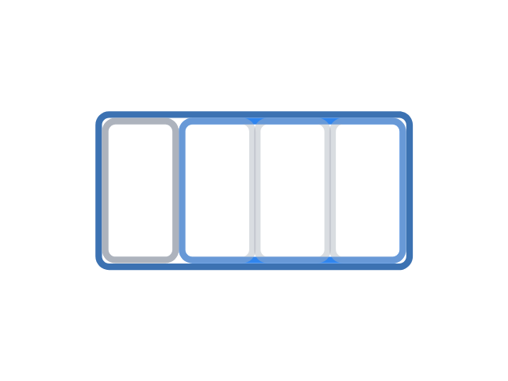

---
metadata:
    description: "In this blog post I go over all types of promotions and discounts that shops usually have and compute how much money each one actually saves you."
title: "What all promotions actually mean"
---

Nowadays stores come up with all sorts of funky promotions to catch your eye...
But how much money do you actually save with each type of promotion?

===

I will do the maths needed to understand how much money each type of promotion actually
saves you, and I will try to cover all the types of promotions I can think of.
If you have seen a type of promotion that is not covered here, then go ahead and ask
me to include it by commenting down below.

! For the sake of simplicity, I'll use the euro (€) as the currency during this post,
! but if you use some other currency, you can mentally replace all € symbols with
! the symbol for your currency and the statements will still be true, there is **no**
! need for conversions.

I will start with a brief note on the classical promotion that says “X% off”.
Everyone is used to seeing those and those are more or less well understood.
Then, I'll provide a short description of a method to convert any other promotion
to this “X% off” type of promotion.
Finally, I will go over many different types of promotions, listed below, and I will
convert them to the “X% off” promotion for some specific values.

 - “X for the price of Y”
 - “Buy X, we offer the cheapest Y”
 - “X% off in the second item”
 - “Plus X% for free" / “Plus X for free”
 - “Get X% cash back in a card/for later/when you come back”
 - “Get X€ for a purchase above Y€”
 - Loyalty cards / stamp cards / point systems

## “X% off”

The first type of promotion that I will cover is the one that is easier to grasp, in my opinion.
It is the “X% off” type of promotions that we are all accustomed to:

When a tag/sign reads “X% off”, it means that for every $100$€ you are going to spend, you save X€.

For example:

 - A “50% off” tag means that, for every $100$€ you were about to spend, you get to save $50$.
 - A “70% off” tag means that, for every $100$€ you were about to spend, you get to save $70$.

## How To Calculate How Much I Save With A Promotion

There is a simple train of thought that allows you to understand how much money each
promotion actually saves you, and that is the train of thought I will be using throughout
the remainder of this blog post.

To see how much a promotion actually saves, you need to do a couple of simple steps:

 1. First, calculate what is the amount of money you need to spend in order
to trigger the promotion, which means accounting for the things you have to pay and the
things you will get for free.

 2. Calculate what is the amount of money you can actually save.

 3. Lastly, divide the amount of step 2 by the amount of step 1, multiply by $100$ and that
gives the percentage that promotion saves you.

## “X for the price of Y”

This type of promotion is common in places like supermarkets, where we can buy
X copies of the same product, but only pay Y of them.
For example, next to a pack of cookies you may find a sign saying “3 for the price of 2”.

These promotions are straightforward to convert to a “X% off” promotion.
You just need to divide the number of free items by the total number of items you need to
take, and then multiply by $100$.

For example:

 - “3 for the price of 2” - you get $1$ out of $3$ for free, so it is the same as a
$100 \times (1 / 3) \approx 33\%$ discount.
 - “5 for the price of 3” - you get $2$ out of $5$ for free, so it is the same as a
$100 \times (2 / 5) = 40\%$ discount.

## “Buy X, we offer the cheapest Y”

This type of promotion is really similar to the “X for the price of Y”,
and allows us to buy different products, whereas the previous one is usually for you
to buy multiple of the same product.

The problem with these promotions is that they do not work well in your favour
if you buy items whose prices are not the same/similar.
For a promotion of that reads “Buy X, we offer the cheapest Y”, here is how to find out
the best case scenario for you: divide Y by X and multiply by $100$.
That is the percentage of discount you get **if** you were to buy X items that all
have *exactly the same price*.

For example:

 - “Buy 2, we offer the cheapest item” - according to the paragraph above, in the best case
scenario this is the same as a “50% off” promotion, if your two items cost exactly the same.
 - “Buy 6, we offer the cheapest 3” - this is the same as the one above, as $100\times (3/6) = 50\%$
as well, but this promotion plays with your psychology to get you to buy more items than the
ones you actually needed.

Notice that if the items you buy have very different prices, the promotions get diluted.
For example, “buy 2, we offer the cheapest” can be as good as a “50% off” promotion, but
if you buy an item for $10$€ and another for $5$€, then you are being offered $5$€ out
of a total $15$€, which is a $\approx 33\%$ discount.
In a “buy X, we offer the cheapest Y”, if you already know the X items you want to buy
and they have different prices, just sum the cheapest Y and divide by the total price of
the X items you want, that will give you the equivalent percentage discount.
More often than not, it will be significantly lower than the best case scenario.

## “X% off in the second item”

This promotion is also very similar to the one before, except that instead of getting the
cheapest item for free, you are getting a discount on it.
A “X% off in the second item” can be converted to the classical discount if you take X
and divide it by two.

For example:

 - “50% off in the second item” looks really good, because a “50% off” is a nice promotion,
but 50% off in the *second* item means you get, at most, $50 / 2 = 25\%$ off of your total purchase.

We can also do the maths if the “X% off” applies to the Yth item in general,
and not necessarily the second one.
In that case, just divide X by Y and you get the total percentage you get off of your total purchase.

For example:

 - “90% off in the third item” is, at best, a $90 / 3 = 30\%$ off in your total purchase.

Just like in the case above, if your items have different prices, your total discount gets diluted.

## “Plus X% for free” / “Plus X for free”

I see this promotion again and again in cereal packages, packs of yogurts, and the like in supermarkets.
This is usually seen in a packaging of some sort, claiming that the package got
X% bigger (i.e. it contains X% more of whatever you are buying) but you are paying the old price.
This type of promotion can be very misleading, because it sounds the same as a “X% off” discount, but is
in fact slightly less advantageous for you.

In short, they are trying to get you to compare the free portion with the paid portion,
instead of letting you compare the free portion with the totality of what you are
purchasing, leading you to make a comparison that looks better.

If the promotion is of the type “Plus X% for free”, then you can convert it to the usual “X% off” promotion
with ease: you just divide X by $100$ plus X and multiply by $100$.

For example:

 - “Plus 50% for free” - X is $50$ in this case, so this is the same as $100 \times (50 / (100 + 50)) \approx 33\%$
discount.
 - “Plus 25% for free” - X is $25$ in this case, so this is the same as $100 \times (25 / (100 + 25)) = 20\%$ discount.

To understand why this formula works, it is easier if we look at the other variant of this promotion:
“Plus X for free”, which is common in packs with smaller items inside, e.g. a pack of yogurts that used
to have $6$ yogurts and now contains $8$, saying “Plus 2 for free”.
This is *exactly* the same as the promotion that reads “8 for the price of 6”, and we saw that
in this promotion what matters is the total number of things we are getting and how many are offered for free
($2$, in this case).

All in all, a pack of 6 yogurts that now offers an additional $2$ yogurts for free could say “Plus 2 for free”,
or “Plus 33% for free”, because the $2$ extra yogurts, when compared to the original $6$, represent $33\%$
of what was already offered.
However, the $2$ free yogurts only represent $25\%$ of the total number of yogurts you are getting.
To make this even clearer, look at the picture below.

The original, small blue package used to have $3$ gray packs and it now says “Plus one for free”,
the gray pack to the left.
The promotion is playing mind games with you, because it makes you compare the free pack with
the three packs in the original package, instead of having you look at the free pack as a part
of the whole package you are now buying.

## “Get X% cash back in a card/for later/when you come back”

This is a classical type of "deferred" discount in which you get a percentage of
the money you spent back, to discount in a later purchase.
When dealing with deferred discounts, you have to take into account the amounts spent
in all the purchases that are tied to the promotion, starting with the purchases
that "unlock" the promotion, up until the purchase in which you benefit from the
promotion.

From the point of view of the calculations, this is very similar to the previous promotion.

If you are getting X% of what you spend back in a (gift) card/coupon/..., then
you should divide X by $100$ plus X, and then multiply that by $100$.

For example:

 - If your local supermarket says they'll give you $10\%$ of what you spend back,
for your next purchase, then you will get a discount of, at most,
$100 \times (10 + (100 + 10)) \approx 9\%$.

## “Get X€ for a purchase above Y€”

If someone just hands you a coupon that says “Get X€ for a purchase above Y€”,
then you can get the equivalent discount by multiplying $100$ by X divided by Y.
However, if you had to spend Z€ to win that coupon, then the total discount you
get is smaller: you have to divide X by the sum of Y and Z, and then multiply
by $100$.

For example:

 - If you spent $30$€ and then were given a coupon that says “Get 10€ for a purchase
above 20€” (that looks like a $50\%$ discount), then this is equivalent to
$100 \times (10 / (20 + 30)) = 20\%$ discount, much less than what it looked like
at first.

## Loyalty cards / stamp cards / point systems

The promotions I am thinking about in this section are the ones along the lines of
“every menu awards you a stamp, after $10$ stamps we offer you a menu for free”.
Again, these types of promotions give varying percentages of discounts depending
on the amount of money you spend to get each stamp/point/..., but to find the
best case scenario for you, you just have to divide $1$ by the total number of
stamps/menus/... you need to get, plus one. Then multiply that by $100$.

For example:

 - If you have a card with $10$ stamp slots and you get a stamp every time
you buy an ice cream, and if a complete card gives you a free ice cream,
then that will correspond to $100 \times (1 / (1 + 10)) \approx 9\%$ discount.

The *absolute best case scenario* can be computed if you find out the minimum
amount of money you need to spend per stamp, and if you find out the maximum
value of the item they can give you for free.
Then you just divide the cost of the free item by the sum of the two values.

---

I hope you found this post useful, and if you did be sure to leave a reaction below
and a comment!
Share this post with your friends!
