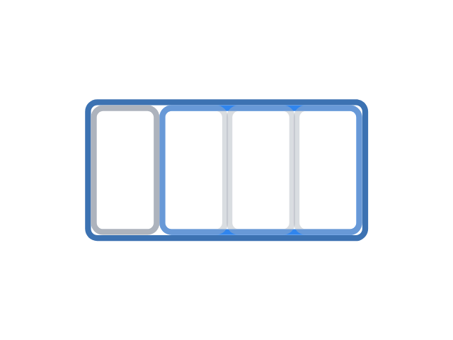

---
metadata:
    description: "Neste artigo vamos olhar para os vários tipos de descontos e promoções que as lojas costumam ter e vamos ver quanto é que se poupa com cada um dos tipos de desconto."
title: "O que é que as promoções querem dizer"
---

Hoje em dia as lojas criam todo o tipo de ações promocionais para nos chamar à atenção...
Mas quanto dinheiro é que poupamos realmente com cada tipo de promoção?

===

Vou fazer as contas necessárias para se perceber quanto dinheiro é que se poupa com
cada promoção, e vou tentar fazê-lo para todo o tipo de promoções de que me lembre.
Se te lembrares de algum tipo de promoção de que não falei, por favor faz-me saber
com um comentário no fim do artigo.

! Para efeitos de simplicidade, vou usar o euro (€) durante a redação do artigo,
! mas se tu usas outra moeda, basta substituires mentalmente todos os símbolos €
! pelo símbolo da tua moeda, o que está escrito no artigo vai continuar a ser
! verdade. Não é preciso fazer conversões nenhumas.

Vou começar por mencionar o tipo de desconto clássico a que todos estamos habituados,
os descontos de “Promoção de X%”.
Acho que toda a gente está habituada a encontrar esses descontos e toda a gente
percebe-os mais ou menos bem.
Depois, vou explicar a metodologia que uso para converter todos os outros tipos
de desconto num desconto equivalente do tipo “Promoção de X%”.
Finalmente, vou fazer as contas para os vários tipos de promoções que enumero
de seguida, para os converter nos descontos do tipo “Promoção de X%”.

 - “Leve X, pague Y”
 - “Compre X, oferecemos os Y mais baratos”
 - “X% de desconto no segundo item”
 - “Mais X% grátis” / “Mais X grátis”
 - “X% em cartão”
 - “X€ numa compra superior a Y€”
 - Cartões de fidelização / carimbos / sistemas de pontos

# “Promoção de X%”

O primeiro tipo de promoção de que vou falar é a mais simples, na minha opinião.
É a ação comercial que diz “Promoção de X%”, e à qual estamos todos habituados:

Quando uma etiqueta diz “X%” ou “-X%” ou “Desconto de X%”, isso significa que por cada
$100$€ que gastares, vais poupar X€.

Por exemplo:

 - “-50%” significa que, para cada $100$€ que ias gastar, vais poupar $50$€.
 - “-70%” significa que, para cada $100$€ que ias gastar, vais poupar $70$€.

# Como calcular quanto poupamos com uma promoção

Há um raciocínio simples que se pode seguir para percebermos quanto é que poupamos
com uma determinada promoção, e esse é o raciocínio que eu vou seguir neste artigo.

Para ver quanto é que uma promoção nos permite poupar, basta seguir uns passos simples:

 1. Começa por calcular quanto dinheiro é que precisarias de gastar para teres direito
à promoção, que significa que tens de ter em conta o valor de tudo
o que terias de pagar, *mais* o valor do que te é oferecido.

 2. De seguida, calculas o valor total que não precisas de gastar.

 3. Finalmente, divides o valor do passo 2 pelo valor do passo 1 e multiplicas por
$100$, para obteres a percentagem de desconto que recebeste.

# “Leve X, pague Y”

Este tipo de promoção é comum em sítios como supermercados, onde nos dizem que podemos
comprar X do mesmo produto que só pagamos Y deles.
Por exemplo, junto às tuas bolachas preferidas pode estar escrito “Leve 3, pague 2”.

Estas promoções são fáceis de converter em promoções do tipo “-X%”.
Basta dividires o número de produtos grátis pelo número total de produtos que levas,
e multiplicar por $100$.

Por exemplo:

 - “Leve 3, pague 2” - recebes $1$ grátis de um total de $3$, logo obténs um desconto
de $100 \times (1 / 3) \approx 33\%$.
 - “Leve 5, pague 3” - recebes $2$ grátis de um total de $5$, logo obténs um desconto
de $100 \times (2 / 5) = 40\%$.

# “Compre X, oferecemos os Y mais baratos”

Este tipo de promoção é muito semelhante à “Leve X, pague Y”, só que com este tipo
de promoção podemos comprar artigos diferentes, ao passo que a anterior costuma ser
para comprar várias vezes o mesmo artigo.

O problema com esta promoção (e outras semelhantes) é que a promoção não é tão boa
quando compramos artigos com preços (muito) diferentes.
Para uma promoção do tipo “Compre X, oferecemos os Y mais baratos”, o melhor cenário
possível é calculado se dividires Y por X e se multiplicares por $100$.
Essa é a percentagem de desconto que obténs **se** comprares X artigos todos
*exatamente com o mesmo preço*.

Por exemplo:

 - “Compre 2, oferecemos o artigo mais barato” - de acordo com o parágrafo anterior,
o melhor cenário corresponderia a um desconto de $50\%$ se os dois artigos
custassem exatamente o mesmo.
 - “Compre 6, oferecemos os 3 artigos de menor valor” - esta promoção é igual à
anterior no melhor caso, $100 \times (3 / 6) = 50\%$, mas nesta promoção estão a
tentar fazer com que tu compres mais artigos de que não precisas.
E também é mais difícil comprar 6 artigos exatamente do mesmo valor, por isso é mais
fácil que o desconto seja menor que $50\%$.

Repara que a percentagem da promoção se degrada se comprares artigos com preços muito
diferentes.
Por exemplo, “Compre 2, oferecemos o artigo mais barato” pode ser igual a $50\%$ de
desconto, mas se comprares um artigo de $10$€ e outro de $5$€, estão a oferecer-te
$5$€ de um total de $15$€, o que equivale a $\approx 33\%$ de desconto.
Numa promoção do tipo “Compre X, oferecemos os Y mais baratos”, se já souberes quais
são os X artigos que queres comprar, então podes simplesmente dividir o total dos
Y artigos mais baratos pelo total dos X artigos.
Isso diz-te a percentagem de desconto que vais obter.
Geralmente, essa percentagem vai ser mais baixa que a do melhor cenário possível.

# “X% de desconto no segundo artigo”

Esta promoção é semelhante à anterior, mas em vez de receberes o segundo artigo sem
custo, obténs um desconto.
Uma promoção do tipo “X% de desconto no segundo artigo” pode ser convertido numa
promoção típica se dividires X por dois.

Por exemplo:

 - “50% de desconto no segundo artigo” parece mesmo bom porque, em geral, uma promoção
“-50%” é boa, mas os “-50%” no segundo artigo significam que, no máximo, obténs um
desconto de $50 / 2 = 25\%$.

Também podes fazer as contas se o “-X%” se aplicar ao Y⁰ artigo, e não necessariamente
ao segundo.
Nesse caso, deves dividir X por Y e obténs a percentagem máxima do desconto que vais
receber.

Por exemplo:

 - “90% de desconto no 3⁰ artigo” é, na melhor das hipóteses, igual a $90 / 3 = 30\%$
de desconto.

Tal como no caso anterior, se os artigos tiverem preços diferentes então a promoção
vale menos.

# “Mais X% grátis” / “Mais X grátis”

Eu vejo esta promoção muitas vezes em embalagens de cereais, packs de iogurtes, e
outros artigos semelhantes no supermercado.
Isto aparece geralmente escrito numa embalagem, que diz que ficou X% maior
(ou seja, contém mais X% daquilo que vais comprar) e que se manteve com o preço
original.
Este tipo de promoção pode ser enganador, porque soa à promoção do tipo “-X%”,
mas é ligeiramente pior para o consumidor.

De forma muito sucinta, estão a tentar que compares a porção grátis com a porção
que não é grátis, em vez de comparares a porção grátis com o total de tudo o que
vais adquirir, levando-te a fazer uma comparação que te parece mais vantajosa.

Se a promoção for do tipo “Mais X% grátis”, então podes convertê-la na promoção
do tipo “-X%” com facilidade: divide X por $100$ mais X, e depois multiplica por $100$.

Por exemplo:

 - “Mais 50% grátis” - X é $50$, logo a promoção equivale a um desconto de
$100 \times (50 / (100 + 50)) \approx 33\%$.
 - “Mais 25% grátis” - X é $25$, logo a promoção equivale a um desconto de
$100 \times (25 / (100 + 25)) = 20\%$.

Para perceber porque é que esta fórmula funciona, talvez seja mais fácil olhar para
uma outra versão desta promoção:
“Mais X grátis”, que é algo que se vê com frequência em packs com artigos individuais
lá dentro, por exemplo um pack de iogurtes que antes tinha $6$ iogurtes e agora tem
$8$, e a embalagem diz “+2 grátis”.
Isto é *exatamente* igual à promoção que diz “8 pelo preço de 6”, e ainda agora vimos
que nessa promoção interessa o número de artigos que são oferecidos ($2$ neste caso)
e o número total de artigos que levamos.
Para tornar isto mais claro, olha para a imagem de baixo.

A embalagem azul pequena, que corresponde à embalagem original, continha $3$
pacotes cinzentos mais pequenos e agora diz “+1 grátis”, que é o pacote cinzento
à esquerda.
A promoção está a brincar com o teu cérebro, porque está a tentar fazer com que
compares o pacote cinzento com o conjunto dos outros três pacotes, em vez de te deixar
olhar para o pacote cinzento como parte do conjunto maior de quatro pacotes.

# “X% em cartão”

Isto é um tipo clássico de desconto futuro, em que uma percentagem do dinheiro que
gastas é-te devolvido para gastares mais tarde.
Neste tipo de descontos que só acontecem no futuro, temos de ter em conta o dinheiro
que gastamos em todas as compras que estão relacionadas com a promoção, a começar
com as compras que "desbloqueiam" a promoção e a acabar com a compra em que
beneficiamos efetivamente de algum desconto.

Do ponto de vista das contas, esta promoção é semelhante à anterior.

Por exemplo:

 - Se o teu supermercado diz que te devolve $10\%$ do dinheiro que tu gastas para
usares numa compra futura, então, na melhor das hipóteses, vais obter um desconto total
de $100 \times (10 + (100 + 10)) \approx 9\%$.

# “X€ numa compra superior a Y€”

Se alguém te der para as mãos um cupão que diz “X€ numa compra superior a Y€”,
então o desconto equivalente é obtido se multiplicares $100$ pela divisão de X por Y.
No entanto, se tiveste de gastar Z€ para receber esse cupão, então o desconto total é
menor: tens de dividir X pela soma de Y e Z, e depois multiplicar por $100$.

Por exemplo:

 - Se gastares $30$€ e te derem um cupão que diz “10€ numa compra igual ou superior
a 20€” (que se parece com $50\%$ de desconto), então isso é equivalente a
$100 \times (10 / (20 + 30)) = 20\%$ de desconto, que é bem menos do que parecia
inicialmente.

# Cartões de fidelização / carimbos / sistemas de pontos

As promoções que estou a tentar englobar nesta secção são algo como
“dou-te um carimbo a cada menu que comprares, depois de $10$ carimbos recebes um menu
grátis”.
Estas promoções correspondem a percentagens diferentes de descontos consoante o
dinheiro que se gastar para obter cada carimbo/ponto/..., mas para calcular o melhor
cenário possível, há que dividir $1$ pelo número total de carimbos/menus/... que
precisas de obter, mais um. Depois multiplica isso por $100$.

Por exemplo:

 - Se tens um cartão com espaço para $10$ carimbos, se recebes um carimbo de cada
vez que compras um gelado e se um cartão completamente carimbado te dá um gelado
grátis, então isso corresponde a $100 \times (1 / (1 + 10)) \approx 9\%$ de desconto.

Sendo absolutamente preciso, o melhor cenário de todos é calculado se descobrires
qual é que é o menor valor possível que podes gastar em cada selo/carimbo/... e se
calculares o valor máximo do artigo que te oferecem.
Depois basta dividires o valor do artigo grátis pela soma do valor mínimo que tens
de gastar com o valor máximo que te podem oferecer.

---

Espero que este artigo tenha sido útil para ti.
Se foi, comenta o artigo e deixa uma reação aqui em baixo!
Partilha o artigo com os teus amigos!
