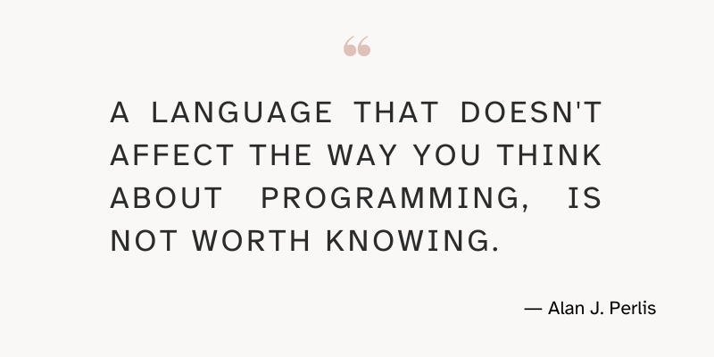

Let me show you characteristics of APL that will influence your understanding of programming concepts and the way you use other languages.

===




# Why APL is a language worth knowing

[Alan Perlis][alan-perlis], the computer scientist recipient of the first [Turing award][turing-award], wrote

 > “A language that doesn't affect the way you think about programming, is not worth knowing.”
 >
 > ― Alan J. Perlis, 1982. Special feature: Epigrams on programming. ACM Sigplan Notices, 17(9), pp.7-13.

Inspired by this statement, this article focuses on showing you how _a language that **does** affect the way you think **is** a language worth knowing_.
In particular, I will be drawing from my own experiences with APL and Python to give empirical evidence that supports my statement.


## Background

I started writing Python code in 2012 and that is the programming language I am most fluent in.
Before Python, I had written code in other languages such as Visual Basic, JavaScript, and C,
and after picking up Python I played around with many other different languages
such as Pascal, Haskell, C++, F#, Matlab, Mathematica, and Java.

Then, in 2020, I started learning APL.
Today, I am nowhere nearly as competent with APL as I am with Python, and yet,
my experience with APL has notably affected the way I think about programming,
the way I understand and reason about certain computer science concepts,
and especially the way I write my Python code.

So, in short, in this article I will share evidence that supports the statement that

 > “APL is a language worth knowing because it affects the way you think about programming.”

As you will soon find out, APL has had such a notorious impact in my programming because APL is the programming language that is most different from everything else I have learned.
Therefore, it is only natural that APL has been the language that provided more enlightening moments for me.


## Disclaimer

Of course, all evidence I am sharing is drawn from my own programming experience and is subjective.
Thus, my examples should not be taken as definite proof that (Python) programmers will get the same benefits as I did from learning APL.
I just think that this following scenario does not make much sense:

 > ― [someone] So, Rodrigo, how has your experience with APL been?
 >
 > ― [me] It's been great! It even has influenced my code in other languages, for example in Python.
 >
 > ― [someone] Really? How so?
 >
 > ― [me] I don't know, I just feel it.

Because of that, I spent a lot of time reflecting and trying to come up with concrete and objective instances of things that were influenced by APL.
That ought to make for a more compelling conversation than the hypothetical scenario from above.


## Prerequisites

While I will be talking about APL a lot, I will not assume that you know APL:
I will explain just about enough for you to follow along.

You also don't need to know Python, but you are expected to be familiar with one imperative programming language.
I need you to be comfortable with variables, conditional statements, and loops.


# What is APL?

In short, [APL] is an array-oriented programming language whose natural and concise syntax lets you develop shorter programs while thinking more about the problem you are trying to solve than how to express it to a computer.

The brief description that follows introduces you to just about enough APL for you to be able to follow the remainder of the article.
Take your time to digest what you are reading, as some of these things may surprise you!
Also, for the sake of simplicity, some of the things written here may not be 100% accurate.
Finally, feel free to open the [Try APL](https://tryapl.org/?clear&q=%E2%8E%95IO%20%E2%86%90%200%20%20%E2%8D%9D%20Feel%20free%20to%20ignore%20this%2C%20I%27m%20just%20setting%20up%20the%20environment.&run) website and try the examples there.

APL is an interpreted language, and the typical environment in which you use it is the session,
which is very similar to REPLs from other languages.
When showing APL code, the APL code will be indented to the right and the result(s) will be aligned on the left,
like so:

```APL
      15 + 16
31
      15 - 14
1
```

APL is infamous for its Unicode symbols, which make up for the set of its built-ins.
For example, many languages have a built-in that lets you create a series of consecutive integers.
In Python, that would be `range`.
In APL, we have the built-in function _index generator_, represented by the symbol iota `⍳`:

```APL
      ⍳6
0 1 2 3 4 5
```

Being an array-oriented language, APL has built-in support for arrays of multiple dimensions.
Single numbers are _scalars_, like the `15` and the `16` in `15 + 16`,
and a linear succession of scalars is a vector, like in `0 1 2 3 4 5`.

Finally, studying the expression `10 - 5 - 2` will highlight another key difference between APL and most other languages.
What should be the result of that expression?
If you follow the rules of traditional mathematics the result is $3$:

$$
10 - 5 - 2 = (10 - 5) - 2 = 5 - 2 = 3
$$

However, in APL, we start evaluating from right to left,
meaning `10 - 5 - 2` is equivalent to `10 - (5 - 2)` and the result is `7`:

```APL
      10 - (5 - 2)
7
      10 - 5 - 2
7
```


# APL and list comprehensions

I want to start by talking about list comprehensions,
the syntactic constructs (available in some programming languages) that make it easier to create new lists based on existing lists.

I want to show you how APL made it easier for me to understand list comprehensions and to use them effectively.


## Scalar functions in APL

In APL, everything is an array and all arrays are composed of scalars,
which ties with the fact that in APL many of its built-ins are said to be _scalar_.
What that means is that they “_ignore_” the structure of the array argument(s) and operate directly on the scalars.
Take a look at these examples:

```APL
      ⍳6          ⍝ 6 integers starting from the origin.
0 1 2 3 4 5
      1+⍳6        ⍝ Add 1 to the 6 integers starting from the origin.
1 2 3 4 5 6
      2×⍳6        ⍝ Multiply by 2 the 6 integers starting from the origin.
0 2 4 6 8 10
```

Notice how:

 - `1+` does not care that `⍳6` is a vector and just adds 1 to each of the scalars in `⍳6`; and
 - `2×` does not care that `⍳6` is a vector and just doubles each of the scalars in `⍳6`.

The fact that many functions are scalar is extremely important
because it makes it convenient to express several computations that apply to your whole data.
This contrasts with the need of doing the computations one scalar at a time,
like in many other languages.

We've seen a dyadic scalar function with a scalar on the left and a vector on the right:

```APL
      10 + 0 1 2 3 4 5
10 11 12 13 14 15
```

A dyadic function is a function that accepts two arguments.
A dyadic scalar function can also take a vector on the left and a scalar on the right:

```APL
      0 1 2 3 4 5 + 10
10 11 12 13 14 15
```

Neither argument _has_ to be a scalar, though.
As long as their shapes are compatible, both the left and right argument can be other arrays.
For example, both arguments can be vectors, as long as they have the same length:

```APL
      100 0 1 × 2 3 4
200 0 4
```

Much like `×` is the symbol that APL uses for multiplication,
APL uses `÷` to represent division.
Knowing that, determine the result of the next expression:

```APL
      24 ÷ 12 6 -4 2
?
```

Before I show you the actual result,
think about the results of the expressions that follow:

```APL
      24÷12 6-4 2
?
      24 ÷ 12 6 - 4 2
?
```

All three expressions above evaluate to `3 6`.
Why?
Because the minus sign `-` was always used as the dyadic function _minus_.
Thus, the expression `24 ÷ 12 6 -4 2` starts by evaluating `12 6 -4 2`:

```APL
      12 6 -4 2
8 4
```

Then, we do the division `24 ÷ 8 4`:

```APL
3 6
```

! The example above was crafted purposefully with the intent of making you think that the `-` next to the `4` would make the number “negative four”, which would challenge the simplicity that APL aims for.
! As you can see, negative numbers are not typed with a `-` next to them, but with a _high minus_:
!
! ```APL
!       1 - 3
! ¯2
!       24 ÷ 12 8 ¯4 2
! 2 3 ¯6 12
! ```

A couple of other useful scalar functions include the function _power_ `*` typically represented by `**`, `pow`, `power`, etc:

```APL
      1 2 3*2
1 4 9
      2*⍳11
1 2 4 8 16 32 64 128 256 512 1024
```

And the function _residue_ `|` which is typically represented by `%`, `mod`, etc:

```APL
      2|⍳5
0 1 0 1 0
      10|1 12 123 1234
1 2 3 4
```


## List comprehensions express data transformations

List comprehensions are a syntactical construct of some programming languages whose objective is to make it easier for you to create new lists (or similar structures) out of existing lists (or similar structures).
Typically, this syntax is more concise than the traditional 3-step alternative:

 1. create an empty list;
 2. iterate over the existing list with a loop; and
 3. add the modified element to the new list.

As a trivial example, consider we have a list of the numbers 0 through 9 and we wish to create another list with the squares of those numbers.

In Python, the traditional way to create such a list would be something like

```py
>>> squares = []
>>> for num in range(10):
>>>     squares.append(num ** 2)
>>> squares
[0, 1, 4, 9, 16, 25, 36, 49, 64, 81]
```

Using a list comprehension in Python, it becomes

```py
>>> squares = [num ** 2 for num in range(10)]
>>> squares
[0, 1, 4, 9, 16, 25, 36, 49, 64, 81]
```

List comprehensions in other languages are likely to look different, but the essence of what we are doing is still the same.

How would we achieve the same effect with APL?
Using the fact that the function _power_ is a scalar function,
we can just use the function _index generator_ to generate the numbers we care about and then square them all at once:

```APL
      (⍳10)*2
0 1 4 9 16 25 36 49 64 81
```

Notice how the APL code puts so much emphasis on the data transformation that we are doing.
Or rather, notice how the APL code doesn't have all the syntax related to extracting items from a list or a range.
In other words, despite list comprehensions being shorter than the alternative with a loop,
the equivalent APL code is still much more straight to the point.

Here is another example.
Let's use list comprehensions to determine the units digit of some numbers.

 - in Python:

```py
>>> 42 % 10  # We use ... % 10 to get the number modulo 10.
2
>>> numbers = [42, 73, 0, 16, 10]
>>> digits = [num % 10 for num in numbers]
>>> digits
[2, 3, 0, 6, 0]
```

 - in APL:

```APL
      10|42  ⍝ We use 10|... to get the number modulo 10.
      numbers ← 42 73 0 16 10
      digits ← 10|numbers
      digits
2 3 0 6 0
```

The key characteristic of the APL code is that the code we needed to write to get the units digit of one number was exactly the same as the code we needed to write to get the units digits of the whole vector of numbers.
In other words, APL makes it extremely convenient to process chunks of data because having just a single number or a bunch of numbers is the “same” thing.

This seems obvious to me now, but I took a long time to understand it and to connect the dots.
After all, I had known that APL was array-oriented.
_You_ also knew that APL was array-oriented!
(I told it to you in the beginning of this article.)
But knowing a fact is not the same thing as _understanding_ it,
and that's why I took some time to realise the connections here.

The first sign that APL was influencing my list comprehensions came in the form of a piece of Python code that we will discuss a bit later.
Then, I had this generalised feeling of being more at ease with list comprehensions.
And then, came the realisation of what I feel is the most compelling argument for why someone should use list comprehensions:

 > “List comprehensions highlight the transformation of the data and relegate the syntax needed to do that.”

In other words, when you use a list comprehension,
the data transformations you are doing are **right in front of you**.
This is helpful because that is what list comprehensions are all about:
creating new lists by modifying existing lists.

If/when you use a traditional approach, like the Python looping alternative we saw before,
the data transformations that you are doing are surrounded by clutter.
Of course, this “clutter” is the code needed to actually build the list of results,
but the “building the list of results” should not be the most important part of your code in those cases.

In hindsight, this argument in favour of list comprehensions is really trivial,
but the truth of the matter is that I have been involved in many discussions about the usage of list comprehensions
and I had never seen/heard anyone advocate for list comprehensions by presenting this argument.
At least, not in these simple terms.

We have seen some list comprehensions that create new data out of existing data,
but list comprehensions are also often used with filtering.
In other words, it is common for list comprehensions to only use _some_ of the already existing data
when building the new list.
We will visit this pattern after talking about Boolean values in APL.


# APL and Boolean values

Boolean values are the two values that a language uses to represent the two logical values “true” and “false”.
Many popular languages use (a variation of) those two words to represent the two Boolean values.
For instance, both Python and Haskell use `True` and `False`,
while Java and JavaScript use `true` and `false`.


## It's all zeroes and ones

However, there are languages that do _not_ have dedicated Boolean values.
APL is one such language.
In APL, we use `0` to represent “false” and `1` to represent “true”.

This can be verified if we do a couple of comparisons to which we already know the result:

```APL
      3 > 2  ⍝ 3 greater than 2
1            ⍝ “true”
      2 > 3  ⍝ 2 greater than 3
0            ⍝ “false”
```

The fact that APL uses zeroes and ones to represent the Boolean values ends up being very convenient,
given the way the rest of the language is structured.

The key factor to keep in mind is that APL is array-oriented and a conditional statement like an `if` statement is a construct that only operates on a scalar level:
the condition of the `if` statement either evaluates to true, and the body of the `if` statement is run,
or the condition of the `if` statement is false, and the body of the `if` statement is not run.

Therefore, APL users tend to use alternative constructs and formulations to write code that depends on a given number of conditions.
For example, we will see that multiplications and exponentiations can often be used to emulate choices and filters.


## Data-driven conditionals

### What are data-driven conditionals?

Data-driven conditionals are expressions that have different values, depending on a condition.
However, data-driven conditionals use the _data_ itself to compute the correct values,
instead of using a branching syntactic construct like an `if` statement.


### Examples

#### US car rental

Consider a situation where a person is travelling to the United States of America and wishes to rent a car.
In the US, it is customary for rent-a-car companies to charge variable fees depending on whether the renter is younger than 25 or not.
You are about to sign a renting agreement that says:

 - you pay $40 per day plus some fees:
   - if you are 25 or older, you pay $200 in extra fees; but
   - if you are 24 or younger, you pay $500 in extra fees.

Assuming you have variables `days` and `age`,
representing the number of days you will be renting the car for and your age, respectively,
how can you compute how much you will have to pay?

If you ask a Python programmer, they are likely to write something like this:

```py
def rental_cost(days, age):
    price = 40 * days
    if age >= 25:
        price += 200
    else:
        price += 500
    return price
```

Some might actually factor out the variable fees with a [conditional _expression_][pydont-conditional-expressions]:

```py
def rental_cost(days, age):
    base = 40 * days
    fees = 200 if age >= 25 else 500
    return base + fees
```

But these two solutions feature a branching syntactic construct:

 - an `if` statement in the first case; and
 - a conditional expression in the second case.

These aren't necessarily the best ways to solve this small problem in Python,
but these are solutions that you are likely to get out of users from these languages.

Interestingly enough, you are likely to get a radically different response from an APL user.
An APL user is likely to give you an answer along these lines:

```APL
      price ← (40×days)+200+300×age≤24
```

The excerpt `40×days` is very much the same, but the `200+300×age≤25` is much different from all the other things that we have seen.
So, where does that come from?

If you have a Boolean value `b`, how can you write a mathematical expression that evaluates to `x` if `b` is `1` and that evaluates to `y` if `b` is `0`?
One such expression would be `(x×b)+x×1-b`:

```APL
      x ← 42
      y ← 73
      b ← 1  ⍝ if b is 1, should evaluate to x
      (x×b)+y×1-b
42
      b ← 0  ⍝ if b is 0, should evaluate to y
      (x×b)+y×1-b
73
```

Notice that the fact that the logical value “false” is represented by a `0` is very convenient,
in that you can use multiplication by `0` to make a number “disappear” in the eyes of an addition...
After all, adding `0` to a number doesn't change anything.

The APL solution builds on this mathematical formulation.

In our case, the Boolean value that we care about is the result of the comparison `age≤25`:

 - if the result is `1`, we want to add $500 of fees; and
 - if the result is `0`, we want to add $200 of fees.

Thus, we would get something like

```APL
      b ← age≤24
      price ← (40×day)+(500×b)+200×1-b
```

Then, it is just a matter of rewriting the terms to the right of `(40×day)`.
Maybe it is easier to follow if we do the rewriting using traditional mathematical notation:

$$
(500b) + 200 \times (1 - b) = 500b + 200 - 200b = 200 + 300b ~ .
$$

This leads straight into the formulation I showed first:

```APL
      price ← (40×days)+200+300×age≤24
```

This also agrees with the reinterpretation of the fees.
Instead of looking at it as

 - if you are 25 or older, you pay $200 in extra fees; but
 - if you are 24 or younger, you pay $500 in extra fees.

We can look at it as:

 1. everyone pays $200 in extra fees; and
 2. there's a $300 surcharge if you are 24 or younger.


#### Discounted articles

As another example, consider a situation where we have a series of articles and their respective prices:

```APL
      articles ← 'tshirt' 'banana' 'toy'
      prices   ←     15.5      0.4    23
```

On top of that, we also have the most recent list of items that are going to get a 65% discount on an upcoming sale:

```APL
      sale_items ← 'tshirt' 'blouse' 'jacket' 'banana' 'apple'
```

We can easily check which articles will be on sale through the dyadic function _membership_ `∊` that,
well, checks if the left argument's scalars are in the right argument's scalars:

```APL
      articles ∊ sale_items
1 1 0
```

The result `1 1 0` means that the first two articles are sale items, while the third article isn't.

How do you compute the final price for each article?
In other words, what expression can you write that applies a discount to the first two items but not on the third?
To be fair, there are plenty of decent solutions, but we will stick with the one that is closest to what we did in the previous example.

In this example, we see that articles generally sell for their full price.
However, we need to adjust the prices:

 - if an article is in the sale, its price reduces by 65%; but
 - if an article is _not_ in the sale, its price reduces by 0%.

The key here is to think that the transformation we are applying (a discount, in this case) is always applied,
just with different parameters.
This translates into the following code:

```APL
      prices-prices×0.65×articles∊sale_items
5.425 0.14 23
```

You can also look at it in a different way.
You can think of `prices×0.65` as an expression that computes _all_ discounts.
Then, instead of applying discounts to _all_ items, we use the Boolean vector `articles∊sale_items` to “mask off” some of the discounts:

```APL
      prices×0.65
10.075 0.26 14.95
      articles∊sale_items
1 1 0
      prices×0.65×articles∊sale_items
10.075 0.26 0
```

Another alternative would be to resort to exponentiation.
Remember that:

 - a number to the power of zero gives `1`; and
 - a number to the power of one stays the same.

Therefore, we can use that information to choose between applying the full price or only 35% of the price to each item:

```APL
      prices×0.35*articles∊sale_items
5.425 0.14 23
```

These highly mathematical approaches to conditional evaluation might seem very farfetched to you but the fact is that this is pretty standard APL code!
And while these data-driven conditionals might not have immediate translations to other languages or other paradigms,
I claim that being able to reason about these expressions is helpful and makes your brain more flexible.


### List comprehensions revisited

These data-driven conditionals are great because they adapt really well to the situation where we are handling multiple values instead of a single one.
For example, for the US car rental example, we handled one age and one set of days.
If we wanted to handle multiple rentals at the same time, we wouldn't need to do anything different.

For one rental, this is what we did:

```APL
      age ← 33
      days ← 40
      price ← (40×days)+200+300×age≤24
      price
1800
```

For multiple rentals, this is what we would do:

```APL
      age ← 33 22 45 73
      days ← 40 40 18 6
      price ← (40×days)+200+300×age≤24
      price
1800 2100 920 440
```

A nice follow-up could be, for example, to figure out how much cash we netted from all those rentals.
If we take for granted that `+⌿` sums a vector, we would get to the final value of $5,260:

```APL
      +⌿(40×days)+200+300×age≤24
5260
```

This jump from one data point to a whole dataset was trivial in APL.
In a language like Python, we would need to wrap the `if` statement with a `for` loop.
And we would also have to constantly update the list of prices:

```py
age = [33, 22, 45, 73]
days = [40, 40, 18, 6]
prices = []
for a, d in zip(age, days):
    base = 40 * d
    fees = 200 if a >= 25 else 500
    prices.append(base + fees)
total = sum(prices)
```

For better or for worse,
now I understand that another possible solution is just

```py
total = sum(40 * d + 200 + 300 * (a <= 24) for a, d in zip(age, days))
```

Perhaps this is a bit too extreme and a compromise would look something like

```py
age = [33, 22, 45, 73]
days = [40, 40, 18, 6]
netted = 0
for a, d in zip(age, days):
    base = 40 * d
    fees = 200 + 300 * (a <= 24)  # $300 surcharge when 24 or younger.
    netted += base + fees
total = sum(prices)
```

This is just an example of how APL reshaped the way I think about Python.
This might not be the best example as far as motivation for why you would do this goes,
but the APL tendency for flat, array-oriented code can be really helpful!


# Filtering list comprehensions

Like I said earlier, knowing APL made me more comfortable with list comprehensions in Python.
However, so far we have only looked at list comprehensions that use _all_ the data that comes from the original list.
What if we want to build a new list but only make use of _some_ of the data available?

We already wrote a list comprehension that squares several numbers:

```py
>>> numbers = [42, 73, 0, 16, 10]
>>> [num ** 2 for num in numbers]
[1764, 5329, 0, 256, 100]
```

But what if we only want to square the even numbers?
How would you do that?

Using a loop, that would mean adding an `if` statement:

```py
# Square all numbers:
squares = []
for num in numbers:
    squares.append(num ** 2)

# Square even numbers:
squares = []
for num in numbers:
    if (num % 2) == 0:
        squares.append(num ** 2)
```

List comprehensions (in Python and other languages) provide mechanisms to do this sort of filtering as well.
In Python, the filtering comes after the `for ... in ...` and is signalled by an `if`:

```py
>>> [num ** 2 for num in numbers if (num % 2) == 0]
[1764, 0, 256, 100]
```

However, many beginners will tell you that they find list comprehensions like this to be confusing.
There is just too much going on at the _same time_ and they would just rather write the whole thing as a loop with an `if` statement.
And I know this is what beginners say because:

 1. I've been there and I've felt it.
 2. People say things like this whenever I start advocating for list comprehensions.

So, how did I wrap my head around more complex list comprehensions?

A key factor was relating it to how APL would achieve a similar effect.
We have used multiplication, exponentiation, and Boolean vectors to perform some sort of filtering,
but we always kept the same number of elements.
APL also has a function that lets you do an actual _filter_ that removes elements from the vector.
That function is called _compress_ and is represented by the forward slash `/`.

Say you have a vector of numbers and you want to pick only some of them.
What you do is put the vector on the right of `/`,
and on the left you give it a Boolean vector where a `1` means you want to keep that item and a `0` means you want to remove that item:

```APL
      1 0 1 1 1 / 42 73 0 16 10
42 0 16 10
      numbers ← 42 73 0 16 10
      0=2|numbers
1 0 1 1 1
      (0=2|numbers)/numbers
42 0 16 10
```

Thus, if you have a vector of numbers and you only want the squares of the even ones,
in APL you can start by _compressing_ the original vector and then squaring the numbers you care about:

```APL
      ((0=2|numbers)/numbers) * 2
1764 0 256 100
```

As another example, if you have a vector that represents cash flows,
how can you determine the total amount of cash flows that came in and the total amount of cash flows that went out?
In practice, you just want to look at a vector of numbers and sum all the positive numbers together and all the negative numbers together.
Here is how you can do it in APL:

```APL
      flows ← ¯6629 2908 2944 ¯4316 ¯4109 3155
      in ← +⌿(flows>0)/flows
      in
9007
      out ← +⌿(flows<0)/flows
      out
¯15054
```

Writing code like this made it easier for me to come to terms with Python expressions such as the following:

```py
>>> flows = [-6629, 2908, 2944, -4316, -4109, 3155]
>>> flows_in = sum(cash_flow for cash_flow in flows if cash_flow > 0)
>>> flows_in
9007
>>> flows_out = sum(cash_flow for cash_flow in flows if cash_flow < 0)
>>> flows_out
-15054
```

To me, list comprehensions with filters made more sense when I started imagining that this was a two-step process:

 - pick data that we care about;
 - operate on those.

It's not that list comprehensions really do the work in these two different phases,
it's just that it became easier to digest!


# Counting over a predicate

Previously I mentioned that I first realised APL was influencing my (Python) thinking when I wrote a specific piece of code.

In this section, let me show you how the APL code `+⌿P v` informed the way I count things with Python.
In short, for a vector `v`, the expression `+⌿P v` counts the number of elements of `v` that satisfy a predicate function `P`.

For example, let me take some numbers and count how many of them are equal to 5:

```APL
      nums ← 5 3 7 6 4 1 9 2 5 6
      +⌿5=nums  ⍝ Here, P is 5=
2
```

If you had the same list of numbers, how would you count how many of them are equal to 5 in Python?

One beginner-friendly solution resorts to a counter, a loop, and a conditional statement:

```py
nums = [5, 3, 7, 6, 4, 1, 9, 2, 5, 6]
count = 0
for num in nums:
    if num == 5:
        count += 1
print(count)  # 2
```

However, after the ideas of APL and branchless coding started to sink in,
I realised I could get rid of the `if` statement.
Can you see how..?

The solution lies in the addition!
Instead of adding only _when_ the number is equal to 5,
let's add something to `count` for every iteration.
However, we'll change _what_ we add depending on the value of the number we have:

```py
nums = [5, 3, 7, 6, 4, 1, 9, 2, 5, 6]
count = 0
for num in nums:
    count += (num == 5)
print(count)  # 2
```

The solution changed from conditionally adding 1 to the counter variable to unconditionally adding _something_ to the counter variable.
From this, it was only a matter of time until I realised it made sense to write something like the following:

```py
nums = [5, 3, 7, 6, 4, 1, 9, 2, 5, 6]
count = sum(num == 5 for num in nums)
print(count)  # 2
```

This gives rise to a very interesting pattern to count how many elements of a list satisfy a given predicate function `pred` (a predicate function is a function that returns a Boolean value):

```py
count = [pred(value) for value in my_list]
```


# Conclusion

In this article I outlined some of the aspects of my (Python) programming experience that were greatly affected by my APL knowledge,
but it goes without saying that there are multiple other concepts that I am more comfortable with after looking at them from the APL perspective.

All in all, that is what this talk was all about:
when you look at things from different angles and different perspectives,
you learn a lot about what you are looking at.
Learning APL provides that unique perspective on programming that is radically different from mainstream languages like Python or JavaScript.
Of course APL is not the _only_ language that is capable of providing unique takes on subjects like the ones we discuss,
but APL is the language that _I_ am learning, meaning it is the one I can talk about.

On the practical side of things,
this article showed you how a bit of mathematics can help you write flatter code, i.e., code with less branching,
and it also tried to show you how the APL way of doing things helped me become more comfortable with list comprehensions.


[pydont-conditional-expressions]: /blog/pydonts/conditional-expressions
[alan-perlis]: https://en.wikipedia.org/wiki/Alan_Perlis
[turing-award]: https://en.wikipedia.org/wiki/Turing_Award
[apl]: https://apl.wiki
