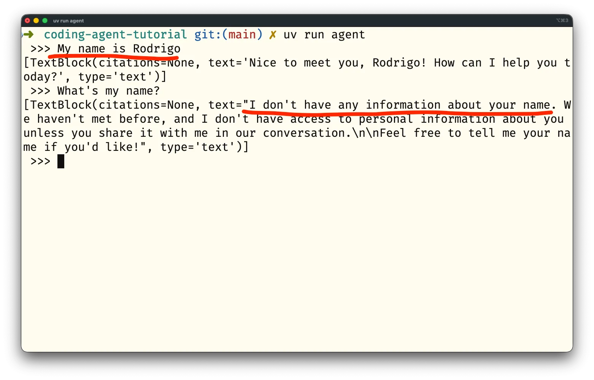
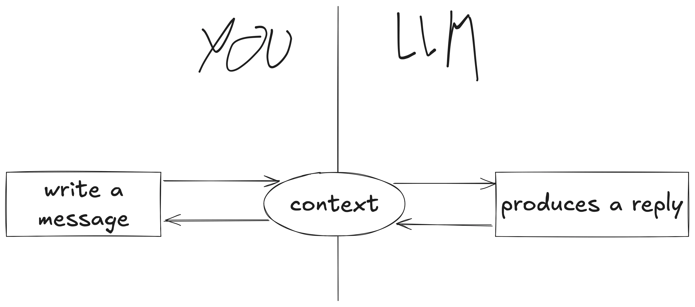
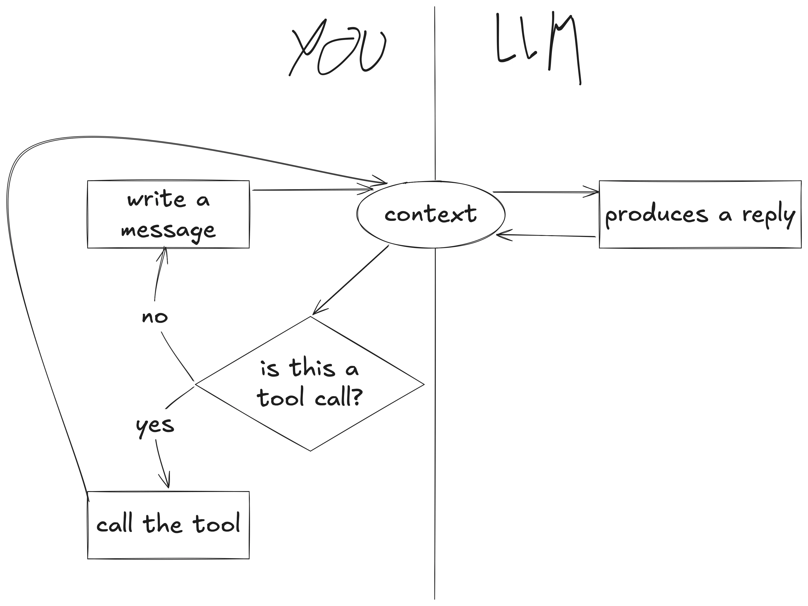
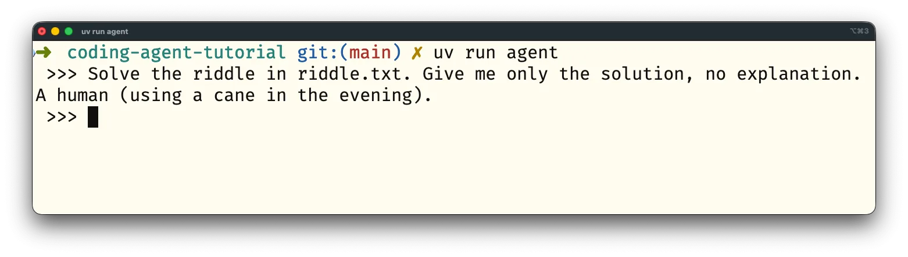
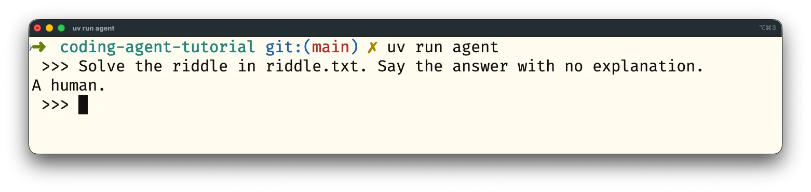
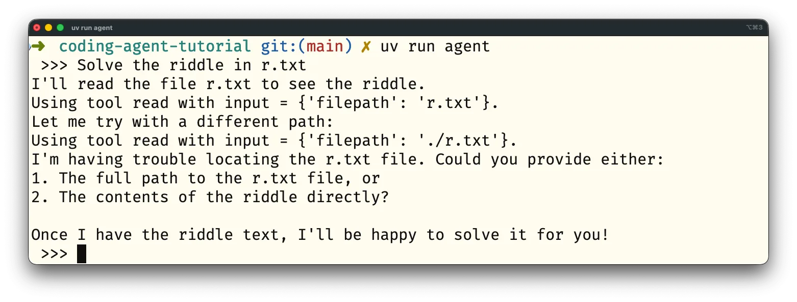
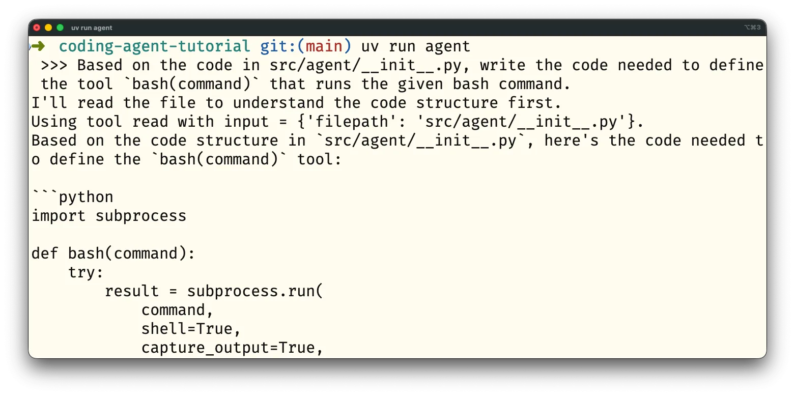

Learn how to write a coding agent in Python in this tutorial that teaches how to interact with an LLM through an API, how to manage the context, and how to do tool calling.

===

## Introduction

This tutorial will show you how to create your own **coding agent** from first principles.
By doing so, you'll understand how coding agents work under the hood.

## Prerequisites

To be able to follow this tutorial, you'll need

 - **prior Python experience**: this tutorial is not suitable for people who don't have programming experience
 - **a valid Claude API key**: you can get a Claude API key in [the Claude Console dashboard](https://platform.claude.com/dashboard)[^1]
 - **uv**: to manage the project you'll be working on

[^1]: I went through the steps in this tutorial multiple times while drafting the article, rehearsing live sessions, teaching tutorials, and more, and my spending is always under 20 cents.

The _concepts_ explained in this tutorial are independent from your LLM provider _but_ the code snippets will make use of the Claude API and its Python SDK.
This means that you can follow along with a different model provider as long as you adapt the code snippets to match the format expected by the API of your provider.

## What's a coding agent?

A **coding agent** is an agent that's specialised for coding.
In turn, an agent is just an LLM that has been extended with extra functionality that allows it to interact with its environment.
This _extra functionality_ is provided through **tools**, one of the core ideas covered in this tutorial.

This short definition still hides a lot of details, but instead of giving you a theoretical definition you can _learn_ what a coding agent is by creating one.
That starts now.

## Project set up

To set your project up, start by using uv to create a packageable app project[^2]:

[^2]: Learn more about how speed up your Python workflows with uv in [this free 4-day uv email course](/courses/uv).

```bash
% uv init --app --package agent
Initialized project `agent` at `/Users/rodrigogs/Documents/mathspp/agent`
```

Then, `cd` into the project and add the two dependencies you'll need:

```py
% cd agent
% uv add python-dotenv anthropic
```

You'll use `python-dotenv` to help you with authentication to access the Claude API and you'll use the dependency `anthropic` to make it easier to interact with the Claude API.

To set up authentication, create a `.env` file and paste your Claude API key there in front of the variable `ANTHROPIC_API_KEY`.
When you're done, your `.env` file should look like this:

```text
ANTHROPIC_API_KEY="sk-ant-api03-qI_3mJ..."
```

To make sure you _never_ upload your API key to GitHub by accident, add the file `.env` to your `.gitignore`:

```text
# .gitignore
# ... other entries generated by uv
.env
```

Now that you've set up your project, you can make your first request to the Claude API.

## Interacting with an LLM

A **coding agent** needs an LLM at its core.
Your LLM can come from any provider you want but you're going to use Claude because its SDK (the dependency `anthropic` you added in the previous section) is easy to use and because Claude is a popular model provider.

Using the `anthropic` SDK, here's how you can send a message to the LLM:

```py
# src/agent/__init__.py
from anthropic import Anthropic
import dotenv

dotenv.load_dotenv()  # Load .env

MODEL = "claude-haiku-4-5"  # Cheap, fast model for this tutorial
MAX_TOKENS = 1024  # Controls costs during experimentation


def main() -> None:
    client = Anthropic()

    response = client.messages.create(
        messages=[
            {
                "role": "user",
                "content": "Tell me a joke.",
            }
        ],
        model=MODEL,
        max_tokens=MAX_TOKENS,
    )
    print(response.content)
```

The package `anthropic` provides a class `Anthropic` that you can instantiate to create a client that can interact with the API through its methods.
This means you don't have to deal with lower-level HTTP requests and the responses.

The line `import dotenv` imports the dependency `python-dotenv` and then the function call `dotenv.load_dotenv()` will load the environment variables in your file `.env`.
In turn, this environment variable is automatically picked up by the client when it's instantiated, later on.

The global constant `MODEL` is going to control the model you interact with.
While you're experimenting, it's a good idea to pick a model that's cheap and fast, such as `claude-haiku-4-5`.
[Check the Claude documentation](https://platform.claude.com/docs/en/about-claude/models/overview) if you'd like to pick a different model.

Inside your function `main`, you instantiate the client, use its methods to send a message to Claude, and then you print the response's content.
The most important part here is noting the format of the message you're sending:

```py
messages=[
    {
        "role": "user",
        "content": "Tell me a joke.",
    }
],
```

Your message is a dictionary with two keys: `"role"` and `"content"`.
This is the format in which the API expects your messages, so there isn't much you can do about it, but you'll understand this format better as you progress through the tutorial.

Save this code in the file `src/agent/__init__.py` and run it with uv:

```bash
% uv run agent
```

If everything is ok, your output will be similar to this:

```text
[TextBlock(citations=None, text="Why don't scientists trust atoms?\n\nBecause they make up everything! 😄", type='text')]
```

The output starts with a reference to a `TextBlock`, which has to do with how the Claude API replies, and inside you can find the joke: “Why don't scientists trust atoms?\n\nBecause they make up everything! 😄”.

If you get an error complaining about your authentication/API key, make sure you pasted your key in the file `.env` that should live at the root of your project, double-check the spelling of the environment variable `ANTHROPIC_API_KEY`, and ensure you're calling `dotenv.load_dotenv` from your code.

Now that you can get a joke from an LLM, can you get a second one?

!!! **Exercise**: improve your agent by letting the user type its message, instead of hardcoding “Tell me a joke.”, and use a loop to make it a conversation.
!!! Work on this for 15 minutes, maximum, and then keep reading.

## The context of a conversation

Your first attempt at creating the illusion of a conversation between you and your agent might be creating an infinite loop around the code that asks for user input, turns it into a message dictionary, and then prints the LLM reply:

```py
def main() -> None:
    client = Anthropic()

    while True:
        user_message = input(" >>> ").strip()

        response = client.messages.create(
            messages=[
                {
                    "role": "user",
                    "content": user_message,
                }
            ],
            model=MODEL,
            max_tokens=MAX_TOKENS,
        )
        print(response.content)
```

This approach does not work, though.
If you run your agent, tell it your name, and then ask your name, the agent will say it doesn't know what your name is:



How come the agent can't tell my name is Rodrigo if I _just_ said it?
The problem is that each interaction with an LLM is a one-off interaction and there was a hint hiding in plain sight this whole time.
Note that the code to send a message to the LLM, in the call to `client.messages.create`, uses _a list_ for the parameter `messages`.
The list type is a _collection_, so it's supposed to hold multiple objects.

In this case, `messages` is supposed to be a list of messages that contains the transcript of the conversation.
If you've heard of the **context** or the **context window**, it's exactly this.
The context is the list of messages exchanged by both sides that you _resend_ on each request.
Thus, you need to modify the code to keep a running list of all the messages you send but _also_ all the messages that the LLM sends:

```py
def main() -> None:
    client = Anthropic()

    context = []  # Initialise an empty context.
    while True:
        user_message = input(" >>> ").strip()

        context.append(  # Add the new message to the context.
            {
                "role": "user",
                "content": user_message,
            }
        )
        response = client.messages.create(
            messages=context,  # Send the full context to the LLM.
            model=MODEL,
            max_tokens=MAX_TOKENS,
        )

        print(response.content)
```

But adding your messages to a running context isn't enough.
You also need to keep the LLM responses in the context, and that is why _your_ messages have the key/value pair `"role": "user"`.
To distinguish your messages from the LLM's, you use the key/value pair `"role": "assistant"` for the LLM.

To be able to save the LLM's messages in the context you need to get to their text.
The output you've been getting looks more or less like this:

```py
[
    TextBlock(
        citations=None,
        text='Nice to meet you, Rodrigo! How can I help you today?',
        type='text'
    )
]
```

The LLM response is a list of blocks.
For now, you've been getting a _single_ block that's an instance of `TextBlock`.
And the reply text is in the attribute `text` of the block.
You might get multiple blocks in the reply, so you'll want to write a loop to handle all of the blocks in the response:

```py
def main():
    # ...
    while True:
        # ...
        for block in response.content:
            if block.type == "text":
                ...  # Handle a text block.
            else:
                print(block)
                raise RuntimeError(f"Can't handle block of type {block.type}.")
```

The `else` will cover any other block types that you might not know about, raising a runtime exception so you can look at the new block type and implement the code to handle it.

For each text block, you'll want to print its text while also putting that text in the context:

```py
def main():
    # ...
    while True:
        # ...
        for block in response.content:
            if block.type == "text":
                print(block.text)
                context.append(
                    {
                        "role": "assistant",
                        "content": block.text,
                    }
                )
            else:
                print(block)
                raise RuntimeError(f"Can't handle block of type {block.type}.")
```

The new `for` loop is enough to create the illusion of a conversation between you and the LLM.
In reality, you're resending the full transcript of the conversation each time you write a new message for the LLM.

! **Tip**: the cost of sending a message increases as the conversation progresses, since you're paying for the total amount of data you're sending over the API.
! In other words, the same user prompt becomes more expensive if you send it with a longer context.

The image below is a diagram that summarises the flow of information in your agent right now:



With experience, you'll realise that managing your context well is half the battle in being able to use agents to get good results.

## User commands

The beauty of developing your own agent is that you can implement whatever commands you think are helpful or relevant.
An obvious candidate for your first command is the command `/exit` or `/quit` to allow you to gracefully close your agent.

!!! **Exercise**: modify your agent so that
!!!  - writing `/exit` or `/quit` closes your agent
!!!  - writing `/help` should list all the available commands
!!!  - writing anything else that starts with `/` should complain about an unrecognised command
!!! Work on this for 10 minutes and then keep reading.

To implement user commands, you must intercept the user input before it's sent to Claude.
That happens right after you get the user input:

```py
# ...
def main():
    client = Anthropic()

    context = []
    while True:
        user_message = input(" >>> ").strip()

        if user_message.startswith("/"):
            if user_message.startswith(("/quit", "/exit")):
                break
            elif user_message.startswith("/help"):
                print("Available commands: /exit, /help, /quit")
            else:
                print(f"Unknown command {user_message!r}. Maybe use '/help'?")
            continue
    # ...
```

By using the string method `startswith` you recognise user messages that start with the forward slash, which you assume are supposed to be user commands.
You then try to parse a known command (`/exit`, `/quit`, or `/help`) and if you can't recognise the command you let the user know about that.
Finally, because you were handling a user command, you're going to skip the rest of the loop body because you don't want to send the user command to the LLM.

You can run your agent at this point to test out some of its commands:


As your agent evolves, you're free to implement whatever commands you want.
Some ideas to fuel your criativity include commands to

 - import and export conversation history
 - manipulate your context, like clearing it fully or dropping the most recent messages

## Agents require tools

Up to this point, you've developed a nice Python script that allows you to interact with an LLM, but it isn't really an agent yet.
According to the initial definition, an agent is “an LLM that has been extended with extra functionality that allows it to interact with its environment.”
This functionality is introduced in the form of (Python) functions that your LLM might want to call...

But wait, an LLM takes tokens as input and produces tokens as output.
Simplifying it a bit, text goes in and text comes out.
How is an LLM supposed to “call Python functions”?

The trick lies in providing _instructions_ to the LLM saying that, if required, the LLM can _request_ a **tool call**.
That's what you'll learn to do next.

### Introducing a tool to read files

Suppose you want to extend your agent by giving it the ability to read files.
To do that, you need to create a tool called `read`.
This will be a function that reads the contents of the given file, so that you can send it to the LLM.
Then, when you interact with your LLM, you just need to tell it “hey, there's a function `read` that I can call for you if needed”.

In practice, when you want to introduce a tool, you start by writing the Python function that implements the functionality you care about:

```py
def read(filepath):
    from pathlib import Path

    f = Path(filepath)
    try:
        return f.read_text()
    except Exception as e:
        return f"Couldn't read the file because of this error: {e}"
```

The function `read` accepts a file path and tries to read the text from that file.

In your tools, you want to avoid exceptions at runtime.
If your tool fails, you want to let the LLM know.

After defining the function, you need to write the instructions to tell the LLM about your tool:

```py
TOOL_INSTRUCTIONS = (
    "If you need to read a file, write the message "
    + "`tool_call: read('path/to/file')`."
    + " Don't send anything else before or after the tool call."
    + " As a response, you'll get the file contents."
)
```

For the tool `read`, it's enough to give a brief description of what the tool does.
The secret sauce is in telling the LLM to reply in a very specific format.
To feed the instructions to the LLM, you'll want to _seed_ the context with this message:

```py
# ...
def read(filepath):
    from pathlib import Path

    f = Path(filepath)
    if not f.exists() or not f.is_file():
        return ""

    return f.read_text()

TOOL_INSTRUCTIONS = (
    "If you need to read a file, write the message "
    + "`tool_call: read('path/to/file')`."
    + " Don't send anything else before or after the tool call."
    + " As a response, you'll get the file contents."
)

def main():
    client = Anthropic()

    context = [
        {
            "role": "user",
            "content": TOOL_INSTRUCTIONS,
        }
    ]
    while True:
        ...
```

After you provide the tool instructions at the beginning of the context, you can try to trigger this tool usage.
At the root of your project create a file `riddle.txt` with the following contents:

```text
What's got 4 legs in the morning, 2 in the afternoon, and 3 in the evening?
```

Now, open your agent and ask it to solve the riddle in the file `riddle.txt`.
If you do, your agent should reply with the exact line `tool_call: read('riddle.txt')`:


You're getting this message because you instructed the agent specifically to send you that specific text if the LLM computed that it would be helpful to read a determined text file.
Since the riddle you want to solve is _inside_ the text file, the LLM is requesting you to read the text file.
Now, it's up to you to run the Python function that the LLM requested, and then send the result back to the LLM.

!!! **Exercise**: update your agent to recognise a tool call, extract the file path, read the file, and then send the contents back to the LLM.
!!! Work on this for 15 minutes and then keep reading.

### Handling tool calls

In order to handle tool calls, you first need to detect whether the LLM requested a tool call or not.
If it did, you'll want to call the tool and send the result back to the LLM.
If it didn't, you'll just ask the user for more input and send that new input to the LLM.
Thus, the diagram that summarises the flow of information must be updated:



The key in the updated diagram is realising that, if we ran a tool, we don't need user input because we already have new information to send to the LLM.

To handle the tool call, you need to inspect the LLM reply and see if it matches the format you specified in the tool instructions.
Then, you must try to parse the tool call information, and use it to call the actual function:

```py
# ...
for block in response.content:
    if block.type == "text":  # Text block.
        if block.text.startswith("tool_call:"):  # Tool call.
            tool_call = block.text.removeprefix("tool_call: ")

            if tool_call.startswith("read("):
                filepath = (
                    tool_call
                    .removeprefix("read(")
                    .removesuffix(")")
                    .strip("'\"")
                )
                result = read(filepath)

            else:
                print(f"Can't handle tool call {tool_call!r}.")
                continue
# ...
```

Now that you have the result, you have to put it in the context.
But the result acts as a user message, so that's the role you give it:

```py
for block in response.content:
    if block.type == "text":  # Text block.
        if block.text.startswith("tool_call:"):  # Tool call.
            tool_call = block.text.removeprefix("tool_call: ")

            if tool_call.startswith("read("):
                filepath = (
                    tool_call
                    .removeprefix("read(")
                    .removesuffix(")")
                    .strip("'\"")
                )
                result = read(filepath)

            else:
                print(f"Can't handle tool call {tool_call!r}.")
                continue

            context.append({"role": "user", "content": result})  # <--
```

But now, when are you supposed to add the assistant message to the context?
That must go _before_ the result.
So, the structure to handle each text block becomes:

 1. Add the text to the context as an assistant message.
 2. Check if it's a tool call.
    1. Check if it's a tool we know about and handle it.
    2. Put the result into the context as a user message.
 3. If it wasn't a tool call, just print the text.
 4. Update a flag that determines whether we need user input or not.

Putting everything together, here's the new loop that handles the LLM responses:

```py
for block in response.content:
    if block.type == "text":
        # 1. Add the text to the context as an assistant message.
        context.append({"role": "assistant", "content": block.text})

        # 2. Check if it's a tool call.
        if block.text.startswith("tool_call:"):
            tool_call = block.text.removeprefix("tool_call: ")

            # 2.1 Check if it's a tool we know about and handle it.
            if tool_call.startswith("read("):
                filepath = (
                    tool_call
                    .removeprefix("read(")
                    .removesuffix(")")
                    .strip("'\"")
                )
                result = read(filepath)
            else:
                print(f"Can't handle tool call {tool_call!r}.")
                continue

            # 2.2 Put the result into the context as a user message.
            context.append({"role": "user", "content": result})
            # 4. Update a flag that determines whether we need user input or not.
            need_user_input = False

        else:
            # 3. If it wasn't a tool call, just print the text.
            print(block.text)
            # 4. Update a flag that determines whether we need user input or not.
            need_user_input = True

    else:
        print(block)
        raise RuntimeError(f"Can't handle block of type {block.type}.")
```

The flag `need_user_input` is updated here so that, in the next iteration, you can tell whether you need to get user input or not.
Thus, you need to update the code at the beginning of your loop so that you only get user input if required:

```py
# ...
def main():
    client = Anthropic()

    context = [{"role": "user", "content": TOOL_INSTRUCTIONS}]
    need_user_input = True
    while True:
        if need_user_input:  # <--
            user_message = input(" >>> ").strip()

            if user_message.startswith("/"):
                if user_message.startswith(("/quit", "/exit")):
                    break
                elif user_message.startswith("/help"):
                    print("Available commands: /exit, /help, /quit")
                else:
                    print(f"Unknown command {user_message!r}. Maybe use '/help'?")
                continue

            context.append({"role": "user", "content": user_message})

        response = client.messages.create(...)
        # ...
```

After updating all your code, you can try running your agent again and asking for the solution to the riddle:



### Tool calling is just metadata and parsing

Tools like `read`, the tool you defined above, are called **client tools**.
`read` is called a **client** tool because the tool _runs_ on the client side.
This has to happen this way because you need to access your own filesystem to be able to read your own file.

To let the LLM know there's a certain tool you need to write down that information.
The LLM may then determine that it's useful to call your tool.
When that happens, the LLM provides the answer in a specific format (for example `tool_call: ...`).
You have to parse that response, grab the arguments for your tools, run the tools, and send the results back.
That's it.

If this is a bit disappointing, good.
It's because you understood there's really no magic involved.
There's a lot of ingenious ideas at play, but no dark magic.

If you'd like some extra practice with defining and handling tools, check the next exercise.
If not, proceed to the next section.

!!! **Exercise**: create and define a tool `ls` that lists the contents of a directory.
!!! Make sure instructions for how to use that tool are provided to the LLM and handle calls to the tool `ls`.
!!! Use your agent and try to trigger the tool call `ls`.

### Tool schema definition

Claude provides mechanisms that make it easier to define and work with tools.
The manual work you did above was great because it showed you there's no magic involved in tool calling.
However, in production, it's preferred to use the mechanisms that the Claude API provides because they provide many advantages:

 - **simplicity**: the Claude API makes it easier to define tools and to handle tool call requests
 - **robustness**: by using the appropriate mechanisms, the agent is more likely to try to use the right tools at the right time and you're more likely to get the right arguments for those tools

To define a tool in the way that the Claude API expects, you'll create a dictionary with three keys:

| Key | Purpose |
| | |
| `name` | The name of the tool (typically, the function name) |
| `description` | A detailed description of what the tool does and when it should be used |
| `input_schema` | A valid JSON Schema object that defines the parameters of the tool |

These three keys are mandatory.
There are a couple of other optional keys, but you can ignore them for now.

As an example tool definition, here's how you could define the tool `read`:

```py
# ...
TOOLS = []  # <-- List that'll collect all tool definitions.

def read(filepath):
    ...

TOOLS.append(
    {
        "name": "read",
        "description": "Reads the text contents of a file given its filepath.",
        "input_schema": {
            "type": "object",
            "properties": {
                "filepath": {
                    "type": "string",
                    "description": "The relative or absolute path of the file to read.",
                }
            },
            "required": ["filepath"],
        }
    }
)
# ...
```

After defining the tool `read`, you can delete the old string `TOOL_INSTRUCTIONS` and remove it from the list `context`.
The Claude API expects tools to be passed in through the parameter `tools` of the function `client.messages.create`:

```py
# TOOLS defined and updated here...
# ...
def main():
    client = Anthropic()

    context = []  # <-- No longer initialised with TOOL_INSTRUCTIONS.
    need_user_input = True
    while True:
        if need_user_input:
            user_message = input(" >>> ").strip()

            ... # Handle user commands here...

            context.append({"role": "user", "content": user_message})

        response = client.messages.create(
            messages=context,
            model=MODEL,
            max_tokens=MAX_TOKENS,
            tools=TOOLS,  # <-- Tool information is passed in here.
        )
```

When you define tools in the way that the Claude API expects, responses with tool uses are returned in a different format.
Replace the loop that handles the LLM response with this simpler version:

```py
# ...
for block in response.content:
    print(block)
    if block.type == "text":
        context.append({"role": "assistant", "content": block.text})
    else:
        raise RuntimeError(f"Can't handle block of type {block.type}.")
```

Now, run your agent and try to trigger a tool call.
For example, ask it to solve the riddle in the file `riddle.txt`:


If you successfully trigger a tool call, you'll see a new type of block that you haven't handled before, the `ToolUseBlock`.
The Claude API returns those blocks to indicate that the LLM wants to run a tool.
The `ToolUseBlock` can be identified by its type, which is `tool_use`.
It also contains three other pieces of information that are relevant to you:

 - `id`: used by the API to match tool use requests with their results
 - `input`: the arguments to be passed to the function
 - `name`: the name of the function to be used

Once you've handled the tool call, [your response should have the following format](https://platform.claude.com/docs/en/agents-and-tools/tool-use/handle-tool-calls):

```py
{
    "role": "user",
    "content": [
        {
            "type": "tool_result",
            "tool_use_id": ...,  # The id from the ToolUseBlock instance.
            "content": ...,  # The result from the tool call, as a string.
        }
    ]
}
```

_Your response must follow the tool use block immediately_, so you must also add the tool use information to the context.
After asking the model to solve the riddle for you, getting the tool use, and computing the response, your context might look like this:

```py
[
    # Your initial prompt:
    {"role": "user", "content": "Solve the riddle in riddle.txt"},
    # The assistant reply starts with some text...
    {"role": "assistant", "content": "Let me read the file riddle.txt first."},
    # ... followed by the tool use request:
    {
        "role": "assistant",
        "content": [
            {
                "type": "tool_use",
                "id": "tool_use_fake_id_abc123",
                "name": "read",
                "input": {"filepath": "riddle.txt"},
            },
        ],
    },
    # To which you reply:
    {
        "role": "user",
        "content": [
            {
                "type": "tool_result",
                "tool_use_id": "tool_use_fake_id_abc123",
                "content": "What's got 4 legs in the morning, 2 in ...",
            }
        ]
    }
]
```

!!! **Exercise**: using the examples above to guide you, handle the tool use blocks from your agent.
!!! When you're done, you should be able to solve the riddle in `riddle.txt` through the tool `read`.
!!! Work on this for up to 20 minutes and then keep reading.

### Working with tool use blocks

You're now going to learn how to handle tool blocks.
The exercise above gave you just enough information for you to get to a working solution with a bit of effort and sweat.
The solution you'll see here uses a couple more tricks that weren't strictly required, but that arguably simplify things.[^3]

[^3]: You might wonder “What was the point of the exercise, then?” From a pedagogical point of view, the exercise made total sense. You're given just enough information to solve the task, otherwise you'd be struck by information overload. Also, spending some time trying to tackle a task primes you to understand the solution. If you're just skipping to the solution, you won't understand it as well.

! For the remainder of this section, the code snippets all belong inside the infinite `while True` loop, at the bottom.

Your starting point is a loop that handles the response blocks by doing barely anything:

```py
for block in response.content:
    print(block)
    if block.type == "text":
        context.append({"role": "assistant", "content": block.text})
    else:
        raise RuntimeError(f"Can't handle block of type {block.type}.")
```

The first thing you're going to do is create a list `content_dictionaries`.
When the assistant sends you multiple blocks, you can aggregate the contents of each block to create a _single_ assistant message in the context:

```py
content_dictionaries = []
for block in response.content:
    content_dictionaries.append(block.to_dict())
    if block.type == "text":
        print(block.text)
    else:
        print(block)
        raise RuntimeError(f"Can't handle block of type {block.type}.")

context.append({"role": "assistant", "content": content_dictionaries})
```

The line `content_dictionaries.append(block.to_dict())` leverages the fact that each block is, in fact, a Pydantic model.
Pydantic models have a method `to_dict` that converts them to a dictionary and those dictionaries contain the information you need.
This dictionary conversion can happen _independently_ of the type of block, which is why it happens _before_ the conditional statement.

The next thing you're going to do is to create a list where you'll aggregate tool results.
While you haven't seen it yet, you may also get _multiple_ tool use blocks in a single response, so this list simplifies things for you:

```py
content_dictionaries = []
tool_results = []
for block in response.content:
    content_dictionaries.append(block.to_dict())
    if block.type == "text":
        print(block.text)
    else:
        print(block)
        raise RuntimeError(f"Can't handle block of type {block.type}.")

context.append({"role": "assistant", "content": content_dictionaries})
if tool_results:
    context.append({"role": "user", "content": tool_results})
need_user_input = not tool_results
```

You can also write the flag `need_user_input` in terms of the list `tool_results`.
You only need user input if you _don't_ have tool results.

Now that you have a place to aggregate your tool results, you have to handle tools.
This piece of code is going to be very similar to what you had before:

```py
content_dictionaries = []
tool_results = []
for block in response.content:
    content_dictionaries.append(block.to_dict())
    if block.type == "text":
        print(block.text)

    elif block.type == "tool_use":
        if block.name == "read":
            result = read(block.input["filepath"])
        else:
            result = f"Unknown tool {block.name}."

        tool_results.append(
            {
                "type": "tool_result",
                "tool_use_id": block.id,
                "content": result,
            }
        )

    else:
        print(block)
        raise RuntimeError(f"Can't handle block of type {block.type}.")
```

This time, if the LLM tries to call a tool you don't know about, you write the result as a basic error message to send back to the LLM.
At this point, your agent is already capable of working with tools again:



The screenshot above shows that the agent is able to use tool calls again, but it also shows that it's not clear to the user that that's what's happening.
You may want to let the user know that your agent is going to run a tool by printing something:

```py
# ...
for block in response.content:
    content_dictionaries.append(block.to_dict())
    if block.type == "text":
        print(block.text)

    elif block.type == "tool_use":
        print(f"Using tool {block.name} with input = {block.input}.")
        # ...
```

This makes the agent session a bit more responsive by providing a visual cue that a tool is running.

### Handling errors in tool calls

When working with tools, the tools you're using might fail.
For example, the LLM might try reading a file that doesn't really exist.
When that happens, there's a mechanism you can use to signal that an error occurred:

```py
for block in response.content:
    content_dictionaries.append(block.to_dict())
    if block.type == "text":
        print(block.text)

    elif block.type == "tool_use":
        print(f"Using tool {block.name} with input = {block.input}.")
        if block.name == "read":
            is_error, result = read(block.input["filepath"])
        else:
            is_error, result = True, f"Unknown tool {block.name}."

        tool_results.append(
            {
                "type": "tool_result",
                "tool_use_id": block.id,
                "content": result,
                "is_error": is_error,  # <-- Error flag.
            }
        )

    # ...
```

The dictionaries that contain tool results can have an optional key `"is_error"` that indicates whether there was an error or not.
For this to work, you need your tool functions to return that Boolean indicating whether the tool call resulted in an error or not.

For your function `read`, it's enough to return `False` alongside the file text or `True` alongside the error message:

```py
def read(filepath):
    from pathlib import Path

    f = Path(filepath)
    try:
        return False, f.read_text()
    except Exception as e:
        return True, f"read({filepath}) failed: str(e)"
```

Flagging errors makes your agent more robust.
For example, if you ask your agent to solve the riddle in the file `r.txt`, which doesn't exist, you can see your agent retrying the tool call and then saying it can't find the file:



At this point you've managed to create an agent that defines a couple of user commands and can read files through tool use...
But is it a coding agent?

## Coding tools

Your agent isn't much of a coding agent yet because it can't really _write code_ or _run code_, but you can change that!
To turn your agent into a _coding agent_ you'll want to define a couple of new tools:

 1. `bash(command)`: runs the given bash command, for example `ls -al .` or `python myscript.py`
 2. `write(filepath, content)`: writes the string `content` to the file `filepath`
 3. `replace(filepath, old, new)`: replaces occurrences of the string `old` with occurrences of the string `new` in the file `filepath`
 4. `insert(filepath, line, content)`: inserts the string `content` at the line number `line` in the file `filepath`

!!! **Exercise**: implement the four tools listed above and test each one of them by triggering the respective tool calls in your agent.
!!! For the tool `bash`, you'll want to look at the module `subprocess`.

### Running bash commands

The brilliance of this exercise is that you can already use your agent to help you improve your agent.
In fact, you can run your agent and ask it to write the code needed for the `bash` tool based on the code already available in `src/agent/__init__.py`:



The screenshot shows that while the agent can't write its own code yet, it can already read its own source code and print the code you requested.

Here's a possible implementation of the tool `bash`:

```py
# ...
def bash(command):
    import subprocess

    try:
        result = subprocess.run(
            command, shell=True, capture_output=True, text=True, timeout=30
        )
        return False, result.stdout if result.returncode == 0 else result.stderr
    except subprocess.TimeoutExpired:
        return True, f"bash({command}) timed out after 30 seconds"
    except Exception as e:
        return True, f"bash({command}) failed: {str(e)}"
# ...
```

The function `bash` can run arbitrary commands on your computer, so it may be a good idea to add some guardrails.
To err on the side of precaution, let's prompt the user every time you're about to run a command:

```py
def bash(command):
    import subprocess

    print(f"About to run the command {command!r}.")
    allow = input("Allow? y/n >>> ").strip().casefold()
    if not allow.startswith("y"):
        return True, f"Running the command {command!r} was not authorised."

    try:
        result = subprocess.run(
            command, shell=True, capture_output=True, text=True, timeout=30
        )
        return False, result.stdout if result.returncode == 0 else result.stderr
    except subprocess.TimeoutExpired:
        return True, f"bash({command}) timed out after 30 seconds"
    except Exception as e:
        return True, f"bash({command}) failed: {str(e)}"
```

You'll want to add the function `bash` alongside its tool definition:

```py
# ...
TOOLS.append(
    {
        "name": "bash",
        "description": "Runs a bash command and returns the output.",
        "input_schema": {
            "type": "object",
            "properties": {
                "command": {
                    "type": "string",
                    "description": "The bash command to execute.",
                }
            },
            "required": ["command"],
        },
    }
)
# ...
```

Finally, in the loop that handles tool calls, you'll call `bash` if the LLM requests that tool:

```py
# ...
for block in response.content:
    content_dictionaries.append(block.to_dict())
    if block.type == "text":
        print(block.text)

    elif block.type == "tool_use":
        print(f"Using tool {block.name} with input = {block.input}.")
        if block.name == "read":
            is_error, result = read(block.input["filepath"])
        elif block.name == "bash":  # <-- Handle the new tool.
            is_error, result = bash(block.input["command"])
        else:
            is_error, result = True, f"Unknown tool {block.name}."
# ...
```

To test this new tool, you can try asking questions about the files that are available in your current directory.
This should make your agent try to run the command `ls`, or a similar command.

### Text editing tools

Following a similar strategy, you can get your agent to write the code for the tools `write`, `replace`, and `insert`.

<details markdown="1">
<summary>Example implementations of <code>write</code>, <code>replace</code>, and <code>insert</code></summary>

Function definitions and tool definitions:

```py
def write(filepath, content):
    from pathlib import Path

    f = Path(filepath)
    try:
        f.write_text(content)
        return False, f"Successfully wrote to {filepath}"
    except Exception as e:
        return True, f"write({filepath}) failed: {str(e)}"


TOOLS.append(
    {
        "name": "write",
        "description": "Writes the string content to the file filepath.",
        "input_schema": {
            "type": "object",
            "properties": {
                "filepath": {
                    "type": "string",
                    "description": "The relative or absolute path of the file to write.",
                },
                "content": {
                    "type": "string",
                    "description": "The string content to write to the file.",
                },
            },
            "required": ["filepath", "content"],
        },
    }
)


def replace(filepath, old, new):
    from pathlib import Path

    f = Path(filepath)
    try:
        content = f.read_text()
        new_content = content.replace(old, new)
        f.write_text(new_content)
        return False, f"Successfully replaced occurrences in {filepath}"
    except Exception as e:
        return True, f"replace({filepath}) failed: {str(e)}"


TOOLS.append(
    {
        "name": "replace",
        "description": "Replaces occurrences of the string old with occurrences of the string new in the file filepath.",
        "input_schema": {
            "type": "object",
            "properties": {
                "filepath": {
                    "type": "string",
                    "description": "The relative or absolute path of the file to modify.",
                },
                "old": {
                    "type": "string",
                    "description": "The string to be replaced.",
                },
                "new": {
                    "type": "string",
                    "description": "The string to replace with.",
                },
            },
            "required": ["filepath", "old", "new"],
        },
    }
)


def insert(filepath, line, content):
    from pathlib import Path

    f = Path(filepath)
    try:
        lines = f.read_text().splitlines(keepends=True)
        # Insert at the specified line (1-indexed)
        if line < 1 or line > len(lines) + 1:
            return (
                True,
                f"insert({filepath}) failed: line number {line} out of range (1-{len(lines) + 1})",
            )
        lines.insert(line - 1, content if content.endswith("\n") else content + "\n")
        f.write_text("".join(lines))
        return False, f"Successfully inserted content at line {line} in {filepath}"
    except Exception as e:
        return True, f"insert({filepath}) failed: {str(e)}"


TOOLS.append(
    {
        "name": "insert",
        "description": "Inserts the string content at the line number line in the file filepath.",
        "input_schema": {
            "type": "object",
            "properties": {
                "filepath": {
                    "type": "string",
                    "description": "The relative or absolute path of the file to modify.",
                },
                "line": {
                    "type": "integer",
                    "description": "The line number where content should be inserted (1-indexed).",
                },
                "content": {
                    "type": "string",
                    "description": "The string content to insert.",
                },
            },
            "required": ["filepath", "line", "content"],
        },
    }
)

# ...
```

Tool use code:

```py
# ...
for block in response.content:
    content_dictionaries.append(block.to_dict())
    if block.type == "text":
        print(block.text)

    elif block.type == "tool_use":
        print(f"Using tool {block.name} with input = {block.input}.")
        if block.name == "read":
            is_error, result = read(block.input["filepath"])
        elif block.name == "bash":
            is_error, result = bash(block.input["command"])
        elif block.name == "write":
            is_error, result = write(
                block.input["filepath"], block.input["content"]
            )
        elif block.name == "replace":
            is_error, result = replace(
                block.input["filepath"], block.input["old"], block.input["new"]
            )
        elif block.name == "insert":
            is_error, result = insert(
                block.input["filepath"],
                block.input["line"],
                block.input["content"],
            )
        else:
            is_error, result = True, f"Unknown tool {block.name}."
    # ...
```

</details>

These three text editing tools, together with the tools `bash` and `read`, provide enough for your agent to be able to write and run code.
To test them, you can ask your agent to write some code and to run it.
As an example, I asked “Create a file fibonacci.py that computes the 40th Fibonacci number and then run it with uv to tell me what's the 40th Fibonacci number.”
The agent proceeded to write the file `fibonacci.py`:

```py
def fibonacci(n):
    """Compute the nth Fibonacci number"""
    if n <= 0:
        return 0
    elif n == 1:
        return 1
    else:
        a, b = 0, 1
        for _ in range(2, n + 1):
            a, b = b, a + b
        return b

# Calculate and print the 40th Fibonacci number
result = fibonacci(40)
print(f"The 40th Fibonacci number is: {result}")
```

It then ran the script and reported the right answer.

## Conclusion and next steps

By using the Claude API, you were able to create a coding agent that

 - uses a context to keep a conversation going with the user
 - defines user commands to provide high-level functionality
 - provides five tools that the agent can use to read, write, and execute code

If you ignore the function definitions, all your code fits in _under_ 100 lines of code, which is pretty impressive.
You can get the full agent code [from this GitHub repository](https://github.com/mathspp/coding-agent-tutorial).

To keep exploring the world of coding agents, there are three natural directions in which you can take your agent:

 1. learn about the [Anthropic-provided tools](https://platform.claude.com/docs/en/agents-and-tools/tool-use/tool-reference), that you can leverage to create a coding agent that's even more robust
 2. implement [response streaming](https://platform.claude.com/docs/en/cli-sdks-libraries/sdks/python#streaming-responses) to allow the agent to provide longer responses and to use more tools
 3. improve the agent UI, for example by using `rich` to add colours to the output or by using `textual` to add a TUI to the agent


