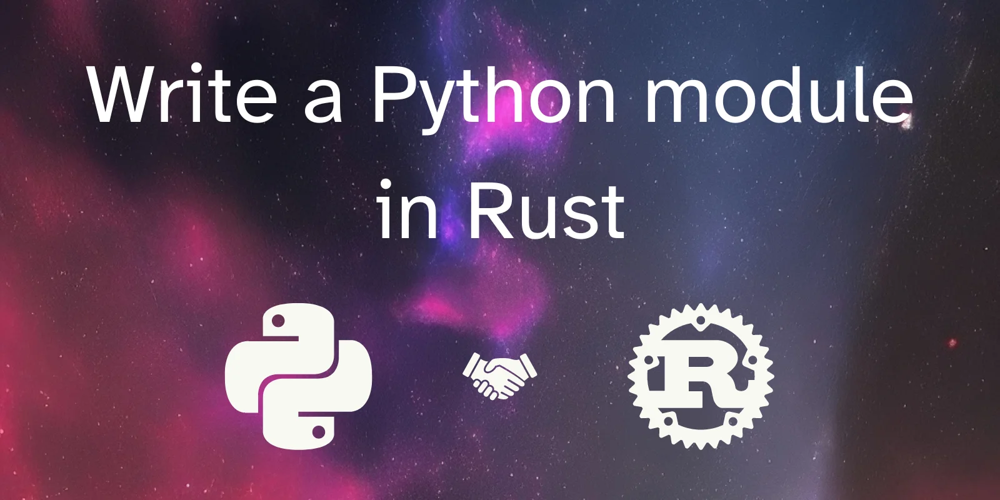

Learn how to write your first Python module in Rust.

===



## Introduction

I'm not going to open with a long-winded introduction explaining why Rust is so awesome and great.
I don't know if it is or not.
I just hear a lot about Rust and I wanted to try and write a Python module in Rust.
So, I did!


## Set up

To follow this tutorial, you need to start by installing Rust.
You can head over to [rust-lang.org](https://www.rust-lang.org/tools/install) and follow the installation instructions there.

Then, we'll use PyO3 to bind Python and Rust together.
To make our lives easier, we set everything up through maturin, which I understand simplifies the process a bit.

Start by creating a virtual environment in a folder for this project:

```bash
$ mkdir rust-factorial
$ cd rust-factorial
$ python -m venv .env
$ source .env/bin/activate  # Activate the virtual env.
$ pip install maturin
```

After installing maturin, we use the command `maturin init` to create a project.
When asked for it, select the `pyo3` bindings!

Maturin will go ahead and create a couple of files for you.
They'll contain a simple, working example of a Python module written in Rust.

You can actually see it already works by running the command `maturin develop` and then using the module from Python:

```bash
$ maturin develop
## lots of progress output as maturin runs the compilation...
$ python
>>> import rust_factorial
>>> rust_factorial.sum_as_string(5, 20)
'25'
```

Now, let us write our own Rust code.


## A factorial function in Rust

As my first attempt at writing some Rust code, I decided to write the factorial function.
Between some educated guesses and compiler errors, I managed to put this together:

```rs
fn factorial(n: u128) -> u128 {
    if n <= 1 {
        return n
    } else {
        return n * factorial(n - 1)
    }
}
```

This is the base Rust code I used.

Then, I need to fit this into the file `lib.rs` that maturin created for me:

```rs
use pyo3::prelude::*;

/// Formats the sum of two numbers as string.
#[pyfunction]
fn sum_as_string(a: usize, b: usize) -> PyResult<String> {
    Ok((a + b).to_string())
}

/// A Python module implemented in Rust.
#[pymodule]
fn rust_factorial(_py: Python, m: &PyModule) -> PyResult<()> {
    m.add_function(wrap_pyfunction!(sum_as_string, m)?)?;
    Ok(())
}
```

The function `factorial` is going to replace the function `sum_as_string`, so it looks like it takes some arguments and then it needs to return a data type that is compatible with Python.
That's what I gather from the `PyResult<String>` result.

The [PyO3 documentation](https://pyo3.rs/v0.18.0/conversions/tables) tells me I can use Rust integer types inside the `PyResult`, so I tried this:

```rs
use pyo3::prelude::*;

fn factorial(n: u128) -> PyResult<u128> {
    if n <= 1 {
        Ok(n)
    } else {
        Ok(n * factorial(n - 1))
    }
}

#[pymodule]
fn rust_factorial(_py: Python, m: &PyModule) -> PyResult<()> {
    m.add_function(wrap_pyfunction!(factorial, m)?)?;
    Ok(())
}
```

Now, this gives me errors, because the recursive function is trying to multiply a regular Rust integer with the `PyResult` thing, so I actually added my original, 100% Rust function as `_factorial`, and then I wrote a wrapper around that:

```rs
use pyo3::prelude::*;

#[pyfunction]
fn factorial(n: u128) -> PyResult<u128> {
    Ok(_factorial(n))
}

fn _factorial(n: u128) -> u128 {
    if n <= 1 {
        return n
    } else {
        return n * _factorial(n - 1)
    }
}

#[pymodule]
fn rust_factorial(_py: Python, m: &PyModule) -> PyResult<()> {
    m.add_function(wrap_pyfunction!(factorial, m)?)?;
    Ok(())
}
```

Now, running `maturin develop` should enable you to use this factorial function:

```bash
$ maturin develop
$ python
>>> import rust_factorial
>>> rust_factorial.factorial(15)
1307674368000
>>> import math
>>> rust_factorial.factorial(20) == math.factorial(20)
True
```

And that's it!
That's pretty much the whole account of my adventure!
It was surprisingly easy to get everything up and running although I did write code with errors!
I didn't even need to get ChatGPT's help, though!

Do you have any experience with writing Python modules in Rust?
Get in touch if you do!
