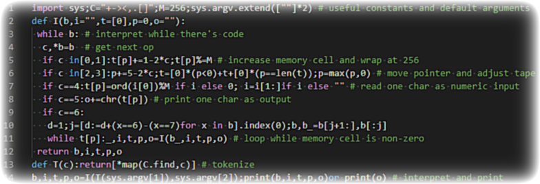

---
metadata:
    description: Neste artigo mostro como escrever um interpretador completo para uma linguagem de programação em menos de 15 linhas de Python.
title: Escrever um interpretador em 14 linhas de Python
---

Neste artigo vou mostrar-te como escreveres um interpretador para a linguagem de programação [brainf*ck][bf] em apenas 14 linhas de Python. No entanto, preciso que te prepares para veres código Python que não é nada convencional!

===



# Preâmbulo

Quando acabares de ler este artigo, vais ter um interpretador de [brainf\*ck][bf] que interpreta o código brainf\*ck `+[-->-[>>+>-----<<]<--<---]>-.>>>+.>>..+++[.>]<<<<.+++.------.<<-.>>>>+.` para produzir a mensagem `"Hello, World!"`.

Ainda por cima, vais fazê-lo em apenas 14 linhas (pouco convencionais) de código Python!

## O código

Podes descarregar o código [daqui][code].
Para tua conveniência, também o podes copiar [daqui][gh-raw].
Para correres o código precisas de Python 3.8 ou superior.
Assumindo que gravaste o código no ficheiro `braifck.py`,
podes correr o exemplo de cima com

```sh
python brainfck.py "+[-->-[>>+>-----<<]<--<---]>-.>>>+.>>..+++[.>]<<<<.+++.------.<<-.>>>>+."
```

mas um exemplo mais simples é capaz de ser

```sh
python brainfck.py ",[>,]<[.<]" "This will get reversed!"
```

A sintaxe da linha de comandos é `brainfck.py [codigo | ficheiro] [input do programa]` e o código Python que faz a magia acontecer é

```py
from sys import*;import io,os;V=argv;V.extend([""]*2);stdin=io.StringIO(V[2])if V[2]else stdin
r=os.path.exists(V[1]);f=r and open(V[1]);b=f.read()if r else V[1];r and f.close()
def I(b,t,p):
 while b: # interpret while there's code
  c,*b=b;c="+-><,.[]".find(c) # get next op
  if c in[0,1]:t[p]+=1-2*c;t[p]%=256 # increase memory cell and wrap at 256
  if c in[2,3]:p+=5-2*c;t=[0]*(p<0)+t+[0]*(p==len(t));p=max(p,0) # move pointer and adjust tape
  if c==4:i=stdin.read(1)or chr(0);t[p]=ord(i)%256 # read one char as numeric input
  if c==5:stdout.write(chr(t[p])) # print one char as output
  if c==6:
   d=1;j=[d:=d+(x=="[")-(x=="]")for x in b].index(0);b,b_=b[j+1:],b[:j]
   while t[p]:t,p=I(b_,t,p) # loop while memory cell is non-zero
 return t,p
t,p=I(b,[0],0);print();print(t,p) # interpret and print debugging info
```

Continua a ler para perceberes o que é que este código faz!

# Brainf*ck

(desce para "[Implementar o interpretador](#implementar-o-interpretador)"
se sabes o que brainf\*ck é e como programar nesta linguagem.)

[Brainf*ck][bf] é uma [linguagem de programação esóterica][epl] minimalista,
o que significa que a linguagem brainf\*ck não foi criada com a preocupação
de ser facilmente utilizável.
Programas em brainf\*ck são escritos com os oito comandos `+-><,.[]`, e
programar em brainf\*ck é mais ou menos como programar diretamente uma
máquina de Turing...
(Se não sabes o que isto quer dizer, não faz mal.)

## Programar em brainf*ck

A execução dos programas de brainf\*ck acontece numa banda
que contém um número infinito de células.
Cada célula tem a capacidade para guardar o valor
de um número inteiro não negativo com 8 bits (ou seja, inteiros de 0 a 255).

Durante a execução de um programa em brainf\*ck há sempre uma célula para
a qual estamos a "olhar",
e a célula para que estamos a olhar é controlada por um ponteiro.

Todos os programas de brainf\*ck começam no mesmo estado da banda/ponteiro:

```
células
-------
[0][0][0][0][0]...
 ^ ponteiro
```

4 das 8 operações básicas servem para mexer o ponteiro para a direita `>` e esquerda `<`,
bem como para aumentar `+` e reduzir `-` o valor da célula atual.

Por exemplo, o programa `+++` resulta em

```
células
-------
[3][0][0][0][0]...
 ^ ponteiro
```

e o programa `+++>++>>++` dá

```
células
-------
[3][2][0][2][0]...
          ^ ponteiro
```

As células só podem conter valores entre 0 e 255,
por isso muitas implementações decidem fazer com que os números dêem a volta
se se tornarem maiores que 255 ou menores que 0.
Desse modo, o programa `-` resulta em

```
células
-------
[255][0][0][0][0]...
 ^ ponteiro
```

porque descer abaixo de 0 dá 255.

As duas operações que se seguem são `,.` e servem para fazer a entrada
e saída de informação do programa.
`,` lê um caracter para a célula atual, mas o caracter é convertido
para o seu código ASCII antes de ser escrito na célula.
Assim, se o caracter `"a"` for lido por um comando `,`, o resultado será

```
células
-------
[97][0][0][0][0]...
 ^ ponteiro
```

porque o `"a"` tem o código 97.
([Nesta][ascii] tabela encontras o código dos 256 caracteres ASCII.)

Do mesmo modo, `.` é usado para imprimir o caracter correspondente ao valor
da célula atual.
Por exemplo, se o código `,+.` for corrido com o input `"a"` então a banda fica

```
células
----------
[98][0][0][0][0]...
 ^ ponteiro
```

e o programa imprime o resultado `"b"`.
Mas não precisas de acreditar em mim!
[Descarrega][code] o código, grava-o no ficheiro `brainfck.py` e corre o comando

```py
python brainfck.py ",+." "a"
```

Finalmente, os comandos `[]` são para criar ciclos.
`[` começa um ciclo `while` e `]` termina o ciclo.
Quando a execução de um programa chega a `[`, só vai correr o código entre `[]`
**enquanto** a célula atual não for 0.
Por exemplo, se a banda de células se parecer com algum dos casos em baixo
quando chegamos a um `[`, então o código entre `[` e `]` é executado.

```
células              |  células            |  células
-------              |  -------            |  -------
[98][0][0][0][0]...  |  [0][1][0][255]...  |  [0][0][0][73]...
 ^ ponteiro          |      ^ ponteiro     |            ^ ponteiro
```

O programa repete o código entre `[]` se, quando chegamos a `]`,
a célula atual não for 0.

Isto é mais ou menos equivalente ao código Python

```py
while tape[pointer]:
    interpret(code_between_brackets)
```

Nota imporante: o código entre `[]` *pode* fazer o ponteiro mexer-se,
portanto a célula que interessa quando chegamos a `]` é a célula *atual*,
não a célula que foi verificada quando o ciclo começou.

Também vale a pena notar que podemos ter um número arbitrário de `[]`
dentro uns dos outros.

Agora que sabemos como programar em brainf\*ck,
está na hora de escrever o interpretador!

# Implementar o interpretador

Antes de mais nada, temos de tomar um par de decisões
quanto às especificações do interpretador.

## Especificações

O nosso interpretador vai cumprir as seguintes especificações:

 - A banda de células é infinita nas duas direções.
 - O valor inicial de cada célula é 0 (isto é standard).
 - O primeiro argumento da linha de comandos é para o código a ser interpretado:
   - pode ser código brainf\*ck, ou
   - o caminho para um ficheiro com código brainf\*ck.
 - O input pode ser dado
   - antes do programa começar a ser executado, como segundo argumento na linha de comandos;
   - interativamente durante a execução do programa.
 - Tentar ler mais input com `,` quando não o há faz com que a célula atual passe a valer `0`.
 - Os valores das células estão sempre entre 0 e 255.

Agora que já sabemos *exatamente* o que queremos podemos escrever o nosso código Python!

## Implementação

Aqui está a implementação completa do interpretador, em 14 linhas de código:

```py
from sys import*;import io,os;V=argv;V.extend([""]*2);stdin=io.StringIO(V[2])if V[2]else stdin
r=os.path.exists(V[1]);f=r and open(V[1]);b=f.read()if r else V[1];r and f.close()
def I(b,t,p):
 while b: # interpret while there's code
  c,*b=b;c="+-><,.[]".find(c) # get next op
  if c in[0,1]:t[p]+=1-2*c;t[p]%=256 # increase memory cell and wrap at 256
  if c in[2,3]:p+=5-2*c;t=[0]*(p<0)+t+[0]*(p==len(t));p=max(p,0) # move pointer and adjust tape
  if c==4:i=stdin.read(1)or chr(0);t[p]=ord(i)%256 # read one char as numeric input
  if c==5:stdout.write(chr(t[p])) # print one char as output
  if c==6:
   d=1;j=[d:=d+(x=="[")-(x=="]")for x in b].index(0);b,b_=b[j+1:],b[:j]
   while t[p]:t,p=I(b_,t,p) # loop while memory cell is non-zero
 return t,p
t,p=I(b,[0],0);print();print(t,p) # interpret and print debugging info
```

!! Este código Python não segue um estilo convencional e eu não estou,
!! de modo nenhum, a querer encorajar que escrevam código Python deste estilo.
!! O código foi escrito assim para eu fazer uma experiência.

## Funcionamento geral do código

As duas primeiras linhas preparam algumas coisas úteis, tais como
 - importar librarias úteis,
 - definir argumentos da linha de comandos por defeito,
 - decidir se lemos o input interativamente ou da linha de comandos
 - e decidir se o código foi dado como argumento da linha de comandos ou se deve ser lido de um ficheiro.

De seguida, definimos a função `I` que interpreta código brainf\*ck.
Os vários `if`s servem para distinguir os vários comandos.
O comando que precisa de ser tratado com mais cuidado é o `[`,
que desencadeia uma (ou várias) chamada recursiva da função `I`.

Finalmente, a última linha do programa interpreta o código brainf\*ck e
imprime algumas informações para efeitos de depuração do código brainf\*ck.

# O código, instrução a instrução

Agora vou explicar o código Python, instrução a instrução.

## `from sys import *`

Importo tudo o que está em `sys` para que me possa referir a `argv` (os argumentos da linha de comandos), `stdin` (o objeto de onde vem o input por defeito)
e `stdout` (o objeto para onde imprimimos coisas por defeito) sem ter de escrever `sys.` antes.

## `import io,os`

Importo `io` para poder usar o objeto `StringIO`, que uso para substituir `stdin`
no caso em que queremos que o input do programa seja o dado pelo segundo argumento
da linha de comandos, em vez de lido interativamente.

Também import `os` para poder verificar se o utilizador está a tentar ler
o código brainf\*ck de um ficheiro ou não.

## `V=argv`

Defino um nome mais curto para `argv` porque sou preguiçoso.

## `V.extend([""]*2)`

Extendemos a lista dos argumentos da linha de comandos com duas
strings vazias para que possa fazer as indexações `V[1]` e `V[2]`
sem ter o problema de `V` ser uma lista demasiado curta.
`V[1]` tem o código brainf\*ck que vai ser interpretado, ou o caminho
para o ficheiro com esse código, e `V[2]` tem o input se não quisermos
que o input seja lido de forma interativa.

## `stdin=io.StringIO(V[2])if V[2]else stdin`

Caso o segundo argumento da linha de comandos seja especificado,
queremos que esse argumento seja lido como se fosse o objeto
standard de onde lemos o input.
Fazemos isso criando um objeto `StringIO`.

Se `V[2]` não tiver nada, então `stdin = stdin` não faz nada
e mais tarde o input é lido interativamente.

## `r=os.path.exists(V[1])`

`r` vai tomar um valor lógico que nos diz se lemos o código brainf\*ck de um ficheiro.

## `f=r and open(V[1])`

Esta atribuição usa "short-circuiting" para fazer uma de duas coisas:
 - atribuir a `f` o valor `False` se não precisarmos de ler o código brainf\*ck de um ficheiro;
 - definir `f` como o ficheiro de onde vamos ler o código, depois de aberto.

## `b=f.read()if f else V[1]`

Dependendo do valor de `r`,
lemos o conteúdo do ficheiro `f` ou então do primeiro argumento da linha de comandos `V[1]`.

## `r and f.close()`

Voltamos a usar "short-circuiting" para fechar o ficheiro se necessário.

## `def I(b,t,p)`

Definimos o cabeçalho da função que `I`nterpreta código brainf\*ck.

Os argumentos são o código `b`rainf\*ck a ser interpretado,
a banda de células (`t`) e o `p`onteiro.

## `while b:`

Interpretamos o código caracter a caracter, enquanto houver caracteres para ler.

## `c,*b=b`

Separamos o código no próximo `c`omando a ser interpretado e no resto do código `b`rainf\*ck.

## `c="+-><,.[]".find(c)`

Definimos `c` como um valor numérico que depende do índice do comando.
Se `c` não for um comando válido, então `c` toma o valor `-1`.

## `if c in[0,1]`

Executamos o código que se segue se `c` for `+` ou `-`, e depois

## `t[p]+=1-2*c`

Aumentamos ou diminuímos o valor da célula atual,
consoante o comando era `+` ou `-`:

| Comando | `c` | `1-2*c` |
| :- | :-: | -: |
| `+` | `0` | `1` |
| `-` | `1` | `-1` |

## `t[p]%=256`

Isto garante que a célula atual está entre `0` e `255`.
`t[p]%=256` quer dizer `t[p] = t[p] % 256`, tal como `n += 1` quer dizer `n = n + 1`.

## `if c in[2,3]`

Executamos o código que se segue se `c` for `>` ou `<`, e depois

## `p+=5-2*c`

Transformamos `c` em `1` ou `-1`, que usamos para ajustar o valor do `p`ointeiro.
Usamos aritmética básica para esse efeito:

| Comando | `c` | `5-2*c` |
| :- | :-: | -: |
| `>` | `2` | `1` |
| `<` | `3` | `-1` |

## `t=[0]*(p<0)+t+[0]*(p==len(t))`

Extendemos a banda de células caso o `p`onteiro não esteja a apontar para uma posição válida.

A banda de células da linguagem brainf\*ck é infinita teoricamente,
mas na prática nunca conseguimos ter uma quantidade infinita de células
em mãos.
Para evitar esse problema, vamos gerindo dinamicamente o tamanho
total da banda de células.
É isso que `[0]*(p<0)` e `[0]*(p==len(t))` fazem:
 - se estamos a apontar para lá da ponta esquerda da banda, então `p < 0`
e `[0]*(p<0)` cria uma célula nova para acrescentar à esquerda da banda;
 - se estamos a apontar para lá da ponta direita da banda, então `p == len(t)`
e `[0]*(p==len(t))` cria uma célula nova para acrescentar à direita da banda.

## `p=max(p,0)`

`p` toma o valor `-1` quando estávamos na ponta esquerda da banda e usamos
o comando `<`.
Quando isso acontece, o passo anterior extende a banda ao criar uma nova
célula que é acrescentada à ponta esquerda da banda.
Nessa altura, temos de corrigir artificialmente o índice para onde o
ponteiro `p` aponta, com `p=max(p,0)`.

## `if c==4`

Executamos o código que se segue se `c` for `,`, e nesse caso

## `i=stdin.read(1)or chr(0)`

Lemos um caracter de `i`nput.
Começamos por tentar ler um caracter do objeto `stdin`.
Se isso não for possível (porque o input acabou), definimos `i` como
sendo o caracter cujo valor ASCII é `0`, através de `chr(0)`.

`stdin` pode ser o objeto standard de onde se lê o input, ou pode
ser um objeto `io.StringIO` criado no início da execução do código Python.
Independentemente disso, `stdin.read(1)` lê, no máximo, um caracter de input.

## `t[p]=ord(i)%256`

Lemos o código ASCII do caracter de input e guardamos o valor
na célula atual.
Fazemos isto módulo `256` para nos prevenirmos, caso o input
original não fosse um caracter ASCII válido.

## `if c==5`

Executamos o código que se segue se `c` for `.`, e nesse caso

## `stdout.write(chr(t[p]))`

Limitamo-nos a converter a célula atual para um caracter e depois
imprimimos esse caracter.

## `if c==6`

Executamos o código que se segue se `c` for `[`, i.e. se quisermos começar um ciclo.

A ideia vai ser procurar o `]` respetivo,
extrair o código entre `[` e `]` e depois interpretar esse código recursivamente.
É assim que a magia acontece:

## `d=1`

A variável `d` quantifica a quantidade de `[` que estão "abertos".
Sempre que encontramos um `[` o valor de `d` aumenta e sempre que
encontramos um `]` o valor de `d` diminui.
Estamos à procura do primeiro `]` que diminui o valor de `d` para `0`.

## `j=[d:=d+(x=="[")-(x=="]")for x in b].index(0)`

Isto define `j` como a posição do `]` que corresponde ao `[` que acabámos de encontrar,
ao calcular uma lista com o número de `[` que estão abertos em casa posição
do código e depois procurando o primeiro `0`.
Se o código não tiver um `]` respetivo, então o programa Python termina com um erro.

A expressão com a lista é usada para calcular a quantidade de `[` que estão
por fechar, para cada comando do código brainf\*ck que ainda não foi interpretado.
Para cada caracter `x`, atualizamos esse número de `[` por fechar ao comparar
`x` com `[` (caso em que temos de aumentar o número de `[` que estão por fechar)
e com `]` (caso em que acabámos de fechar um `[` anterior).

Por exemplo, se o código for `[++[<]]`, então `c` toma o valor de `[` e `b` passa a ser `++[<]]`.
Nesse momento, `d` começa com o valor `1` e criamos a lista `[1, 1, 2, 2, 1, 0]`.

## `b,b_=b[j+1:],b[:j]`

Depois de encontrarmos o `]` respetivo, dividimos o código em dois pedaços.
O pedaço `b_`, que estava entre `[]` e que vai ser interpretado recursivamente,
e o pedaço para lá do `]` e que vai ser interpretado quando acabarmos o ciclo `[]`.

## `while t[p]`

Este é o teste que permite que o código dentro de `[]` seja interpretado repetidamente,
enquanto a célula atual não for `0`.

## `t,p=I(b_,t,p)`

A célula atual não era `0` (ver o passo anterior) e por isso vamos interpretar
recursivamente o código que está entre `[]`.
Esta interpretação é depois usada para atualizar o valor da banda de células
e do ponteiro.

## `return t,p`

Depois de todo o código ter sido interpretado, devolvemos o valor final
da banda de células e do ponteiro.
Isto é muito importante para as chamadas recursivas da função `I`,
que são necessárias para interpretar o código entre `[]`.

Neste ponto do código Python a função `I` já está toda definida.

## `t,p=I(b,[0],0)`

Esta é a chamada inicial da função `I` que permite que interpretemos
um programa `b`rainf\*ck qualquer.

## `print()`

Imprime uma linha vazia para separar o que quer que tenha sido produzido
pelo programa brainf\*ck das informações que são partilhadas na instrução seguinte.

## `print(t,p)`

Imprimimos o valor final da banda de células e do ponteiro para efeitos
de depuração, caso queiramos verificar o estado final do programa brainf\*ck.

**E é isto!** Já vimos o interpretador todo!

Agora estás à vontade para escrever os teus próprios programas brainf\*ck, ou
então podes ver os recursos adicionais que partilho em baixo, bem como
o link que partilho onde encontrarás vários programas escritos em brainf\*ck.

# Recursos adicionais

Podes encontrar dois interpretadores de brainf\*ck *bastante* curtos,
também escritos em Python, [aqui][bf-golf-1] e [aqui][bf-golf-2].
Tanto um como outro foram escritos no site [Code Golf][cg], da rede
de sites do Stack Exchange.
Qualquer um desses dois interpretadores tem menos funcionalidades
que o deste artigo.

[Esta][bf-tutorial] página contém um tutorial de brainf\*ck e
também podes interpretar código brainf\*ck online [aqui][bf-online].

No site [brainfuck.org](http://brainfuck.org) encontras alguns
programas impressionantes escritos em brainf\*ck, todos da autoria
do Daniel B. Cristofani.

[bf]: https://en.wikipedia.org/wiki/Brainfuck
[epl]: https://en.wikipedia.org/wiki/Esoteric_programming_language
[ascii]: http://www.asciitable.com/
[code]: https://github.com/RojerGS/languages/blob/master/brainfck/brainfck_terse_terse.py
[cg]: codegolf.stackexchange.com
[bf-golf-1]: https://codegolf.stackexchange.com/a/187127/75323
[bf-golf-2]: https://codegolf.stackexchange.com/a/3085/75323
[bf-tutorial]: https://gist.github.com/roachhd/dce54bec8ba55fb17d3a
[bf-online]: https://copy.sh/brainfuck/
[gh-raw]: https://raw.githubusercontent.com/RojerGS/languages/master/brainfck/brainfck_terse_terse.py
