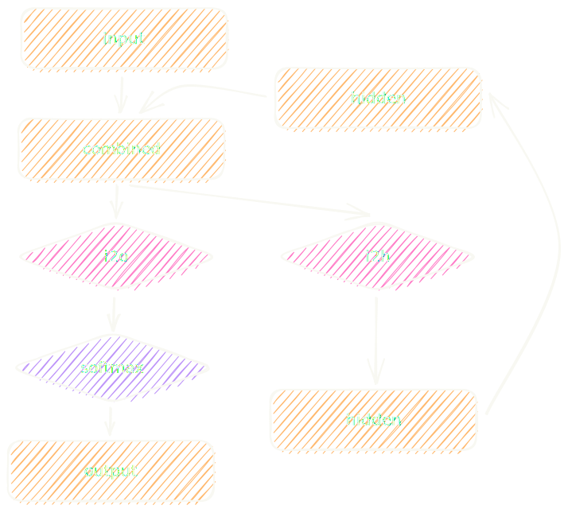
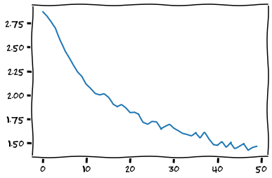
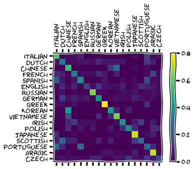

In this introductory tutorial, you will build a recurrent neural network (RNN) with PyTorch.

===


# Introduction

This tutorial will introduce you to [PyTorch][pytorch] and recurrent neural networks (RNNs).
In this tutorial, you will use the module PyTorch to implement a recurrent neural network that will accept a name, character by character, and will output the language of that name.

Some of the things you will learn include:

 - how to convert names (strings) into tensors that can be fed into your network;
 - how to create a recurrent neural network (RNN) layer by layer;
 - how RNNs accept and process their input sequentially;
 - how PyTorch tracks gradients and updates network parameters; and
 - how to build a confusion matrix to see how well your model is doing.

The tutorial you are reading is an adaptation of [this brilliant PyTorch tutorial][pytorch-tutorial].
My changes and adaptations include some minor tweaks to the structure of the tutorial and, most notably, updating the source code to a more idiomatic and modern version of Python.


# Why recurrent neural networks?

Recurrent neural networks are a type of neural network that is suitable for processing streams of information, like the successive characters of a name.
Other networks like fully-connected networks or convolutional neural networks expect an input of a fixed size, which may be hard to come by when dealing with things that have variable lengths.

The example we are tackling is that of reading a name, like "John" or "Rodrigo", and guessing what language that name comes from.
Different names have different lengths, so it would be harder to solve this task with a neural network that accepts inputs of a fixed size.
It _could_ be done, but recurrent neural networks are a much more natural fit for this type of problem.


# Setting up

To follow this tutorial, you need to have [PyTorch] installed on your machine or you can use an online service like [Google Colaboratory](https://colab.research.google.com).

If you are following along locally, go ahead and create a folder for this tutorial.


# Getting the data

The data is in a directory that contains 18 files, each with the name of a natural language, like English or Portuguese.
Go ahead and [download the compressed directory][data].

Then, extract it to the folder `names` in your local folder, or upload the extracted folder `names` to whatever online service you are using.


# Reading the data in

The data contain some names with accented letters and, for the sake of simplicity, we want to get rid of them.
To that end, we will use a function `unicode_to_ascii` that will convert a name string into a simple string that only contains ASCII characters.
This means, in particular, that the function `unicode_to_ascii` will remove accents of letters.

Here are two examples:

```py
>>> unicode_to_ascii("Girão")
Girao
>>> unicode_to_ascii("Ślusàrski")
Slusarski
```

Removing accents from letters means that our RNN has to be able to recognise a smaller number of characters, which will make our lives easier.
The implementation of `unicode_to_ascii` is based on [this StackOverflow answer][so-name-normalisation] and is as follows:

```py
import unicodedata
import string

valid_chars = string.ascii_letters + " .,;'"
n_chars = len(valid_chars)  # Useful later.

def unicode_to_ascii(string):
    """Convert a Unicode string to use plain ASCII letters.

    Based on https://stackoverflow.com/a/518232/2828287.
    """
    return "".join(
        c for c in unicodedata.normalize("NFD", string)
        if unicodedata.category(c) != "Mn"
        and c in valid_chars
    )
```

After knowing how to remove accents from letters, we can read the data and normalise all the names from each language.
We start by using `pathlib` to look for all the text files in the folder `names`.
(If you saved your files in a different folder, you need to update the name accordingly.)

```py
import pathlib

def find_files(path):
    return pathlib.Path(path).glob("*.txt")

print(len(list(find_files("names"))))  # 18
```

Next, we go through the text files.
For each text file, we:

 - take note of the language;
 - read all names and normalise them with `unicode_to_ascii`; and
 - save the names to a dictionary.

This step looks like this:

```py
def process_names_file(filename):
    """Read the names from a data file and normalise them."""
    with open(filename) as f:
        return [unicode_to_ascii(line.strip()) for line in f]

names_by_language = {
    filename.stem: process_names_file(filename)
    for filename in find_files("names")
}
languages = list(names_by_language.keys())
n_languages = len(languages)  # 18
```

After processing all language files, we can print all the languages and see how many names we have for each language:

```py
for idx, language in enumerate(languages, start=1):
    print(f"{idx:2}. {language:12}: {len(names_by_language[language])}")

"""
 1. Italian     : 709
 2. Dutch       : 297
 3. Chinese     : 268
 4. French      : 277
 5. Spanish     : 298
 6. English     : 3668
 7. Russian     : 9408
 8. German      : 724
 9. Greek       : 203
10. Korean      : 94
11. Vietnamese  : 73
12. Irish       : 232
13. Polish      : 139
14. Japanese    : 991
15. Scottish    : 100
16. Portuguese  : 74
17. Arabic      : 2000
18. Czech       : 519
"""
```

We can see that there are a couple of languages for which we do not have many different names (for example, Vietnamese and Portuguese).
We will not worry too much about it, but in a real-life setting, this type of imbalance might need to be addressed explicitly.


# Converting names into tensors

A recurrent neural network (or any other type of network, for that matter) expects a tensor as input.
In other words, we cannot feed a literal string like `"Rodrigo"` to the network.
We have to convert it into something the network knows how to handle: a tensor.

To convert a name into a tensor, it is simpler to understand first how we encode a character in isolation.
We will use one-hot encoding, which means we create a vector with a length equal to the number of different characters we know.
We fill that vector with zeroes, except for the position that matches the character we are converting into a tensor, where we put a one.

Here is an example:

```py
import torch

def char_to_tensor(char):
    """Convert a character into a one-hot encoded vector."""
    tensor = torch.zeros(n_chars)
    tensor[valid_chars.index(char)] = 1
    return tensor

print(char_to_tensor("a"))
print(char_to_tensor("b"))
print(char_to_tensor("f"))

"""
#       a   b   c   d   e   f...
tensor([1., 0., 0., 0., 0., 0., 0., 0., 0., 0., 0., 0., 0., 0., 0., 0.,
        0., 0., 0., 0., 0., 0., 0., 0., 0., 0., 0., 0., 0., 0., 0., 0.,
        0., 0., 0., 0., 0., 0., 0., 0., 0., 0., 0., 0., 0., 0., 0., 0.,
        0., 0., 0., 0., 0., 0., 0., 0., 0.])
#       a   b   c   d   e   f...
tensor([0., 1., 0., 0., 0., 0., 0., 0., 0., 0., 0., 0., 0., 0., 0., 0.,
        0., 0., 0., 0., 0., 0., 0., 0., 0., 0., 0., 0., 0., 0., 0., 0.,
        0., 0., 0., 0., 0., 0., 0., 0., 0., 0., 0., 0., 0., 0., 0., 0.,
        0., 0., 0., 0., 0., 0., 0., 0., 0.])
#       a   b   c   d   e   f...
tensor([0., 0., 0., 0., 0., 1., 0., 0., 0., 0., 0., 0., 0., 0., 0., 0.,
        0., 0., 0., 0., 0., 0., 0., 0., 0., 0., 0., 0., 0., 0., 0., 0.,
        0., 0., 0., 0., 0., 0., 0., 0., 0., 0., 0., 0., 0., 0., 0., 0.,
        0., 0., 0., 0., 0., 0., 0., 0., 0.])
"""
```

For a full name, we create a matrix where each row represents a one-hot encoding of the corresponding character:

```py
def name_to_tensor(name):
    """Convert a name into a matrix where each row one-hot encodes a character."""
    tensor = torch.zeros(len(name), n_chars)
    for idx, char in enumerate(name):
        tensor[idx][valid_chars.index(char)] = 1
    return tensor
```


# Creating the RNN architecture

The next step is creating the RNN architecture we will be working with.
In this introductory tutorial, we will start by building a simpler network architecture that exposes some of its inner workings.
By exposing these inner workings, you will get a better understanding of how recurrent neural networks work and why they are suitable to handle sequences of arbitrary length.

The architecture of the RNN will match this diagram:



In orange, the rectangles `input`, `hidden`, `combined`, and `output`, represent tensors.

 - the tensor `input` represents a single character that we are feeding into the network;
 - the tensor `hidden` represents some network hidden state;
 - the tensor `combined` is a concatenation of the tensors `input` and `hidden` and is what feeds the layers of the network; and
 - the tensor `output` is the final network output.

The diamonds `i2o`, `i2h`, and `softmax`, represent network layers.
The pink layers `i2o` and `i2h` represent linear layers and the purple layer `softmax` represents a final normalisation layer we use to compute the output.
(`i2o` means “input to output” and `i2h` means “input to hidden”.)

Thus, our RNN implementation needs to have the three layers represented as the three diamonds:

```py
import torch.nn as nn

class RNN(nn.Module):
    """Simple RNN architecture that explicitly accepts its hidden state."""
    def __init__(self, input_size, hidden_size, output_size):
        super().__init__()

        self.hidden_size = hidden_size

        combined_size = input_size + hidden_size
        self.i2h = nn.Linear(combined_size, hidden_size)
        self.i2o = nn.Linear(combined_size, output_size)
        self.softmax = nn.LogSoftmax(dim=0)

    def forward(self, input, hidden):
        """Forward pass for a given input tensor and hidden state."""
        combined = torch.cat((input, hidden))
        hidden = self.i2h(combined)
        output = self.i2o(combined)
        output = self.softmax(output)
        return output, hidden

    def init_hidden(self):
        """Create a new hidden state for a new name."""
        return torch.zeros(self.hidden_size)
```

## The hidden state

The key to understanding how recurrent neural networks handle sequences lies in understanding the usefulness of the tensor `hidden`.
The tensor `hidden` represents some hidden state that the recurrent neural network will update as we feed it successive characters from the same name.
We do not control or influence the hidden state directly and that is exactly the point!
The tensor `hidden` provides some freedom for the network to “save information” about the characters it has seen and is what allows the network to do its magic.

If we did not have any hidden state, then the consecutive characters of a name would be unrelated in the eyes of the network, and the network would have to classify a name based solely on its last character, which does not make much sense.

Finally, because the hidden state always concerns a given sequence, we initialise the hidden state whenever we want to feed a new name to the network.

To demonstrate this, we can exemplify how names are fed into the network:

```py
rnn = RNN(n_chars, 128, n_languages)  # 128 is an arbitrary value.

hidden = rnn.init_hidden()
for char_tensor in name_to_tensor("Rodrigo"):
    output, hidden = rnn.forward(char_tensor, hidden)
print(output)

"""
tensor([-2.8058, -2.9490, -2.8567, -2.8537, -3.0147, -2.9369, -2.8580, -2.8767,
        -2.9192, -2.8295, -3.0420, -2.8667, -2.8892, -2.9176, -2.7810, -2.8520,
        -2.9159, -2.8992], grad_fn=<LogSoftmaxBackward0>)
"""
```

As you can see, before feeding a name into the network, we initialise the hidden state.
Then, we keep feeding the hidden state into the network along with the successive characters.
Finally, we can inspect the output of the network.

Notice that we care about the intermediate values of `hidden`, because we need to feed them to the network in the next iteration.
However, we do not care about the final value of `hidden`, because we have no use for it; it is something that only concerns the network.
Conversely, we do not care about the intermediate values of `output`; we only care about the final value because that is the final prediction of the network.


## The logarithmic softmax layer

The final logarithmic softmax layer is used to facilitate the interpretation of the network results.
After going through a log softmax layer, the values in our output tensor will be negative integers.
The closer a given value is to 0, the surer the network is about its prediction.
In other words, given an output value, the best guess of the network corresponds to the position that has a negative value that is closer to 0.

If for a given name the network was **absolutely** sure of the correct language, one position of the tensor `output` would have a number like `-0.00001`, which is very close to 0.


# Preparing for training

Now that we have the data and the network, it is time to train the network.
To do that, we need a couple of utility functions.


## Interpreting the output

The first one is `language_from_output`, which we use to interpret the output of the network.
As we have seen in the example before, the network produces an output vector with 18 negative values.
The largest one (the one closer to zero) corresponds to the network's best guess for the correct language,
so we need to be able to retrieve that:

```py
def language_from_output(output):
    """Interpret the network output classification."""
    _, top_idx = output.topk(1)
    language_idx = top_idx[0].item()
    return languages[language_idx], language_idx

print(language_from_output(output))  # ('Scottish', 14)
```


## Testing and training data

The other thing we need to do before training the network is split the data into

 - the training set; and
 - the testing set.

The training set will be used while training the network and the testing set will be used to see how good the network is.
We will use 85% of the data for training and 15% for testing:

```py
import random

split = 0.85

training = {}
testing = {}

for language, names in names_by_language.items():
    random.shuffle(names)
    idx = round(split * len(names))
    training[language] = names[:idx]
    testing[language] = names[idx:]
```

Then, we need an auxiliary function to retrieve a random example to feed into the network:

```py
def random_example(source):
    """Retrieve a random example from a source dictionary."""
    language = random.choice(list(source.keys()))  # Pick random language.
    name = random.choice(source[language])         # Pick random name from said language.
    lang_tensor = torch.tensor(languages.index(language), dtype=torch.long)
    name_tensor = name_to_tensor(name)
    return language, name, lang_tensor, name_tensor

for _ in range(3):
    language, name, lang_tensor, name_tensor = random_example(training)
    print(f"{language = }, {name = }")

"""
language = 'Dutch', name = 'Koolen'
language = 'English', name = 'Kilbride'
language = 'German', name = 'Rosenberger'
"""
```


## Single training pass

The final utility function we will implement is the function `train`, which accepts the network, the name tensor, and the expected output, and trains the network on that example.
The function `train` will make use of two global variables:

```py
learning_rate = 0.005  # Set through experimentation.
criterion = nn.NLLLoss()  # Suitable loss function.
```

The learning rate is a parameter that one has to experiment with and adjust, to find a value that works.

For the loss function, we use the `NLLLoss` (negative log likelihood), not only because it is appropriate for classification problems like ours but also because it is a sensible loss function to use when the output comes from a final log softmax layer, like ours.

```py
def train(rnn, name_tensor, lang_tensor):
    hidden = rnn.init_hidden()

    rnn.zero_grad()  # Reset gradient computations.

    for char_tensor in name_tensor:
        output, hidden = rnn(char_tensor, hidden)

    loss = criterion(output, lang_tensor)
    loss.backward()

    # Tweak the network's parameters slightly! (aka, teach the network!)
    for p in rnn.parameters():
        p.data.add_(p.grad.data, alpha=-learning_rate)

    return output, loss.item()
```

Unlike the [“Neural Networks Fundamentals With Python” series][nnfwp], we do not have to compute gradients by hand to implement backpropagation.
PyTorch keeps track of the internal calculations that happened in the successive forward passes and then is able to automatically calculate the gradients for all of the network parameters.
Then, we go through the parameters of the network and tweak them ever so slightly, as in the standard gradient descent algorithm.

# Training the network

To train the network, all we have to do is give it many training examples!

Thus, this code would suffice:

```py
N_ITERS = 50000

for _ in range(N_ITERS):
    lang, name, lang_tensor, name_tensor = random_example(training)
    output, loss = train(rnn, name_tensor, lang_tensor)
```

However, we want to keep track of the loss of the network (to plot its evolution later) and we also want to have a couple of auxiliary prints so we can tell that the code is running.
All in all, our training code looks like this:

```py
import time

N_ITERS = 50000
PRINT_EVERY = 5000
LOG_EVERY = 1000

# Keep track of losses for plotting.
current_loss = 0
all_losses = []

def time_since(since):
    """Return a pretty string with time elapsed."""
    now = time.time()
    s = now - since
    m, s = divmod(s, 60)
    return f"{int(m)}m {s:.2f}s"


n_hidden = 128
rnn = RNN(n_chars, n_hidden, n_languages)

start = time.time()

for it in range(1, N_ITERS + 1):
    lang, name, lang_tensor, name_tensor = random_example(training)
    output, loss = train(rnn, name_tensor, lang_tensor)
    current_loss += loss

    if it % LOG_EVERY == 0:
        # Print current progress.
        avg_loss = current_loss / LOG_EVERY
        print(f"{100 * it / N_ITERS}% ({time_since(start)}) {avg_loss:.4f}")
        # Save average loss for plotting.
        all_losses.append(avg_loss)
        current_loss = 0
```

Running this code, I get the following (truncated) output:

```
2.0% (0m 2.16s) 2.8688
4.0% (0m 3.62s) 2.8252
6.0% (0m 5.12s) 2.7693
8.0% (0m 6.59s) 2.7015
10.0% (0m 8.04s) 2.5621
...
90.0% (1m 14.39s) 1.4487
92.0% (1m 16.41s) 1.4737
94.0% (1m 18.17s) 1.4984
96.0% (1m 19.60s) 1.4240
98.0% (1m 21.07s) 1.4498
100.0% (1m 22.52s) 1.4594
```

As you can see, this training session ran quite quickly, in under one minute and a half.
(This was running in Google Colaboratory.)

Now that our network is trained, we can plot the loss:

```py
import matplotlib.pyplot as plt

with plt.xkcd():
    plt.figure()
    plt.plot(all_losses)
```



The loss plot (shown above) looks good, but how does the network perform on completely new data?


# Evaluating the network

To evaluate the network, we will create a confusion matrix.
We can do this by going through all of the available testing examples and making note of what the network thinks is the language of that given name.

We make use of an auxiliary function that also showcases another great feature that PyTorch has:

```py
def evaluate_test(rnn, name_tensor):
    """Auxiliary function to get the output from the network without training."""
    hidden = rnn.init_hidden()

    with torch.no_grad():
        for char_tensor in name_tensor:
            output, hidden = rnn(char_tensor, hidden)

    return output
```

The context manager `torch.no_grad` can be used to disable the automatic tracking of gradients that PyTorch does.
When testing the network, we do not need to keep track of the gradients because those are only needed for training.
So, we disable gradient tracking inside `evaluate_test`.

After defining that function, we can build our confusion matrix:

```py
# Empty confusion matrix:
confusion = torch.zeros(n_languages, n_languages)

# Go through all examples and see how the network does.
correct = 0
for language, names in testing.items():
    lang_idx = languages.index(language)
    for name in names:
        # Build the language and name tensors for the example.
        lang_tensor = torch.tensor(languages.index(language), dtype=torch.long)
        name_tensor = name_to_tensor(name)
        # Get the output.
        output = evaluate_test(rnn, name_tensor)
        # Interpret the output.
        _, guess_idx = language_from_output(output)
        # Mark the output in the confusion matrix.
        confusion[lang_idx][guess_idx] += 1
        # Did we guess correctly?
        correct += guess_idx == lang_idx

total_examples = sum(len(names) for names in testing.values())
print(f"Overall accuracy is {100 * correct / total_examples:.2f}%")
# Overall accuracy is 51.99%
```

As we can see, the overall accuracy was a bit over 50%.
This means that the network can recognise about half of the names correctly.
Remember that we are talking about names that the network has _never_ seen before!

After populating the confusion matrix, we can plot it:

```py
from matplotlib import ticker

# Normalise by dividing every row by its sum.
for row in confusion:
    row /= row.sum()

# Set up plot.
with plt.xkcd():
    fig = plt.figure()
    ax = fig.add_subplot(111)
    cax = ax.matshow(confusion.numpy())
    fig.colorbar(cax)

    # Set up axes.
    ax.set_xticklabels([""] + languages, rotation=90)
    ax.set_yticklabels([""] + languages)

    # Force label at every tick.
    ax.xaxis.set_major_locator(ticker.MultipleLocator(1))
    ax.yaxis.set_major_locator(ticker.MultipleLocator(1))

    plt.show()
```



From the confusion matrix, we can see that the network seems to be more confident in recognising Greek, Japanese, and Arabic names.
These are the languages that the network reckons to have the most distinctive names, especially taking into consideration that these three languages are not the languages with the largest data files.

For example, Russian was the language with the largest dataset and it is only the fourth or fifth best recognised language.

The confusion matrix also allows one to see the type of mistakes that the network makes.
For example, looking at the Portuguese row, we can see that off of the main diagonal, the brighter squares are in the Italian and Spanish columns, which means that the network thought some Portuguese names were Spanish or Italian.
This is the type of mistake that a Human could make, given that Portuguese, Spanish, and Italian, share the same roots in Latin.

# Running the network on user input

The final bit of code we will write is to run the network on user input:
the user types a name and the network prints its best guess.
Here is the code that does that:

```py
print("Type names and the network classifies them.")
print("An empty name will quit.")
while name := input(" >> "):
    normalised_name = unicode_to_ascii(name.strip())
    name_tensor = name_to_tensor(normalised_name)
    output = evaluate_test(rnn, name_tensor)
    language = language_from_output(output)
    print(language)
```


# Conclusion

Throughout this tutorial, you:

 - parsed data from data files;
 - created a recurrent neural network architecture;
 - saw how RNNs use hidden state to carry information along the input sequence;
 - trained a RNN in a classification task;
 - evaluated the performance of the RNN;
 - built a confusion matrix; and
 - created an interface for the user to interact with the RNN.

Pat yourself in the back and go for a walk.
When you come back, I have some additional challenges for you!


# Challenges

You just learned a lot about recurrent neural networks...
But reading a tutorial on my blog is not enough!
If you are serious about taking your Python 🐍 and machine learning skills to the next level, you need to practise! 🚀

Drop your email below and I will send you some challenges for you to practise what you just learned!
Drop your email below, and you will join a community of over 16,000 developers that want to take their Python 🐍 skills to the next level. 🚀

See you there!

<script async data-uid="b56530daea" src="https://mathspp.ck.page/b56530daea/index.js"></script>


[data]: https://github.com/mathspp/training/blob/master/your-first-recurrent-neural-network/names.zip
[pytorch]: https://pytorch.org
[pytorch-tutorial]: https://pytorch.org/tutorials/intermediate/char_rnn_classification_tutorial.html
[so-name-normalisation]: https://stackoverflow.com/a/518232/2828287
[nnfwp]: https://mathspp.com/blog/tag:nnfwp
