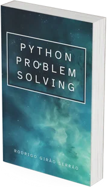

This book contains 50 coding challenges and an analysis of multiple solutions to those challenges.
It's part of the [Python problem-solving bootcamp](/pythonbootcamp), that I run periodically.

The “first edition” of this book was published in December 2021, when I ran the bootcamp for the first time.
Whenever I run a new edition of the bootcamp, I end up perfecting and improving the book.

<a href="/pythonbootcamp" class="btn" style="margin-left: 1em;">Learn more</a>

===

