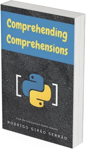

I devoted an entire book with over 200 exercises to list comprehensions, dictionary and set comprehensions, and generator expressions.
This book provides clear explanations for how comprehensions work and, most importantly, a _**unique point of view**_ that helps you understand and memorise the syntax.

My unique point of view stems from my experience with the APL programming language, which helped me understand comprehensions in a completely new light.

For a taste of my point of view, you can [read this blog article of mine](/blog/pydonts/list-comprehensions-101).

The book is missing the last two chapters, so you can buy it for 40% off while I finish it!

  
  Buy for $29 $17.4 
  [Learn more](/books/comprehending-comprehensions)
  
  
  
===
