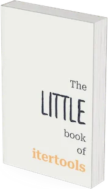

Unlock the power of advanced iteration with this concise, actionable guide to Python's `itertools` module.
Perfect for curious programmers who love diving deep into the intricacies of the standard library, this book offers a hands‑on approach to mastering one of Python's most versatile libraries in a short, fluff‑free format.

  
  Get the book! 
  [Learn more](/books/the-little-book-of-itertools)
  
  
  
===
