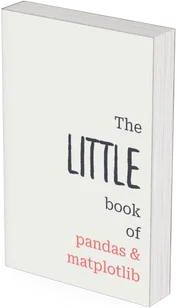

Get started with data science in Python quickly with the little book of pandas & matplotlib.

The short chapters introduce you to the key concepts that you need to

 1. manipulate and transform your data;
 2. query it to get answers to the questions you have; and
 3. create plots that convey your findings in a clear way.

This book is perfect for you if you want to get an overview of the multiple tools, ideas, and concepts, that pandas and matplotlib have to offer and that you can learn and master.

<a href="https://mathspp.gumroad.com/l/little-book-pandas-matplotlib/?wanted=true" target="_blank" class="btn" style="margin-right: 1em;">Get the book!</a>
<a href="/books/little-book-pandas-matplotlib" class="btn" style="margin-left: 1em;">Learn more</a>

<!--
## Testimonials

 > “*[The book] seems to be extremely well put together, unlike some other books on Python I've read recently. It's a good book. I like how to the point it is.*” ― Tanner S., USA.

-->
<!--

 > “*First of all, thank you thank you and thank you again for a beautiful ebook with such amazing content. If you're a beginner or a more experienced pythonista, pydon'ts will still achieve its purpose. Beautifully designed and explained! Definitely worth the reading. I'm reading it once more in a year or so!*” ― Alonso, Mexico.

-->

===

