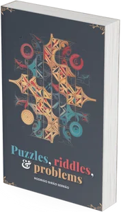

This book compiles the [puzzles, riddles, and problems I've published on my blog](/blog/problems).

I try to publish problems that are easy to state and easy to understand and I also try to
stick to problems that only require logic and, at most, knowledge of mathematics at the
high school level.  From ants stuck in a pipe to a pirate ship filled with democratic
pirates, there's a bit of everything in this book.

  Buy for **$27**
  [Learn more](/books/puzzles-riddles-and-problems)

===
