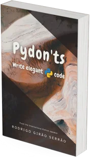

This book guides you through the core Python language, showing you how to use the language features to write better, more elegant Python code.

Each chapter of the book guides you through a specific feature of the Python language, explaining the theory and showing concrete examples of that feature in the real world.

This book is for best suited for people who already have some Python experience or for experienced programmers in other languages who want a crash course on the “Pythonic way” of doing things.

<a href="https://gumroad.com/l/pydonts?variant=Free%20for%20ever%20%F0%9F%92%B8&wanted=true" target="_blank" class="btn plausible-event-name=pydonts+cta" style="margin-right: 1em;">Get the book!</a>
<a href="/books/pydonts" class="btn" style="margin-left: 1em;">Learn more</a>

<!--
## Testimonials

 > “*[The book] seems to be extremely well put together, unlike some other books on Python I've read recently. It's a good book. I like how to the point it is.*” ― Tanner S., USA.

-->
<!--

 > “*First of all, thank you thank you and thank you again for a beautiful ebook with such amazing content. If you're a beginner or a more experienced pythonista, pydon'ts will still achieve its purpose. Beautifully designed and explained! Definitely worth the reading. I'm reading it once more in a year or so!*” ― Alonso, Mexico.

-->

===

