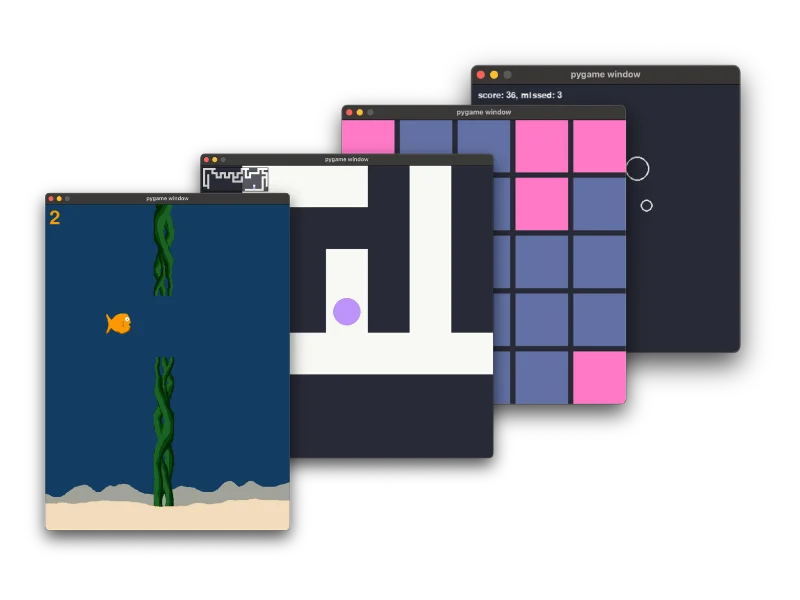

Ready to dive into game development with Python?
This short, hands‑on book walks you through building four different minigames using Pygame, even if you’ve never written a rock paper scissors game before.

With clear explanations and all the source code included, you’ll learn all the fundamentals required to build a game.
Whether you’re a hobbyist looking to explore something new or a developer wanting to build fun side projects, this book is designed to get you started quickly and confidently.

No fluff – just practical steps to making your own games from scratch.

  
  Get the book! 
  [Learn more](/books/the-little-book-of-pygame)
  
  
  
===
