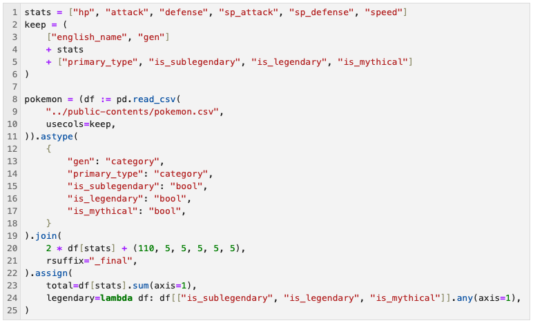
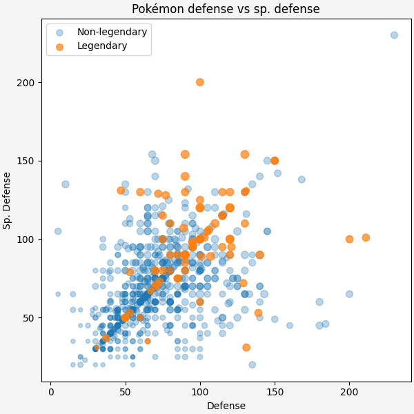
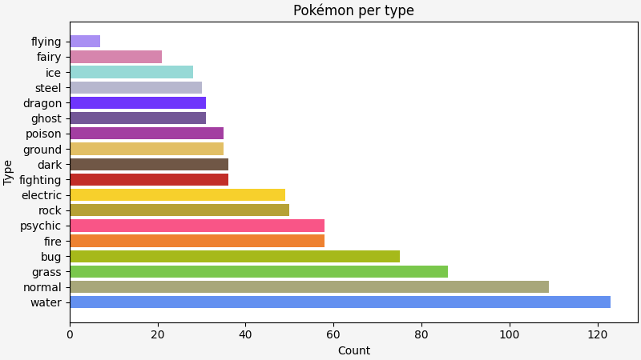

---
gallery:
    items:
        - title: "Code"
          image: _pandas_code.png
          desc: "Cenas"
        - title: "Scatter plot"
          image: _18_scatter_defense_vs_sp_defense_legendary_legend.png
          desc: "Cenas 2"
        - title: "Horizontal bar plot"
          image: _13_barh_type_coloured.png
          desc: "Cenas 3"
---

## Examples of what you'll be learning

You will learn how to write pandas code that is readable, easy to maintain, and extendable.
Notice how the code below flows from top to bottom.
It encapsulates a full pipeline that prepares your data for plotting.

After manipulating and transforming your data it is essential to be able to present your results in a clear, understandable way, and you will learn how to create clear plots like the ones below:

