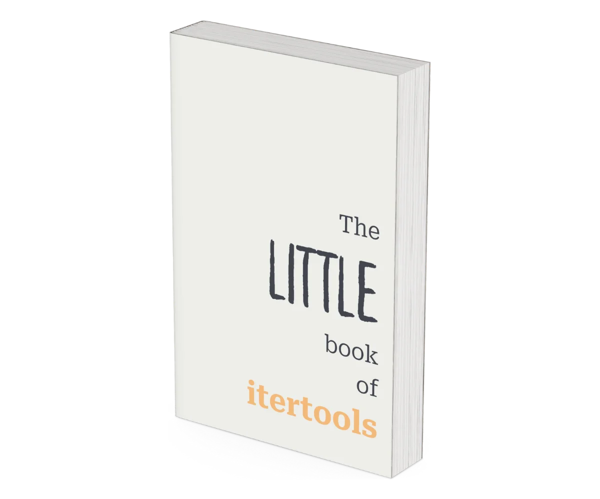

## Master `itertools` & iteration in Python

Unlock the power of advanced iteration with this concise, actionable guide to Python's `itertools` module.
Perfect for curious programmers who love diving deep into the intricacies of the standard library, this book offers a hands-on approach to mastering one of Python's most versatile libraries in a short, fluff-free format.

    <a href="https://mathspp.gumroad.com/l/the-little-book-of-itertools/?wanted=true" target="_blank" class="btn" style="margin-right: 1em;">Become an itertools and Python iteration master</a>

