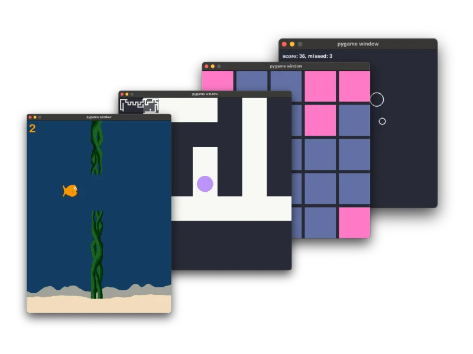

## Create your own computer minigames

This short, hands-on book walks you through building four different minigames using Pygame, even if you’ve never written a rock paper scissors game before.

With clear explanations and all the source code included, you’ll learn all the fundamentals required to build a game.
Whether you’re a hobbyist looking to explore something new or a developer wanting to build fun side projects, this book is designed to get you started quickly and confidently.

No fluff – just practical steps to making your own games from scratch.

    <a href="https://mathspp.gumroad.com/l/the-little-book-of-pygame/?wanted=true" target="_blank" class="btn" style="margin-right: 1em;">Start creating your own computer minigames!</a>

