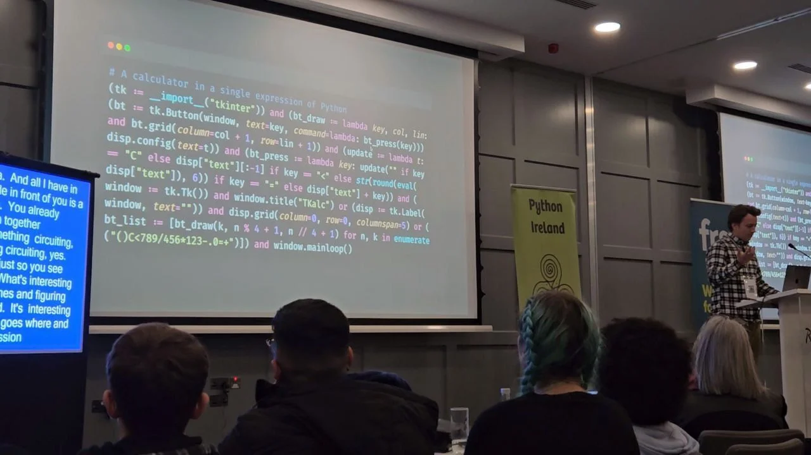

In this lighthearted lightning talk I took a Python script for a tkinter calculator and continuously refactored it until the whole calculator was a single expression.
We managed to get some laughs out of this ridiculous process, while we also explored a couple of interesting Python features like conditional expressions, Boolean short-circuiting, and assignment expressions.

I was very happy with my performance and so was James, who dubbed it a [“killer lightning talk”](https://www.linkedin.com/posts/jamesgshields_just-finished-pycon-ireland-2023-a-huge-activity-7129793135693459457-J_xd).

===

===

Where: [PyCon Ireland 2023](http://pycon.ie/pycon-2023/schedule/), 11-11-2023 • Main reference: [blog article](/blog/single-line-calculator) • Slides for the talk: [static PDF][pdf-slides] (low res) • [Online slides][snappify-slides]

[pdf-slides]: https://github.com/mathspp/talks/blob/main/20231111_pycon_ireland_elegant_loc/slides.pdf
[snappify-slides]: https://snappify.com/view/1ac1517f-fe09-43c7-afc8-cd4153fbca74
