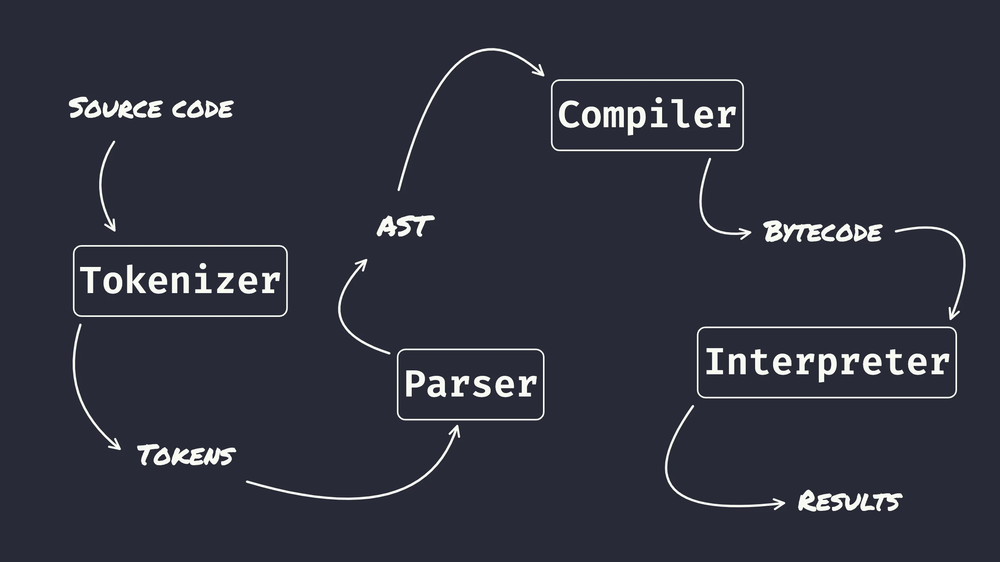

In this hands-on tutorial we went through the four main components that let you implement a programming language like Python from scratch.

I aimed for an interesting and fun workshop and the feedback I received tells me I delivered it:

 > “I liked that we quickly got a very simple compiler and interpreter up and running, we did all of the fun stuff without too much of the boring repetitive parts.” — Samir

===

===

Where: [PyCon Ireland 2023](http://pycon.ie/pycon-2023/schedule/), 11-11-2023 • Main reference: [“Building a Python compiler and interpreter”](/blog/tag:bpci) blog series • Workshop materials: [source code][gh-repo] • Slides for the tutorial: [static PDF][pdf-slides] (low res) • [Online slides][snappify-slides]

<!--

<iframe width="560" height="315" src="https://www.youtube.com/embed/tDy-to9fgaw?start=140" title="How APL made me a better Python developer talk by Rodrigo Girão Serrão" frameborder="0" allow="accelerometer; autoplay; clipboard-write; encrypted-media; gyroscope; picture-in-picture; web-share" allowfullscreen></iframe>

-->

[pdf-slides]: https://github.com/mathspp/talks/blob/main/20231111_pycon_ireland_implement_python/slides.pdf
[snappify-slides]: https://snappify.com/view/38542fa0-f3e3-41b7-8465-bf36e564d21e
[gh-repo]: https://github.com/mathspp/talks/tree/main/20231111_pycon_ireland_implement_python
