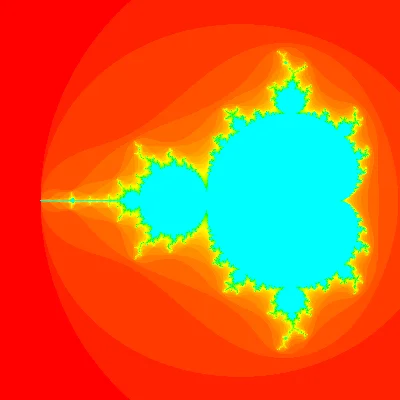

In this lightning talk my only objective was to show how easy it is to create stunning images with a little bit of Python and a little bit of maths.

===

===

Where: [PyCon Ireland 2023](http://pycon.ie/pycon-2023/schedule/), 11-11-2023 • Main reference: [blog article](/blog/mandelbrot-set)
