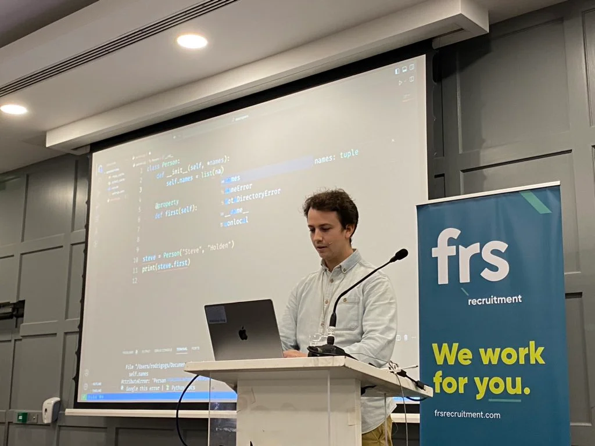

In this live-coding talk I wanted to explain how descriptors work by establishing a parallel with properties.
Although properties _are_ descriptors, this approach is how descriptors clicked for me and I was hoping it would help descriptors click for others as well.

Coming into the talk, I wasn't sure if I should present it as a live-coding demo, but Barry's feedback tells me I made the right choice:

 > “Used descriptors before but this [talk] clarified a lot. Live coding is hard to do, but makes it a better experience. Thanks for that.”

===

===

[PyCon Ireland 2023](http://pycon.ie/pycon-2023/schedule/), 12-11-2023 • [Main reference](/blog/pydonts/describing-descriptors) • [Backup talk slides][pdf-slides] (low res PDF) • [Online slides][snappify-slides] • [Source code from live demo][source]

[pdf-slides]: https://github.com/mathspp/talks/blob/main/20231112_pycon_ireland_describing_descriptors/slides.pdf
[snappify-slides]: https://snappify.com/view/5f6a9340-b95a-4df0-8d3e-4941bceefb38
[source]: https://github.com/mathspp/talks/tree/main/20231112_pycon_ireland_describing_descriptors/descriptors
