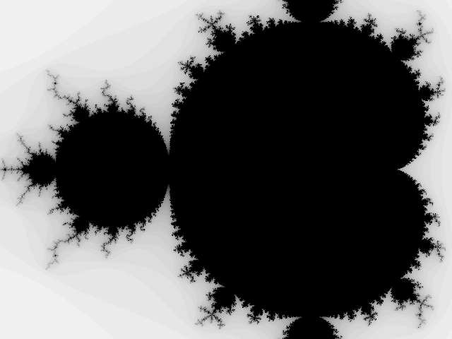

# Desenhar fractais com Python

## Objetivo

O objetivo deste workshop é mostrar às pessoas o que é que o [conjunto de
Mandelbrot][Mandelbrot] é realmente e como calculá-lo.
Para além disso, também vamos usar Python para criar uma animação do fractal
como mostro aqui em baixo:

O programa que vamos escrever vai ser capaz de fazer zoom numa posição
arbitrária em que cliquemos, vai gravar as imagens geradas e também vai ser
capaz de gravar todos os *frames* gerados, para que consigas criar um GIF como o
que está aqui em cima.

## Teor do workshop

Durante o workshop vou ensinar o que é que o conjunto de Mandelbrot é, do ponto
de vista matemático, e depois vamos transformar essa definição em algo que um
computador consiga calcular.

Vamos trabalhar no nosso programa de forma incremental e vamos ver várias
versões do nosso conjunto de Mandelbrot:

## Conclusões

Se prestares atenção suficiente e se eu fizer o meu trabalho bem o suficiente,
quando o workshop acabar tu vais ter

 - compreendido como funciona um fractal, do ponto de vista matemático;
 - criado um programa que determina se um ponto pertence ao conjunto de
   Mandelbrot ou não;
 - percebido como criar um programa que demora bastante tempo a concluir mas que
   vai atualizando o utilizador sobre o seu estado interno;
 - criado uma animação progressiva do conjunto de Mandelbrot.

## Recursos adicionais

O código de referência para este workshop está [no meu repositório de workshops
no GitHub][workshops-gh].

Também [escrevi um par de artigos no meu blogue][fractals-blog] sobre fractais e
sobre como desenhá-los.

[workshops-gh]: https://github.com/RojerGS/workshops
[Mandelbrot]: /blog/fractals-and-mandelbrot-set
[fractals-blog]: /blog/tag:fractals
