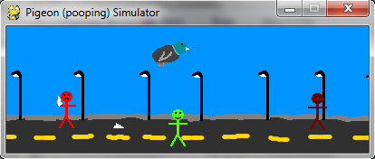

# Mini jogos

Gosto bastante de escrever pequenos jogos como projetos de programação. Já escrevi vários deles em Python + pygame e alguns também em Java com a biblioteca Processing.

Os meus três preferidos são o [simulador de pombos][pigeon simulator], o [HueHue] e o [Minesweeper]. À direita podes ver uma captura de ecrã do Minesweeper e em baixo do simulador de pombos.

[pigeon simulator]: ../../blog/pigeon-pooping-simulator
[HueHue]: ../../blog/huehue
[Minesweeper]: ../../blog/minesweeper-remake
