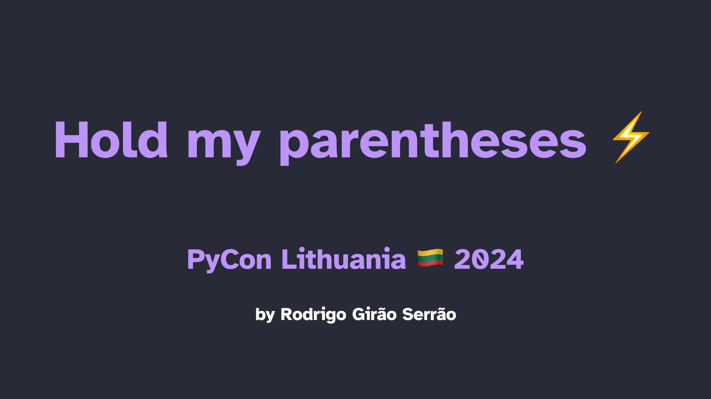

In this lightning talk I draw from my APL experience to solve a simple coding challenge:
given a string representing an expression, how can I determine whether the parentheses are correctly balanced or not?

In the end, we'll end up with two fun lines of code that use features of the Python language that are typically frowned upon!

===

===

[PyCon Lithuania 2024](https://pycon.lt/2024/schedule/), 03-04-2024 • [Main reference](/blog/hold-my-parentheses) • [Talk slides][pdf-slides] (low res PDF) • [Online slides][snappify-slides]

[pdf-slides]: https://github.com/mathspp/talks/blob/main/20240403_pycon_lithuania_lightning_hold_my_parens/slides.pdf
[snappify-slides]: https://snappify.com/view/dfec7e35-5b3e-41d1-aaa8-692349d4701e
