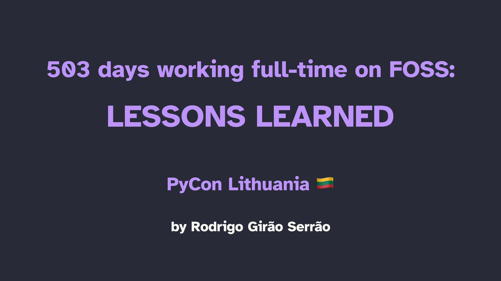

In this talk I share my experience working on a FOSS project full-time for 503, sharing some of the non-technical lessons I learned along the way.

These lessons fall into 4 broad categories:

 1. how to get a tech job;
 2. how to manage your ego;
 3. how to interact with users; and
 4. how to work with a big codebase.

===

===

[PyCon Lithuania 2024](https://pycon.lt/2024/schedule/), 04-04-2024 • [Main reference](/blog/503-days-working-full-time-on-foss-lessons-learned) • [Talk slides][pdf-slides] (low res PDF) • [Online slides][snappify-slides]

[pdf-slides]: https://github.com/mathspp/talks/blob/main/20240404_pycon_lithuania_503_working_on_foss_lessons_learned/slides.pdf
[snappify-slides]: https://snappify.com/view/dfbc01f5-771f-4ac5-8c03-75131f579e1a
[source]: https://github.com/mathspp/talks/tree/main/20231112_pycon_ireland_describing_descriptors/descriptors
