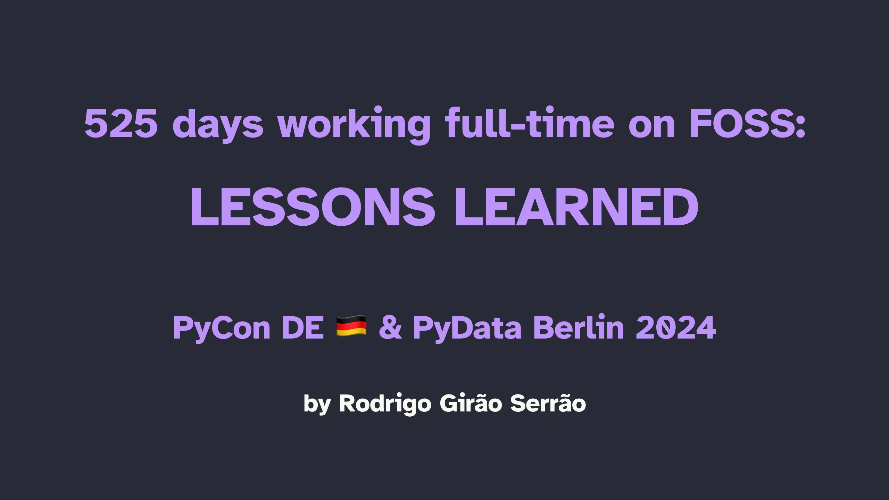

In this talk I share non-technical lessons I learned after working on a FOSS project full-time for +500 days.
These lessons fall into 4 broad categories:

 1. how to get a tech job;
 2. how to manage your ego;
 3. how to interact with users; and
 4. how to work with a big codebase.

This is an improved version of [the same talk](/talks#503-days-working-full-time-on-foss-lessons-learned) I gave at PyCon Lithuania 2024.

===

===

[PyCon DE & PyData Berlin 2024](https://pretalx.com/pyconde-pydata-2024/talk/ZMC9FU/), 24-04-2024 • [Main reference](/blog/503-days-working-full-time-on-foss-lessons-learned) • [Talk slides][pdf-slides] (low res PDF) • [Online slides][snappify-slides]

[pdf-slides]: https://github.com/mathspp/talks/blob/main/20240424_pycon_de_525_working_on_foss_lessons_learned/slides.pdf
[snappify-slides]: https://snappify.com/view/52e25a1b-e890-4300-8a34-a1c262cb0f27
[source]: https://github.com/mathspp/talks/tree/main/20231112_pycon_ireland_describing_descriptors/descriptors
