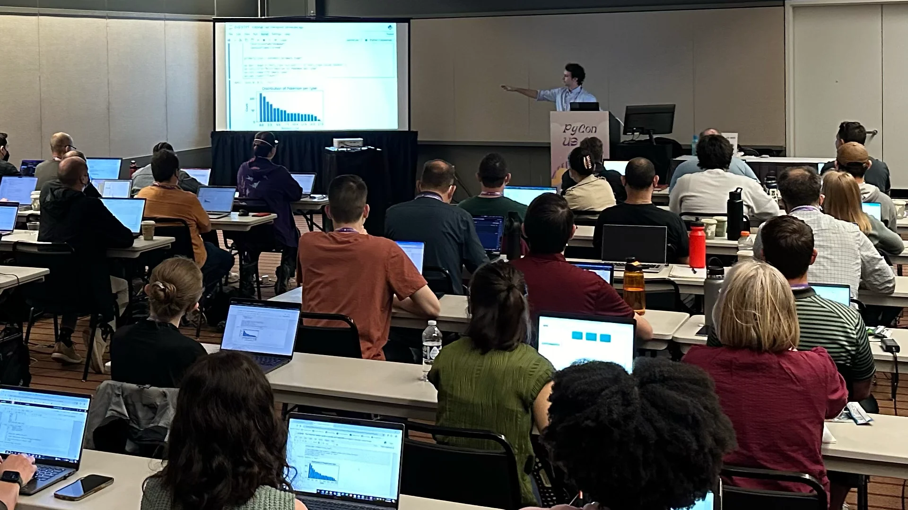

This 3h tutorial focuses in teaching the fundamentals of pandas and matplotlib in a light and interactive environment.
To distinguish this tutorial from the others you can find online, we used data from [the Pokémon franchise](https://en.wikipedia.org/wiki/Pokémon), which led to a highly engaging session.

The overall consensus of the participants was that the tutorial was well worth their time and one participant even wrote:

 > “[...] I strongly feel that this tutorial is the gold standard for what teaching should be. [...]”, Gabe C.

===

===

[PyCon US 2024](https://us.pycon.org/2024/schedule/presentation/102/), 15-05-2024 • [Main reference](https://mathspp.gumroad.com/l/the-little-book-of-pandas-and-matplotlib) • [Attend this tutorial online](https://mathspp.gumroad.com/l/webinar-pandas-matplotlib)
