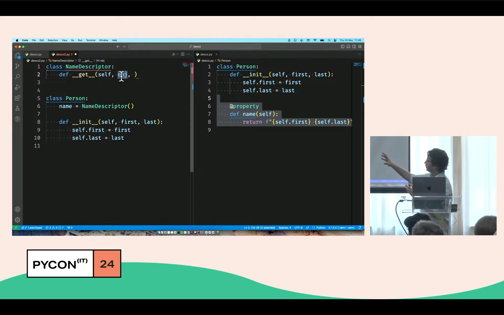

In this live-coded talk I walk the audience through a series of analogies between the built-in `property` and the way descriptors work.

I chose to introduce descriptors by establishing parallels with the built-in `property` because that is how I first understood descriptors.
The enthusiastic nods while I was presenting and the feedback afterwards lead me to believe this was a good choice.

===

===

[PyCon Italy 2024](https://2024.pycon.it/en/event/descriptors-made-easy), 23-05-2024 • [Main reference](https://mathspp.com/books/pydonts)
