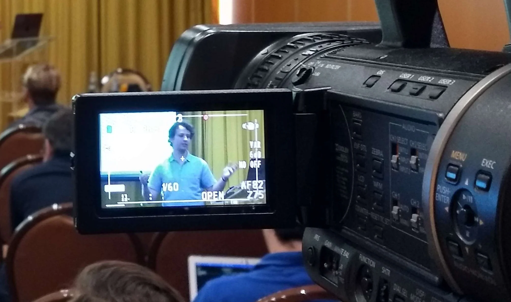

This was the third iteration of this talk of mine, which I presented to cover someone who had to cancel their scheduled talk.

Because the talk slot was longer than the two previous iterations, I managed to enrich the talk with more personal anecdotes and I also included a short section on how luck is not 100% random.

===

===

[PyCon Italy 2024](https://2024.pycon.it/en/event/503-days-working-full-time-on-foss-lessons-learned), 25-05-2024 • [Main reference](https://mathspp.com/blog/503-days-working-full-time-on-foss-lessons-learned) • [Talk slides][pdf-slides] (low res PDF) • [Online slides][snappify-slides]

[pdf-slides]: https://github.com/mathspp/talks/blob/main/20240525_pycon-italy-503-days-working-full-time-on-foss-lessons-learned/slides.pdf
[snappify-slides]: https://snappify.com/view/e7978e46-611e-4df6-86ca-8755df200af0
