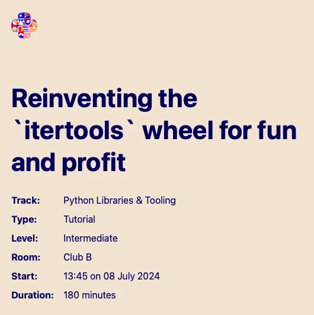

In this hands-on tutorial we reinvented the wheel by reimplementing several iterators from the module `itertools`.
This was the excuse we needed to take a deep dive into some fundamental aspects of Python programming, like what are iterables and iterators, how the built-ins `next` and `iter` work, what the iterator protocol is, and more.

The tutorial was highly praised for the practical component, given that I [prepared several practice exercises](https://github.com/mathspp/the-little-book-of-itertools) and the attendees enjoyed attempting them.

===

===

[EuroPython 2024](https://ep2024.europython.eu/session/reinventing-the-itertools-wheel-for-fun-and-profit), 08-07-2024 • [Main reference](https://mathspp.com/books/the-little-book-of-itertools)
